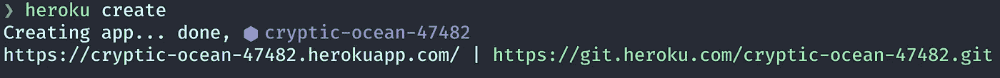
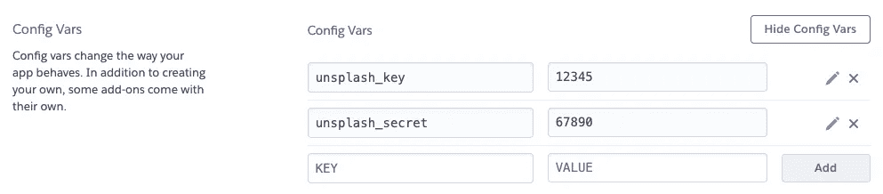
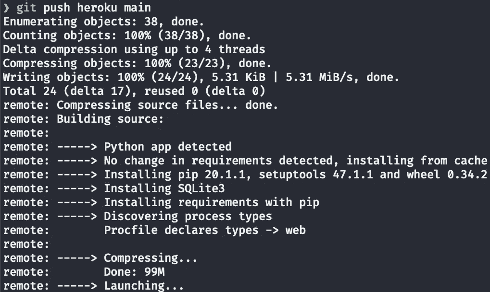
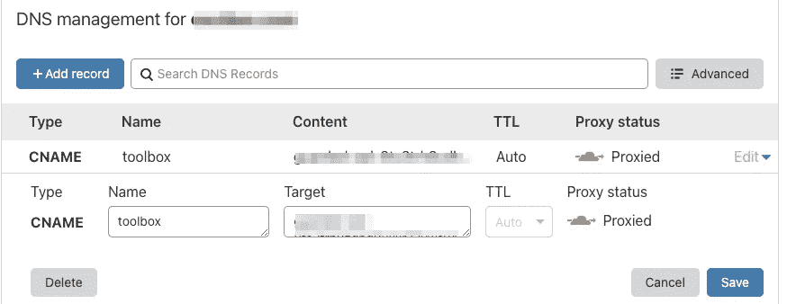
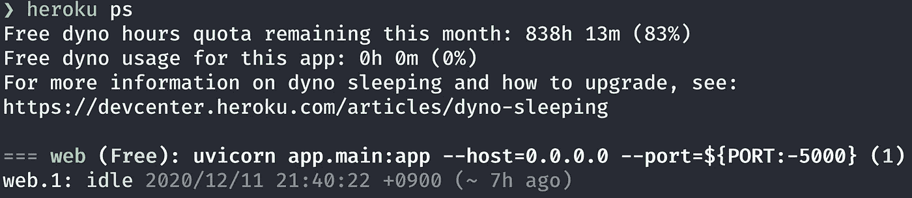
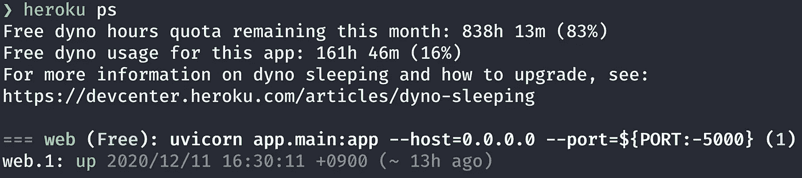
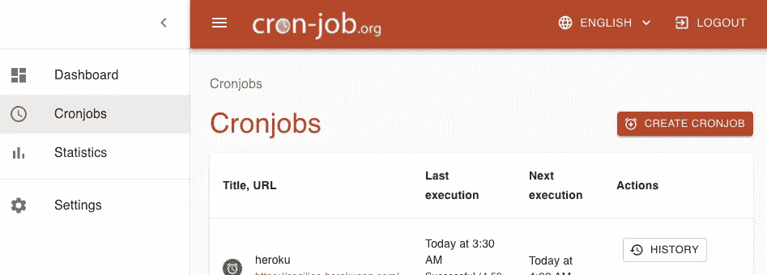
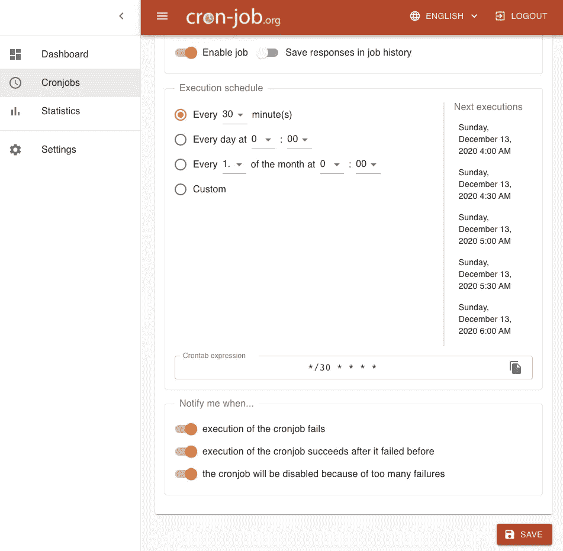
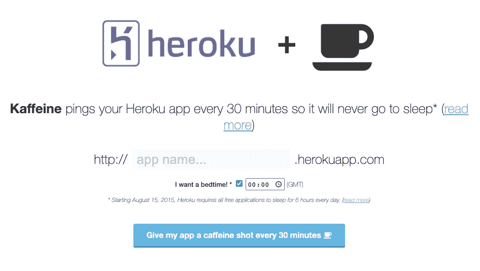
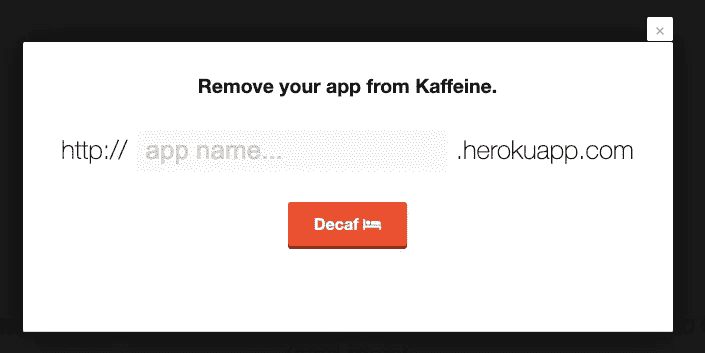

# 如何在 Heroku 上免费部署 FastAPI 应用程序

> 原文：<https://towardsdatascience.com/how-to-deploy-your-fastapi-app-on-heroku-for-free-8d4271a4ab9?source=collection_archive---------5----------------------->

## 如何让您的应用全天候保持活跃


图片来自 [Pixabay](https://pixabay.com/) 的 [mohamed_hassan](https://pixabay.com/users/mohamed_hassan-5229782/)

**注意:Heroku 免费版本不再提供。请阅读** [**从 Heroku 到 Deta 免费托管 Python 项目**](https://medium.com/mkdir-awesome/from-heroku-to-deta-to-host-python-project-for-free-1e967139e234) **免费托管 FastAPI。**

# 介绍

Heroku 是一个云平台即服务(PaaS)，支持 Ruby on Rails、Java、Node.js、Scala、Clojure、Python、PHP 和 Go。Heroku 的免费版本每月提供 550-1000 dyno 小时。如果没有人使用你的应用程序，你的应用程序会在 30 分钟后休眠。如果你的每月动态时间在限制范围内，你的应用程序将永远免费。

Dynos 是 Heroku 平台上隔离的虚拟化 Linux 容器。

在本文中，您将了解到在 Heroku 上设置和运行 FastAPI 项目并使其全天候活动是多么容易。

我目前在 [Heroku 主持](https://fastapi-webstarter-demo.herokuapp.com/)[这个 FastAPI 网站](https://levelup.gitconnected.com/building-a-website-starter-with-fastapi-92d077092864)作为演示。

```
**Table of Contents**
· [Introduction](#fa53)
· [Git](#d66a)
· [Setting up Your Heroku Account](#6e50)
· [How to Create the requirement.txt for FastAPI on Heroku](#9e18)
· [runtime.txt](#eb9a)
· [Procfile](#0457)
· [Environment Variables](#8642)
· [How to Upload to Heroku](#73c2)
· [How to Add a Subdomain](#5bbe)
· [How to Keep Your App Active 24/7](#3c12)
  ∘ [cron-job.org](#7cd1)
· [How to fix a failed cron-job](#b1d7)
  ∘ [Kaffeine](#beb1)
· [How to Rename Your App](#6ba6)
· [How to ssh to Heroku](#c69f)
· [Conclusion](#fc09)
· [Newsletter](#ad04)
· [References](#2fbb)
```

# 饭桶

我使用 [Gitstart](/automate-creating-a-new-github-repository-with-gitstart-1ae961b99866) 来自动化 Git 初始化。从您的终端，它运行`git init`。添加`.gitignore`和 README 文件，并提交一条消息。这在 Github 中创建了一个新的 repo，它会推送所有的文件。

```
$ mkdir my_new_project
$ cd my_new_project
$ gitstart
```

# 设置您的 Heroku 帐户

个人账户每月有 550 小时的免费动态时间。除了这些基本小时数之外，使用信用卡[1]进行验证的帐户还将获得额外的 450 小时，添加到*每月*免费动态配额中。[2]

你需要给 Heroku 添加 SSH 密钥。[3]
安装 Heroku CLI [4]
然后从您的终端登录 Heroku 并创建一个 Heroku 应用程序:

```
$ heroku login
$ heroku create
```



heroku 创造产出。图片作者。

您可以向 Heroku 应用程序添加自定义域。[5]

# 如何在 Heroku 上为 FastAPI 创建 requirement.txt

Heroku 需要`requirement.txt`来安装你的 Python 包。`pipreqs` [6]基于项目中的导入生成它。

```
$ pip install pipreqs
$ cd my_new_project
$ pipreqs ./
# if you already have the requirement.txt
$ pipreqs --force ./
```

由于`pipreqs`是基于`import`生成的，您需要手动将以下内容添加到`requirements.txt`中。

```
uvicorn==0.12.3
aiofiles==0.6.0
python-multipart==0.0.5
jinja2==2.11.2
```

你需要`uvicorn`来启动 Heroku 上的 ASGI 服务器。静态文件需要使用`aiofiles`。如果你的项目有一个表单，添加`python-multipart`。如果您的项目使用模板引擎，添加`jinja2`。

# runtime.txt

Heroku 使用默认的 Python 版本。为了使用某个 Python 版本，在你的 Python 版本中添加`runtime.txt`。例如:

```
python-3.8.6
```

# Procfile

Heroku 需要 Procfile。[7]

如果应用程序目录中有`main.py` ，则添加以下内容:

```
web: uvicorn app.main:app --host=0.0.0.0 --port=${PORT:-5000}
```

如果根目录中有`main.py`:

```
web: uvicorn main:app --host=0.0.0.0 --port=${PORT:-5000}
```

# 环境变量

Heroku 不使用`.env`文件。相反，将`.env`文件中的值添加到配置变量中。您可以在“设置”选项卡下找到它。



向配置变量添加环境变量。图片作者。

# 如何上传到 Heroku

现在，您已经准备好将您的项目推向 Heroku:

```
$ git push heroku main
$ heroku open
```

`heroku open`命令在浏览器中打开您的项目。



git 在终端上推 heroku main。图片作者。

# 如何添加子域

我正在使用 Cloudflare，这是我必须要做的。

选择“CNAME”作为类型。为该名称添加您的子域名。为内容添加您的 Heroku 域。你的 Heroku 域名有点像，serene-example-4269.herokuapp.com。

下图显示了如何添加`toolbox.mywebsite.com`子域。



向 Cloudflare 添加子域。

# 如何让您的应用全天候保持活跃

30 分钟不活动后，Heroku 应用程序进入空闲状态。您可以使用`heroic ps`找到您的应用程序流程。



heroku ps 输出显示空闲。图片作者。

你可以在最后一行找到“闲置”。

这是我的另一个应用程序进程状态，显示为“启动”。



heroku ps 输出出现。图片作者。

cron-job.org[8]和凯费恩[9]提供免费服务。双方都会在预定的时间访问您的 URL。

## **cron-job.org**

您可以通过添加 URL 和执行时间表来创建 cronjob。



cron-job.org 克朗乔布斯标签。图片作者。

对于您的 cronjob，您需要每 15 分钟选择一次。如果每 30 分钟设置一次，可能会延迟 5 到 15 秒。



为 cronjob 选择每 30 分钟一次。图片作者。

您可以轻松编辑或删除您的 cronjob。

# 如何修复失败的 cron 作业

您的 cron-job 可能无法告知“响应数据太大”或“输出太大”。


作者图片

cron-job.org 从您的 URL/脚本接受高达 4 kB 的响应数据。要解决这个问题，您可以创建一个返回 JSON 字符串而不是 HTML 页面的端点。

## **卡夫芬**

Kaffeine 每 30 分钟对你的 Heroku 应用进行一次 pings 操作，这样它就永远不会进入睡眠状态。



Kaffeine 网站。

**如何从 Kaffeine 移除你的应用**

网站中的链接不起作用，但如果你点击下面的链接，它对我有用。

[http://kaffeine.herokuapp.com/#decaf](http://kaffeine.herokuapp.com/#decaf)



从 Kaffeine 移除您的应用程序。

# 如何重命名您的应用程序

```
$ heroku apps:rename new_app_name
```

当你重命名你的应用程序时，**不要忘记更新你的 cron 作业**。

# 如何向 Heroku 宋承宪

你可能想对 Heroku 说些什么。`heroku ps:exec`确实如此。

```
$ heroku ps:exec
Establishing credentials... done
Connecting to web.1 on ⬢ demo-desuyo...
~ $
```

# 结论

Heroku 为您的项目提供最长 1000 小时的免费托管，该项目使用的内存低于 512MB。你可以用你的域名。如果您需要自定义域上的 SSL，您需要升级到爱好层。

cron-job.org 和卡夫丁峡谷提供了一个 cronjob 访问您的网址，以避免睡眠。

**通过** [**成为**](https://blog.codewithshin.com/membership) **会员，获得媒体上所有故事的访问权限。**


[请订阅。](https://blog.codewithshin.com/subscribe)

# 参考

1.  [账户验证](https://devcenter.heroku.com/articles/account-verification)
2.  [自由动态小时数](https://devcenter.heroku.com/articles/free-dyno-hours#usage)
3.  [SSH 按键](https://devcenter.heroku.com/articles/keys)
4.  [Heroku CLI](https://devcenter.heroku.com/articles/heroku-cli)
5.  [为应用程序定制域名](https://devcenter.heroku.com/articles/custom-domains)
6.  [pipreqs](https://pypi.org/project/pipreqs/)
7.  [过程文件](https://devcenter.heroku.com/articles/procfile)
8.  [cron-job.org](https://cron-job.org/en/)
9.  [卡夫芬](http://kaffeine.herokuapp.com/)