# 如何使用 PostgreSQL 导出汇总统计数据

> 原文：<https://towardsdatascience.com/how-to-derive-summary-statistics-using-postgresql-742f3cdc0f44?source=collection_archive---------2----------------------->

## 使用 PostgreSQL 导出数值和分类字段的汇总统计数据


[活动发起人](https://unsplash.com/@campaign_creators?utm_source=unsplash&utm_medium=referral&utm_content=creditCopyText)在 [Unsplash](https://unsplash.com/s/photos/database?utm_source=unsplash&utm_medium=referral&utm_content=creditCopyText) 上的照片

在本文中，我们将讨论如何使用 SQL 获得数字和分类列/字段的汇总统计数据。我们将使用从 **Tableau 公共样本数据集下载的**网飞电影和电视节目**数据集(**[https://public.tableau.com/en-us/s/resources](https://public.tableau.com/en-us/s/resources)并转到样本数据**)。**该数据集由截至 2019 年网飞可用的电视节目和电影组成，由 Tableau 从 [**Kaggle**](https://www.kaggle.com/shivamb/netflix-shows) 获取，数据集的更新版本可在 Kaggle 上找到。然而，对于本文，我们将使用在 **Tableau 样本数据集**中可用的旧版本，并将其导入到 **Postgres** 中。本文假设读者对 SQL 查询和统计有基本的了解。下面是我们将在整篇文章中使用的 ***网飞 _titles*** 的快照。

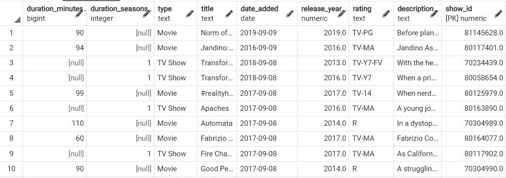

网飞 _ 标题表(图片由作者提供)

# 数字变量的汇总统计

常用的数字变量汇总统计有均值、中值、最小值、最大值、范围、标准差、方差、Q1、Q3、IQR 和偏度。

## **的意思是**

在 PostgreSQL 中，使用 **AVG()** 函数计算数值字段/列的平均值。我们将计算 ***持续时间 _ 分钟*** 字段的平均值，如下所示。

```
**SELECT** 
 **AVG**(duration_minutes) **AS** mean
  **FROM** netflix_titles;
```

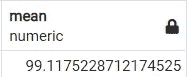

作者图片

## **中间值**

在 PostgreSQL 中，没有直接计算数值字段/列的中值的函数。然而，由于中位数是第 50 个百分位数，我们可以用它来代替中位数。使用 **PERCENTILE_CONT()** 函数计算数值变量的百分比。我们将计算 ***持续时间 _ 分钟*** 字段的中值，如下所示。

```
**SELECT 
 PERCENTILE_CONT**(0.5) **WITHIN GROUP** (**ORDER BY** duration_minutes) **AS** median
  **FROM** netflix_titles;
```

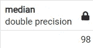

作者图片

**WITHIN GROUP** 子句创建可用于执行聚合的有序数据子集。 **PERCENTILE_CONT** 将所需的百分位作为参数，本例中为 0.5，即第 50 个百分位。

## **最小值**

在 PostgreSQL 中，使用 **MIN()** 函数找到数值字段/列的最小值。我们将找到***duration _ minutes***字段的最小值，如下所示。

```
**SELECT** 
 **MIN**(duration_minutes) **AS** min 
  **FROM** netflix_titles;
```

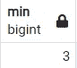

作者图片

## **最大值**

在 PostgreSQL 中，使用 **MAX()** 函数找到数值字段/列的最大值。我们将找到***duration _ minutes***字段的最大值，如下所示。

```
**SELECT** 
 **MAX**(duration_minutes) **AS** max 
  **FROM** netflix_titles;
```

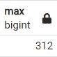

作者图片

## 范围

在 PostgreSQL 中，没有直接计算数值字段/列范围的函数。然而，由于范围是最大值和最小值之间的差值，我们可以用它作为范围的代理。

```
**SELECT** 
 **MAX**(duration_minutes) - **MIN**(duration_minutes) **AS** range
    **FROM** netflix_titles;
```

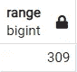

作者图片

## 标准偏差

在 PostgreSQL 中，使用 **STDDEV()** 函数计算数值字段/列的标准偏差。我们将计算 ***持续时间 _ 分钟*** 字段的标准偏差，如下所示。

```
**SELECT** 
 **ROUND**(**STDDEV**(duration_minutes), 2) **AS** standard_deviation
    **FROM** netflix_titles;
```

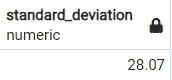

作者图片

**或**

我们还可以将标准差计算为方差的平方根，如下所示。

```
**SELECT** 
 **ROUND**(**SQRT**(**VARIANCE**(duration_minutes)), 2) **AS** stddev_using_variance
    **FROM** netflix_titles;
```

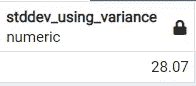

作者图片

## 差异

在 PostgreSQL 中，使用 **VARIANCE()** 函数计算数值字段/列的方差。我们将计算 ***持续时间 _ 分钟*** 字段的方差，如下所示。

```
**SELECT** 
 **ROUND**(**VARIANCE**(duration_minutes), 2) **AS** variance
    **FROM** netflix_titles;
```

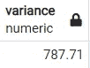

作者图片

**或**

我们也可以将方差计算为标准差的平方，如下所示。

```
**SELECT** 
 **ROUND**(**POWER**(**STDDEV**(duration_minutes), 2), 2) **AS** variance_using_stddev
    **FROM** netflix_titles;
```

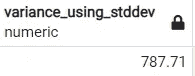

作者图片

## **Q1**

在 PostgreSQL 中，没有直接计算数值字段/列的第一个四分位数(Q1)的函数。然而，由于 Q1 是第 25 个百分点，我们可以用它来代表 Q1。我们将计算 ***持续时间 _ 分钟*** 字段的 Q1，如下所示。

```
**SELECT**
 **PERCENTILE_CONT**(0.25) **WITHIN GROUP** (**ORDER BY** duration_minutes) **AS** q1
    **FROM** netflix_titles;
```

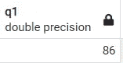

作者图片

## Q3

在 PostgreSQL 中，没有直接计算数值字段/列的第三个四分位数(Q3)的函数。但是，由于第 3 季度是第 75 个百分点，我们可以用它来代替第 3 季度。我们将计算 ***持续时间 _ 分钟*** 字段的 Q3，如下所示。

```
**SELECT**
 **PERCENTILE_CONT**(0.75) **WITHIN GROUP** (**ORDER BY** duration_minutes) **AS** q3
    **FROM** netflix_titles;
```

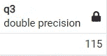

作者图片

## IQR

在 PostgreSQL 中，没有直接计算数值字段/列的四分位间距(IQR)的函数。然而，由于 IQR 是第三季度和 Q1 之间的差异，我们可以用它作为 IQR 的代理。我们将计算 ***持续时间 _ 分钟*** 字段的 IQR，如下所示。

```
**SELECT**
 **PERCENTILE_CONT**(0.75) **WITHIN GROUP** (**ORDER BY** duration_minutes) -
 **PERCENTILE_CONT**(0.25) **WITHIN GROUP** (**ORDER BY** duration_minutes) **AS** iqr
     **FROM** netflix_titles;
```

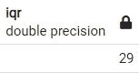

作者图片

## 歪斜

在 PostgreSQL 中，没有直接计算数值字段/列的偏斜度的函数。然而，由于偏斜度是 **3 *(均值-中值)/标准差**，我们可以用它来代替偏斜度。我们将计算 ***持续时间 _ 分钟*** 字段的偏斜度，如下所示。为了让代码更具可读性，我们将使用 CTE 来计算平均值、中值和标准差。

```
**WITH** mean_median_sd **AS**
(
 **SELECT** 
  **AVG**(duration_minutes) **AS** mean,
  **PERCENTILE_CONT**(0.5) **WITHIN GROUP** (**ORDER BY** duration_minutes) **AS** median,
  **STDDEV**(duration_minutes) **AS** stddev
   **FROM** netflix_titles
)**SELECT** 
 **ROUND**(3 * (mean - median)**::NUMERIC** / stddev, 2) **AS** skewness
  **FROM** mean_median_sd;
```


作者图片

## **将所有这些放在一起**

我们将把前面讨论的所有函数放在一起，并在一个表中返回它们。在下面的查询中，我们将创建两个 cte，即 ***summary_stats*** (每列返回一个前面讨论过的统计信息)和***row _ summary _ stats***(每行返回一个统计信息)。

```
**WITH RECURSIVE**
summary_stats **AS**
(
 **SELECT** 
  **ROUND**(**AVG**(duration_minutes), 2) **AS** mean,
  **PERCENTILE_CONT**(0.5) **WITHIN GROUP** (**ORDER BY** duration_minutes) **AS** median,
  **MIN**(duration_minutes) **AS** min,
  **MAX**(duration_minutes) **AS** max,
  **MAX**(duration_minutes) - **MIN**(duration_minutes) **AS** range,
  **ROUND**(**STDDEV**(duration_minutes), 2) **AS** standard_deviation,
  **ROUND**(**VARIANCE**(duration_minutes), 2) **AS** variance,
  **PERCENTILE_CONT**(0.25) **WITHIN GROUP** (**ORDER BY** duration_minutes) **AS** q1,
  **PERCENTILE_CONT**(0.75) **WITHIN GROUP** (**ORDER BY** duration_minutes) **AS** q3
   **FROM** netflix_titles
),row_summary_stats **AS**
(
**SELECT** 
 1 **AS** sno, 
 'mean' **AS** statistic, 
 mean **AS** value 
  **FROM** summary_stats
**UNION
SELECT** 
 2, 
 'median', 
 median 
  **FROM** summary_stats
**UNION
SELECT** 
 3, 
 'minimum', 
 min 
  **FROM** summary_stats
**UNION
SELECT 
** 4, 
 'maximum', 
 max 
  **FROM** summary_stats
**UNION
SELECT** 
 5, 
 'range', 
 range 
  **FROM** summary_stats
**UNION
SELECT 
** 6, 
 'standard deviation', 
 standard_deviation 
  **FROM** summary_stats
**UNION
SELECT 
** 7, 
 'variance', 
 variance 
  **FROM** summary_stats
**UNION
SELECT 
** 9, 
 'Q1', 
 q1 
  **FROM** summary_stats
**UNION
SELECT 
** 10, 
 'Q3', 
 q3 
  **FROM** summary_stats
**UNION
SELECT 
** 11, 
 'IQR', 
 (q3 - q1) 
  **FROM** summary_stats
**UNION
SELECT 
** 12, 
 'skewness', 
 **ROUND**(3 * (mean - median)**::NUMERIC** / standard_deviation, 2) **AS** skewness 
  **FROM** summary_stats
)**SELECT** * 
 **FROM** row_summary_stats
  **ORDER BY** sno;
```

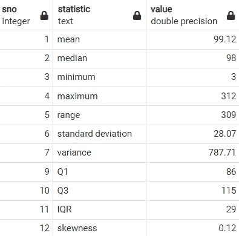

作者图片

# 分类变量的汇总统计

分类变量常用的汇总统计数据有模式、基数(唯一类别的数量)、频率和相对频率。

## 方式

在 PostgreSQL 中，使用 **MODE()** 函数计算分类字段/列的模式。我们将计算 ***评级*** 字段的模式，如下所示。

```
**SELECT** 
 **MODE**() **WITHIN GROUP** (**ORDER BY** rating) **AS** mode
  **FROM** netflix_titles;
```

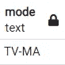

作者图片

## 基数

在 PostgreSQL 中，没有直接计算分类字段/列的唯一值数量的函数。但是，我们可以计算变量的不同值，如下所示。

```
**SELECT** 
 **COUNT**(**DISTINCT** rating) **AS** cardinality
  **FROM** netflix_titles;
```

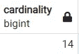

作者图片

## 频率和相对频率

在 Postgres 中，我们可以使用 **GROUP BY** 和 **COUNT** 来计算类别变量中类别的出现频率。对于相对频率，我们将使用 CTE 来计算评级字段中值的总数，并使用它来计算相对频率。因为，不是所有的数据库都支持窗口函数，我们将使用 CTE。我们还将讨论如何使用窗口函数计算相对频率。

```
**WITH** total_count **AS**
(
**SELECT**
 **COUNT**(rating) **AS** total_cnt
  **FROM** netflix_titles
)**SELECT** 
 rating,
 **COUNT**(rating) **AS** frequency,
 **ROUND**(**COUNT**(rating)**::NUMERIC** / 
    (**SELECT** total_cnt **FROM** total_count), 4) **AS** relative_frequency
    **FROM** netflix_titles
     **GROUP BY** rating
   **ORDER BY** frequency **DESC**;
```

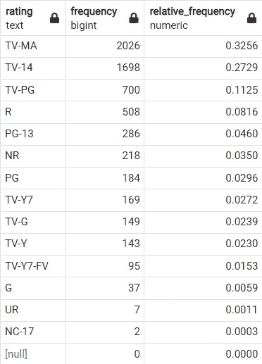

作者图片

在上面的例子中，我们已经创建了一个 CTE 来捕获 ***rating*** 字段中的值的计数。然后，我们使用它来计算 ***评级*** 字段中每个类别的百分比/相对频率。由于 Postgres 支持窗口函数，我们将看到一种使用窗口函数计算相对频率的更简单的方法。我们将使用 **OVER()** 来计算每组评分的总数，这也就是 ***评分*** 字段中值的总数。

```
**SELECT** 
 rating,
 **COUNT**(rating) **AS** frequency,
 **ROUND**(**COUNT**(rating)**::NUMERIC** / **SUM**(**COUNT**(rating)) **OVER()**, 4) **AS** relative_frequency
    **FROM** netflix_titles
     **GROUP BY** rating
      **ORDER BY** frequency **DESC**;
```

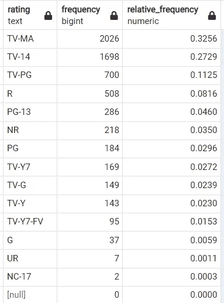

作者图片

文章到此结束。我们已经讨论了计算常用数值字段汇总统计数据的各种函数，如均值、中值、最小值、最大值、Q1、Q2、IQR 等。以及基数、频率等分类字段。汇总统计可用于了解数据分布，也有助于识别潜在的异常值。