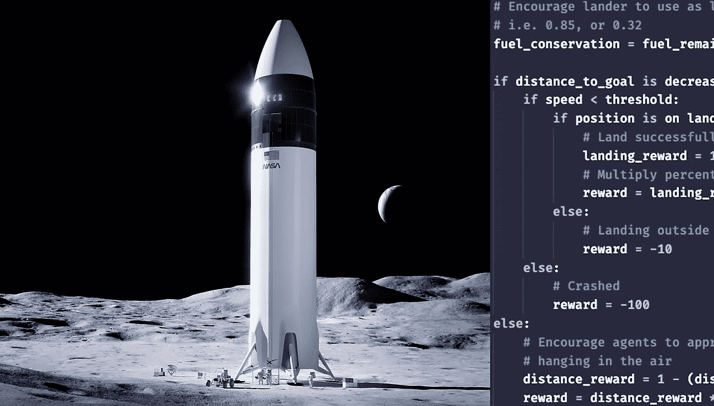
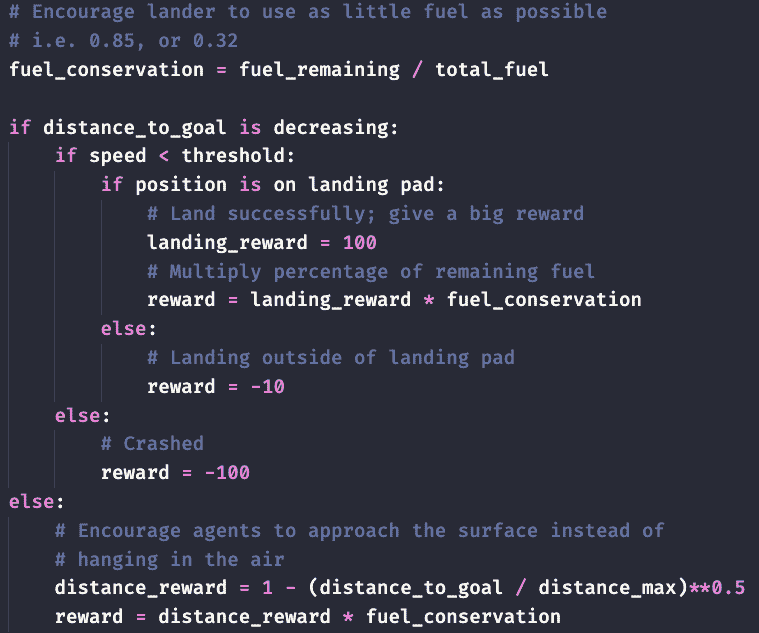

# 如何为月球着陆器🛸设计强化学习奖励函数

> 原文：<https://towardsdatascience.com/how-to-design-reinforcement-learning-reward-function-for-a-lunar-lander-562a24c393f6?source=collection_archive---------10----------------------->



照片来源于[Nasa](https://www.nasa.gov/sites/default/files/thumbnails/image/for_press_release.jpg)；作者代码

想象外星人👽受到攻击，而你正试图让 Lander🛸登陆月球，你会考虑哪些因素来成功完成任务？

以下是一些注意事项:

*   在着陆垫上着陆 *vs* 离开着陆垫
*   低速着陆 *vs 高速坠毁*
*   使用尽可能少的燃料*对*使用大量燃料
*   尽快接近目标 *vs* 悬在空中

罚什么？奖励什么？如何平衡多重约束？如何在我们的奖励函数中表现这些想法？

## 强化学习中的奖励函数

强化学习(RL)是机器学习中的一个分支，它利用代理训练中的试错问题解决方法。在我们的例子中，代理将尝试着陆月球着陆器，比如说，10k 次，以学习如何在不同的状态下做出更好的行动。

奖励功能是一个**激励机制**，它使用奖励和惩罚来告诉代理什么是正确的，什么是错误的。逆向物流中代理人的目标是最大化总报酬。有时我们需要牺牲眼前的回报，以最大化总回报。

## 月球着陆器奖励函数中的规则

月球着陆器奖励功能中的奖励和惩罚规则的一些想法可以是:

*   以足够低的速度降落在正确的地方，给予高额奖励
*   如果着陆器在着陆区外着陆，则给予处罚
*   根据剩余燃料的百分比给予奖励
*   如果在表面着陆时速度超过阈值(坠毁),给予很大的惩罚
*   给予距离奖励以鼓励着陆器接近目标

## 如何用 python 代码表示规则



作者代码

如上图所示，变量***fuel _ conservation***是一个介于 0 和 1 之间的值。当成功降落在着陆场时，收到的奖励会乘以***fuel _ conservation***以鼓励着陆器尽量少用燃料。

如果着陆器在目标点之外着陆，我们会给它一个-10 的小惩罚。如果着陆器以很高的速度坠毁，我们会给一个很大的惩罚-100。

***distance _ reward = 1-(distance _ to _ goal/distance _ max)* * 0.5***使用 0.5 的幂，随着着陆器越来越接近着陆垫，为代理提供平滑的奖励梯度。

```
# Encourage lander to use as little fuel as possible
# i.e. 0.85, or 0.32
fuel_conservation = fuel_remaining / total_fuelif distance_to_goal is decreasing:
    if speed < threshold:
        if position is on landing pad:
            # Land successfully; give a big reward
            landing_reward = 100
            # Multiply percentage of remaining fuel
            reward = landing_reward * fuel_conservation
        else:
            # Landing outside of landing pad
            reward = -10
    else:
        # Crashed
        reward = -100
else:
    # Encourage agents to approach the surface instead of
    # hanging in the air
    distance_reward = 1 - (distance_to_goal / distance_max)**0.5
    reward = distance_reward * fuel_conservation
```

## 结论

在本文中，我们以月球着陆器为例，演示如何构建一个带有奖惩规则的高级奖励函数。

在 RL 模型的培训过程中，奖励功能指导代理从试验和错误中学习:

*   我该怎么办？如何在行动之间进行选择？
*   最大化总回报的更好行动是什么？
*   如何评价不同状态下动作的好/坏？

祝着陆愉快！希望外星人会和平到来。👽☮️✌️🕊🛸

## 参考资料:

*   [关于 RL 的 Youtube 教程视频](https://youtu.be/CvQ-1JAPsCw)
*   [open ai 的 lunar lander-v2](https://gym.openai.com/envs/LunarLander-v2/)

# 报名参加🦞:的 Udemy 课程

## [具有机器学习和统计的推荐系统](https://www.udemy.com/course/recommender-system-with-machine-learning-and-statistics/?referralCode=178D030EF728F966D62D)


https://www . udemy . com/course/recommender-system-with-machine-learning-and-statistics/？referral code = 178d 030 ef 728 f 966 d62d