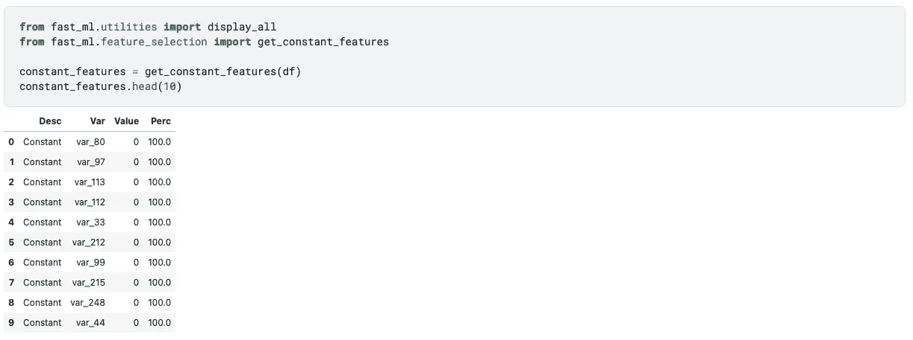
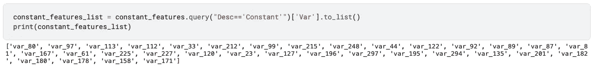
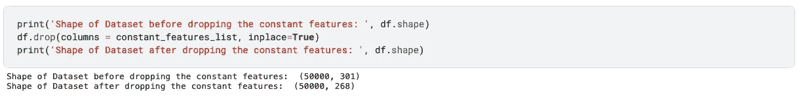
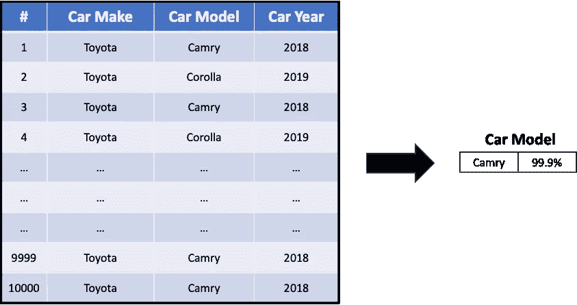
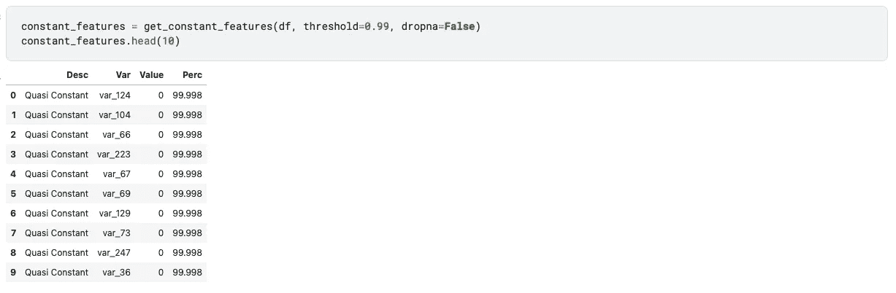
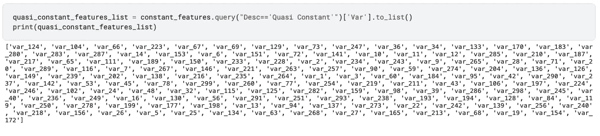
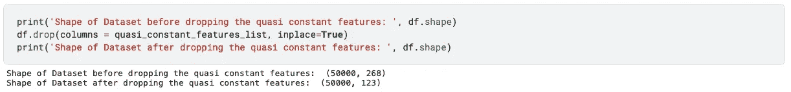

# 如何检测数据集中的常量、准常量要素

> 原文：<https://towardsdatascience.com/how-to-detect-constant-quasi-constant-features-in-your-dataset-a1ab7aea34b4?source=collection_archive---------15----------------------->

## 使用 fast_ml 进行特征选择


由[红色齐柏林飞艇](https://unsplash.com/@redzeppelin?utm_source=medium&utm_medium=referral)在 [Unsplash](https://unsplash.com?utm_source=medium&utm_medium=referral) 拍摄的照片

# 介绍

在大多数情况下，顶尖数据科学家与其他人有两个区别:**特征创建**和**特征选择**。即，创建捕捉关于业务或客户的更深/隐藏的洞察力的特征，然后做出关于为您的模型选择哪些特征的正确选择。

# 特征选择在机器学习中的重要性

机器学习模型的质量取决于你的数据——垃圾进，垃圾出。(这里的垃圾意味着坏数据/数据中的噪声)。

在一个广泛的特性工程步骤之后，你会得到大量的特性。您可能无法使用模型中的所有功能。您可能会对只给模型添加那些重要的特性感兴趣，或者删除那些没有任何预测能力的特性。

这篇文章是为了确认所有那些不变的特征。它可以有两种类型:

1.  恒定特征:所有记录中的值相同。
2.  准常数特征:其中一个值占优势 99.9%。

# 我们来详细了解一下这个

## 1.常量值(所有记录中的相同值)


图片作者。数据集中具有常数值的要素

如示例图像所示，对于数据中的所有记录，只有 Toyota 作为 Car Make 中的值。你的机器学习模型不会通过训练保持这一功能来学习任何有见地的东西。你最好放弃这个功能。同样，还可能有更多这样的特性，您需要一种更加自动化的方式来识别这些特性。

1)使用`get_constant_features`函数获取所有常量特征。



图片作者。在一行代码中，您可以检测到所有具有常量值的特性

2)将所有恒定特征存储为列表，以便从数据集中移除。



图片作者。所有不变的特性作为一个列表

3)从数据集中删除所有此类要素。我们可以看到功能的数量从 301 下降到了 268。



图片作者。从数据集中移除所有恒定要素

## ***2。准常数(其中一个值是显性的~99%记录)***



图片作者。数据集中具有常数值的要素

如示例图所示，在您的数据中，“凯美瑞”占记录的 99.9%。你的机器学习模型不会通过训练保持这一功能来学习任何有见地的东西。或者更糟的是，你的模型会从边缘案例中学习，导致过度拟合。你最好放弃这个功能。同样，还可能有更多这样的特性，您需要一种更加自动化的方式来识别这些特性。

1)使用`get_constant_features`函数获取所有常量特征。



图片作者。在一行代码中，您可以检测到所有具有准常数值的特性

*   阈值:用于定义要消除的数据的准度的临界值。99%、99.9%、98%等。

2)将所有拟常数特征存储为列表，以便从数据集中移除。



图片作者。所有的准常数特性作为一个列表

3)从数据集中删除所有此类要素。我们可以看到，功能的数量从 268 个减少到了 123 个。



# 摘要

**两个常量的代码片段&准常量特性:**

```
from fast_ml.utilities import display_all
from fast_ml.feature_selection import get_constant_features**# Use the function to get the results in dataframe**
constant_features = get_constant_features(df)
display_all(constant_features)**# All the constant features stored in a list**
constant_features_list = constant_features['Var'].to_list()**# Drop all the constant features from the dataset**
df.drop(columns = constant_features_list, inplace=True)
```

# 感谢阅读！！

*   如果你喜欢这个，[跟随我在媒体](https://samarthagrawal86.medium.com/)了解更多。
*   有兴趣合作吗？我们上 [Linkedin](https://www.linkedin.com/in/samarth-agrawal-2501/) 连线吧。
*   请随意写下您的想法/建议/反馈。
*   [卡格尔链接](https://www.kaggle.com/nextbigwhat/detect-constant-and-quasi-constant-features)
*   [Fast_ml 链接](https://pypi.org/project/fast-ml/)

笔记本可在以下位置获得，并附有完整的功能代码:

[](https://www.kaggle.com/nextbigwhat/detect-constant-and-quasi-constant-features) [## 检测常数和准常数特征

### 使用 Kaggle 笔记本探索和运行机器学习代码|使用来自实践数据集的数据进行二进制…

www.kaggle.com](https://www.kaggle.com/nextbigwhat/detect-constant-and-quasi-constant-features)