# 如何检测、评估和可视化数据中的历史漂移

> 原文：<https://towardsdatascience.com/how-to-detect-evaluate-and-visualize-historical-drifts-in-the-data-7b2903c6da4f?source=collection_archive---------28----------------------->

## 显然，阴谋和 Mlflow


图片作者。

**TL；DR:** 您可以查看数据的历史漂移，以了解您的数据是如何变化的，并选择监控阈值。这里有一个例子，显然，Plotly，Mlflow 和一些 Python 代码。

我们经常谈论[在实时数据上检测漂移](https://evidentlyai.com/blog/machine-learning-monitoring-data-and-concept-drift)。

目标是检查当前分布是否偏离训练或过去的某个时期。当[漂移被检测到](https://evidentlyai.com/blog/evidently-001-open-source-tool-to-analyze-data-drift)时，你知道你的模型在一个相对未知的空间中运行。是时候做点什么了。

但是这里有很多细微的差别。漂移是多大的漂移？如果只有 10%的特征漂移，我应该在意吗？应该按周看漂移还是按月看漂移？

细节决定成败。答案在很大程度上取决于模型、用例、重新培训的容易程度(或可能性)以及性能下降给你带来的损失。

这里有一个过程可以帮你想清楚。

再来看历史数据漂移！

# 为什么要看过去的数据漂移？

我们的目标是学习漂移动力学。我们的数据过去发生了多大的变化？

这很有用，原因有二:

**首先，我们可以了解模型的衰变纲图。**

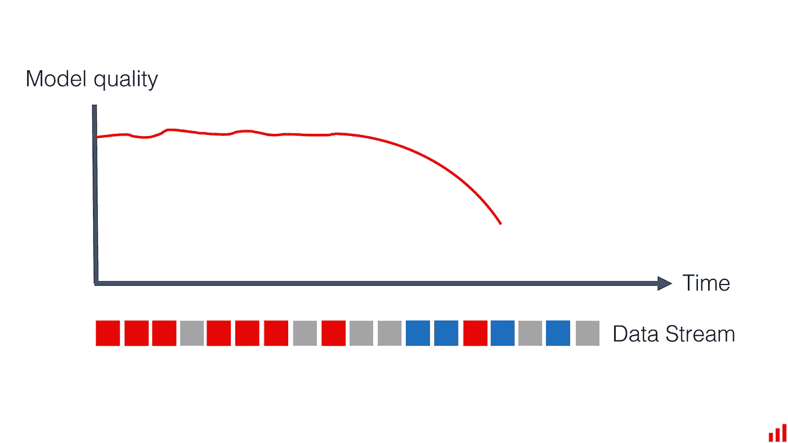

图片作者。

我们分享了一个关于如何提前[检查模型再培训需求的类似想法](https://evidentlyai.com/blog/retrain-or-not-retrain)。在那里，我们观察了模型性能如何随时间变化。

**现在，我们来看看数据是如何变化的。你可以选择其中一个。如果我们知道我们将不得不在生产中等待地面真相标签，那么理解数据漂移就特别有帮助。**

假设数据以恒定的速度变化，我们可以使用这种分析来设定我们的预期。并准备适当的基础设施。

用例是高度动态的吗？是否应该做好频繁再培训的准备，建立自动流水线？

**其次，这种分析可以帮助我们定义模型监控触发器。**

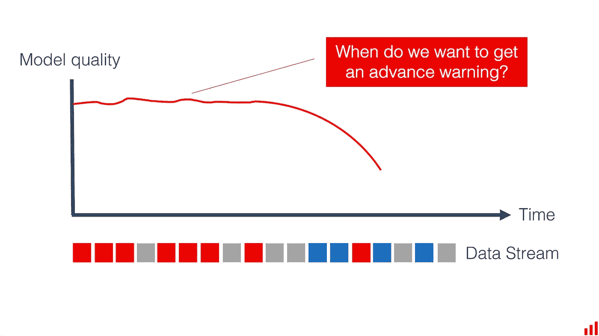

图片作者。

**一旦模型投入生产，我们可能需要检查数据漂移。**我们的触发器应该有多敏感？我们需要发生什么来应对漂移？

要选择阈值和条件，我们需要了解我们的数据在过去是如何变化的。这是一种微妙的平衡！我们不希望有太多的假警报，但我们也希望对有意义的变化做出反应。

我们可以对过去的数据运行几次漂移检查(模拟不同的漂移阈值和监控窗口)并探索结果。

这里有一个例子来说明如何做到这一点。

# 定义漂移检测逻辑

让我们从 Kaggle 获取一个自行车共享数据集。我们将使用它来探索过去的数据漂移。你可以在这个[例子 Jupyter 笔记本](https://github.com/evidentlyai/evidently/blob/main/evidently/tutorials/historical_drift_visualization.ipynb)中跟随它。

在现实生活中，您可以对训练数据进行类似的处理。

为了决定我们的漂移检测逻辑，我们应该做一些假设。

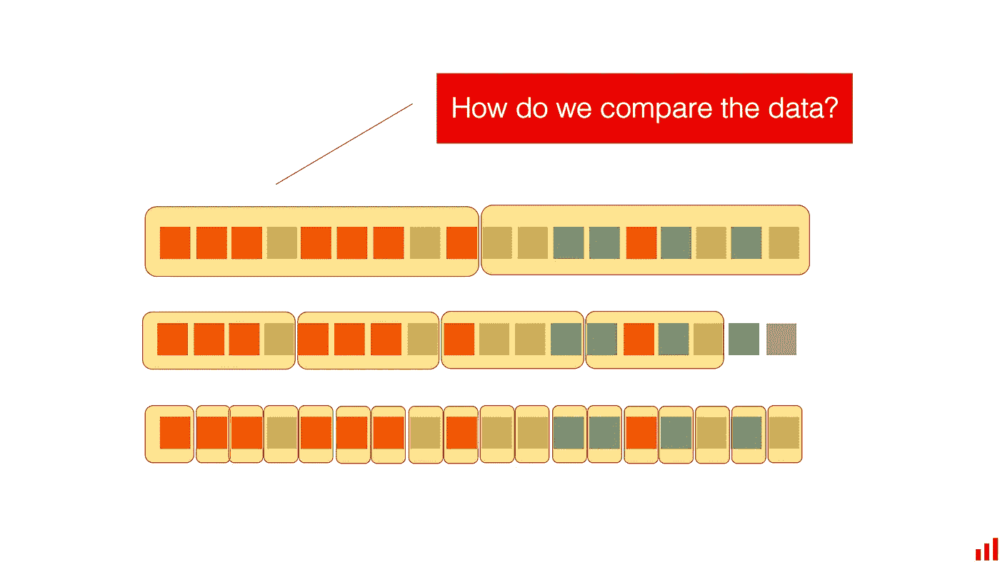

图片作者。

**首先，我们要定义比较窗口。**

例如，我们可以逐月查看数据。这个选择取决于你对数据的理解。数据是如何产生的？背后的真实世界过程是怎样的？你认为它变化的速度有多快？

这里有一些提示:

*   如果你的数据有已知的季节性，你可以考虑它。例如，进行一周一周的比较，而不是一天一天的比较，以避免对周末模式反应过度。或者相互比较不同年份的 12 月份数据。
*   **如果你知道模型退化的速度，就以此为起点**。我们在之前已经分享过[这种方法。如果你知道你的模型在一个月内降级，你可以看看周漂移，看看你能提前多长时间预测这种下降，以及它看起来如何。](https://evidentlyai.com/blog/retrain-or-not-retrain)
*   **你可以建立几个漂移“视图”，设定不同的预期。**比如同时看周线和月线漂移，设置不同的阈值。用例定义了它:你可以有多个季节或者其他已知的模式。

你总是可以测试一些假设，看看这会如何改变结果。

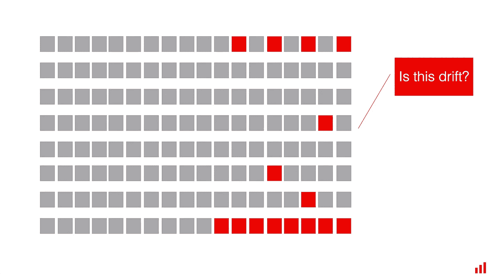

作者图片

**我们的第二个假设是漂移检测阈值。**

我们可以使用统计测试来评估单个要素的漂移，并根据 P 值来判断结果。

但是为了对其进行操作或实现监控触发器，我们通常需要一些“是”或“否”的决定或整个数据集的聚合数。为此，我们可以在统计测试的结果之上实现一些定制的逻辑。

**例如，我们可以查看漂移特征的份额**，并且仅当超过 50%的漂移特征具有统计上的显著变化时才发出警报。

我们还可以操纵统计测试的置信水平。通常的默认值是 0.95，但是您可能有理由将其设置为 0.99 或 0.9，例如。

这里有一些提示:

*   您可以只关注关键特性。您可以根据重要性为特征分配不同的权重，或者仅对顶部特征运行漂移检测。并非所有的漂移都是一样的。次要特性的变化通常不会影响关键性能指标。
*   **如果你有很多弱项，你可以看看整体漂移。**但是在这种情况下，您可以增加阈值来定义漂移已经发生(根据更高的置信水平和特征数量)。

在我们的例子中，我们有几个月的数据。**让我们定义一下我们的假设:**

*   我们用第一个月作为训练数据。
*   我们逐月进行漂移比较。
*   我们将测试单个要素和数据集的漂移。
*   在数据集漂移的情况下，我们将统计测试的置信水平设置为 0.95。我们将同等重视所有要素，如果超过 50%的要素发生漂移，则认为我们的数据集发生了漂移。

# 它在代码中的样子

要查看所有细节，请查看我们的[示例 Jupyter 笔记本](https://github.com/evidentlyai/evidently/blob/main/evidently/tutorials/historical_drift_visualization.ipynb)。

为了实现这种方法，我们将使用以下库:

*   *JSON* 、 *pandas* 和 *NumPy* 作为处理数据所需的标准库。
*   *Plotly* ，来可视化我们的数据漂移。
*   *显然是*，使用统计测试计算漂移。
*   *Mlflow* ，记录结果。

一旦我们导入了库，我们就加载了数据。看起来是这样的:

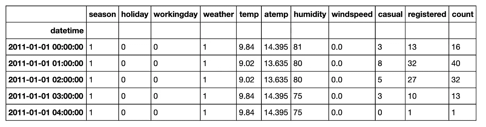

作者图片，Jupyter 笔记本中的数据集预览。

我们定义列映射来指定特征类型。这显然是执行正确的统计测试所需要的。

```
data_columns = {}
data_columns['numerical_features'] = ['weather', 'temp', 'atemp', 'humidity', 'windspeed']
```

我们还定义了我们的参考数据(第一个月)和随后的时间段来评估漂移。我们将每个月的数据视为一次实验。

```
reference_dates = ('2011-01-01 00:00:00','2011-01-28 23:00:00')experiment_batches = [
    ('2011-02-01 00:00:00','2011-02-28 23:00:00'),
    ('2011-03-01 00:00:00','2011-03-31 23:00:00'),
    ('2011-04-01 00:00:00','2011-04-30 23:00:00'),
    ('2011-05-01 00:00:00','2011-05-31 23:00:00'),  
    ('2011-06-01 00:00:00','2011-06-30 23:00:00'), 
    ('2011-07-01 00:00:00','2011-07-31 23:00:00'), 
]
```

接下来，我们实现了两个自定义函数。他们在显然由概要提供的统计测试结果之上引入逻辑。

**第一个帮助检测数据集漂移。**它将返回关于整体漂移的单一真真或假响应。我们可以设置统计测试的置信水平，并选择漂移特征的阈值。我们也可以通过设置 *get_ratio* 为 TRUE 来获得漂移特性的份额。

**第二个有助于检测特征漂移。**显然已经在 JSON 概要文件输出中返回了各个特性的 P 值。我们添加这个函数来获得每个特性的二进制响应:1 表示漂移，0 表示不漂移。我们可以设置统计测试的置信水平。并且，我们仍然可以通过将 *get_pvalues* 设置为 TRUE 来获得每个特征的 P 值。

您可以按照这个示例构建自己的定制逻辑。

# 可视化特征漂移

先说特征漂移。

我们调用我们的函数来评估单个特征的漂移。

```
features_historical_drift = []**for** date **in** experiment_batches:
    drifts = detect_features_drift(raw_data.loc[reference_dates[0]:reference_dates[1]], 
                           raw_data.loc[date[0]:date[1]], 
                           column_mapping=data_columns, 
                           confidence=0.95,
                           threshold=0.9)

    features_historical_drift.append([x[1] **for** x **in** drifts])

features_historical_drift_frame = pd.DataFrame(features_historical_drift, columns = data_columns['numerical_features'])
```

然后，我们使用 Plotly 将结果可视化在热图上。我们将检测到漂移的时间段标为红色。

这是我们得到的结果:

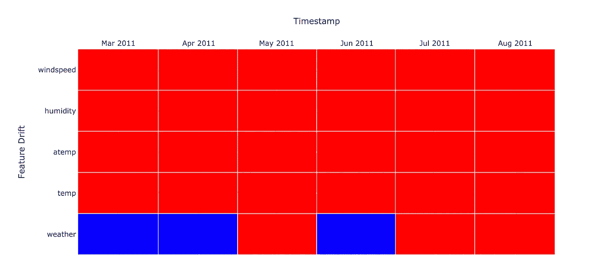

作者形象，情节可视化。

哎哟！一点都不稳定。

事实是，我们采用了一个季节性很强的用例。我们的数据实际上与天气有关。温度、湿度、风速模式逐月变化很大。

这给了我们一个非常明确的信号，我们需要考虑最新的数据，并经常更新模型。

如果我们想以更精细的方式来看，我们可以绘制 P 值。我们将 *get_pvalues* 设置为真，然后生成一个新的绘图。

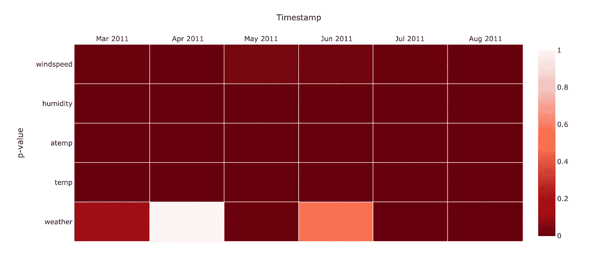

作者形象，情节可视化。

在更细微的变化的情况下，将 P 值视为梯度而不仅仅是漂移的布尔真/假可能会有所帮助。

# 可视化数据集漂移

现在让我们调用一个函数来计算数据集漂移。

知道了数据的不稳定性，我们将阈值设得很高。只有当 90%的特征在分布上有统计变化时，我们才称之为漂移。

```
dataset_historical_drift = []**for** date **in** experiment_batches:
    dataset_historical_drift.append(detect_dataset_drift(raw_data.loc[reference_dates[0]:reference_dates[1]], 
                           raw_data.loc[date[0]:date[1]], 
                           column_mapping=data_columns, 
                           confidence=0.95))
```

这就是逐月统计的结果。

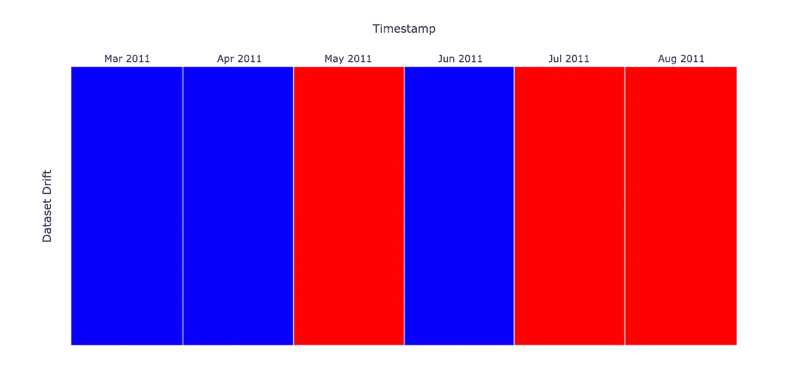

作者形象，情节可视化。

您还可以设置一个更细粒度的视图，并使用每个月内的漂移特征份额绘制一个图。

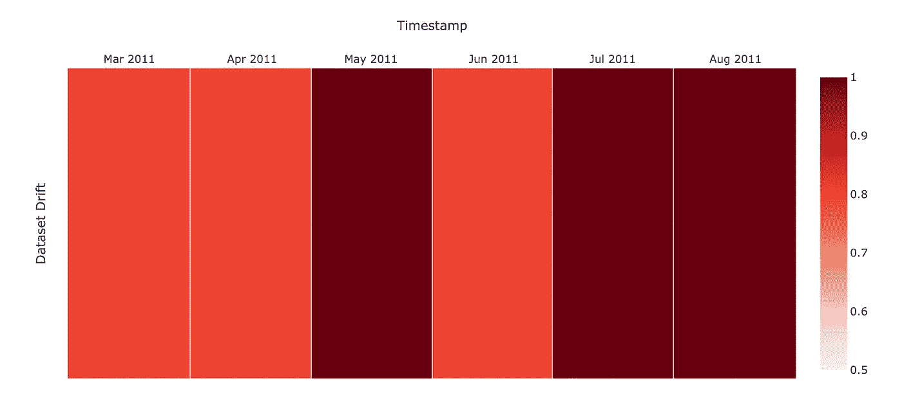

作者形象，情节可视化。

根据不同的用例，您可以选择不同的方式来显示这些数据，比如条形图。

# 记录漂流物

当我们的目标是探索或分享信息时，可视化是很有帮助的。

但是我们可能还想简单地记录其他地方的特性和数据集漂移测试的数字结果。例如，我们想记录一个实验结果的漂移值。

**或者，我们想为生产中的模型跟踪它。**

一旦我们定义了漂移条件，我们就可以监控它们是否得到满足。我们希望得到一个布尔响应，无论生产中是否发生了漂移，或者基于某个阈值触发警报。

**要记录漂移结果，我们可以使用 Mlflow 跟踪。这是一个管理 ML 生命周期的流行库。在这种情况下，我们显然使用和我们的自定义函数来生成输出(数据集漂移度量)，然后用 Mlflow 记录它。**

你可以按照我们在 [Jupyter 笔记本](https://github.com/evidentlyai/evidently/blob/main/evidently/tutorials/historical_drift_visualization.ipynb)中的例子来做。这很简单！

以下是 Mlflow 界面中的结果。我们记录了每次运行的数据集漂移指标。

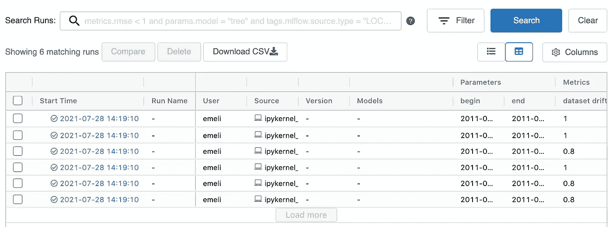

图片由作者提供，Mlflow 界面截图。

或者这是一个扩展视图:

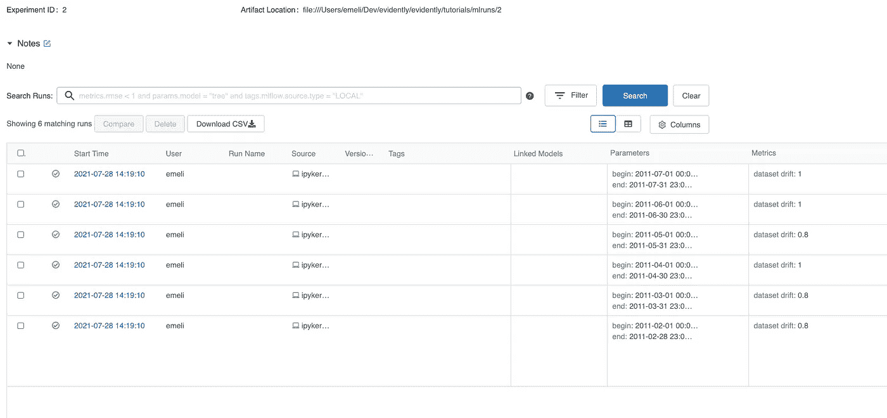

图片由作者提供，Mlflow 界面截图。

# 适应您的用例

您可以将这个示例应用到您的用例中。

**例如，您可以修改漂移检测逻辑**来更好地考虑手头的用例。您可以测试几种组合，并选择合适的窗口和漂移条件。

**你也可以用其他的** [**报道**](https://docs.evidentlyai.com/reports) **。**例如，除了数据漂移之外，您还可以生成一个性能报告来记录模型质量指标。然后，您可以遵循类似的步骤，使用 Plotly 来分析您的[模型衰减测试](https://evidentlyai.com/blog/retrain-or-not-retrain)的结果，从而可视化历史模型性能。

**当然，这种方法也适用于生产。**尤其是当您有批量模型运行时。例如，您定期对数据和预测运行漂移检查，并使用 Mlflow 进行记录，或者简单地将其写入数据库。

你一直在看你的数据漂移吗？让我们知道！

*最初发表于*[*https://evidentlyai.com*](https://evidentlyai.com/blog/tutorial-3-historical-data-drift)*并与* [*埃琳娜·萨穆伊洛娃*](https://www.linkedin.com/in/elenasamuylova/) *合著。*

在 appeally AI，我们创建了开源工具来分析和监控机器学习模型。在 GitHub *上查看我们的* [*项目，喜欢就给它一颗星！*](https://github.com/evidentlyai/evidently)

想留在圈子里吗？

*   [*报名参加*](https://evidentlyai.com/blog/retrain-or-not-retrain#signup) *我们的每月简讯。*
*   *关注* [*推特*](https://twitter.com/EvidentlyAI) *和*[*Linkedin*](https://www.linkedin.com/company/evidently-ai/)*。*
*   *加入我们的* [*不和谐社区*](https://discord.gg/xZjKRaNp8b) *聊天连线。*