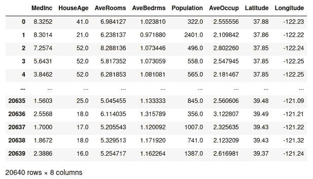
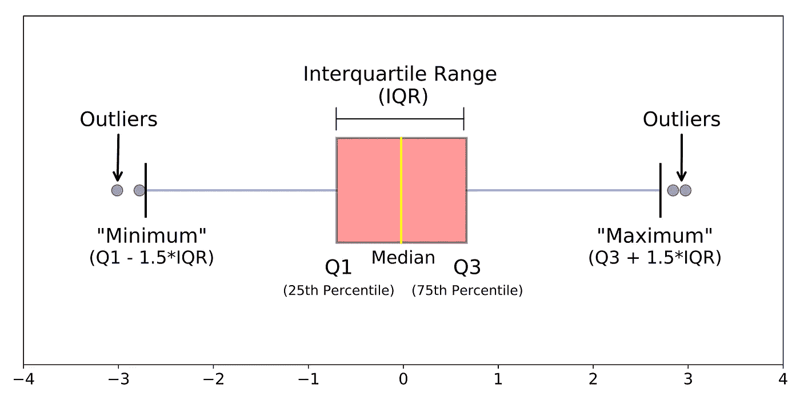
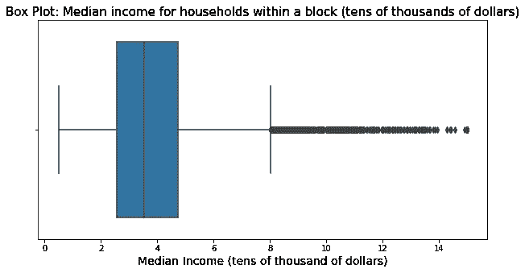
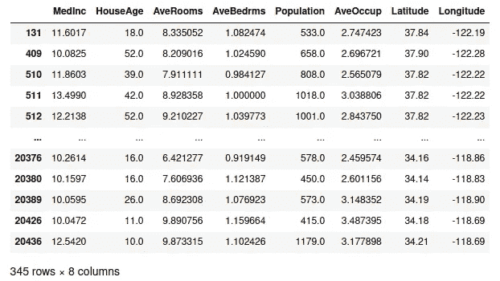
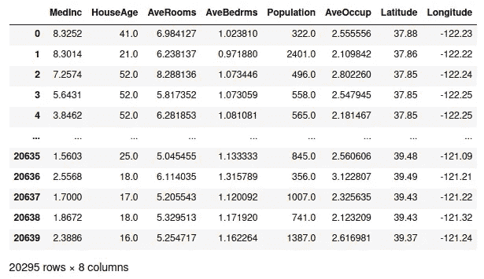
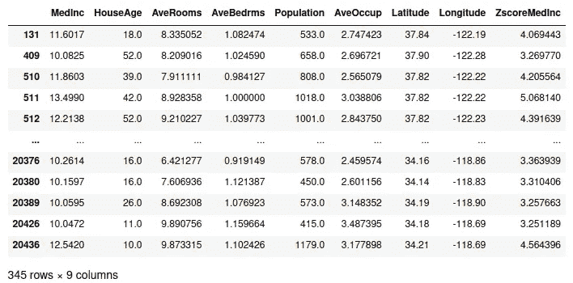
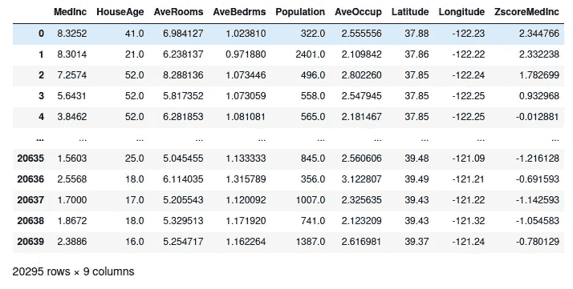

# 如何检测、处理和可视化异常值

> 原文：<https://towardsdatascience.com/how-to-detect-handle-and-visualize-outliers-ad0b74af4af7?source=collection_archive---------15----------------------->

当我刚开始开发数据科学项目时，我不关心数据可视化或离群点检测，我只关心创建酷模型。但是，当我开始检查其他数据科学家的代码时，我意识到数据质量甚至比模型本身更重要，所以我开始更多地关注探索性数据分析(EDA)部分，我意识到我是多么愚蠢。

# 介绍

几乎在任何数据科学项目中，我们都必须了解我们将要处理的数据。根据我们从事的项目，这些数据会有很大差异，但每个项目的流程几乎都是相同的:

1.  从源(读取数据。csv，。xlsx，关系数据库…)
2.  检查每一列的描述性统计数据(平均值、最大值、最小值、标准偏差、中位数……)
3.  数据清理和数据争论(删除或填充 NaN、inf 和-inf 值，删除无用的列，创建新列……)
4.  使用不同类型的图(条形图、散点图、箱线图等)可视化数据
5.  处理异常值(如果可能，删除或转换它们)
6.  创建、训练和测试模型
7.  迭代最佳模型，进行微调、特性选择和 A/B 测试
8.  选择最佳模型并部署它

当然，详细解释这一过程需要很长时间，所以在这篇文章中，我将把重点放在异常检测、处理和可视化上。但是等一下…什么是离群值，为什么我应该关心它们？

根据**维基百科**，这是离群值的定义:

> 在统计学中，**异常值**是与其他观察值显著不同的数据点。异常值可能是由于测量中的可变性造成的，或者它可能表明实验误差；后者有时被排除在数据集之外。异常值会在统计分析中引起严重的问题。

# 一些异常理论

既然我们已经了解了什么是异常值以及为什么处理它们很重要，我们可以从一些理论开始。

正态分布和标准偏差[2]

上图显示了一个完美的正态分布数据集。如果我们仔细观察曲线的中心，我们会看到数据集的平均值的标准偏差为 0，根据理论，正态分布数据集的 99.7%的数据点距离平均值的标准偏差在 3 到-3 之间。这意味着标准偏差大于 3 或小于-3 的所有值都将被视为异常值。

# 用 Python 可视化离群值

检测异常值的一个非常有用的方法是可视化它们。显示异常值的最佳图表类型是箱线图。但是，在可视化之前，让我们加载一个数据集:

Scikit-learn 的加州住房数据集

## 箱形图

正如我之前所说的，当谈到离群值可视化时，盒状图是掌握关于数据离群值的有价值信息的最简单的方法。但是在可视化任何异常值之前，让我们理解什么是箱线图及其不同的组成部分:

箱形图的组成部分[3]

正如我们在上面的图像中看到的，箱线图有许多组成部分，每一部分都有助于我们表示和理解数据:

*   **Q1。** 25%的数据低于该数据点。
*   **中位数。**数据集的中心值。它也可以表示为 Q2。50%的数据都在这个数据点以下。
*   **Q3。** 75%的数据都在这个数据点以下。
*   **最小值。**数据集中非异常值的最小值数据点。
*   **最大。**数据集中非离群值的最大值的数据点。
*   **IQR。**代表 Q1 和 Q3 之间的所有值。

一旦我们理解了盒状图的所有组成部分，让我们针对数据集中的给定变量对其进行可视化:

哇！看起来在我们的数据集的 MedInc 变量中有许多异常数据点。但是，如果我们想检查熊猫的数据框中的这些行呢？我们怎样才能只选择这些行呢？

在下面的段落中，我们将看到如何使用 Python 和 scipy 包来检测异常值。

# 从头开始检测异常值

正如我们在文章开头所说的，所有偏离平均值 3 或-3 个标准差的数据点都是异常值。让我们为 MedInc 列(中等收入列)编码:

这些是异常值:

中间异常行

如果我们移除所有医学异常值，这将是数据集:

无医学异常值的数据集

# 用 Scipy 检测异常值

有一种更简单的方法来检测异常值。多亏了 scipy 包，我们可以计算任何给定变量的 z 值。z 得分让您了解一个数据点离平均值有多少标准差。因此，如果 z 得分为-1.8，我们的数据点将偏离平均值-1.8 个标准偏差。让我们检查代码:

如果我们显示数据框，结果将与我们之前从头开始的方法相同:

使用 z-score 对异常值行进行 MedInc

使用 z-score 的无医学异常值数据集

# 处理异常值

我们已经学会了如何检测和可视化异常值，但是我们如何处理它们呢？这个问题没有简单的答案，但我会尽量简短。答案是，这在很大程度上取决于你正在做的项目类型:

如果您正在进行探索性数据分析(EDA)，您的一些见解可能是错误的，因为异常值可能会让您得出错误的结论。为了防止这种情况，您还应该从其余数据中单独分析您的异常值，并尝试重复分析以消除异常值。一旦你完成了这个迭代过程，你的洞察力将更加一致。

在您创建机器学习模型的情况下，离群值可能会使您的模型表现不佳。为了防止这种情况发生，你可以尝试不同的方法。这里有两个例子:

*   如果您有大量数据，但离群值很少，您可以尝试删除它们，并用较少的数据训练您的模型。
*   如果异常值是由错误的测量(如传感器收集的数据)引起的，您可以尝试使用平均值来更改异常值。

# 摘要

在这篇文章中，我们看到:

1.  离群值的定义
2.  关于异常值和数据分布的一些理论
3.  如何可视化离群值
4.  如何检测异常值
5.  如何处理异常值

# 参考

1.  [https://es . Wikipedia . org/wiki/Distribuci % C3 % B3n _ de _ probabilidad](https://es.wikipedia.org/wiki/Distribuci%C3%B3n_de_probabilidad)
2.  [https://towards data science . com/understanding-box plots-5e 2 df 7 bcbd 51](/understanding-boxplots-5e2df7bcbd51)