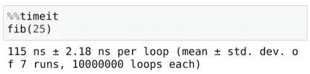
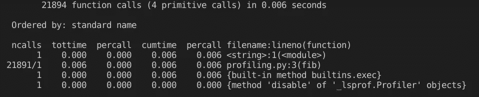
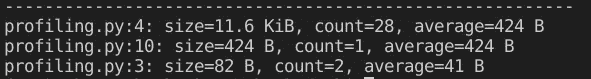
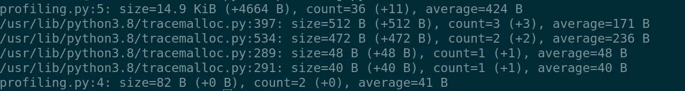

# 如何检测 Python 应用程序中的内存泄漏

> 原文：<https://towardsdatascience.com/how-to-detect-memory-leakage-in-your-python-application-f83ae1ad897d?source=collection_archive---------12----------------------->

## 标准的 Python 库，可以显示每一行的内存使用和执行时间

来自[佩克斯](https://www.pexels.com/photo/photo-of-gray-faucet-2339722/?utm_content=attributionCopyText&utm_medium=referral&utm_source=pexels)的[路易斯·金特罗](https://www.pexels.com/@jibarofoto?utm_content=attributionCopyText&utm_medium=referral&utm_source=pexels)的照片

看到我们如何在 python 中提高测量算法的性能是很有趣的。大约十年前，当我开始用 python 编程时，我将时间存储在代码中不同点的变量中。这肯定是最丑陋的方式，但在那个时候，我认为我很聪明。

几年后，当我学会使用 python 中的 decorators 时，我创建了一个函数来做同样的事情。我以为我变聪明了。

但是 python 生态系统在过去十年中已经变得非常庞大。它的应用超越了数据科学和 web 应用开发。随着这一发展，我们改进了用 Python 进行性能审计的方法。

在云计算时代，对资源使用的更精确测量的需求很高。如果你使用 AWS、Azure、G-Cloud 或任何其他云基础设施，通常你必须为资源小时付费。

此外，Python 是机器学习和分布式计算等数据密集型应用的流行语言。因此，理解概要分析和性能审计对于每个 Python 程序员来说都是必不可少的。

在本文中，我们将讨论，

*   测量执行时间的又快又脏的方法；
*   提取运行持续时间的准确摘要；
*   在不同点拍摄内存快照；

在继续之前，让我们也讨论一下我多年来一直使用的老派方法。

# 我再也不会用以前的学校方法了。

这个方法是我刚开始编程时的做法。我存储函数执行前后的时间值。区别在于这个过程运行了多长时间。

下面的代码片段计算小于输入值的质数。在函数的开头和结尾，我写了代码来捕捉时间和计算持续时间。如果我需要编写另一个需要性能审计的函数，我将不得不再次做同样的事情。

这个方法我用了好几年。我遇到的最大问题是我的代码库被快照时间填满了。即使在一个小规模的项目中，这些重复的行也很烦人。它降低了代码的可读性，使调试成为一场噩梦。

当我了解到装修工人时，我很兴奋。他们可以让我的 python 代码再次变得漂亮。我只需要在每个函数的顶部放置一个装饰器。

装饰器接受一个函数，添加一些功能，并返回修改后的。这是我的计算和打印执行时间。

我创建了一个装饰器来捕捉执行函数前后的时间，并在上面的代码中打印出持续时间。我可以注释任何函数，它会打印每次执行的持续时间。

如你所见，我写了第二个函数— skwer。然而，这一次我没有重复任何时间捕获代码。相反，我也注释了 skwer。

装饰者是伟大的时间节省者。有了它们，代码看起来更整洁了。但是对于这种捕获执行时间的方法有一个警告。

如果你的脚本包含一个递归函数，一个调用自己的函数，这将是一个混乱。我已经使用了一段时间的一个变通方法是将装饰器附加到一个包装函数上。

Python 有一些标准库可以方便地解决这些问题。其中两个跟踪运行持续时间的是“timeit”和“cProfile”

# 测量执行时间的最快方法。

Python 标准安装包括 time it——一种测量执行时间的便捷方法。

有了 timeit，你不必重写代码来捕捉时间和手工计算。此外，time 它捕获语句的执行。因此不必担心递归函数调用。

还有，IPython 笔记本有一个很棒的神奇功能，可以打印电池的运行时长。在 Jupyter 笔记本上工作时，这个功能非常有用。

# 全面的性能统计信息集合。

时间这是一种收集性能统计数据的便捷方式。然而，它并没有深入到发现程序的哪些部分是最慢的。

另一个标准 Python 库 cProfile 可以做得更好。

运行上面的脚本将为您提供每行的说明性摘要。

Python 解释器在 6 毫秒内运行了 21894 个函数来执行我们脚本中的四行代码。解释器花了大部分时间运行第三行，在那里我们定义了 Fibonacci 函数。

很了不起。在大规模的应用程序中，我们知道 cProfile 的瓶颈在哪里。

在另一个函数中执行我的应用程序函数，也是在一个字符串中，这是一种不适。但是，cProfile 有一个更方便的方法。用哪个是你个人的喜好。

当使用 cProfile 进行审计时，我通常更喜欢 Profile 类而不是 run 方法。是的，run 方法很方便。然而，我喜欢 Profile 类，因为它不希望我在另一个类中运行函数。我有做我需要的事情的灵活性。

# 内存泄漏侦探。

timeit 和 cProfile 都简化了 Python 程序员的一个关键问题。查明代码在哪里花费了大部分运行时间是进一步优化机会的暗示。

然而，运行时间并不是衡量算法性能的正确标准。许多其他外部因素扭曲了实际执行时间。通常是操作系统控制它，而不是代码本身。

> 运行时间不是性能的衡量标准。它只是资源使用的一个代理。

由于这些外部的复杂性，我们不能断定一个长时间运行的函数确实是一个瓶颈。

Python 标准库也有一种精确估计资源使用的方法——trace malloc。

Tracemalloc 代表跟踪内存分配，是一个标准的 Python 库。它允许您在代码的不同点获取内存使用的快照。以后你可以比较一下。

这里有一个 tracemalloc 的基本例子。

运行上面的代码将输出每一行的内存使用情况。类似于 cProfile，但是是内存而不是运行时间。

代码的第四行是最重要的内存消耗者。解释器已经检查了这一行 28 次，每次都使用了 424B 的内存。

在示例应用程序中，这个数量很小。但是在实际应用中，这将是重要和关键的。

进一步的 tracemalloc 允许快照之间的比较。有了这个特性，我们甚至可以创建不同组件的内存使用图。

上面的代码将打印出每一行消耗了多少内存，以及自上次快照以来增加了多少。

在我们的代码中，我们计算了第 9 行中的第 30 个斐波那契数，并拍摄了我们的第一张快照。然后我们计算第 40 个斐波那契数列，再取一个。输出显示我们已经使用了 4664B 的额外内存，并且对第 5 行多执行了 11 次。

# 结论

成功运行软件的一个关键方面是准确测量它使用了多少资源。这种理解允许工程师优化 CPU 内核和内存来运行应用程序。

今天，我们在许多项目中广泛使用 Python。由于其广泛的社区和生态系统，使用在最近几年成倍增长。

本文主要关注如何追溯 Python 程序中的执行时间和内存使用情况。Python 的标准库允许我们在行的层次上找到这些矩阵，即使是在多模块应用程序上。

我们讨论了三个内置的 python 库来进行性能审计。Timeit 最方便，与 Jupyter 笔记本完美融合。cProfile 是一个全面的执行时间记录器。最后，我们讨论了 tracemalloc，它允许我们在不同的点拍摄内存快照并进行比较。

我希望在 Python 中测量性能现在已经非常清楚了。但是如何让 Python 运行得更快呢？与 Java 和 C++相比，它仍然被认为是一种缓慢的编程语言。查看我之前关于提升 Python 脚本性能的文章。

 [## 如何将 Python 数据管道加速到 91X？

### 一个 5 分钟的教程可以为您的大数据项目节省数月时间。

towardsdatascience.com](/how-to-speed-up-python-data-pipelines-up-to-91x-80d7accfe7ec) 

> 感谢阅读，朋友！看来你和我有许多共同的兴趣。我很乐意通过 LinkedIn、T2、Twitter 和 Medium 与你联系

还不是中等会员？请使用此链接 [**成为**](https://thuwarakesh.medium.com/membership) 的会员。你可以享受成千上万的有见地的文章，并支持我，因为我赚了一点佣金介绍你。