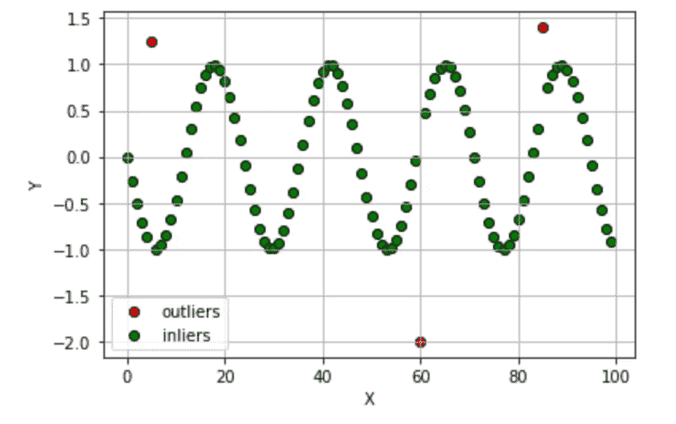

# 如何用 Python pyod 检测异常值

> 原文：<https://towardsdatascience.com/how-to-detect-outliers-with-python-pyod-aa7147359e4b?source=collection_archive---------16----------------------->

## 数据预处理

## 关于 pyod 库使用的快速教程。


威尔·梅尔斯在 [Unsplash](https://unsplash.com?utm_source=medium&utm_medium=referral) 上拍照

异常值检测是一种预处理技术，它允许识别数据集中的*奇怪的*数据点。

数据预处理还包括:

*   [缺失值](/data-preprocessing-with-python-pandas-part-1-missing-data-45e76b781993?source=your_stories_page-------------------------------------)
*   [标准化](/data-preprocessing-with-python-pandas-part-4-standardization-ccd5b1608f1c?source=your_stories_page-------------------------------------)
*   [正常化](/data-preprocessing-with-python-pandas-part-3-normalisation-5b5392d27673?source=your_stories_page-------------------------------------)
*   [格式化](/data-processing-with-python-pandas-part-2-data-formatting-710c2eafa426?source=your_stories_page-------------------------------------)
*   [宁滨](/data-preprocessing-with-python-pandas-part-5-binning-c5bd5fd1b950?source=your_stories_page-------------------------------------)
*   [删除重复](/data-preprocessing-in-python-pandas-part-6-dropping-duplicates-e35e46bcc9d6)。

数据集中的异常值检测包括发现具有异常行为的项目。离群值检测可以被认为是一种预处理技术，以及缺失值检测、规范化、标准化、数据格式化、数据宁滨和删除重复项。在 Sergio Santoyo 的这篇有趣的文章中可以找到异常值检测的快速介绍。

存在不同的异常值检测技术:

*   极值分析:这种方法假设太大或太小的值都是异常值。这项技术包括 Z 检验和学生的 t 检验；
*   **概率和统计模型**:这些方法假设数据的特定分布。离群点是概率低的点；
*   **线性模型**:这些方法利用每个数据点到特定平面的距离来发现异常值。这些技术包括 PCA(主成分分析)；
*   **基于接近度的模型**:在这些模型中，离群点是指从其余观察中分离出来的点。这些技术包括聚类分析、基于密度的分析和最近邻法；
*   **信息论模型**:在这些模型中，离群值增加了描述数据集的最小代码长度；
*   **高维离群点检测**:这些模型实现了特定的方法来处理高维稀疏数据。

在本教程中，我利用了`pyod` Python 库，它支持以下异常值检测技术:

*   基于邻近的
*   线性的
*   盖然论的
*   离群系综
*   神经网络。

`pyod`库的完整文档可以在[这个链接](https://pyod.readthedocs.io/en/latest/)中找到。在本教程中，我只关注前三种技术。

这个教程可以从我的 [Github 库](https://github.com/alod83/data-science/tree/master/Preprocessing/OutliersDetection)下载。

# 构建数据集

首先，我从头开始构建数据集:我构建一个正弦波，然后通过手动添加三个异常值来扰动它。我利用`numpy`库的`sin()`函数来构建正弦波。

```
import numpy as npX = np.arange(0,100)
Y = np.sin(50*X)
```

在波动扰动之前，我通过`matplotlib`库绘制了它。

```
import matplotlib.pyplot as pltplt.plot(X,Y)
plt.scatter(X,Y)
plt.grid()
plt.ylabel('Y')
plt.xlabel('X')
plt.show()
```


作者图片

现在我通过修改一些 Y 值来扰动正弦波。最后，我有 3 个异常值。

```
Y[5] = 1.25
Y[60] = -2
Y[85] = 1.4
n_outliers = 3
```

我画出了扰动后的波形。3 个异常值的存在是清楚的。

```
plt.plot(X,Y)
plt.scatter(X,Y)
plt.grid()
plt.ylabel('Y')
plt.xlabel('X')
plt.show()
```


作者图片

# 基于邻近的模型

这些模型将异常值视为与其余观察值隔离的点。基于邻近度的主要模型包括:

*   聚类分析
*   基于密度的分析
*   最近的街区。

`pyod`库实现了以下算法:

*   LOF(局部异常因素)
*   COF(基于连通性的异常因素
*   基于聚类的局部离群因子
*   局部相关积分
*   基于直方图的异常值分数
*   kNN (k 最近邻)
*   平均 KNN
*   MedKNN(中位数 KNN)
*   子空间离群点检测
*   ROD(基于旋转的异常检测)

在本教程中，我利用了`KNN`模型。首先，我将`Y`数据改造成可以作为`KNN()`模型输入的格式。然后，我构建了`KNN`模型，并用`Y`来拟合它。最后，我通过`predict()`函数预测异常值。

```
from pyod.models.knn import KNNY = Y.reshape(-1, 1)
clf = KNN()
clf.fit(Y)outliers = clf.predict(Y)
```

`outliers`变量是一个数组，如果`Y`中对应的值是离群值`0`，则包含`1`，否则包含`0`。因此，我可以通过名为`where()`的`numpy`函数来计算异常值的位置。在这个例子中，算法正确地检测出异常值。

```
np.where(outliers==1)
```

它给出了以下输出:

```
(array([ 5, 60, 85]),)
```

我绘制结果。首先我计算`Y_outliers`和`X_outliers`，以及`Y_inliers`和`X_inliers`。

```
Y_outliers = Y[np.where(outliers==1)]
X_outliers = X[np.where(outliers==1)]
Y_inliers = Y[np.where(outliers==0)]
X_inliers = X[np.where(outliers==0)]
```

然后，我画一个散点图。

```
plt.scatter(X_outliers, Y_outliers, edgecolor='black',color='red', label='outliers')
plt.scatter(X_inliers, Y_inliers, edgecolor='black',color='green', label='inliers')
plt.legend()
plt.grid()
plt.ylabel('Y')
plt.xlabel('X')
plt.show()
```



作者图片

每个异常值检测算法为每个数据点计算一个异常值。数据点的异常值越大，该数据点为异常值的概率就越高。我通过`decision_function()`计算异常分数。

```
anomaly_score = clf.decision_function(Y)
```

我绘制了一个直方图，其中显示了异常值，一条垂直线显示了算法用来检测异常值的最小异常值。

```
min_outlier_anomaly_score = np.floor(np.min(anomaly_score[np.where(outliers==1)])*10)/10
plt.hist(anomaly_score, bins=n_bins)
plt.axvline(min_outlier_anomaly_score, c='k')
plt.xlabel('Anomaly Score')
plt.ylabel('Number of data points')
plt.show()
```


作者图片

我可以手动定义异常值。例如，我可以考虑异常值大于 0.3 的所有数据点。在这种特定的情况下，手动定义并不好用，但在其他情况下，它可能是有用的。

```
raw_outliers = np.where(anomaly_score >= 0.3)
raw_outliers
```

它给出了以下输出:

```
(array([60, 85]),)
```

# 推广到其他模型

所描述的过程也可以推广到其他方法。为了避免重复代码，我定义了一个名为`outliers_detection()`的函数，它接收异常模型及其名称作为输入。该函数精确计算出我为`KNN`模型计算出的值。

```
def outliers_detection(model, name):
    clf = model
    clf.fit(Y)

    outliers = clf.predict(Y)

    Y_outliers = Y[np.where(outliers==1)]
    X_outliers = X[np.where(outliers==1)]

    Y_inliers = Y[np.where(outliers==0)]
    X_inliers = X[np.where(outliers==0)]
    print(X_outliers)

    plt.scatter(X_outliers, Y_outliers, edgecolor='black',color='red', label='outliers')
    plt.scatter(X_inliers, Y_inliers, edgecolor='black',color='green', label='inliers')
    plt.title(name)
    plt.legend()
    plt.grid()
    plt.ylabel('Y')
    plt.xlabel('X')
    plt.show()

    anomaly_score = clf.decision_function(Y)
    min_outlier_anomaly_score = np.floor(np.min(anomaly_score[np.where(outliers==1)])*10)/10
    plt.hist(anomaly_score, bins=n_bins)
    plt.axvline(min_outlier_anomaly_score, c='k')
    plt.xlabel('Anomaly Score')
    plt.ylabel('Number of data points')
    plt.show()
    return anomaly_score
```

# 线性模型

`pyod`库实现了以下线性模型:

*   主成分分析
*   最小协方差行列式
*   单类支持向量机
*   基于偏差的异常值检测。

在这个例子中，我使用了`OCSVM`模型。首先，我构建模型，然后调用`outliers_detection()`函数。

```
from pyod.models.ocsvm import OCSVM
model = OCSVM()
anomaly_score = outliers_detection(model, 'OCSVM')
```

该模型确定了以下异常值:

```
[ 5  6 29 30 53 54 60 65 77 85]
```


作者图片


作者图片

这个模型高估了异常值的数量。因此，我可以手动定义离群值。从前面的直方图中，我可以看到，例如，异常值可能是异常值大于 2.5 的所有数据点。

```
raw_outliers = np.where(anomaly_score >= 2.5)
raw_outliers
```

它给出了以下输出:

```
(array([ 5, 60, 85]),)
```

在这种情况下，算法会正确识别异常值。

或者，当我构建模型时，我可以指定要检测的异常值的百分比，前提是我事先知道异常值的数量。这可以通过设置`contamination`参数来完成。

```
model = OCSVM(contamination=n_outliers/len(Y))
anomaly_score = outliers_detection(model, 'OCSVM')
```

这给出了以下异常值:

```
[ 5 60 85]
```

# 概率模型

`pyod`库实现了以下概率模型:

*   ABOD(基于角度的异常检测)
*   FastABOD(基于角度的快速异常检测)
*   COPOD(基于 Copula 的离群点检测)
*   中位数绝对偏差
*   随机异常值选择。

在下面的例子中，我主要关注`ABOD`模型。类似地，对于`OCSVM`模型，`ABOD`模型高估了异常值的数量。

```
from pyod.models.copod import COPOD 

model = COPOD()
anomaly_score = outliers_detection(model, 'COPOD')
```

该模型确定了以下异常值:

```
[ 6 29 30 53 54 60 76 77 78]
```

在这种情况下，识别出的异常值列表不包含任何实际的异常值。因此，在这个具体的例子中不应该使用这个算法。

# 摘要

在本教程中，我展示了如何使用 Python `pyod`库检测异常值。

可以通过手动设置阈值来修改基本算法，以区分正常数据点和异常值。

或者，可以通过指定污染百分比来修改基本模型。

如果你想了解我的研究和其他活动的最新情况，你可以在 [Twitter](https://twitter.com/alod83) 、 [Youtube](https://www.youtube.com/channel/UC4O8-FtQqGIsgDW_ytXIWOg?view_as=subscriber) 和 [Github](https://github.com/alod83) 上关注我。

# 相关文章

</model-evaluation-in-scikit-learn-abce32ee4a99>  </how-to-deal-with-imbalanced-multiclass-datasets-in-python-fe0bb3f2b669> [## 如何在 Python 中处理不平衡的多类数据集

towardsdatascience.com](/how-to-deal-with-imbalanced-multiclass-datasets-in-python-fe0bb3f2b669) </automl-in-python-a-comparison-between-hyperopt-sklearn-and-tpot-8c12aaf7e829> 