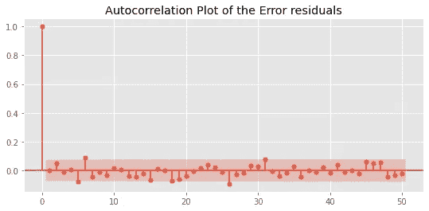
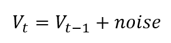

# 时间序列预测中如何检测随机游走和白噪声

> 原文：<https://towardsdatascience.com/how-to-detect-random-walk-and-white-noise-in-time-series-forecasting-bdb5bbd4ef81?source=collection_archive---------2----------------------->

## 找出目标是否值得预测


**照片由** [**【鸢】**](https://www.pexels.com/@pripicart?utm_content=attributionCopyText&utm_medium=referral&utm_source=pexels)**[**像素**](https://www.pexels.com/photo/person-stands-on-brown-pathway-631986/?utm_content=attributionCopyText&utm_medium=referral&utm_source=pexels) **组成。除非另有说明，所有图片均为作者所有。****

# **介绍**

**再强大的机器学习*也不能*预测一切。一个众所周知的领域是时间序列预测，在这个领域它可能会变得非常无助。**

**尽管有一大套自回归模型和许多其他时间序列算法可用，但如果目标分布是**白噪声**或遵循**随机游走**，你就无法预测目标分布。**

**因此，在进一步努力之前，您必须检测这样的分布。**

**在本文中，您将了解什么是白噪声和随机游走，并探索检测它们的成熟统计技术。**

**<https://ibexorigin.medium.com/membership>  

获得由强大的 AI-Alpha 信号选择和总结的最佳和最新的 ML 和 AI 论文:

<https://alphasignal.ai/?referrer=Bex>  

# 在我们开始之前…

这是我关于时间序列预测系列的第三篇文章(你可以从这个[列表](https://ibexorigin.medium.com/list/time-series-forecast-from-scratch-c72ccf7a9229)，一个新的媒体特性中查看整个系列)。

第一个是关于[每一个熊猫功能操纵 TS](/every-pandas-function-you-can-should-use-to-manipulate-time-series-711cb0c5c749?source=your_stories_page-------------------------------------) 数据，第二个是关于[时间序列分解和自相关](/advanced-time-series-analysis-in-python-decomposition-autocorrelation-115aa64f475e?source=your_stories_page-------------------------------------)。

为了从这篇文章中获得最大收益，你至少需要理解什么是自相关。在这里，我将给出一个简单的解释，但如果你想更深入地了解我的上一篇文章。

# 自相关的简要说明

自相关涉及到寻找时间序列和其滞后版本之间的相关性。考虑这个分布:


滞后时间序列意味着将其向后移动一个或多个周期:


自相关函数(ACF)在每个滞后 *k* 找到时间序列与其滞后版本之间的相关系数。您可以使用`statsmodels`中的`plot_acf`函数来绘制它。它看起来是这样的:


x 轴是滞后 *k，*，y 轴是每个滞后的皮尔逊相关系数。红色阴影区域是置信区间。如果柱的高度在该区域之外，这意味着相关性在统计上是显著的。

# 什么是白噪声？

简而言之，白噪声分布是具有以下特征的任何分布:

*   零平均值
*   恒定方差/标准差(不随时间变化)
*   所有滞后的自相关为零

本质上，它是一系列随机数，根据定义，没有算法可以合理地模拟它的行为。

有一些特殊类型的白噪声。如果噪声是正常的(遵循一个[正态分布](/how-to-use-normal-distribution-like-you-know-what-you-are-doing-1cf4c55241e3?source=your_stories_page-------------------------------------)，则称为*高斯白噪声*。让我们看一个直观的例子:


标准偏差为 0.5 的高斯白噪声分布

即使偶尔有尖峰，也看不到可辨别的模式，即分布完全是随机的。

验证这一点的最佳方法是创建 ACF 图:


白噪声分布在所有滞后处的自相关约为 0。

还有“严格的”白噪声分布，它们具有严格的 0 序列相关性。这不同于[褐色/粉红色噪声](https://en.wikipedia.org/wiki/Brownian_noise)或其他自然随机现象，在这些现象中存在微弱的序列相关性，但仍保持无记忆。

# 白噪声在预报和模型诊断中的重要性


照片由[爱德蒙·邓蒂斯](https://www.pexels.com/@edmond-dantes?utm_content=attributionCopyText&utm_medium=referral&utm_source=pexels)从[像素](https://www.pexels.com/photo/man-people-woman-girl-7103038/?utm_content=attributionCopyText&utm_medium=referral&utm_source=pexels)拍摄

尽管白噪声分布被认为是死胡同，但它们在其他情况下可能非常有用。

例如，在时间序列预测中，如果预测值和实际值之间的差异代表一个白噪声分布，您可以为自己的出色工作而感到欣慰。

当残差显示任何模式时，无论是季节性的还是趋势性的，或者具有非零均值，这表明仍有改进的空间。相比之下，如果残差是纯粹的白噪声，那么您已经超出了所选模型的能力。

换句话说，该算法设法捕捉到了目标的所有重要信号和属性。剩下的是随机波动和不一致的数据点，它们不能归因于任何东西。

例如，我们将使用七月的 Kaggle 游乐场竞赛来预测空气中的一氧化碳含量。我们将保持输入“原样”，我们不会执行任何特征工程，我们将选择一个带有默认参数的基线模型:

为简洁起见，省略了初始化和训练/测试分割步骤



ACF 图中有一些模式，但它们在置信区间内。这两个图表明，即使使用默认参数，随机森林也可以从训练数据中捕获几乎所有的重要信号。

# 随机漫步

时间序列预测中更具挑战性但同样不可预测的分布是随机游走。与白噪声不同，它具有非零均值、非恒定标准差/方差，绘制时看起来很像正态分布:


这难道不像雅虎财经里的股票情节吗？

随机漫步系列总是以这种方式巧妙伪装，但它们仍然一如既往地不可预测。对今天价值的最佳猜测是昨天的。

初学者的一个常见困惑是将随机漫步视为一个简单的随机数序列。事实并非如此，因为在随机漫步中，每一步都依赖于前一步。

出于这个原因，随机游走的自相关函数*和*返回非零相关性。

随机漫步的公式很简单:



无论前面的数据点是什么，添加一些随机值，并继续下去，只要你喜欢。让我们用 Python 来生成这个，比如说，初始值为 99:


让我们也画出 ACF:


如你所见，前 40 个滞后产生了统计上显著的相关性。

那么，当可视化不是一个选项时，我们如何检测随机游走呢？

由于它们是如何产生的，区别时间序列应该隔离每个步骤的随机添加。取一阶差是通过将序列滞后 1 并从原始序列中减去它来完成的。熊猫有一个方便的`diff`功能来做到这一点:


如果你画一个时间序列的一阶差分，结果是白噪声，那么就是随机游走。

# 漂移随机游动

对常规随机行走的一个微小修改是添加一个常数值，称为随机漂移步长:


漂移通常用μ表示，就随时间变化的值而言，漂移意味着逐渐变成某种东西。

例如，即使股票不断波动，它们也可能出现正漂移，即随着时间的推移，总体上逐渐增加。

现在，让我们看看如何用 Python 来模拟这一点。我们将首先创建起始值为 25:

从上面的公式中，我们看到，我们需要在每一步添加所需的漂移。我们再加上漂移 5，看剧情:


尽管有剧烈的波动，这个系列还是有明显的上升趋势。如果我们进行差分，我们将看到该系列仍然是随机行走:

```
drifty_walk.diff().plot();
```


# 统计检测随机游走

你可能会问，是否有比仅仅从图中“目测”更好的识别随机游走的方法。

作为回答，Dicker D. A .和 Fuller W. A .在 1979 年提出了一个假设检验，它被称为扩展的 Dickey-Fuller 检验。

本质上，它试图检验一个序列遵循随机游走的零假设。在引擎盖下，它回归滞后价格的价格差异。


如果找到的斜率(β)等于 0，则该系列为随机行走。如果斜率明显不同于 0，我们拒绝序列遵循随机游走的零假设。

幸运的是，您不必担心数学问题，因为测试已经用 Python 实现了。

我们从`statsmodels`导入`adfuller`函数，并将其用于上一节创建的漂移随机行走:

我们看 p 值，大约是 0.26。因为 0.05 是显著性阈值，我们不能拒绝零假设，即`drifty_walk`是随机漫步，即*是*随机漫步。

让我们对一个我们知道不是随机游走的分布进行另一个测试。我们将使用 TPS 七月 Kaggle 游乐场竞赛中的一氧化碳指标:

p 值非常小，表明我们可以很容易地拒绝零假设，即`target_carbon_monoxide`遵循随机游走。

# 摘要

我们只完成了这个时间系列“系列”的第三部分，你已经知道很多了。

从现在开始，随着我们越来越接近系列中实际的“预测”部分，事情只会变得越来越有趣。有一些有趣的文章计划在关键的时间序列主题，如平稳性和时间序列交叉验证。

此外，我将专门针对时间序列的特征工程师写一篇文章——这是一件令人兴奋的事情！[敬请期待](https://ibexorigin.medium.com/)！

## 您可能也会感兴趣…

*   [每一个你可以(应该)用来操纵时间序列的熊猫函数](/every-pandas-function-you-can-should-use-to-manipulate-time-series-711cb0c5c749?source=your_stories_page-------------------------------------)
*   [Python 中的高级时间序列分析:分解、自相关](/advanced-time-series-analysis-in-python-decomposition-autocorrelation-115aa64f475e?source=your_stories_page-------------------------------------)
*   [Matplotlib vs. Plotly:让我们决定一劳永逸](/matplotlib-vs-plotly-lets-decide-once-and-for-all-ad25a5e43322?source=your_stories_page-------------------------------------)**