# 如何检测时间序列中的季节性、异常值和变化点

> 原文：<https://towardsdatascience.com/how-to-detect-seasonality-outliers-and-changepoints-in-your-time-series-5d0901498cff?source=collection_archive---------1----------------------->

## 只需要 Kats 和几行代码

# 动机

你有没有看过一个时间序列，想知道其中是否有重复的模式、异常值或变化点？

当我查看 2021 年 1 月至 8 月每天有多少用户浏览我的页面时，我问了同样的问题。

当看到上面的图表时，我想知道:

*   我的页面平均浏览量有变化吗？如果是，什么时候？
*   我的时间序列中有异常值吗？如果是，什么时候？
*   我怀疑有一些时间比其他时间有更多的活跃用户。这是真的吗？

如果您能像下面这样用几行代码就能检测出时间序列中的突然变化，那不是很好吗？

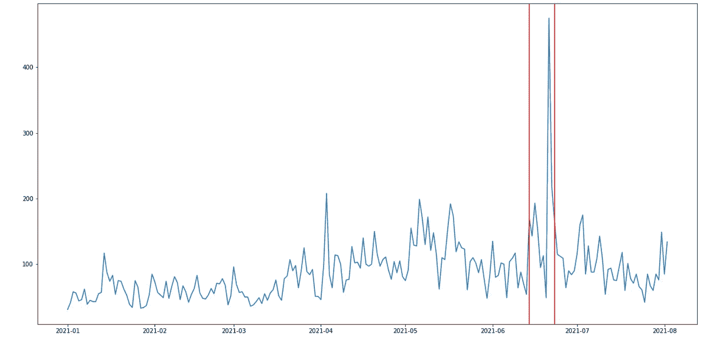

作者图片

这就是 Kats 派上用场的时候。在[的上一篇文章](/kats-a-generalizable-framework-to-analyze-time-series-data-in-python-3c8d21efe057)中，我介绍了 Kats 提供的一些分析时间序列的有用方法。在本文中，我将更深入地研究 Kats 的检测模块。

# 什么是 Kats？

[Kats](https://facebookresearch.github.io/Kats/) 是一个轻量级的、易于使用的、通用的框架，用 Python 来执行时间序列分析，由脸书研究院开发。您可以将 Kats 视为 Python 中时间序列分析的一站式商店。

要安装 Kats，请键入:

```
pip install --upgrade pip
pip install kats==0.1 ax-platform==0.2.3 statsmodels==0.12.2
```

我把我的页面浏览量数据上传到了 Google Drive 上，这样你就可以自己摆弄这些数据了。要下载数据，请使用 gdown:

```
pip install gdown
```

上面的数据显示了从 6 月 1 日到 8 月 2 日，我的网站**每小时**的访问量。让我们想象一下这些数据是什么样子的。

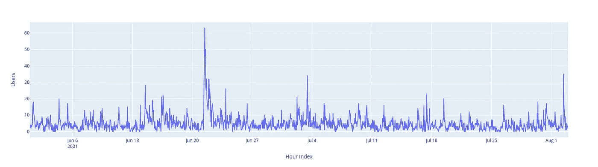

我怀疑每天都有正常运行时间和停机时间。让我们通过放大 2021 年 6 月 1 日的数据来验证一下:

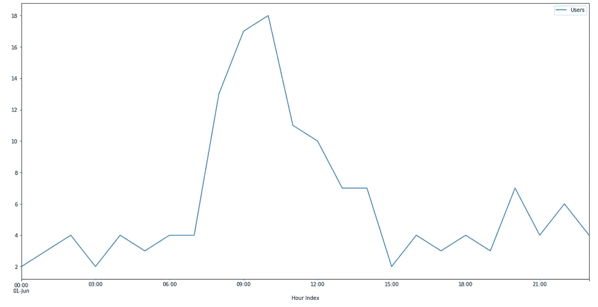

作者图片

这里有一些模式。让我们看看 2021 年 6 月 2 日是否能看到同样的模式:

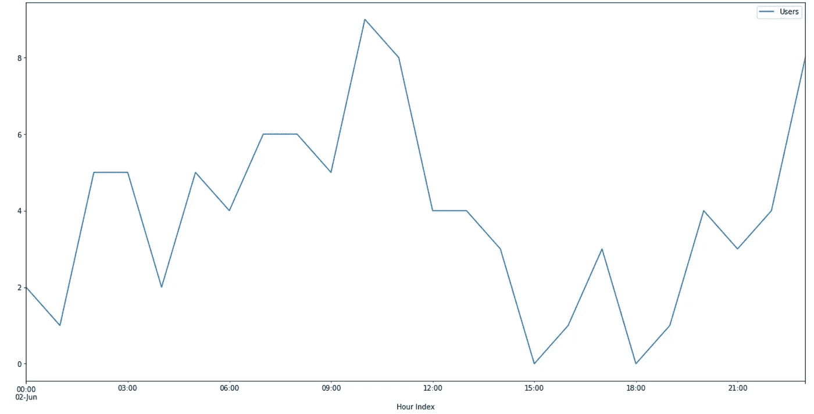

作者图片

看起来这里有一些重复的模式，但不是很容易看到。上图中混合了季节性、趋势和噪声。让我们使用 Kats 将时间序列分解成趋势、季节性和残差。

# 检测季节性

什么是季节性？季节性是时间序列的一个特征，在该时间序列中，类似的变化以小于一年的特定规则间隔发生，例如每小时、每天、每周或每月。

## 时间序列分解-季节性分解

要使用 Kats 分解时间序列，首先要构建一个时间序列对象。

接下来，将时间序列分解为 3 个不同的部分:

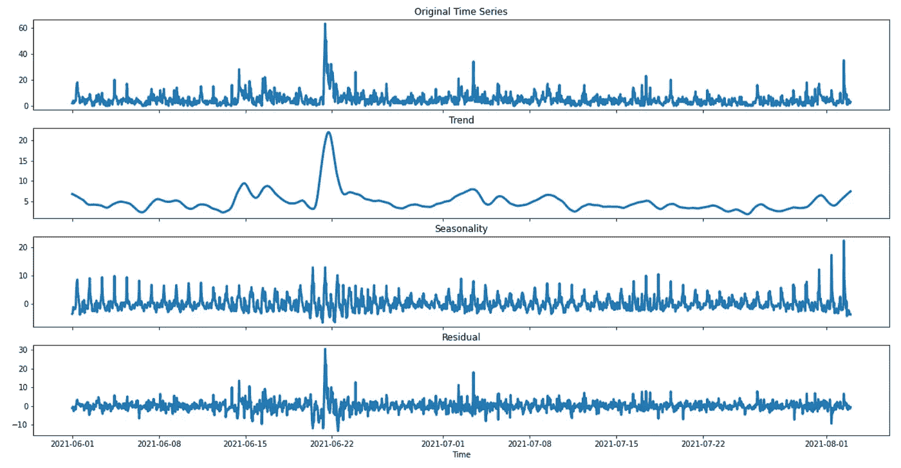

作者图片

啊哈！看起来数据中有季节性。让我们仔细看看 6 月 1 日的季节性部分。

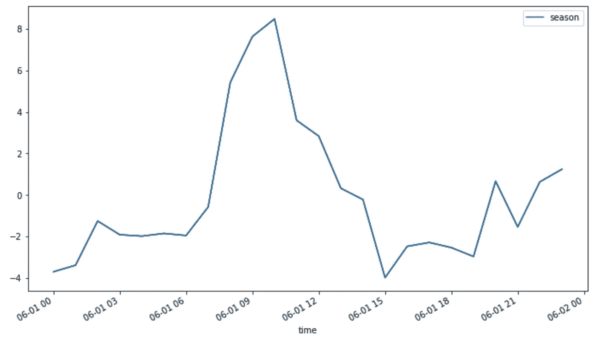

作者图片

让我们再来看看 6 月 2 日的季节性:

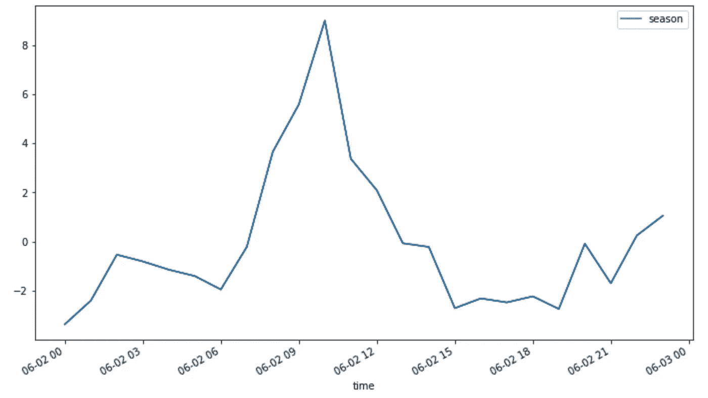

作者图片

6 月 3 日时间序列:

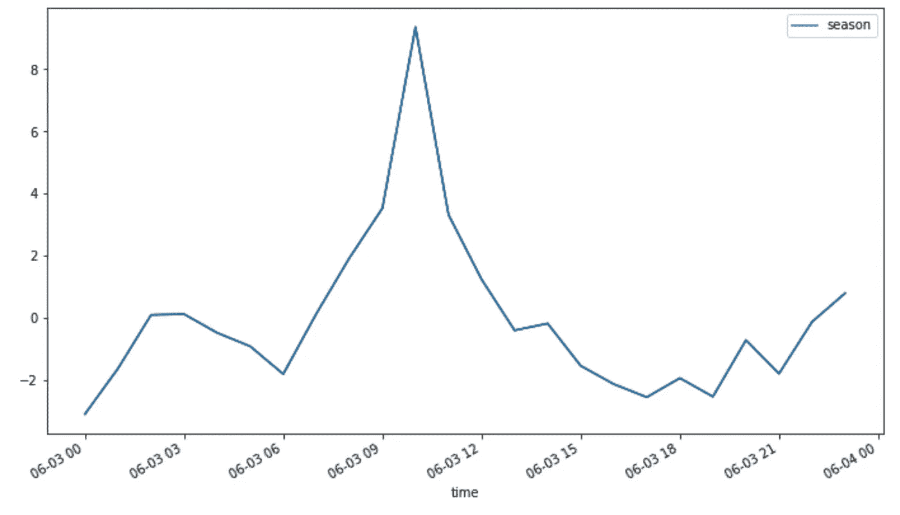

作者图片

现在格局清晰多了！早上 8 点到晚上 12 点是观看人数的高峰。这种模式是有意义的，因为我每天早上 8 点左右写一篇新文章，早上 10 点发一篇时事通讯。

除了手动查看图表，有没有一种测试可以让我们确认时间序列中确实存在季节性？是的，我们可以用 Kats 的快速检测器来做。

## 快速傅立叶变换季节性检测器

除了分解时间序列，Kats 还允许我们使用快速傅立叶变换来检测季节性，并找出潜在的周期长度。

```
{'seasonality_presence': True, 'seasonalities': [56.0, 24.0]}
```

酷！现在我们知道时间序列中确实存在季节性，季节性要么是 24 小时，要么是 56 小时。24 小时季节性证实了我们之前看到的。

# 检测变化点

## CUSUMDetector —检测平均值的向上/向下移动

现在，我好奇的另一个问题是，是否存在一个**期，在此之后，每天的平均浏览量**会发生变化。

要回答这个问题，先从获取 1 月 1 日到 8 月 2 日的**日报**数据开始:

可视化数据:

看起来在 2021 年 4 月初的某个地方有一个手段的转变。让我们用 CUSUM 来确认。

CUSUM 是一种测试变点是否具有统计显著性的方法。Kats 允许您将累计方法与累计检测器一起使用。

```
TimeSeriesChangePoint(start_time: 2021-04-01 00:00:00, 
                      end_time: 2021-04-01 00:00:00, 
                      confidence: 0.9999999999999967)
```

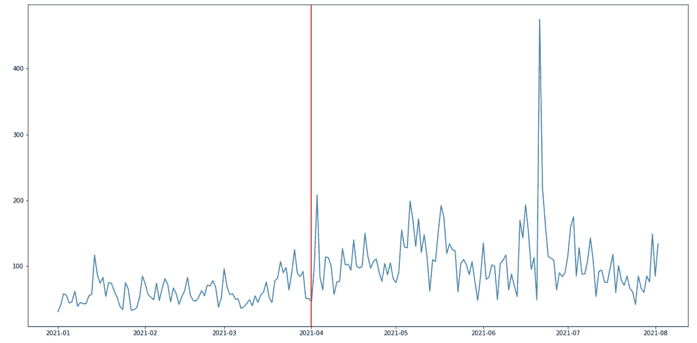

作者图片

是啊！现在我们被证实在 4 月 1 日有一个手段的转变。

## BOCPDetector —检测突然的变化

贝叶斯在线变化点检测(BOCPD)是一种**检测持续时间较长的时间序列中的突然变化**的方法。BOCPD 的一些属性是:

*   **在线模型:**这个检测只需要看前面几步，而不是看整个系列来做预测。随着新数据的到来，它会修正自己的预测。
*   **贝叶斯模型:**您可以指定关于变点概率的先验信念。例如，如果您认为 1%的数据将是一个变化点，那么您可以设置`changepoint_prior=0.01`。

目前，Kats 支持 3 种概率模型:

*   正态分布
*   趋势变化分布
*   泊松过程模型。

在此找到 BOCPDetector [中所有可用的参数。](https://facebookresearch.github.io/Kats/api/kats.detectors.bocpd.html#kats.detectors.bocpd.BOCPDetector)

我们将使用正态分布作为潜在的概率模型。因为我相信我的数据中大约有 1%是一个变点，所以我将设置`changepoint_prior=0.01`。

```
TimeSeriesChangePoint(start_time: 2021-06-14T00:00:00.000000000,
                      end_time: 2021-06-14T00:00:00.000000000, 
                      confidence: 0.74723810504334)TimeSeriesChangePoint(start_time: 2021-06-23T00:00:00.000000000,
                      end_time: 2021-06-23T00:00:00.000000000,  
                      confidence: 0.5250604974512938)
```

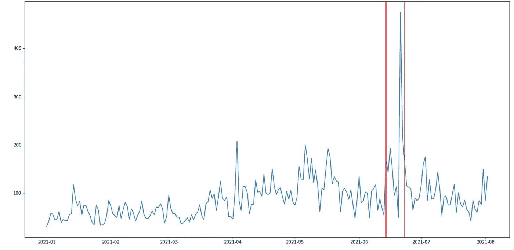

作者图片

变化点在 2021 年 6 月 14 日和 2021 年 6 月 23 日。这个结果是有意义的，因为我们看到 2021 年 6 月 14 日的浏览量显著增加，而 2021 年 6 月 23 日的浏览量下降。

# 异常检测和去除器

剔除异常值在时间序列中非常重要，因为异常值会给下游处理带来问题。幸运的是，Kats 使得检测和去除异常值变得很容易。

Kats 的异常值检测算法是这样工作的:

1.  使用季节分解来分解时间序列
2.  去除趋势和季节性以生成剩余时间序列
3.  检测残差中超出四分位数范围 3 倍的点

让我们使用 OulierDectector 来尝试一下这种检测算法:

```
[Timestamp('2021-04-03 00:00:00'),
 Timestamp('2021-06-20 00:00:00'),
 Timestamp('2021-06-21 00:00:00')]
```

不错！我们能够检测 2021 年 4 月 3 日、2021 年 6 月 20 日和 2021 年 6 月 21 日的异常值。

现在我们已经检测到了这些异常值，让我们使用`remover`方法移除它们。我们还将使用新的线性插值替换移除的值:

绘制原始时间序列和剔除异常值的新时间序列。

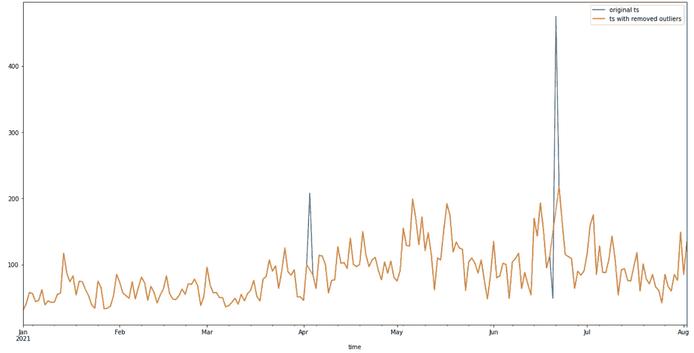

作者图片

酷！从上图中我们可以看出，剔除异常值后的时间序列(橙色线)与 2021 年 4 月 3 日、2021 年 6 月 20 日和 2021 年 6 月 21 日的原始时间序列(蓝色线)不同。

在新的时间序列中似乎没有显著的异常值。现在，您可以放心地将这个新的时间序列用于其他过程，例如预测。

# 结论

恭喜你！您刚刚学习了如何使用 Kats 检测季节性、变化点和异常值。我希望这篇文章能给你在自己的时间序列中发现模式的动力。

您只需使用几行代码就可以获得有用的信息。还有什么比这更好的呢？

随意发挥，并在这里叉这篇文章的源代码:

<https://github.com/khuyentran1401/Data-science/blob/master/time_series/google_analytics/google-analytics-analysis.ipynb>  

我喜欢写一些基本的数据科学概念，并尝试不同的算法和数据科学工具。你可以通过 [LinkedIn](https://www.linkedin.com/in/khuyen-tran-1401/) 和 [Twitter](https://twitter.com/KhuyenTran16) 与我联系。

如果你想查看我写的所有文章的代码，请点击这里。在 Medium 上关注我，了解我的最新数据科学文章，例如:

</similarity-encoding-for-dirty-categories-using-dirty-cat-d9f0b581a552> [## 使用 dirty_cat 对脏类别进行相似性编码

towardsdatascience.com](/similarity-encoding-for-dirty-categories-using-dirty-cat-d9f0b581a552) </kats-a-generalizable-framework-to-analyze-time-series-data-in-python-3c8d21efe057>  </pydash-a-bucket-of-missing-python-utilities-5d10365be4fc>  </how-to-sketch-your-data-science-ideas-with-excalidraw-a993d049f55c> [## 如何用 Excalidraw 勾画您的数据科学想法

towardsdatascience.com](/how-to-sketch-your-data-science-ideas-with-excalidraw-a993d049f55c)