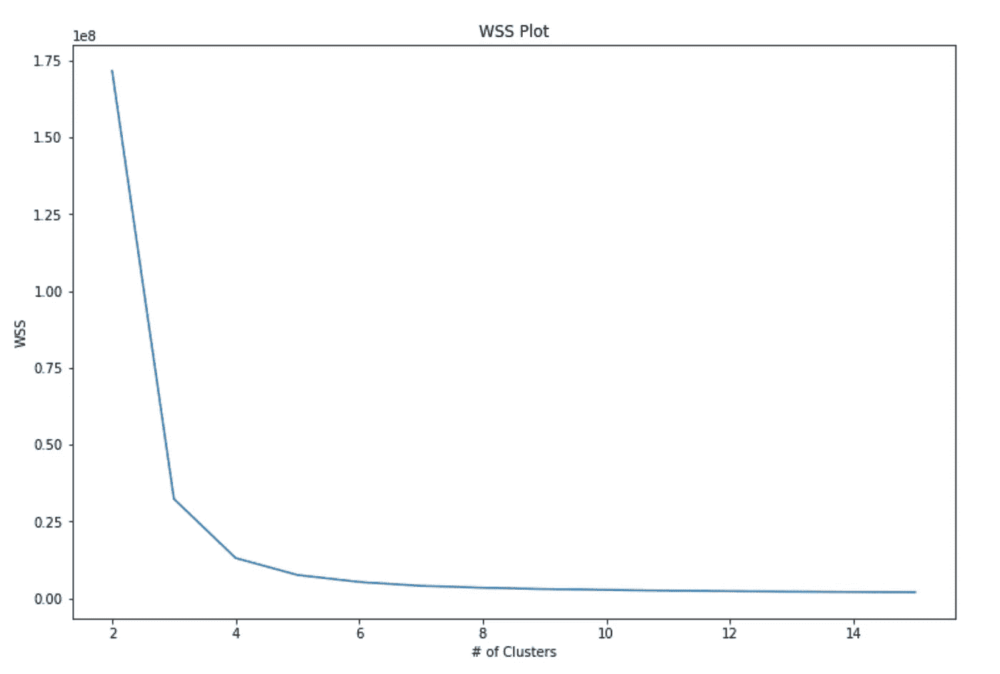
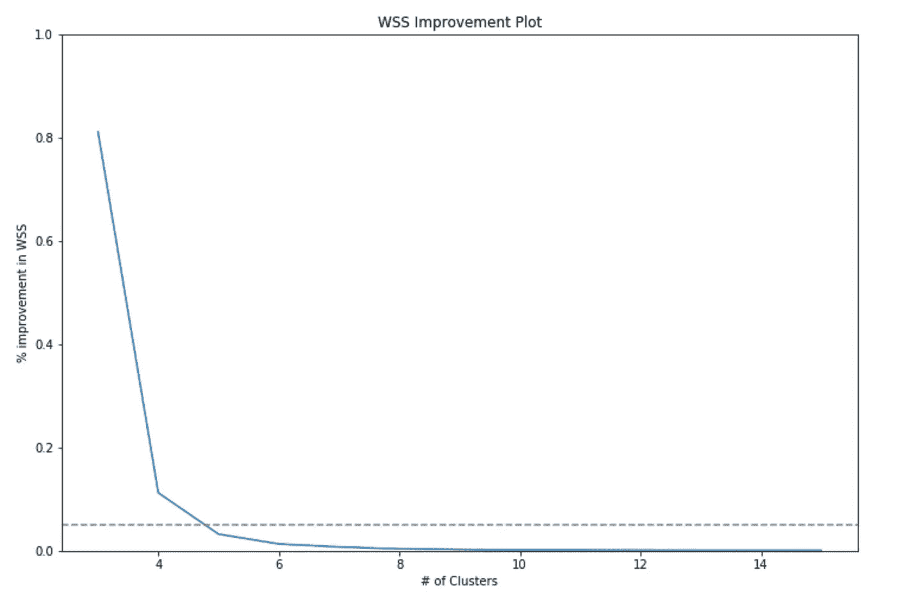
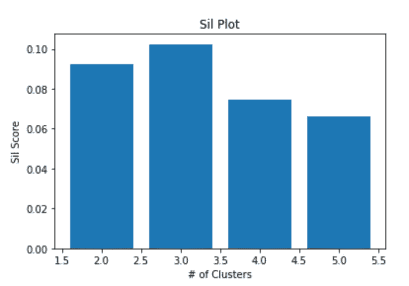

# 如何确定正确的集群数量(带代码)

> 原文：<https://towardsdatascience.com/how-to-determine-the-right-number-of-clusters-with-code-d58de36368b1?source=collection_archive---------38----------------------->

## 如何使用 KMeans &确定在您的分析中使用多少个集群

分类是数据科学工具包中的一项基本技能。它可以解决从用户细分到异常检测的大量问题，并可以帮助您的团队获得非常有趣的见解。


照片由[克里斯里德](https://unsplash.com/@cdr6934?utm_source=medium&utm_medium=referral)在 [Unsplash](https://unsplash.com?utm_source=medium&utm_medium=referral) 上拍摄

为您的项目确定正确的集群数量是一门艺术，而不是科学。在本文中，我将介绍几种确定集群数量的常用方法。

以下所有示例都将涉及以下导入:

```
import pandas as pd
import numpy as np
import matplotlib.pyplot as pltfrom sklearn.cluster import KMeans
```

以及以下变量:

```
min_clusters = 2max_clusters = 15
```

# #1:组内平方和(WSS)

该指标的目标是找到 WSS 曲线的“肘”，以确定在数据中获取最多信号的最少聚类数。如果这个定义听起来模糊而主观，那是因为它确实如此——找到图表的“肘部”当然是一个主观决定。

类内平方和(WSS)是每个质心距离其各自的类实例有多远的度量。WSS 越大，聚类值离质心越分散。我们可以把 WSS 定义为:

```
def within_sum_of_squares(data, centroids, labels):

    SSW = 0
    for l in np.unique(labels):
        data_l = data[labels == l]
        resid = data_l - centroids[l]
        SSW += (resid**2).sum()
    return SSW
```

通过简单地迭代每个聚类的数据，我们可以生成肘形曲线:

```
wss_list = []for i in range(min_clusters, max_clusters+1):
  print('Training {} cluster algo...'.format(i))
  km = KMeans(n_clusters=i)
  km.fit(data)
  wss = within_sum_of_squares(np.array(data),km.cluster_centers_, km.predict(data))    
  wss_list.append(wss)plt.plot(wss_list)
plt.title('WSS Plot')
plt.xlabel('# of Clusters')
plt.ylabel('WSS')plt.show()
```



作者制作

从上面的示例中，我们可以确定 4–5 个集群是合适的集群数量，因为添加了额外的集群。

分割这些数据的另一种方法是通过每个聚类的相对改进。通过设置一个阈值，比如说 5%，我们可以看到在多少个集群上，低于 5%的额外集群的回报会开始减少

```
perc_improve_list = [0]
rel_improvement = []
base_wss = wss_list[0]
for i in range(len(wss_list)):
  improvement = (wss_list[0] - wss_list[i])/wss_list[0]
  rel_improvement.append(improvement - perc_improve_list[-1])
  perc_improve_list.append(improvement)

threshold = 0.05plt.plot([i for i in range(min_clusters+1,max_clusters+1)], rel_improvement[1:])
plt.axhline(threshold, linestyle='--', color='grey')
plt.title('WSS Improvement Plot')
plt.xlabel('# of Clusters')
plt.ylabel('% improvement in WSS')
plt.ylim([0,1])
plt.show()
```



作者制作

这张图表显示了与第一组相同的结果，4-5 个集群，尽管更清晰一些。我更喜欢这个输出，因为它为图表提供了一个客观的阈值，我们可以在以后修改它。

# #2 平均轮廓得分

> “最佳聚类数 k 是在 k 的可能值范围内使平均轮廓最大化的数”(Kaufman 和 Rousseeuw，1990 年)

轮廓分数是(除了是一个我第一次尝试都不能正确拼写的单词)一个特定的例子与来自其他聚类的例子有多接近。与其他聚类示例的距离越大，聚类之间的划分就越清晰，因此聚类就越好。

如上所述，根据最大化平均轮廓分数的聚类数量，优于其他选项。

为了计算轮廓分数，我们可以使用 SKLearns 内置函数:

```
from sklearn.metrics import silhouette_score
sil_score_list = []
for i in range(min_clusters, max_clusters+1):
  print('Training {} cluster algo...'.format(i))
  km = KMeans(n_clusters=i)
  km.fit(data)
  sil = silhouette_score(np.array(data),km.predict(data))
  sil_score_list.append(sil)

plt.bar([i for i in range(2,len(sil_score_list)+2)],sil_score_list)
plt.title('Sil Plot')
plt.xlabel('# of Clusters')
plt.ylabel('Sil Score')
plt.show()
```



作者制作

对于这个度量，它似乎指向使用 3 个聚类来最大化平均轮廓分数。WSS 和希尔的分数不会总是一致的，因为他们衡量的是不同的东西。结合使用这两种方法，以及下面概述的第三种方法，将有助于您做出最明智的决定。

*请注意:虽然我不知道 SKLearn Silhouette algo 的大 O 符号(有人知道的话请评论！)但这比上述 WSS 搜索花费的时间要长得多。WSS 代码大约半小时就完成了，而剪影代码花了 4 个多小时。做好准备！*

# #3 具体使用案例

关于有多少集群是正确的，真正的答案是:

> 无论什么对你的团队和项目最有意义

这似乎是一个逃避的答案(当然也不是数据科学的答案)，但比 WSS 或剪影分数更重要的是，你生成的聚类有助于你完成手头的任务。


[切瑞迪克](https://unsplash.com/@cherrydeck?utm_source=medium&utm_medium=referral)在 [Unsplash](https://unsplash.com?utm_source=medium&utm_medium=referral) 上拍摄的照片

验证聚类强度的方法还有很多，从 Dunn Statics 到 Gap Metrics，但是验证您的聚类方法的真正方法是确保它能够回答您正在寻找的问题。数据科学家常常只见树木不见森林，强调多个数据驱动的成功标准而不是为团队产生成果是一个常见的错误。

如果你希望这些集群为你的业务生成人类可解释的原型，也许是为了通知市场营销，那么你不希望使用超过 10 个集群；否则，你的营销团队会因为太多的人物角色而陷入困境。

另一方面，如果您使用聚类进行个性化，您会希望*尽可能多的有意义的聚类*，因为您创建的聚类越多，您就能为您的客户提供越多独特的体验。微细分对于推荐来说是非常好的，但是以可解释性为代价。

因此，当确定集群时——确保你与项目的利益相关者在同一页上，并确信你可以从非技术的角度证明集群的数量，无论是 2 个还是 200 个。

希望你喜欢！