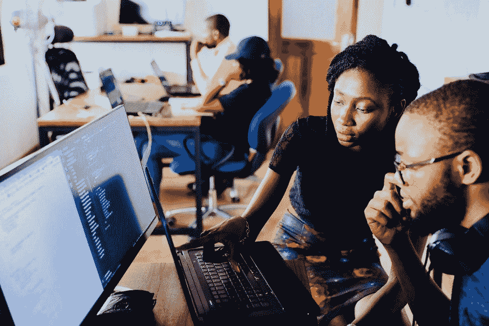

# 如何发展沟通技巧以获得技术性工作

> 原文：<https://towardsdatascience.com/how-to-develop-communication-skills-to-get-a-technical-job-ee8bdf7d503?source=collection_archive---------49----------------------->

## 我如何学会有效沟通并获得一份数据科学工作

克里斯托夫·高尔在 [Unsplash](https://unsplash.com/photos/m_HRfLhgABo) 上拍摄的照片

# 介绍

口头和书面沟通技巧是获得任何工作的关键。我认为这些技能在数据科学和编程等技术职业中尤为重要。你可能是世界上最有才华的数据科学家，但是如果你不能有效地交流你的模型和分析，没有人会感兴趣。

每个面试过程都至少会有一个行为部分，你必须描述你生活中的不同故事，这些故事让你非常适合这个角色和公司。此外，大多数数据科学和编程职位都包括面试过程中的技术部分，在面试过程中，你必须描述解决类似于你将在该职位中解决的问题的过程和结果。要获得这类工作，你需要有效地描述你生活中的事件和你解决问题的思维过程。

我并不是说发展你有效编程、分析数据和建立模型的技能不重要。这些技能也是获得数据科学技术职位所必需的。好消息是，有成千上万的免费和付费资源可以用来开发这些技能。

从我的经验来看，技术和沟通技能发展的区别在于，后者需要更多的重复来掌握。你不可能只看一堂关于沟通的课程就立刻成为一个更好的沟通者。这些课程可能会给你提供有效的改进工具，但你需要多次应用它们，以学习如何根据你自己的个性和沟通风格来使用它们。

[王占山](https://unsplash.com/@jdubs)在 [Unsplash](https://unsplash.com/photos/iI4sR_nkkbc) 上拍照

我是宾夕法尼亚大学的四年级学生，本科主修统计和金融，并获得了数据科学的硕士学位。我将于 2021 年 5 月毕业，在 Wayfair 担任技术分析师，分析营销数据。

作为一个会认为自己非常内向的人，我花了很多精力来培养有效沟通的能力。在过去的四年大学经历中，我一直致力于培养一名有效的沟通者。我现在认为向非技术利益相关者解释技术信息是我最大的优势之一。我写这篇文章的目的是描述我的过程和旅程，帮助你理解发展这一重要技能的潜在途径。

# 发展技术交流技能

与发展任何其他技能类似，获得尽可能多的练习机会会产生最佳效果。如果你想找一份数据科学或任何技术方面的工作，你需要练习有效地交流技术信息。

我在大二的时候就知道我想在毕业后从事这种类型的工作。那时，我甚至对我的同学描述统计学和计算机科学概念都不太舒服。每当我的教授想给学生打电话时，我都会很紧张，因为我对自己有效传达答案的能力没有信心。

为了更好地适应这一点，我申请成为一名统计学入门课程(后来是计算机科学入门课程)的导师。我知道我理解这些概念，只需要努力实际沟通它们。

这导致了每周 10 节 1 小时的辅导课，在那里我有机会练习交流技术信息。这些会议都是为了两个不同的课程。这让我有机会反复改进我与多个学生交流同一个话题的方式。我会根据每个学生在课程结束时的理解程度来寻找反馈，并尝试在下一次课程中改进我的方法。

我发现这些介绍性的课程给了我和那些以前没有接触过这些话题的学生交谈的机会。对我来说，这是一个发展我与非技术受众沟通能力的绝佳机会(这是技术角色的一项关键技能)。

暑假期间，我在学校组织的一个项目中担任助教，在这个项目中，我们向高中生教授体育背景下的统计学和计算机科学概念。

在 [Unsplash](https://unsplash.com/photos/IgUR1iX0mqM) 上由[海拉戈斯蒂奇](https://unsplash.com/@heylagostechie)拍摄的照片

当我面试全职职位的时候，我已经可以很自如地解释这类信息了。在多次面试过程中，我被要求分析数据，并向一名非技术员工展示我的发现。这些演示进行得非常顺利，我在演示过程中感到非常舒服。

如果你不在大学，没有机会申请助教或家教职位，有很多选择可以发展这项技能。你可以开一个 YouTube 频道，或者写一些博客文章来讨论一些技术性的东西。你也可以和朋友或家人谈论这些话题。如果你对这个话题感兴趣，我相信他们会很乐意听你谈论这个话题。

重复对于培养你的交流能力(尤其是技术信息)非常重要。它们允许你反复改进和掌握这些必要的技能。你的实践不需要什么开创性的东西。我每周只和 10 名学生交谈，很快就感受到了显著的进步。

# 发展与招聘人员沟通的技巧

另一个重要的技能是你与招聘人员和面试官交谈的能力。在这些环境中变得舒适是一种技能，也只能通过重复来培养。当你开始与面试官谈论你真正感兴趣的职位时，没有其他方法可以复制你的紧张感。

[彼得·琼斯](https://unsplash.com/@dailykairos)在 [Unsplash](https://unsplash.com/photos/J7GMnb12vp0) 上拍照

现在就开始申请工作。练习面试的唯一方法就是实际面试。你可以(也应该)尽可能多地练习处理案例和技术问题，但如果没有面试，你将无法充分发展面试技巧。推迟这个过程，直到你已经完成了每一个案例问题，有了一份完美的简历，将会阻碍你的发展。

你也可以通过参加招聘会来练习这种技能。招聘会让你可以更快、更轻松地与一群不同的招聘人员交谈。如果谈话进行得不顺利，实际上不会有任何负面后果，如果进展顺利，你只是和招聘人员建立了联系。我在大一的时候开始参加这些活动，当时我甚至不打算申请接下来夏天的实习。

在这些招聘会上，我与招聘人员进行了一些非常尴尬的对话，一些非常有见地的对话让我最终申请并喜欢上了 Wayfair 这样的公司(毕业后我将在那里工作)。关键是做好准备，快速介绍你自己(你是哪一年，你学什么，你对什么职位感兴趣，等等)。)以及一些关于公司和角色的问题。这是任何行为面试的两个组成部分，你有机会与数百名想与你交谈的招聘人员一起练习。

练习这些技能的最后一个方法是，在你感兴趣的公司里，接触那些在你感兴趣的职位上工作的人。你可以问他们是否有几分钟时间和你谈谈他们是如何走到现在这一步的。很多人都很乐意和你谈论他们是如何成功的，并帮助你。很多人也不是。不要为拒绝或没有回应而焦虑。许多人只是很忙，没有太多的时间聊天。有没有兴趣总是值得一问的。

到了大四，当我与面试官交谈时，我明显感觉更自信了，尤其是在行为面试中。他们中的大部分人只是感觉像是在交谈(事实上也是如此),压力较小。在我大二的头几次面试中，我明显变得更加刻板和不自在。面试官只想和你聊聊。练习与他们交谈有助于你与他们交谈。

照片由[奥斯丁·潘](https://unsplash.com/@austinpoon)在 [Unsplash](https://unsplash.com/photos/JO_S6ewBqAk) 上拍摄

# 结论

我不认为我培养有效交流技术信息或与面试官轻松交谈的技巧是唯一的方法。然而，我知道集中重复是提高沟通能力的唯一方法。

不可能了解数据科学和编程的一切。这就是我们热爱这个领域的原因。成长和学习的机会总是有的。同样，做一个完美的沟通者也是不可能的。我们总是有机会发展这种技能，这可能是一个我们喜欢的过程。这就是为什么我总是在寻找新的发展机会(比如前几天开始在 Medium 上写作)。

这项技能的大量发展需要感觉不舒服，这是成长的必要步骤。拥抱它。随着你练习的越来越多，让你不舒服的事情也就不再觉得不舒服了。

沟通是所有面试过程中不可避免的一步。不要忽视它。我们可能会陷入 LeetCode 的实践案例和技术编码问题中，而忘记发展这项技能。

拒绝是招聘过程中不可避免的一部分，尤其是在这段时间。拒绝只是帮助你在这个过程中提高的又一次重复。如果你有足够的天赋，你最终会有所发现。只要继续努力和学习。

感谢您花时间阅读这篇文章。祝你在招聘过程中好运。