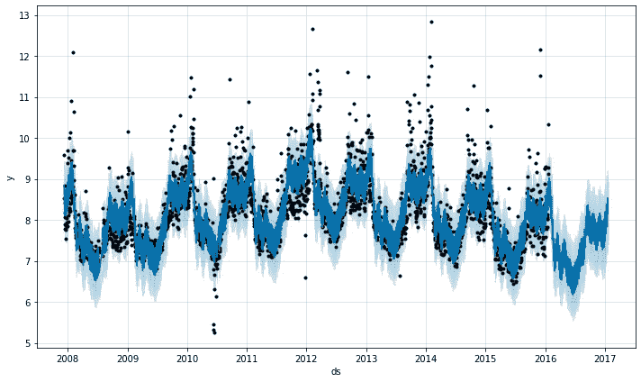
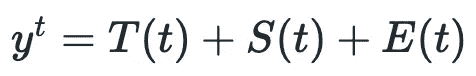
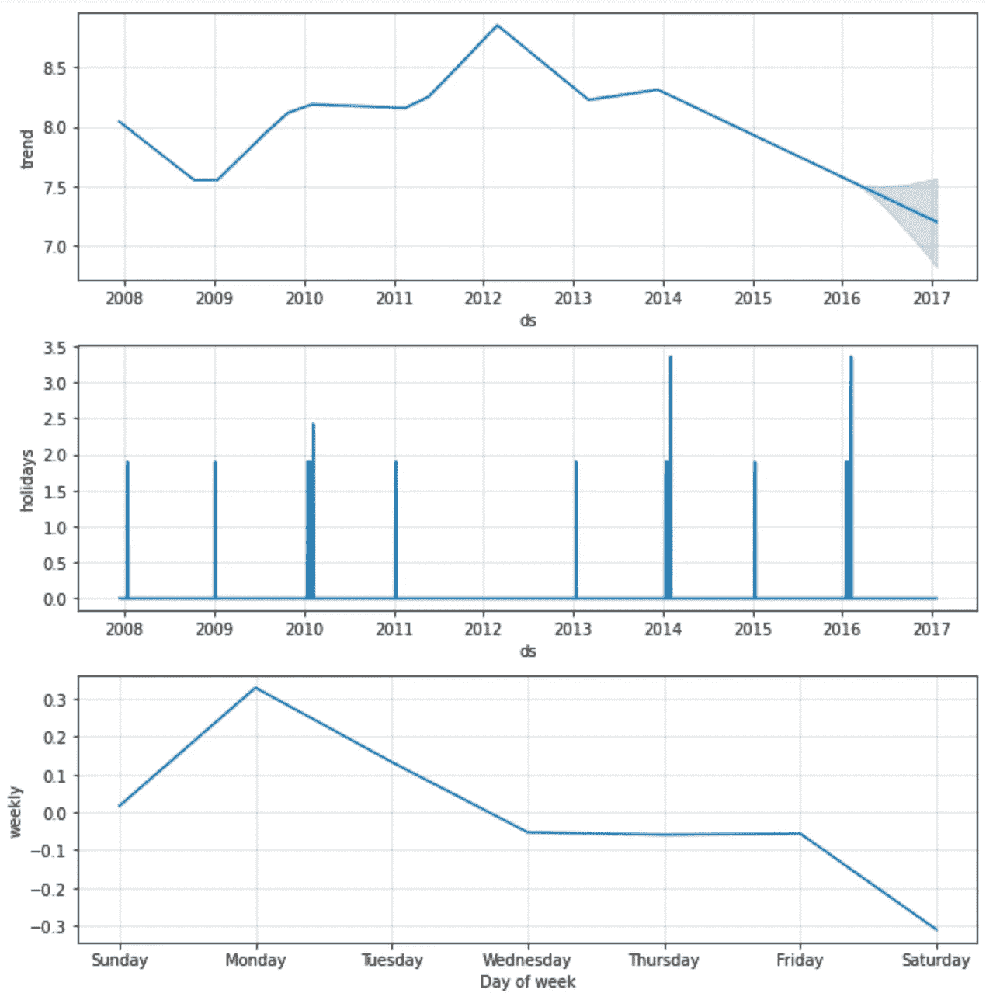
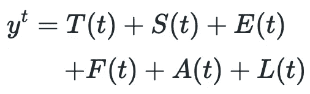
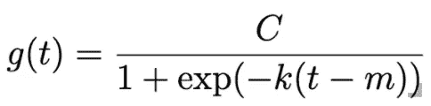
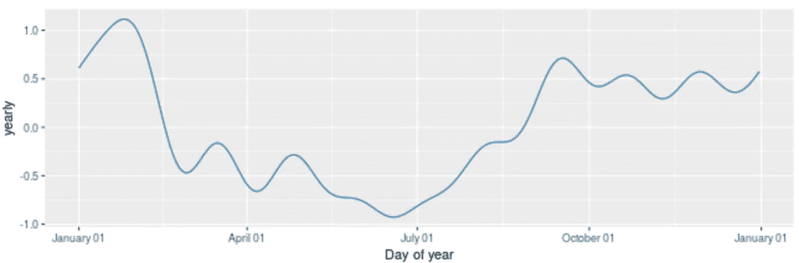

# 如何利用深度学习开发可解释的时间序列预测

> 原文：<https://towardsdatascience.com/how-to-develop-interpretable-time-series-forecasts-with-deep-learning-50b27bfcb8a1?source=collection_archive---------3----------------------->

## 对神经原植物的简明而全面的总结。

时间序列预测烂透了。这很麻烦，需要主题和技术知识。也就是说，直到现在。

图 1: NeuralProphet 快速启动预测。图片作者。

2020 年，斯坦福和脸书的研究人员[重组了先知算法](https://arxiv.org/pdf/2111.15397v1.pdf)以包括深度学习组件。主要卖点是准确度提高了 55–92%。该模型的深度学习部分建立在 PyTorch 之上，因此它们很容易扩展。运行时间平均增加了大约 4 倍，但是时间序列预测很少是实时的，所以运行时间不是主要问题。

如果你需要一个可解释但强大的时间序列预测，NeuralProphet 可能是你最好的选择。这里有一个[实现示例](/prophet-vs-neuralprophet-fc717ab7a9d8)。

让我们开始吧。

# 技术 TLDR

NeuralProphet 是原始 Prophet 库的深度学习扩展。该模型的游戏结构保持不变，我们只是包括几个深度学习术语。这些术语是滞后协变量、未来(预测)协变量和自回归。下面描述了三种具有递增复杂性的神经网络配置。

# 但是，到底是怎么回事呢？

好吧，让我们慢一点。我们将从头开始，假设你对脸书·先知一无所知。

## 1 —什么是脸书先知？

最初的[脸书先知算法](https://facebook.github.io/prophet/) (2017)是非常轻量级但有效的时间序列预测模型。它是为了易于使用和解释而构建的，这种描述很少与时间序列建模联系在一起。

根据[的原始论文](https://peerj.com/preprints/3190.pdf)，该模型成功了，因为研究人员将时间序列预测重新定义为一个**曲线拟合**问题，而不是一个**自回归**问题。许多以前的模型，如 ARIMA，滞后和拟合数据，而不是试图找到我们趋势的函数形式。

图 2:初始脸书先知算法术语。图片作者。

该模型有三个主要组件，如图 2 所示。 *T(t)* 对应于我们的时间序列去除季节性后的趋势。S(t) 对应于我们的季节性，无论是每周、每月还是每年。最后， *E(t)* 对应于预先指定的事件和假期。

每一个组成部分都有一个拟合过程，一旦拟合，它们通常会结合起来产生一个可靠的预测。

为了更直观地展示这些组件，下面是 Prophet 文档中的分解图。

图 3:培顿·曼宁触地得分数据— [src](https://facebook.github.io/prophet/docs/seasonality,_holiday_effects,_and_regressors.html) 的趋势(上)、事件(中)和每周季节性(下)。作者图片

既然对 NeuralProphet 的前身有了一些基础，那就继续吧。

## 2 —神经营养蛋白是如何工作的？

NeuralProphet 向我们的原始框架添加了三个组件，如图 4 的第二行所示。

图 4:神经先知算法术语。图片作者。

前三项在两种模型中基本保持不变。最后三个是深度学习术语，用于区分新模型和旧模型。让我们依次看一看每一个。

**2.1 —趋势*T(T)***

趋势与之前的 Prophet 模型保持不变。简而言之，我们希望使用指数或线性增长函数来模拟趋势。下面我们来看看指数增长(图 5):

图 Prophet 中使用的指数增长方程。 *C* 为承载能力， *k* 为增长率，m 为偏移参数。图片作者。

使用逻辑增长是一种非常传统且广为接受的解决方案，然而原始 Prophet 模型的创新之处在于**它允许函数的参数发生变化**。这些*变化点*由模型动态确定，并给予其他静态增长率和偏移参数更多的自由度。

**2.2 —季节性 *S(t)***

图 6:年度季节性成分图— [src](https://facebook.github.io/prophet/docs/quick_start.html#python-api) 。图片作者。

季节性被定义为以特定的规则间隔发生的变化。众所周知，这很难解释，因为它可以有很多种形式。

该模型的最初开发者提出了另一个伟大的想法——他们不是试图用自回归(即滞后数据)来模拟季节性，而是试图模拟季节性的曲线。这就是傅立叶级数的由来。

傅立叶级数是一组正弦曲线的总和，可以用来拟合任何曲线。一旦我们有了数据的每日、每周、每月等的函数形式。季节性，我们可以简单地将这些项添加到我们的模型中，并准确地预测未来的季节性。

**2.3 —事件 *E(t)***

最初的先知模型中的最后一个术语是用来处理事件的。

季节性和事件的处理方式几乎相同——使用傅立叶级数。然而，给定一个特定的假日，我们期望我们的傅立叶变换产生一个非常尖锐的曲线，而不是平滑的曲线。而且，因为底层函数是正弦函数，所以它们很容易扩展到未来。

现在让我们继续讨论新的模型。

**2.4 —回归变量 *F(t)，L(t)***

Prophet 和 NeuralProphet 模型的一个强有力的方面是它们考虑到了协变量。大多数时间序列预测模型都是单变量的，尽管它们有时也提供多变量版本——ARIMA vs 玛丽玛。

当用时间序列预测处理协变量时，我们需要确保那些协变量将提前 *n* 个时间段出现，否则我们的模型就没有什么可预测的了。我们可以通过将当前协变量延迟 *n* 个时间段来实现这一点，这由 *L(t)* 项建模，或者为这些协变量开发一个预测，这由 *F(t)* 项建模。

一旦我们有了各自的协变量，我们就可以进行深度学习(第 3 节)。

**2.5—自动回归 *A(t)***

最后，自回归是回顾以前的值并将其用作未来值的预测值的概念。最初的 prophet 模型非常有效，因为它远离了这种哲学，但是为了利用深度学习，我们必须返回。

自回归项使用滞后值来预测未来值。在实践中，我们很少使用协变量，所以这是大部分神经先知的力量来自。

有了那个结构，让我们放大一下 NeuralProphet 使用的深度学习模型。

## 3 —深度学习模型

NeuralProphet 构建在 PyTorch 和 AR-Net 之上，因此它的模块很容易定制和扩展。

有几种配置。第一个是**线性 AR** ，它只是一个单层神经网络(NN)，没有偏置或激活函数。它非常轻量级，将特定的滞后回归到特定的预测步骤，这使得解释模型非常容易。

**Deep AR** 是一个全连接的 NN，具有指定的隐藏层数和 ReLU 激活函数。随着线性 ar 和深度 AR 之间复杂性的增加，训练时间越来越长，你失去了可解释性。但是，您通常会看到预测准确性的提高。同样需要注意的是，您可以使用每个输入位置的第一层绝对权重的总和来近似计算线性 ar 中权重的信息。虽然不完美，但总比没有强。

**稀疏 AR** 是深度 AR 的延伸。对于自回归部分，通常最好使用高阶 AR(在之前的时间步长有更多值)，因为我们可以添加一个正则项。通过添加更多的数据并在拟合过程中自动去除其重要性，我们更有可能找到信号。

以上三种方法中的任何一种都可以用协变量和自回归值来实现。

# 摘要

这就是你要的，神经保护，这是荣耀！

为了深入理解这些概念，我们将快速总结一下。

NeuralProphet 是脸书先知的深度学习扩展。它通过在时间序列的协变量和数据上包括深度学习术语，增加了先前的模型。

初始模型(Prophet)利用曲线拟合，这是一种时间序列预测的新方法。它提供了无与伦比的开箱即用的性能和可解释性，但是我们需要更多的建模能力。NeuralProphet 为 Prophet 添加了深度学习术语，这些术语由三种神经网络配置管理。NeuralProphet 显著提高了模型拟合能力，但降低了性能和可解释性。

如果脸书先知不切它，尝试神经普罗菲特。

*感谢阅读！我会再写 25 篇文章，把学术研究带到 DS 行业。查看我的评论，链接到这篇文章的主要来源和一些有用的资源。*