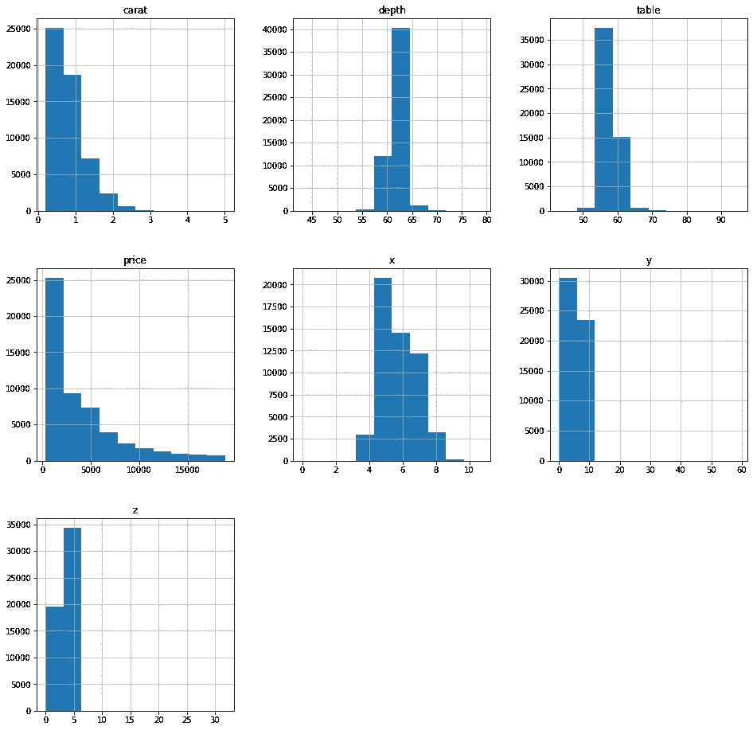
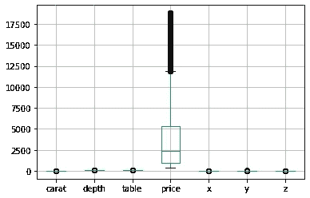
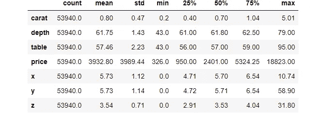
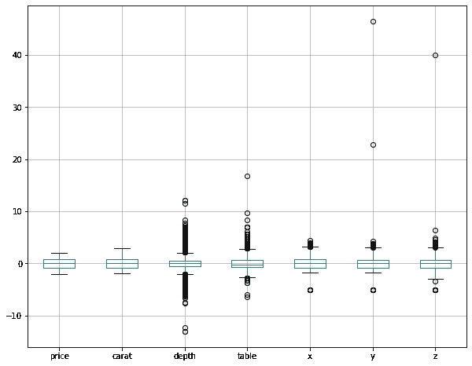
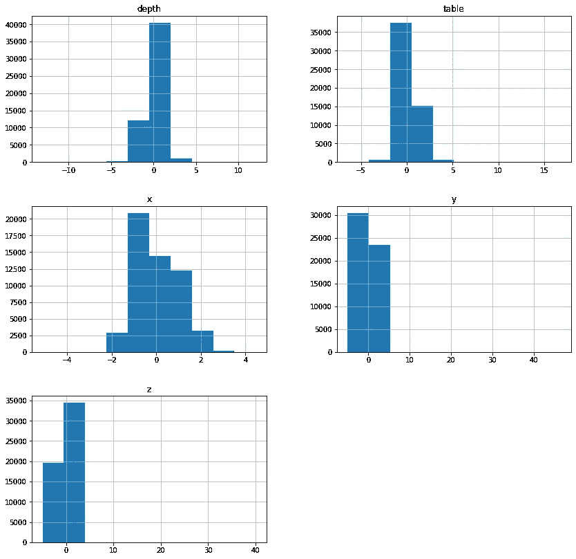
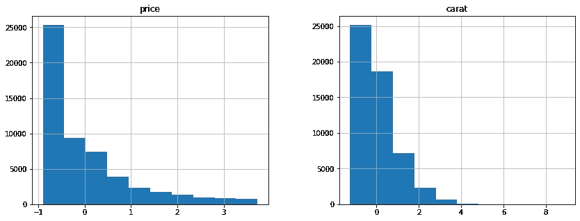
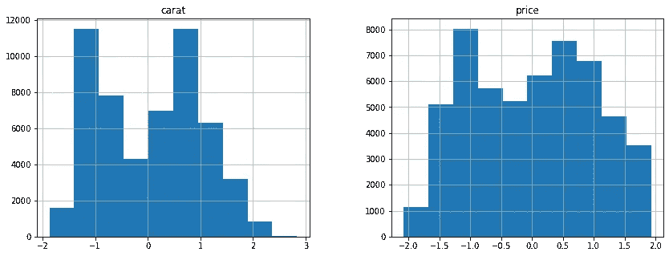
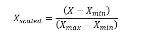
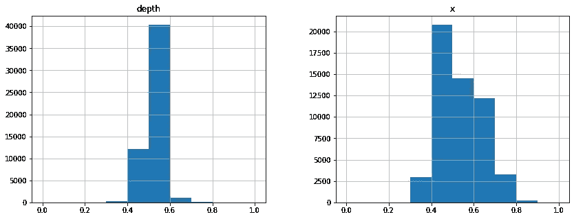

# 如何区分缩放、规范化和对数转换

> 原文：<https://towardsdatascience.com/how-to-differentiate-between-scaling-normalization-and-log-transformations-69873d365a94?source=collection_archive---------4----------------------->

## 获取特征工程数值变量的实用知识

了解标准化(缩放)、规范化和对数变换之间的根本区别。深入了解何时应用每种方法，并选择其中一种方法。


**照片由** [**乔治·贝克尔**](https://www.pexels.com/@eye4dtail?utm_content=attributionCopyText&utm_medium=referral&utm_source=pexels) **上** [**像素**](https://www.pexels.com/photo/grayscale-photography-of-three-wise-monkey-figurines-134402/?utm_content=attributionCopyText&utm_medium=referral&utm_source=pexels)

## 符合统计方法意味着什么？

您可能在课程或文章中遇到过这种情况:

> 数据集中的要素应符合模型的统计假设。

符合统计假设是什么意思？如果数字特征或多或少不遵循标准的[高斯(正态)分布](/how-to-use-normal-distribution-like-you-know-what-you-are-doing-1cf4c55241e3?source=your_stories_page-------------------------------------)，那么在 Sklearn 中实现的许多模型可能表现不佳。除了基于树的模型，Sklearn 算法的目标函数*假设*特征遵循正态分布。

实际上，用*这个词假设*会把事情看得很轻。对于像 K-最近邻这样的模型，特征变换是算法预期执行的一个要求:

在实践中，您甚至可能面临这样的场景，其中特性转换的效果甚至比性能提高 5%还要显著。

您可以应用多种技术来使您的要素或多或少地遵循正态分布，并且它们根据每个要素的基础分布而有所不同。

这篇文章将教你三种技术:缩放、归一化和对数变换。您将对它们的差异以及何时在您的工作流程中应用它们有一个实际的了解。

[](https://ibexorigin.medium.com/membership) [## 通过我的推荐链接加入 Medium-BEXGBoost

### 获得独家访问我的所有⚡premium⚡内容和所有媒体没有限制。支持我的工作，给我买一个…

ibexorigin.medium.com](https://ibexorigin.medium.com/membership) 

获得由强大的 AI-Alpha 信号选择和总结的最佳和最新的 ML 和 AI 论文:

[](https://alphasignal.ai/?referrer=Bex) [## 阿尔法信号|机器学习的极品。艾总结的。

### 留在循环中，不用花无数时间浏览下一个突破；我们的算法识别…

alphasignal.ai](https://alphasignal.ai/?referrer=Bex) 

## 识别特征的基本分布

在应用您将要学习的任何技术之前，直观地探索每个特性是很重要的。你不必创造完美的情节；具有默认样式的简单直方图和箱线图将足以识别分布。看看这些来自 Seaborn 钻石数据集的直方图:



请密切注意分布的形状和 X 轴上的范围。支线剧情显示价格和克拉特征遵循偏斜分布，深度、表格和 *x* 可能有点像正态分布。

除了分布之外，值的范围也是特性的一个重要方面。箱线图最好使用五位数的摘要来显示这一点:

```
>>> diamonds.boxplot()
```



上面的剧情足以告诉我们，特征有非常不同的尺度。由于钻石价格具有更大的价值尺度，他们将其他箱线图压成一条线。以下是五位数的总结，以供进一步比较:

```
>>> diamonds.describe().T.round(2)
```



既然您已经了解了如何识别分布的形状以及每个要素的比例差异，那么到本文结束时，我们将使所有要素都具有相同的比例，并且或多或少地遵循正态分布，如下所示:



## 使用 StandardScaler 进行缩放或标准化

解决一个要素的方差比其他要素大得多的情况的默认方法之一是使用缩放(也称为标准化):

根据[官方 Sklearn 关于缩放的指南](https://scikit-learn.org/stable/modules/preprocessing.html#standardization-or-mean-removal-and-variance-scaling):

> 学习算法的目标函数中使用的许多元素假设所有特征都以零为中心，并且具有相同数量级的方差。如果某个特征的方差比其他特征的方差大几个数量级，那么它可能会主导目标函数，使估计器无法像预期的那样正确地从其他特征中学习。

因此，许多模型通常需要伸缩来实现高性能。Sklearn 在`StandardScaler()`转换器中实现了这一点，转换器*将*数字特征转换为平均值为 0，方差为 1。

SS 通过两种操作实现这一点:

1.  **居中**:从分布中的每个值中减去平均值。
2.  **缩放**:将每个结果除以标准偏差。

这些操作使原始特征遵循正态分布。下面是我们如何手动完成这项工作:

> 我们忽略了价格和克拉特征，因为它们遵循一个偏斜的分布。稍后将详细介绍。



让我们对`StandardScaler()`做同样的事情:


同样的结果。

检查平均值和方差:

现在，让我们关注缩放的有效性。深度和 x T4 现在看起来真的像高斯分布。然而，特征表、 *y、*和 *z* 仍然挤在它们的图的角落里，表明异常值的存在(否则，大部分直方图会在中心)。这意味着缩放在深度和 *x* 特征上效果更好，但在其他特征上效果不佳。我们将在接下来的章节中记录这一点。

## 使用 PowerTransformer 进行日志转换

当一个要素不遵循线性分布时，使用平均值和标准差对其进行缩放是不明智的。例如，如果我们缩放价格和克拉的偏态分布，会发生以下情况:



特征仍然是倾斜的这一事实证实了标准化对它们不起作用。

为了实现非线性转换，Sklearn 提供了一个`PowerTransformer`类(使用对数函数),帮助最小化偏斜度，并将任何分布尽可能地映射到正态分布:



```
>>> diamonds[["carat", "price"]].var()carat    1.000019
price    1.000019
dtype: float64
```

新功能看起来比旧的倾斜功能好得多。因此，每当面对偏斜分布时，使用`PowerTransformer`类。

## 使用最小最大缩放器归一化

缩放的替代方法称为*归一化*。归一化不使用方差和平均值，而是使用分布的最小值和最大值。以下等式用于每个值:



作者图片

这种变换的效果是给出分布的绝对最小值和最大值，通常在 0 和 1 之间。Sklearn 提供了一个类似的`MinMaxScaler`转换器来实现这一点:



即使强制要素遵循正态分布，要素也不会有单位方差和平均值 0:

但是，使用这种方法有一些注意事项。例如，如果训练集中的最大值小于测试集中的最大值，缩放可能会导致意外的预测。最小值也是如此。

此外，MinMaxScaler 不能很好地处理含有异常值的要素。我留给你去思考为什么(提示:注意 MMScaler 的公式)。

此外，MinMaxScaler 根本不会改变分布的形状。归一化后，值位于给定范围内，但分布形状保持不变。

由于这些原因，StandardScaler 的使用频率更高。

## 把所有的放在一起

在本节中，我们将尝试使用逻辑回归算法来预测钻石切工。我们将在管道中使用 StandardScaler 和 PowerTransformer。如果你不熟悉 Sklearn 管道和 ColumnTransformers 的工作原理，可以看看这篇文章:

[](/how-to-use-sklearn-pipelines-for-ridiculously-neat-code-a61ab66ca90d) [## 如何将 Sklearn 管道用于极其简洁的代码

### 编辑描述

towardsdatascience.com](/how-to-use-sklearn-pipelines-for-ridiculously-neat-code-a61ab66ca90d) 

让我们开始吧。首先，我们将构建特性/目标数组，并提取我们将应用转换器的列的名称:

接下来，我们将创建一个 ColumnTransformer 对象，该对象将转换器映射到相关的列:

我们将把这个变压器插入一个以逻辑回归结尾的管道:

最后，我们将数据分为训练集和测试集，并测量分类器的性能:

我们的 ROC AUC 值为 0.83。此时，您可以开始超参数调整来改善这一点。

## 上述变压器的数据泄漏注意事项

无论何时进行预处理，都要注意[数据泄漏](https://www.forcepoint.com/cyber-edu/data-leakage#:~:text=Data%20leakage%20is%20the%20unauthorized,is%20transferred%20electronically%20or%20physically.)。因为我们今天学习的所有转换器都是从特性的底层分布中获得度量的，所以它们很容易从测试数据中泄露数据。

这就是为什么建议在预处理之前将数据分成训练/测试集。此外，不要在测试集上使用`fit_transform()`方法。变压器应全部符合训练数据，随后的转换应仅使用`transform`方法:

但是，在管道中使用这些变压器就不用担心这个了。Sklearn 在拟合和转换特征时会处理引擎盖下的数据泄漏。

## 摘要

在本文中，您学习了如何对数字要素进行特征工程，以符合许多模型的统计假设。具体来说，我们学习了如何:

*   使用`StandardScaler`缩放数据，当我们希望某个特征遵循均值为 0 且单位方差为正态分布时，会使用该转换器。最常用于没有太多异常值的分布或其他一般形状的分布。
*   使用`PowerTransformer`记录转换数据，当我们希望将严重倾斜的特征转换为尽可能接近的正态分布时，可以使用该转换器。
*   使用`MinMaxScaler`归一化数据，当我们希望特征值位于特定的最小值和最大值范围内时，可以使用这个转换器。它不能很好地处理许多异常值，如果测试集中的值超出了给定的范围，很容易出现意外的行为。这是一种不太受欢迎的缩放替代方案。

感谢您的阅读！

[](https://ibexorigin.medium.com/membership) [## 通过我的推荐链接加入 Medium。

### 作为一个媒体会员，你的会员费的一部分会给你阅读的作家，你可以完全接触到每一个故事…

ibexorigin.medium.com](https://ibexorigin.medium.com/membership) [](https://ibexorigin.medium.com/subscribe) [## 每当 Bex T .发布时收到电子邮件。

### 每当 Bex T .发布时收到电子邮件。注册后，如果您还没有中型帐户，您将创建一个…

ibexorigin.medium.com](https://ibexorigin.medium.com/subscribe) 

**我的更多故事:**

[](/10-minute-effortless-sql-tutorial-for-die-hard-pandas-lovers-a64c36733fd0) [## 10 分钟轻松的 SQL 教程，适合铁杆熊猫爱好者

### 曾几何时，情况正好相反

towardsdatascience.com](/10-minute-effortless-sql-tutorial-for-die-hard-pandas-lovers-a64c36733fd0) [](/how-to-create-slick-math-animations-like-3blue1brown-in-python-457f74701f68) [## 如何用 Python 创建像 3Blue1Brown 这样流畅的数学动画

### 学习将你对数学和编程的热爱结合起来的最佳方式

towardsdatascience.com](/how-to-create-slick-math-animations-like-3blue1brown-in-python-457f74701f68) [](/matplotlib-vs-plotly-lets-decide-once-and-for-all-dc3eca9aa011) [## Matplotlib vs. Plotly:让我们决定一劳永逸

### 从 7 个关键方面进行深入快速的比较

towardsdatascience.com](/matplotlib-vs-plotly-lets-decide-once-and-for-all-dc3eca9aa011) [](https://ibexorigin.medium.com/yes-these-unbelievable-masterpieces-are-created-with-matplotlib-b62e0ff2d1a8) [## 是的，这些令人难以置信的杰作是用 Matplotlib 创作的

### 它们让我的作品看起来像孩子画的树

ibexorigin.medium.com](https://ibexorigin.medium.com/yes-these-unbelievable-masterpieces-are-created-with-matplotlib-b62e0ff2d1a8)