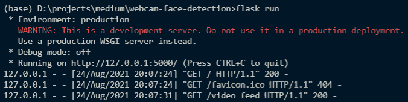
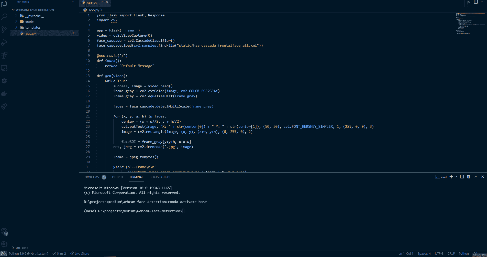

# 如何使用 Flask 显示来自网络摄像头的视频流

> 原文：<https://towardsdatascience.com/how-to-display-video-streaming-from-a-webcam-using-flask-7a15e26fbab8?source=collection_archive---------13----------------------->

## 在网络上实现你的计算机视觉解决方案。


欧内斯特·欧杰在 [Unsplash](https://unsplash.com/s/photos/webcam?utm_source=unsplash&utm_medium=referral&utm_content=creditCopyText) 上拍摄的照片

# 介绍

计算机视觉帮助我们看到我们看不到的东西。有了计算机视觉，我们可以解决像物体检测、人脸识别、看到隐藏模式等许多问题。

实现计算机视觉需要几个步骤。如果我们实现了一个计算机视觉解决方案，但却不能将其部署到生产中，例如，在移动或 web 应用程序中，那么它将毫无用处。

令人欣慰的是，有很多人为实现计算机视觉解决方案生成了一个开源库，也为实现以前更容易的 web 应用程序生成了一个框架。这些库是 OpenCV 和 Flask。

本文将向您展示一个如何使用 OpenCV 从网络摄像头实现人脸检测的示例，并使用 Flask 在一个 web 应用程序上实现它。

没有进一步，让我们开始吧！

> **这里边注:**因为这是一个 Flask 项目，所以你得在一个 ide 上实现，比如 Visual Studio，PyCharm，Sublime Text，或者任何你喜欢的 IDE。我先一步一步解释代码。而如果你有什么纠结，可以按照文末的完整代码。

# 履行

## 导入库

我们要做的第一件事是导入库。在本例中，我们将导入 Flask 库来实现我们的 web 应用程序。此外，我们引入 OpenCV 库来实现我们的计算机视觉解决方案。

从 Flask 中，我们将导入 Flask 来生成 web 应用程序。此外，我们将导入用于从网络摄像头接收图像的响应对象。下面是实现这一点的代码:

## 初始化对象

导入库之后，下一步是初始化几个对象。

*   第一个是**烧瓶**物体。
    正如我之前提到的，Flask 对象将初始化我们构建 web 应用程序所需的东西，因此我们可以专注于构建我们的解决方案。
*   第二个是 OpenCV 库中的 **VideoCapture** 对象。
    该对象将捕捉输出，其中网络摄像头是源。我们将为从网络摄像头拍摄图像设置参数“0”。
*   最后一个是 OpenCV 库中的 **CascadeClassifier** 。
    这个对象将初始化一个人脸检测模型，该模型基于 AdaBoost 和级联分类器的组合。这个模型已经用大量的图像进行了训练，这些图像被表示为一个叫做 Haar 的特征。我不会进一步解释这个分类器，但有一天我会向你解释，安拉保佑。

在本文中，我们不会从头开始训练我们的模型。我们将使用来自 OpenCV 的预训练模型，你可以在这里 下载 [**。**](https://github.com/opencv/opencv/blob/3.4/data/haarcascades/haarcascade_frontalface_alt.xml)

下面是初始化对象的代码:

## 实现人脸检测

初始化对象后，下一步是实现我们的人脸检测功能。下面是我们的函数将执行的步骤:

*   下面的这个函数将接受一个输入，在这个例子中，它来自网络摄像头，每帧处理一次。
*   在每一帧上，该函数将从中检测面部，并设置一个包围我们面部的边界框。
*   在该函数检测到人脸后，该函数使用。jpeg 格式并将其转换为字节。
*   这些来自图像的字节将被附加到 HTTP 响应中。
*   因为我们不止一次发送图像，所以我们将使用 yield 关键字而不是 return 关键字。原因是 yield 关键字返回一个总是生成值的生成器，只要它没有阈值。

下面是实现的代码:

# **在网络上显示图像**

在我们创建了我们的人脸检测函数之后，下一步是构建一个在网站上显示人脸检测结果的函数。在下面的函数中，你可以看到在我们函数的名字上面有一个叫做 app.route 的东西。

此 app.route 用作标识符，因此我们可以更容易地访问我们的图像。例如，我们有一个名为 website.com 的网站。我们用/video_feed 在 app.route 参数上设置了一个参数。为了访问我们的网络摄像头的结果，我们可以使用这个链接:**website.com/video_feed**。

在函数内部，我们将返回包含由 gen 函数生成的图像的响应对象，它从一个名为 video 的全局变量中获取输入。

使用 global 关键字的原因是为了强调我们没有在函数内部声明 video 变量。同时，我们需要用它来区分函数中的变量。

下面是显示人脸检测结果的代码:

最后，初始化 app.run 来运行我们的 flask 应用程序。下面是实现这一点的代码:

## 运行代码

好了，现在我们已经实现了代码。现在让我们在电脑上运行它。要运行代码，您可以使用“python app.py”或“flask run”命令，如下所示:

```
**flask run**
```

如果成功，我们的终端将显示:



截图为作者截图。

以下是网站上的预览:



GIF 是作者捕获的。

有用！干得好。

# 结束语

干得好！我们使用 Python 中的 Flask 和 OpenCV 实现了一个代码，用于显示来自网络摄像头的人脸检测流。我希望它能帮助你实现你的计算机视觉项目，尤其是在一个 web 应用程序上。

如果你对我的文章感兴趣，可以在 Medium 上关注我。如果你有任何问题或者想打个招呼，你可以在 [**LinkedIn**](https://www.linkedin.com/in/alghaniirfan/) 上联系我。

谢谢你看我的文章！

> 如果代码片段中有错误，您可以在此处查看完整的代码: