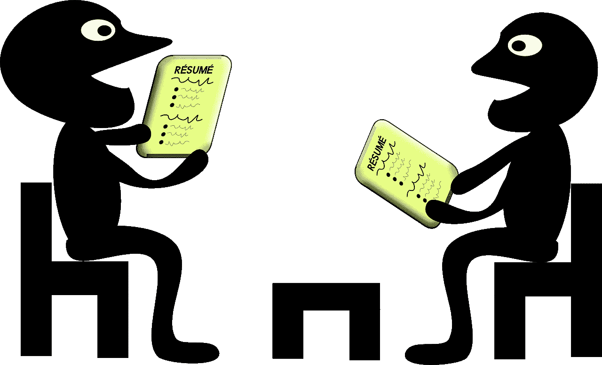
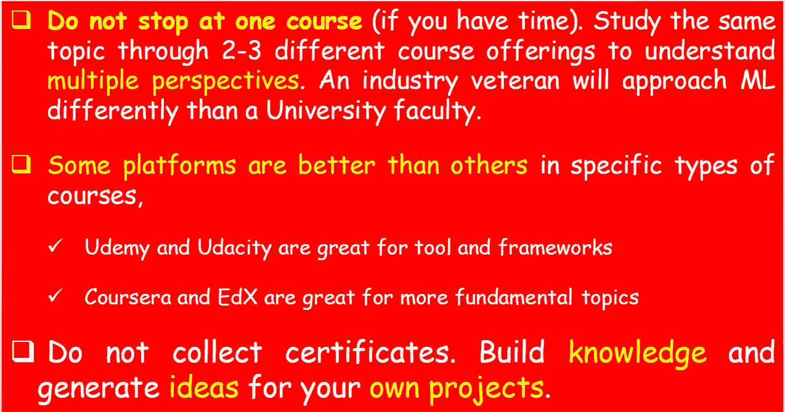
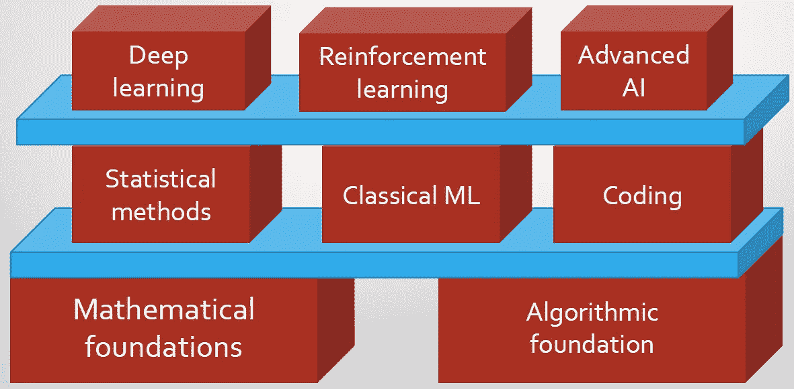
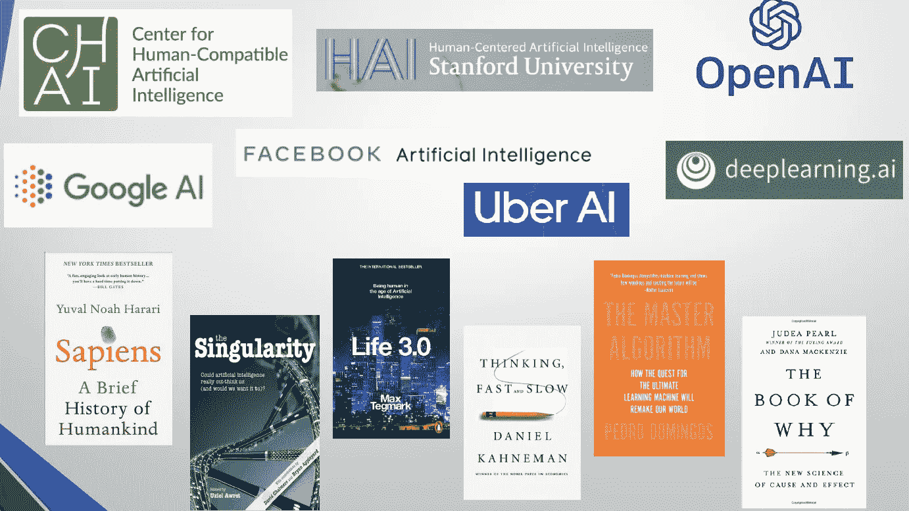

# 如何从数百名数据科学候选人中脱颖而出？

> 原文：<https://towardsdatascience.com/how-to-distinguish-yourself-from-hundreds-of-data-science-candidates-62457dd8f385?source=collection_archive---------6----------------------->

## 一些简单(也不那么简单)的方法向雇主证明你的技能和态度让你处于更高的位置。

图片来源: [Pixabay](https://pixabay.com/photos/apple-fruit-selection-especially-1594742/) (免费使用)

# 为什么要区分我自己呢？

因为要得到一份数据科学家的工作，T2 的竞争非常激烈。

<https://www.kdnuggets.com/2020/10/getting-data-science-job-harder.html>  

因为有一个**狂冲**。每一种工程师、科学家和职业人士都称自己为数据科学家。

<https://www.linkedin.com/pulse/why-so-many-fake-data-scientist-bernard-marr/>  

因为你不确定你是否能在这方面取得成功。请记住**冒名顶替综合症**在数据科学中很流行。

</how-to-manage-impostor-syndrome-in-data-science-ad814809f068>  

我可以继续，但你要明白…

那么，如何把自己和群众区分开来呢？我不知道你能不能做到，但是我可以告诉你一些测试自己的方法。这就是这篇文章的内容。

# 问自己几个简单的问题

图片来源: [Pixabay](https://pixabay.com/vectors/classroom-cooperative-learning-1297779/) (免费使用)

问自己几个问题，数一数有多少答案是肯定的。你做得越多，就越脱离群众。

## 如果你是初学者

*   你有没有**发布**你自己的 Python/R(无论你用什么编码)**包**？
*   如果是的话，你是否已经编写了大量的**文档**以方便其他人使用？
*   你把你在 Jupyter 笔记本上的分析带到一个完全出版的**网络应用**上了吗？或者，你研究过帮助你轻松做到的工具吗？
*   你是否写过至少几篇**高质量、详细的文章**描述你的爱好项目？
*   你有没有尝试实践 [**费曼学习法**](https://fs.blog/2021/02/feynman-learning-technique/) 即*教一个六年级学生你想学的概念*？

## 在稍微更高级的阶段

如果你不是初学者，但认为自己作为一名数据科学家已经处于比较成熟的阶段，你会这样做吗？

*   你是否有意识地在你的数据科学代码中尽可能地集成好的**软件工程实践**(例如面向对象编程、模块化、单元测试)？
*   你是否注意到不要停留在你必须做的即时数据分析的范围内，而是想象 100 倍的数据量或做出错误预测的 10 倍成本会发生什么？换句话说，你是否有意识地思考**数据或问题扩展及其影响**？
*   你是否特别注意不要停留在传统的 ML 指标上，还要考虑数据采集的**成本**和 **ML 商业价值**？

## 构建工具和创建文档:需要掌握的两项重要技能

图片来源: [Pixabay](https://pixabay.com/illustrations/carpenter-hummer-wood-construction-1453880/) (左)和 [Pixabay](https://pixabay.com/illustrations/chinese-asian-girl-little-writing-1891496/) (右)

不要把所有的时间和精力都花在分析更大的数据集或者实验最新的深度学习模型上。

留出至少 25%的时间学习做几件在任何地方、任何组织、任何情况下都有价值的事情**，**

*   为您的日常数据分析构建小而集中的实用工具。在这个练习中，你的创造力会自由流动。你正在创造的东西可能没有成千上万的直接用户，但它将是新颖的，它将是你自己的创造。
*   阅读和**创建与新工具或框架或您刚刚构建的实用工具相关的高质量文档**(见上文)。这将迫使你学会如何以一种能被广大观众理解的方式来传达你的创作的效用和机制。

正如你所看到的，这些习惯很容易培养和实践，也就是说，它们不需要繁重的工作，不需要多年的统计背景，也不需要深度机器学习知识的高级专业知识。

但是，令人惊讶的是，并不是每个人都接受它们。这是你脱颖而出的机会。

# 如何在求职面试中利用这些习惯？

图片来源: [Pixabay](https://pixabay.com/vectors/job-interview-career-conference-156130/) (免费使用)

想象你自己在一次工作面试中。如果你对上面的问题有很多肯定的回答，你可以对你的面试官说，

*   嘿，看看我为随意生成合成时序数据而构建的很酷的 Python 包。
*   "*我还写了一份详细的文档，存放在 MyApp.readthedocs.io 网站上。它是用狮身人面像和哲基尔建造的。*
*   "*我定期为最大的数据科学在线平台撰写数据科学文章。基于这些，我甚至得到了像 Packt 或 Springer* 这样的知名出版商的出书邀请。
*   *每个人都可以在笔记本上放一个 ML 模型。但是，我可以编写一个 Scikit-learn 函数的基本 web 应用程序演示，您可以通过 REST API 发送数据，并获得预测结果*。
*   "*我可以帮助对新的机器学习程序进行成本效益分析，并告诉你效益是否超过了数据收集工作，以及如何以最佳方式完成这项工作*。

想象一下，在面试委员会看来，你与其他所有在统计学和梯度下降等常规问题上表现出色，但没有提供全面能力证明的候选人有多么不同。

它们表明你对数据科学问题很好奇。

它们表明**你阅读、分析、交流**。您**创建**和**文档**供他人创建。

它们表明您的思维超越了笔记本电脑和分类准确性，进入了**商业附加值和客户同理心**的领域。哪个公司不会喜欢那种候选人呢？

> …这些习惯很容易培养和实践，也就是说，它们不需要繁重的工作，不需要多年的统计背景，也不需要深度机器学习知识方面的高级专业知识。但是，令人惊讶的是，并不是每个人都接受它们。这是你脱颖而出的机会。

# 我在哪里可以得到帮助？

有很多很棒的工具和资源可以帮助你练习。在一篇小文章的篇幅里，要列出其中的一部分是不可能的。我只是举一些有代表性的例子。关键的想法是沿着这些路线探索，发现对自己有帮助的艾滋病。

*   **仅使用 Jupyter 笔记本电脑构建可安装软件包**

<https://www.fast.ai/2019/12/02/nbdev/>  

*   **如何制作一个很棒的 Python 包—一步一步来**

<https://antonz.org/python-packaging/>  

*   学习如何在你自己的 ML 模型和模块开发中集成单元测试原则

</pytest-for-machine-learning-a-simple-example-based-tutorial-a3df3c58cf8>  

*   **学习如何在数据科学任务中整合面向对象编程原则**

</object-oriented-programming-for-data-scientists-build-your-ml-estimator-7da416751f64>  

*   **使用简单的 Python 脚本构建交互式 web 应用——不需要 HTML/CSS 知识**

</pywebio-write-interactive-web-app-in-script-way-using-python-14f50155af4e>  

*   **直接从你的 Jupyter 笔记本上写下所有的编程和技术书籍。也可以用它来构建文档。**

<https://jupyterbook.org/intro.html>  

*   **理解现实生活中分析问题的多面复杂性，以及它不仅仅是建模和预测**

<https://medium.com/analytics-vidhya/why-a-business-analytics-problem-demands-all-of-your-expertise-at-once-1290170808c4>  

> 想象一下，在面试委员会看来，你与其他所有在统计学和梯度下降等常规问题上表现出色，但没有提供全面能力证明的候选人有多么不同。

# 关于 MOOCs 在线课程的一些事情

图片来源:作者自己创作

学习的时候不要跳台阶。按照步骤操作。

图片来源:作者自己创作

# 一有机会就阅读董事会主题和书籍

不要只专注于阅读最新的深度学习技巧或关于最新 Python 库的博文。抓住每一个机会，阅读行业顶级论坛和好书上的董事会主题。我喜欢的一些书籍和论坛如下:

图片来源:作者自己创作

# 摘要

随着越来越多的企业采用和拥抱这些变革性技术，数据科学以及机器学习和人工智能的相关技能现在在就业市场上的需求非常高。人才的需求方和供应方之间存在大量的竞争和沟通不畅。

一个燃眉之急的问题是:*如何从一百个共同申请者中区分出自己？*

我们列出了一些关键问题，你可以问自己，并评估自己在一些技能和习惯上的独特性，这些技能和习惯让你与众不同。我们展示了一些想象中的对话片段，展示了这些技巧和习惯。我们还提供了一份资源清单，以帮助您开始使用这些资源。

我们列出了参加 MOOCs 的几种方法，并推荐了阅读资源。

祝您在数据科学之旅中一切顺利…

喜欢这篇文章吗？成为 [***中等会员***](https://medium.com/@tirthajyoti/membership) *继续* ***无限制学习*** *。如果您使用下面的链接，* ***，我将收取您的一部分会员费，而不会对您产生额外费用*** *。*

<https://medium.com/@tirthajyoti/membership> 