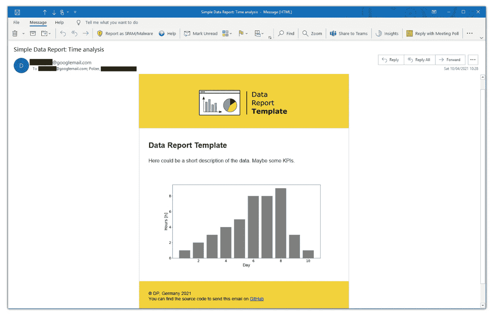
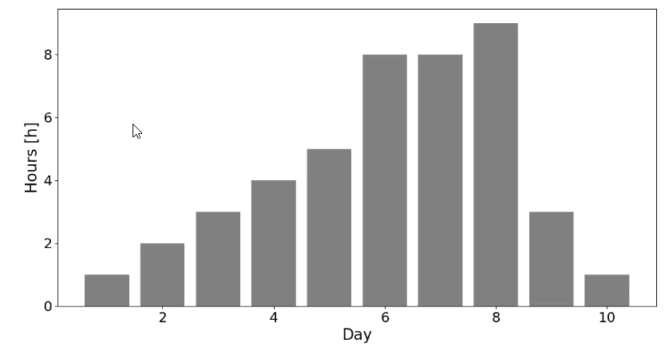
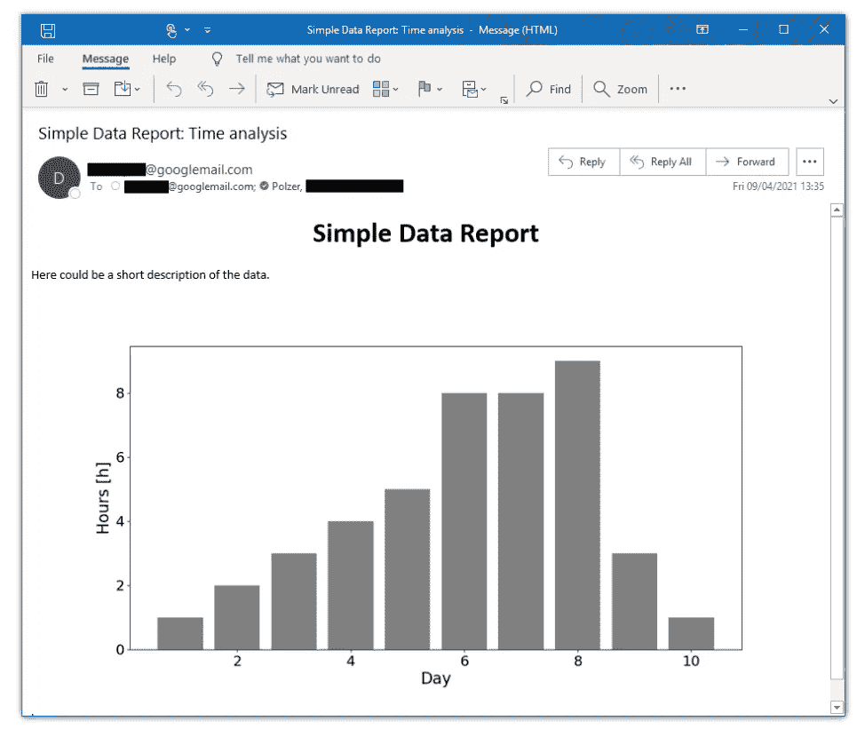
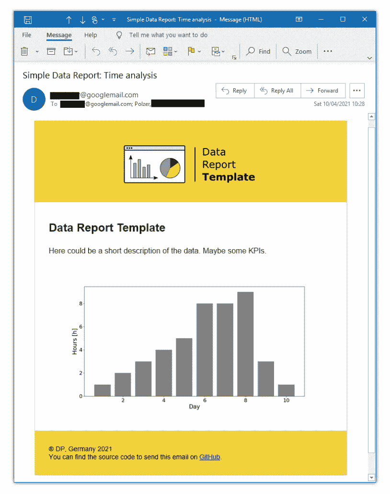

# 如何将数据可视化嵌入 HTML 电子邮件并使用 Python 发送

> 原文：<https://towardsdatascience.com/how-to-distribute-your-data-reports-via-mail-with-a-few-lines-of-code-8df395c72e55?source=collection_archive---------6----------------------->

## 关于如何在 HTML 邮件中发送 Python 数据分析的指南和模板

用于分发数据报告的电子邮件模板

Python 提供了大量的可视化选项来准备数据，并以一种可理解的方式呈现数据。如果您希望将您的分析分发给更多的受众，您通常可以选择将绘图集成到 web 应用程序中。尽管如此，电子邮件仍然是一个合法的选择，以简单有效的方式发布你的结果。

下面的文章解释了如何在 HTML 邮件中包含和发送 Matplotlib 图形。

## 1.创造情节

无论您是想使用 Matplotlib、Seaborn 还是 Plotly 来可视化您的数据，对于下面的过程都无关紧要。我将使用 Matplotlib 构建一个简单的情节，并将其保存为图像。

为此，我创建了一个新项目，其中包含一个文件夹，用于存放保存的图(`./results`)和 Python 脚本`send_report.py`。下面的 Python 代码片段展示了脚本的第一部分，它创建了一个简单的情节并将其存储在`./results`文件夹中。为了能够在下面拾取存储的图像，该函数返回绘图的位置`path_plot`。

执行完代码片段后，您应该会在`./results`中找到 PNG 文件形式的情节(如`2021-04-08.png`)。

绘制你的数据

## 2.定义您的消息并发送邮件

现在，我想将可视化包含到邮件正文中并发送出去。

为了发送电子邮件，我使用我的 Gmail 帐户。要做到这一点，你必须首先确保 Gmail 帐户安全设置中的“访问安全性较低的应用程序”选项已启用。如果你不能马上找到它，网上有很多教程会解释在哪里可以找到设置。

然后，您可以使用下面的代码来测试是否可以用 Python 发送简单的邮件。只需设置变量`from_mail`、`from_password`和`to_mail`并试用即可。这应该会从“from_mail”向收件人“to_mail”发送一封主题为“简单数据报告:时间分析”的空白电子邮件。

现在，我想填写电子邮件的信息，并附上创建的情节。然后我可以将图像合并到邮件消息中。为此，我设置了一个简单的 HTML 主体并包含了附加的 PNG 文件。作为图像的来源，我使用了已定义的`Content-ID`。

您应该会收到这封简单的 HTML 电子邮件。

在下面，你可以使用你的 HTML 技巧来设计你喜欢的电子邮件。如果你想从头开始创建自己的 HTML 电子邮件，你可以从妮可·梅林那里找到一个全面的指南。

我还在 [GitHub](https://github.com/polzerdo55862/Python-Email-Template) 上将项目文件夹上传到了下面的例子中。

日期报告模板(图片由作者提供——灵感来自[妮可·梅林](https://webdesign.tutsplus.com/articles/build-an-html-email-template-from-scratch--webdesign-12770)

## 摘要

希望我可以向您展示一种简单的方法来结合

1.  构建数据可视化
2.  在 HTML 电子邮件中嵌入绘图
3.  将邮件分发到您的收件人列表

在一个 Python 脚本中。这使得通过预定任务自动分发变得容易。

## 参考

[1]支持不太安全的应用程序访问 Gmail，[https://hotter.io/docs/email-accounts/secure-app-gmail/](https://hotter.io/docs/email-accounts/secure-app-gmail/)

[2] Nicole Merlin，从头开始构建 HTML 电子邮件模板，[https://web design . tuts plus . com/articles/Build-an-HTML-Email-Template-From-Scratch-web design-12770](https://webdesign.tutsplus.com/articles/build-an-html-email-template-from-scratch--webdesign-12770)