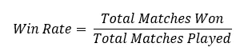
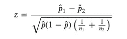
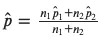
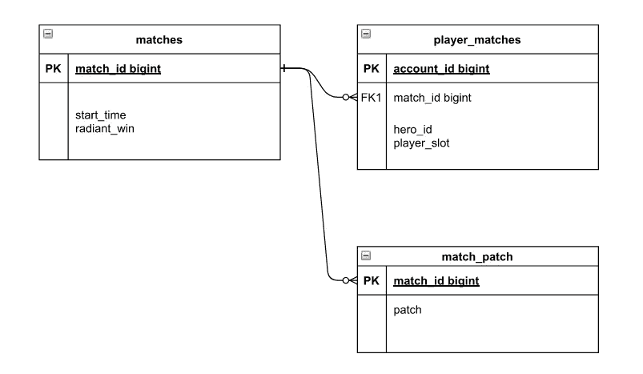
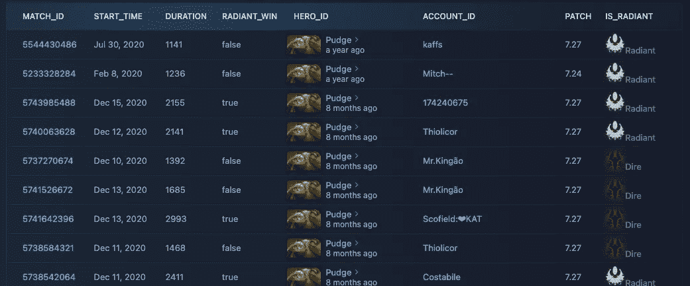
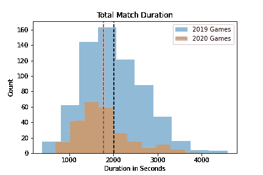

# 如何在 MOBA 游戏上进行 A/B 测试

> 原文：<https://towardsdatascience.com/how-to-do-a-b-testing-on-moba-games-e44891c5701?source=collection_archive---------26----------------------->

## 屠夫布丁的例子

弗拉季斯拉夫·比契科夫在 [Unsplash](https://unsplash.com?utm_source=medium&utm_medium=referral) 上的照片

# 介绍

DOTA2 是一款流行的大型在线战场(MOBA)游戏，拥有数百万的每日活跃用户。玩家从 121 个英雄中挑选，在 5v5 游戏中玩。众所周知，这个游戏有一个陡峭的学习曲线，没有一个英雄可以保证胜利。事实上，每个英雄似乎都有另一个完美的对手。

DOTA2 也是一个不断发展的游戏，为了保持游戏平衡，物品和英雄要么得到*要么得到 ***削弱*** 。例如，最近发布了补丁 7.30，社区很快指出了现在“*坏掉*”的英雄，也就是说，他们被打磨得如此之多，以至于胜率高得离谱([见这个例子](https://www.youtube.com/watch?v=tp-BAkXv9XQ))。*

*这就提出了一个问题:DOTA2 开发者如何保持游戏平衡？我们如何确定一个英雄是否被成功地强化/削弱？*

*本文的目的是展示假设检验如何作为一种游戏平衡的衡量标准，以及如何与 OpenDOTA API 交互。*

# *假设公式*

*这篇文章选择的英雄是 [Pudge](https://www.dota2.com/hero/pudge) ，他是[最受欢迎的](https://www.dotabuff.com/heroes/winning?date=all)和多才多艺的 DOTA2 英雄之一。这是一个经常被削弱/增强的英雄，引起了 DOTA2 社区的强烈反应([见这里的例子](https://www.reddit.com/r/DotA2/comments/92n7gw/nerf_pudge_already/))。由于[喷泉钩故障](https://www.youtube.com/watch?v=d6H-HEpnlk8)使得男主角如果与[陈](https://www.dota2.com/hero/chen)搭档肯定会被干掉，所以《胖墩》也有相当大的争议。*

*胖墩是不是神经过敏了？我们需要看看胜率的变化，其定义为:*

**

*把赢得游戏的几率想象成掷硬币是有用的:你要么赢，要么输。因此，我们处理的是二项分布，如果样本量足够大(通常 n>30)，我们可以使用 z 检验。对于这个测试，我们使用双尾测试，P 值为 0.05，相应的 z 值为 1.96。*

*这些假设是:*

*   ***零假设:** 2019 年的布丁和 2020 年的布丁没什么区别，胜率是一样的。*
*   ***候补假设** : 2019 年的布丁和 2020 年的布丁不一样，胜率变了。*

*我们正在比较平均值，可以使用下面的公式:*

**

*使得`p_hat`被定义为:*

**

# *数据收集*

*使用 [OpenDota Explorer](https://www.opendota.com/explorer?sql=select%20match_id%20from%20matches%0Ajoin%20team_match%20using(match_id)%0Awhere%20team_id%20%3D%2036%0Aorder%20by%20match_id%20desc) 获取数据，它允许我们编写 SQL 查询来提取数据。完整的表格模式可在此处找到:*

* [## 主 odata/core 上的 core/create_tables.sql

### 开源 Dota 2 数据平台。通过在 GitHub 上创建帐户，为 odata/core 开发做出贡献。

github.com](https://github.com/odota/core/blob/master/sql/create_tables.sql) 

## 数据模式

显然，我们不会查询整个数据库，下图显示了感兴趣的表和关系。

作者素描

## 用 SQL 实现

例如，我们可以使用下面的查询提取 2020 年的数据。注意，虽然我们想要 2020 年的比赛，但是时间框架被主要补丁任意限制(见第 17-20 行)。

结果是下面的快照，我们可以下载为 csv 表。

作者截屏

# 实验结果

比较胜率的结果 p 值是 0.570，表明我们应该保留原假设，拒绝替代假设。

然而，人们必须问:我们是在比较苹果和苹果吗？评估的一种方法是评估额外的变量。

# 比赛持续时间

我们可以关注的一个控制变量是比赛持续时间。均值差异的 z 得分为 2.754，表明两个样本之间的匹配持续时间在统计学上不同。

作者图片

# 团队选择

2019 和 2020 样品的团队辐射/迪瑞的选择是一样的吗？这个实验的 p 值是 0.007，因此，在两个时间段，团队的选择是相同的。

# 限制

第一个限制是样本数量。事实上，该查询返回了 2020 年的约 250 款游戏和 2019 年的 650 款游戏。相比之下，平均每天有 220 万场比赛，样本数量看起来并不令人印象深刻。

比赛持续时间是另一个比其面值更复杂的变量。事实上，每个英雄都有不同的能量峰值，这是游戏持续时间的函数。比如有些英雄在游戏初期极其强大，第 30 分钟后就脱落了。

此外，返回的匹配来自同意公开他们游戏数据的玩家。更具体地说，比赛往往来自职业球员和联赛。因此，实验结果不能外推到每一个游戏级别。如果玩家等级( [MMR](https://dota2.fandom.com/wiki/Matchmaking_Rating) )已知，这种限制可以很容易地被纠正。

# 结论

实验最终没有结果，因为我们不确定 Pudge 是被削弱了还是被增强了。DOTA 是一个具有复杂机制的游戏，虽然没有明确的答案令人沮丧，但学习新东西总是很有趣。

如果您希望研究整个代码，请参见下面的资源库:

 [## GitHub-NadimKawwa/dota _ hypothesis _ test:使用样本英雄对胜率进行假设检验

### 使用样本对胜率进行假设检验

github.com](https://github.com/NadimKawwa/dota_hypothesis_test) 

# 参考

 [## 统计假设检验-维基百科

### 统计假设是一种假设，可以根据模拟为实际值的观察数据进行检验…

en.wikipedia.org](https://en.wikipedia.org/wiki/Statistical_hypothesis_testing)  [## 测试两个二项分布在统计上是否不同

### begingroup$我有三组数据，每组都是二项分布(也就是说，每组的元素都是…

stats.stackexchange.com](https://stats.stackexchange.com/questions/113602/test-if-two-binomial-distributions-are-statistically-different-from-each-other)  [## 主 odata/core 上的 core/create_tables.sql

### 开源 Dota 2 数据平台。通过在 GitHub 上创建帐户，为 odata/core 开发做出贡献。

github.com](https://github.com/odota/core/blob/master/sql/create_tables.sql)*