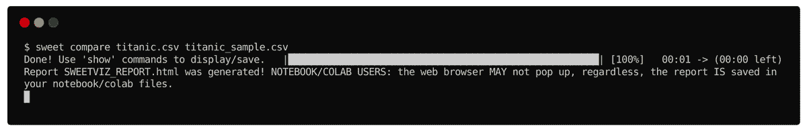
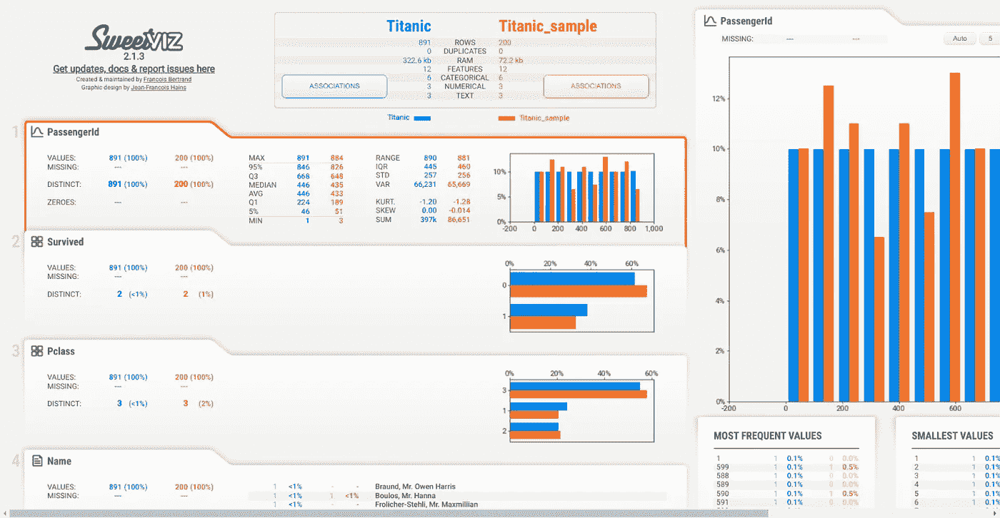

# 如何在眨眼之间用 Python 做一吨的分析？

> 原文：<https://towardsdatascience.com/how-to-do-a-ton-of-analysis-in-the-blink-of-an-eye-16fa9affce06?source=collection_archive---------21----------------------->

## 使用这些 Python 探索性数据分析工具，将数据探索时间缩短到原来的十分之一。


图片由来自 [Pixabay](https://pixabay.com/?utm_source=link-attribution&utm_medium=referral&utm_campaign=image&utm_content=4997724) 的[丹尼尔·汉纳](https://pixabay.com/users/danielhannah-8058574/?utm_source=link-attribution&utm_medium=referral&utm_campaign=image&utm_content=4997724)拍摄

我还记得过去美好的大学时光，我们花了几个星期在 SPSS 中分析调查数据。看看我们从那一点走了多远是很有趣的。

今天，我们可以在一个命令中完成所有这些任务，甚至在您眨眼之间就可以完成更多任务。

这是一个显著的进步！

这篇短文将分享三个令人印象深刻的用于探索性数据分析(EDA)的 Python 库。不是 Python pro？放心吧！即使您对 Python 一无所知，也可以从这些工具中受益。

它们可以节省您数周的数据探索时间，并提高数据质量。此外，你会少很多揪头发的时刻。

第一个是最 [*受欢迎的*](#0e4b) ，然后是我的 [*最喜欢的*](#50f4) 最后一个是最[](#b0da)*。即使您以前知道这些库，我在本文中介绍的 CLI 包装器可能会帮助您以闪电般的速度使用它们。*

# *最流行的 Python 探索性数据分析库。*

*GitHub 中有超过 77k 颗星星， [Pandas-Profiling](https://github.com/pandas-profiling/pandas-profiling) 是我们列表中最受欢迎的探索性数据分析工具。它易于安装，使用简单，结果无可挑剔。*

*您可以使用 PyPI 或 Conda 来安装 Pandas-Profiling。*

```
*pip install pandas-profiling
# conda install -c conda-forge pandas-profiling*
```

*该安装允许您在终端窗口中使用 pandas-profiling CLI。几秒钟之内，它会生成一个 HTML 报告，其中包含大量关于数据集的分析。*

*眨眼时刻:这里有一个演示展示了它是如何工作的。我们使用流行的泰坦尼克号幸存者数据集进行分析，并将其存储在一个 HTML 文件中。然后我们用最喜欢的浏览器打开它。这里有一个[现场版](https://thuwarakeshm.github.io/analysis-in-the-blink-of-an-eye/profiling.html)你可以随便玩玩。*

**

*作者插图。*

*当你打开文件或上面的链接时，它看起来会像下面这样。*

**

*[作者截图。](https://medium.com/@thuwarakesh)*

*变量部分是对数据集中每个变量的综合分析。它包括描述性统计、直方图、变量的普通值和极值。*

*在交互部分，您可以选择任意两个变量并创建一个散点图。*

*这是一个单页面无依赖性的网络应用。因为生成的 HTML 是一个自包含的应用程序，所以您可以用任何静态站点托管提供商来托管它。*

*在这份报告中，我最喜欢的部分之一是相关性部分。它创建了变量相关性的热图。您可以选择在热图中使用的关联类型。*

# *我最喜欢的 EDA 库。*

*虽然它在 GitHub 上只有 1.7k 颗星，但 [Sweetviz](https://github.com/fbdesignpro/sweetviz) 在很多方面都让我着迷。显而易见的磁铁是该库超级酷的交互式 HTML 输出。但是我对这个工具的喜爱是有其他原因的。*

*您可以使用下面的命令安装该库*

```
*pip install sweetviz*
```

*Sweetviz 不附带命令行界面。但是下面的代码在这个库周围创建了一个 CLI 包装器。如果您想了解更多关于为您的数据科学项目创建漂亮的 CLI 的信息，请查看我以前关于该主题的文章[。](/a-simplified-guide-to-create-clis-for-your-data-science-project-bf9bcaa26e1)*

*完整的代码可以在 [Github 库](https://github.com/ThuwarakeshM/analysis-in-the-blink-of-an-eye)中找到。非 python 用户可以按照那里的说明快速入门。*

## *Sweetviz 在 CLI 中的主要用法。*

*代码片段由[作者提供。](https://medium.com/@thuwarakesh)*

*为了让上面的脚本工作，*

1.  *将内容复制到一个名为`sweet`的文件中(注意文件没有扩展名)；*
2.  *使文件成为可执行文件。用`chmod +x sweet`就可以了，还有；*
3.  *用`export PATH=$PATH:$PWD`将当前目录添加到系统路径中。*

***闪现时刻:**这创建了我们需要的 CLI，以便更快地生成 EDA。这是它的主要用法。*

**

*作者插图。*

*上面的示例生成了一个关于数据集的详细报告，并在浏览器中打开它。输出可能如下所示。一个[现场版](https://thuwarakeshm.github.io/analysis-in-the-blink-of-an-eye/sweet_report.html)也有。*

**

*作者插图。*

*你可能会看到，Sweetviz 提供的信息几乎与 Pandas-Profiling 提供的信息相同。Sweetviz 也生成了一个自包含的 HTML。可以用 Github pages 等静态托管解决方案托管。*

*Sweetviz 的两个显著特性是我最喜欢的——数据集比较和设置目标变量。我们一个一个看，然后一起看。*

## *在 CLI 中使用 Sweetviz 比较数据集。*

*用下面的内容更新我们创建的 sweet 文件。您可以将其粘贴到“更多功能”行的下方。此功能为您的 CLI 提供了额外的功能—比较。*

*作者插图。*

***眨眼时刻:**它是这样工作的。它将两个文件作为参数，并像前面一样生成报告。对于这个例子，我通过采样 Titanic 数据集创建了第二个文件。在现实生活中，同一文件可能有不同的版本。*

**

*作者插图由[提供。](https://medium.com/@thuwarakesh)*

*生成的输出现在看起来不同了。它现在包含在每个级别显示的比较值。在这个[现场版](https://thuwarakeshm.github.io/analysis-in-the-blink-of-an-eye/sweet_compare.html)里可以看的很清楚。*

**

*作者插图。*

*否则，对两个数据集进行这样的比较可能需要很大的努力。*

*Sweetvis 的另一个很酷的地方是它的目标变量设置。这样，您就可以生成一个报告，根据目标变量检查每个切割。下面的代码更新将允许您使用 CLI 来完成。*

*代码由[作者提供。](https://medium.com/@thuwarakesh)*

***瞬间:**现在，您可以在 CLI 中指定数据集名称和目标变量。下面是演示和输出( [live 版](https://thuwarakeshm.github.io/analysis-in-the-blink-of-an-eye/sweet_target.html))。*

**

*作者插图。*

**

*作者插图。*

*我已经将“幸存”变量指定为目标变量。现在，除了每个变量，你还可以研究目标的可变性。*

*在大多数情况下，您必须了解不同版本的数据集的目标变量是如何变化的。这只是与 Sweetviz 的另一个眨眼。*

## *数据集与目标变量的比较*

*下面的代码将更新 CLI 以接受三个参数。第一个是主数据集，然后是比较数据集，最后是目标变量。*

*代码由[作者提供。](https://medium.com/@thuwarakesh)*

***眨眼时刻:**您可以使用我们之前创建的用于比较的样本数据集来运行它，并将“幸存”列作为目标。*

**

*作者插图由[提供。](https://medium.com/@thuwarakesh)*

*现在，输出既有比较数据集，也有针对目标变量的分析。在大多数专业工作中，这可能非常有用。如果您处理同一个数据集，请用新的观察值对其进行更新，并关注单个变量。下面是[现场版](https://thuwarakeshm.github.io/analysis-in-the-blink-of-an-eye/sweet_compare_with_target.html)来测试。*

**

*作者插图。*

# *灵活的 EDA 操场。*

*如果你可以多眨几下眼睛，但需要更多地控制你的分析，这就是你需要的。 [Pandas GUI](https://github.com/adamerose/PandasGUI) 为您的数据框创建图形包装。您可以使用方便的接口，而不是编写代码。熊猫 GUI 与其说是一个快速探索工具，不如说是一个探索游乐场。*

*您可以用 PyPI 安装它:*

```
*pip install pandasgui*
```

*和 Sweetviz 一样，Pandas GUI 也没有 CLI。尽管启动它并不复杂，但是如果您不是 Python 用户，下面的 CLI 包装器可以帮助您。*

*代码由[作者提供。](https://medium.com/@thuwarakesh)*

*就像我们对 Sweetviz 所做的那样，用上面的内容创建一个名为`pgui`的文件。用`chmod +x pgui`使其可执行。但是，您不必像我们已经做的那样，再次将当前目录添加到路径中。下面的命令将启动用户界面。*

```
*pgui titanic.csv*
```

**

*作者插图。*

*你可以看到互动软件出现。使用这个工具，您可以进行不同的分析，这是我提到的另外两个工具所做不到的。*

*例如，这是幸存者相对于他们年龄的等高线图。*

**

*作者插图。*

*在这里，我们不打算讨论更多关于熊猫 GUI 的细节。但是下面来自他们官方文件的视频会帮助你了解更多。*

*来自 PandasGUI 官方文档页面的视频教程。*

# *结论*

*除了解释之外，探索性数据分析在很大程度上是重复的。我们纠结于 SPSS 和 Excel 做鸡毛蒜皮的事情的日子一去不复返了。今天，一眨眼的功夫，我们能做的远不止这些。*

*在本文中，我讨论了三个非常方便的 Python 库来实现 EDA。熊猫画像是其中最受欢迎的一个。Sweetviz 创建了一个我觉得很方便的自包含 HTML 应用程序。最后，我们讨论了 Pandas GUI，这是一个允许您控制分析的工具。*

*除了这个库，我们还讨论了如何创建 CLI 包装器来使它更加方便。它允许非 Python 用户也从这些工具中受益。*

*这三个库的安装和使用都很简单。随着 EDA 重复性任务的完成，你可以将注意力集中在更令人兴奋的事情上。*

*做好准备，在你的观众眨眼之前给他们一个惊喜。*

> *感谢阅读，朋友！看来你和我有许多共同的兴趣。我很乐意通过 LinkedIn、T2、Twitter 和 Medium 与你联系*

*还不是中等会员？请使用此链接 [**成为**](https://thuwarakesh.medium.com/membership) 会员。你可以享受成千上万的有见地的文章，并支持我，因为我赚了一点佣金介绍你。*