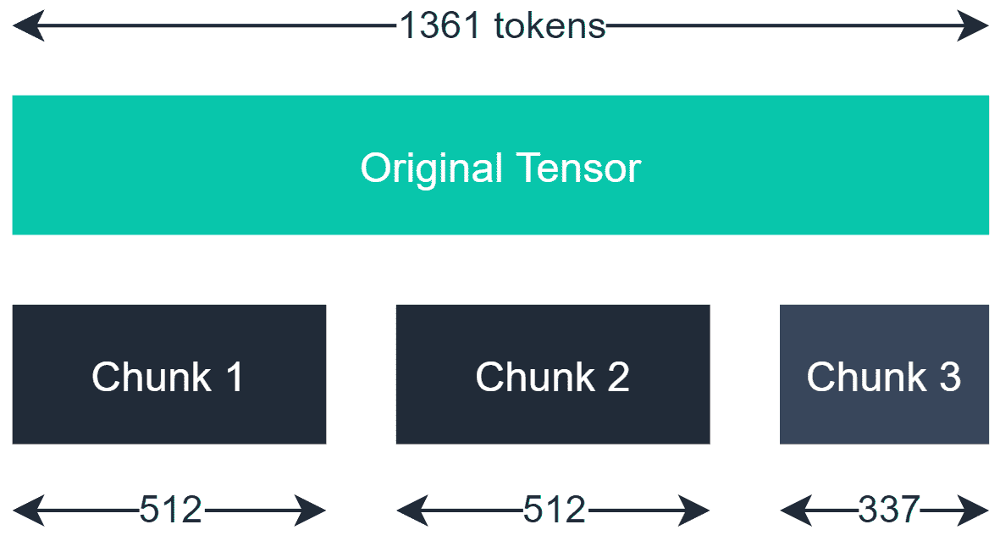
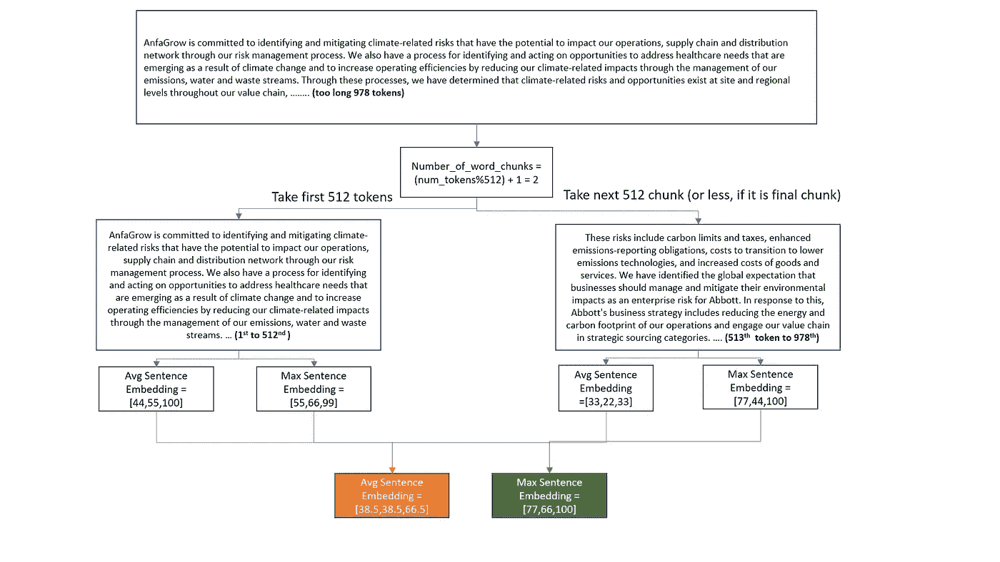

# 长句如何做平均和最大单词嵌入？

> 原文：<https://towardsdatascience.com/how-to-do-average-and-max-word-embedding-for-long-sentences-f3531e99d998?source=collection_archive---------22----------------------->

## 如何对超过 512 个单词的长句执行 NLP 操作

由 [Raphael Schaller](https://unsplash.com/@raphaelphotoch?utm_source=medium&utm_medium=referral) 在 [Unsplash](https://unsplash.com?utm_source=medium&utm_medium=referral) 拍摄的照片

# 总体架构/方法

在我们在这个实验中使用的 BERT 模型的情况下，我们使用来自 https://github.com/mukut03/ESG-BERT[的 ESG_BERT 模型。在这个 BERT 模型中，该模型可以处理的最大序列只有 512 个令牌。因此，如果你的序列超过 512 个记号，你需要一种叫做**分块的技术。**我们还应该注意，对于我们使用的模型，**单词嵌入向量大小被训练为 768** ，因此我们的嵌入输出也将显示每个令牌的向量大小为 768。](https://github.com/mukut03/ESG-BERT)

图片来源:[https://towards data science . com/how-to-apply-transformers-to-any-length-of-text-a 5601410 af7f](/how-to-apply-transformers-to-any-length-of-text-a5601410af7f)

作者图片

假设我们有 978 个令牌的序列，我们可以将它们分成 2 个块，因为 978//512 = 1(我们比地板除法多取一个块)。为了说明，我们假设每个单词的嵌入向量大小是 3。

橙色框中是**平均句子嵌入(AvgSE)** ，绿色框代表**最大句子嵌入(MaxSE)** 。

为了计算 AvgSE，我们需要

1.  把长序列分块
2.  在每个块中:

*   查找块中每个单词的单词嵌入
*   找出组块中所有单词嵌入的平均值(将所有向量相加，除以组块中的单词数)

3.通过将所有单词嵌入相加(在第 2 项中),除以组块数，再次对进行平均

为了计算 MaxSE，我们需要

1.  把长序列分块
2.  在每个块中:

*   查找块中每个单词的单词嵌入
*   找到组块中所有单词嵌入的最大值

3.再次 Max 单词 embeddings across the chunks(在项目 2 中)

# 词汇符号化和组块化的味道

在标记化下，我们看到*“我开玩笑生气了”*中的 4 个词原文，现在被标记为 *['我'，'我'，'开玩笑'，' ##ly '，'生气']。*这种标记化在 BERT 模型中很普遍，根据您选择的 BERT 模型的类型，单词也会被不同地拆分。

在分块下，这里是我们的分块代码的工作方式，分块大小为 2。我们的句子是*“我是屋里的女孩”*。组块之后，我们将句子分成许多部分，每个部分的大小为 2(除了最后一个组块):*[‘我是’，‘一个女孩’，‘在房子里’]*

我们之所以引入这两个概念，是因为它们将在下面的**主代码:长句的平均单词嵌入**和**主代码:长句的最大单词嵌入**部分的主代码块中使用。

# 让我们首先引入一些辅助函数

# 主代码:长句平均单词嵌入

# 主代码:长句最大单词嵌入

# 最终想法:

首先，这是一个简单的方法，可以克服单词嵌入时序列长度的限制。

第二点:本教程讲述如何找到整个句子/序列的平均和最大单词嵌入。

希望对你有帮助！

*免责声明:内容由作者生成，不隶属于任何组织*