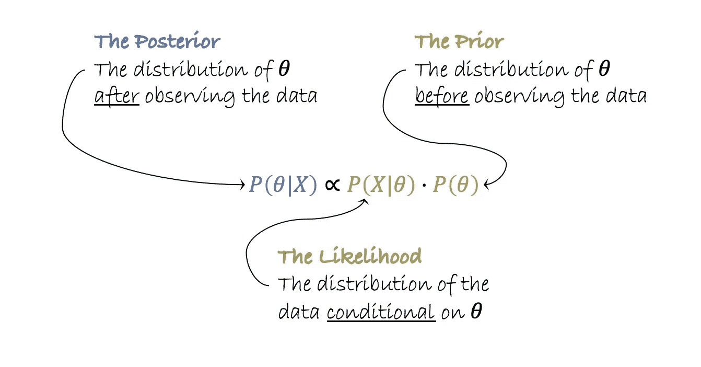
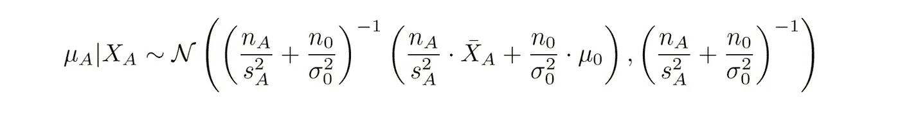
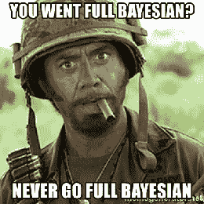
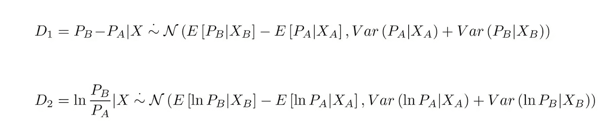
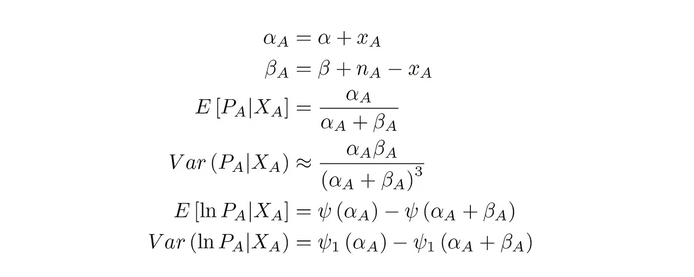
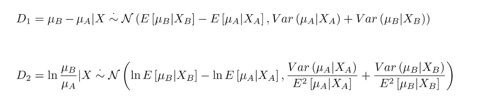
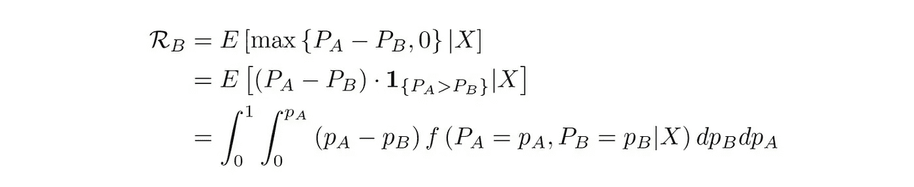
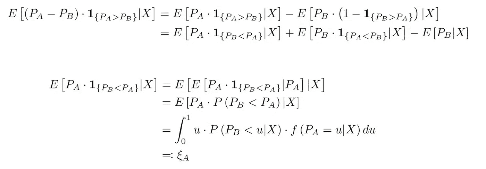
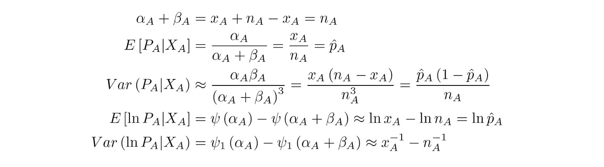

# 如何大规模进行贝叶斯 A/B 测试

> 原文：<https://towardsdatascience.com/how-to-do-bayesian-a-b-testing-fast-41ee00d55be8?source=collection_archive---------9----------------------->

## [行业笔记](https://towardsdatascience.com/tagged/notes-from-industry)

## 在不影响性能的情况下分析贝叶斯 A/B 测试

如果你读过[我之前的文章](/why-you-should-switch-to-bayesian-a-b-testing-364557e0af1a)，你就会知道为什么我认为你应该转向贝叶斯 A/B 测试。在这篇文章中，我简要概述了贝叶斯 A/B 测试背后的统计模型，并介绍了我们在 Wix.com 大学实施它们的方法——在那里我们处理大规模的 A/B 测试。

在这篇文章中，我用 Python 写了一些实际的例子。你可以通过从[这里](https://github.com/itamarfaran/public-sandbox/blob/master/bayesian_blog/main.py)和[这里](https://github.com/itamarfaran/public-sandbox/blob/master/bayesian_blog/orthogonal.py)复制粘贴代码来轻松复制它们。虽然代码相当简单，但我导出的公式可能有点高级；然而，我不认为理解所有的推导来使用代码是很重要的。

如果你没有统计学和[贝叶斯推断](https://en.wikipedia.org/wiki/Bayesian_inference)的背景，我推荐你阅读我的参考资料部分的文章。此外，我使用的许多概念都有维基百科的链接，在那里有更详细的解释。

# 贝叶斯 A/B 测试模型

贝叶斯 A/B 测试结果的可视化。左图:两个比率的后验分布。右图:隆起(比率)的后验分布，使用中心极限定理近似。*作者图片*

贝叶斯统计建立在两个主要概念上:先验分布(T12)和后验分布(T15)，前者是我们在测试前“知道”的 KPI，后者是我们在收集数据后知道的。我们通过用我们的数据更新先验来找到后验。在 A/B 测试环境中，我们尽量保持简单，并使用易于更新的先验分布([共轭先验](https://en.wikipedia.org/wiki/Conjugate_prior))，如贝塔二项式模型。

情商。1: [贝叶斯定理](https://en.wikipedia.org/wiki/Bayes%27_theorem)。在 A/B 测试中， *θ* 是正在讨论的 KPI，例如转换率或每个用户的平均收入。作者图片

[Beta-Binomial](https://en.wikipedia.org/wiki/Beta-binomial_distribution) 模型用于模拟二进制数据，如转换或点击(“用户是否转换？”).我还将回顾一下[正常-正常](https://en.wikipedia.org/wiki/Multivariate_normal_distribution#Bivariate_case_2)模型，它用于连续数据(例如每用户收入)。

在贝塔-二项式模型中，我们假设转换率 *Pᴀ* 具有带参数 *α* 和 *β* 的[贝塔分布](https://en.wikipedia.org/wiki/Beta_distribution)。对于 *α* 和 *β* 的一个[公共选择](https://en.wikipedia.org/wiki/Beta_distribution#Bayes-Laplace_prior_probability_(Beta(1,1)))是 1，这导致一个均匀分布(有时被称为一个[无信息先验](https://en.wikipedia.org/wiki/Prior_probability#Uninformative_priors))。我将在附录中更详细地讨论先验的选择，但是现在让我们继续假设它们已经被选择了。

我们用 *Xᴀ* 表示转化用户的数量，用 *nᴀ* 表示所有用户(转化或未转化)的数量，我们建模 *Xᴀ | Pᴀ ~ Bin(nᴀ，Pᴀ).*由于*pᴀ~β(α，β)* ，利用[贝叶斯定理](https://en.wikipedia.org/wiki/Bayes%27_theorem)我们得到:

情商。2:贝塔分布的后验概率

这意味着我们通过将成功的次数加到 *α* 上，并将失败的次数加到 *β* 上来“更新”我们的先验。很简单，你不觉得吗？

在正态-正态模型中，我们假设每用户预期收入(或任何其他连续指标) *μᴀ* 具有参数 *μ₀* 和 *σ ₀/n₀* 的[高斯分布](https://en.wikipedia.org/wiki/Normal_distribution)。这里我们用 ***X*** *̄ᴀ* 表示样本平均值，用 *sᴀ* 表示样本标准差，并且我们假设***x****̄ᴀ*也近似正态分布。这一次，更新规则有点复杂:

等式 3:高斯分布的后验概率

后验的期望值是先验均值和样本均值的加权平均值，权重与它们的方差成反比。

所有这些公式可能看起来有点难以理解，但是 NumPy 中的计算非常简单:

代码片段 1:设置一些虚拟数据

代码片段 2:更新后验概率

# 如何计算(大多数指标)

既然我们已经找到了 *Pᴀ* 和 *Pʙ* 的后验分布，我们就要计算推断指标，比如可信区间、概率 b 更好以及每个版本的风险。最常见和简单的方法是使用蒙特卡洛模拟。但在 Wix.com，我们每天在数百个 A/B 测试中有数千个 KPI，使用模拟是不可扩展的。相反，我们使用两种方法:[高斯平方](https://en.wikipedia.org/wiki/Gaussian_quadrature)(稍后将详细介绍)和……[中心极限定理](https://en.wikipedia.org/wiki/Central_limit_theorem) (CLT)近似。

图片由[memegenerator.net](https://memegenerator.net/instance/58400233/tropic-thunder-downey-you-went-full-bayesian-never-go-full-bayesian)

你可能会想——CLT 不更像是一个常客吗？CLT 能应用于贝塔分布吗？你质疑这一点是对的。然而，当你在每一个 A/B 测试中有几千个样本时，贝塔分布的 CLT 近似就“足够好”了。你可以通过自己做模拟来验证我(或者看[我的](https://github.com/itamarfaran/public-sandbox/blob/master/bayesian_blog/compare.py))。

在这里，我们将近似的可信度区间和概率 B 更好的 CLT。同样，虽然公式可能有点详尽，但使用 SciPy 的代码几乎是一行代码。我们用 *D₁* 表示 Pʙ - Pᴀ 的差值*，用 *D₂* 表示对数比*对数 Pʙ/Pᴀ* 。当我们报告[相对上升](https://en.wikipedia.org/wiki/Relative_risk)而不是百分点差异时，使用后者。我们用下面的公式来近似 *D₁* 的和 *D₂* 的分布:*

情商。4:两个贝塔随机变量之间的差和比的 CLT 近似

为了完成上面的公式，我们分别用 *ψ* 和 *ψ* ₁来表示[双伽玛函数](https://en.wikipedia.org/wiki/Digamma_function)和第一个[多伽玛函数](https://en.wikipedia.org/wiki/Polygamma_function)。您不需要知道它们是做什么的，只需要知道在 SciPy 的哪里可以找到它们就行了！下面的等式是简单地从维基百科复制来的:

情商。5:贝塔变量及其对数的矩，摘自维基百科

利用这些公式，我们可以很容易地计算出概率 b 较好的有 *P(D₁ > 0)* ，可信区间有 *D₁* 或 *D₂:* 的分位数

代码片段 3:计算 Beta-二项式模型的(一些)推断指标

对于正常-正常的情况， *D₁* 是相当[直截了当的](https://en.wikipedia.org/wiki/Normal_distribution#Operations_on_two_independent_normal_variables)。但是如果我们想用相对差异来代替呢？我们决定使用[德尔塔法](https://en.wikipedia.org/wiki/Delta_method)来寻找*在μᴀ* 的大致分布。现在你可能会想——我怎么才能得到高斯随机变量的对数呢？而且(再次)你将是完全正确的——高斯分布的支持包括负数，并且它的对数没有被正确定义。但是(再一次)对于成千上万的样本量，这是一个“足够好”的近似值，因为 *μᴀ* 的分布离 0“相当远”。

情商。6:两个高斯变量之间的差的分布，以及用 Delta 方法找到的它们的比率的近似分布。

代码片段 4:计算正态-正态模型的(一些)推理度量

# 计算风险

现在我们终于到了重要的部分:风险度量是贝叶斯 A/B 测试中最重要的度量。它取代 P 值作为[决策规则](https://en.wikipedia.org/wiki/Decision_rule)，但也作为[停止规则](https://en.wikipedia.org/wiki/Stopping_time)——因为贝叶斯 A/B 测试具有动态样本大小。

它被解释为“当 B 比 A 差时，如果我选择 B，我预计会损失多少转换？”，并且在形式上，它被定义为:

情商。7:贝叶斯 A/B 测试中风险的正式定义

用**1*1*作为指示功能。注意第三行的积分——我真的很讨厌这个积分！它没有解析解，而且我们无法用 CLT 来近似它。但是正如我之前提到的，蒙特卡洛模拟对我们来说不是一个选项。那我们做了什么？**

[高斯平方](https://en.wikipedia.org/wiki/Gaussian_quadrature) (GQ)是一种用少量节点的加权和来近似积分的酷方法。节点和权重由 GQ 算法计算。在形式上，我们找到最接近 *g* 的积分的 *n* 个节点( *x* )和权重( *w* ):

情商。8:高斯求积用所选节点的加权和来近似积分。 *-∞ ≤ a < b ≤ +* ∞

正如我们前面看到的，风险度量是一个积分，所以我们可以尝试用 GQ 来近似它。首先，让我们简化它的表达式:

情商。9:风险度量的简化

现在 *ξᴀ* 是一个积分，我们*可以用高斯积分*近似！我们可以用大约 20 个节点准确计算风险，而不是用蒙特卡罗模拟中的数千个节点:

情商。10:风险指标的简化表达

我们使用[scipy . special . roots _ hermitnorm](https://docs.scipy.org/doc/scipy/reference/generated/scipy.special.roots_hermitenorm.html)和一个解决方案[scipy . special . roots _ sh _ jacobi](https://docs.scipy.org/doc/scipy/reference/generated/scipy.special.roots_sh_jacobi.html)实现了这个近似(更多解决方案在我的笔记中)。这不是很快，但这是我们找到的最快的方法。

代码片段 5:用 SciPy 的高斯积分计算风险度量

# 摘要

贝叶斯 A/B 测试中的数学和编程比 Frequentist 框架中的更具挑战性。然而，正如我在[上一篇文章](/why-you-should-switch-to-bayesian-a-b-testing-364557e0af1a)中所说，我认为这是值得的。虽然它在计算上更昂贵，但 A/B 测试增加的清晰度和可解释性给任何使用它们的人带来了巨大的价值。

在这篇文章中，我回顾了贝叶斯 A/B 检验的 Beta-Binomial 和 Normal-Normal 模型的基础，并介绍了我们在 Wix.com 实现的一些近似。虽然这些近似可能不是 100%准确，但当实验有成千上万的用户时，它们是“足够好的”，它们允许我们大规模地支持贝叶斯 A/B 测试。

这篇文章关注的是如何计算 A/B 测试的贝叶斯度量，而不是如何分析它或何时停止它。如果你想阅读更多关于这些问题的文章，我的参考资料中的文章给出了一个很好的概述。

# 参考

以下是我第一次学习贝叶斯 A/B 测试时读到的一些帖子。后两篇文章对框架更为关键，我特别推荐阅读它们。

*   *[*贝氏 A/B 测试的力量*](https://medium.com/convoy-tech/the-power-of-bayesian-a-b-testing-f859d2219d5)*迈克尔·弗拉斯科著**
*   ***[*贝叶斯 A/B 测试——模拟实践探索*](/exploring-bayesian-a-b-testing-with-simulations-7500b4fc55bc)*布莱克·阿诺德****
*   ****[*VWO 贝氏 A/B 测试*](https://cdn2.hubspot.net/hubfs/310840/VWO_SmartStats_technical_whitepaper.pdf)*克里斯·斯图基奥*****
*   ****[*贝叶斯与 Frequentist A/B 测试:有什么区别？*](https://cxl.com/blog/bayesian-frequentist-ab-testing/)****
*   ***[*贝叶斯 A/B 测试对偷看免疫吗？不完全是大卫·罗宾逊的*](http://varianceexplained.org/r/bayesian-ab-testing/)***

***最后一个帖子可能是我最喜欢的，我已经读过几遍了。特别是，通过重新创建它的模拟，我已经了解了当动态停止贝叶斯 A/B 测试时，选择不同的先验对错误率的影响(在附录中有更多关于这个主题的内容)。***

*****我还开发了一些与贝叶斯 A/B 测试相关的酷炫的应用程序，只使用了*和*本文中的公式:*****

*   **[贝塔-二项式 A/B 测试计算器](http://itamar-faran.shinyapps.io/bayesian-binary-calculator-app/)**
*   **[正常-正常 A/B 测试计算器](http://itamar-faran.shinyapps.io/bayesian-continuous-calculator-app)**
*   **[一个比较贝叶斯&频密 A/B 测试](http://itamar-faran.shinyapps.io/bayesian-runtime-simulator)之间运行时间&准确性的酷应用**

**我在这篇文章中使用的所有代码都可以在[这个目录](https://github.com/itamarfaran/public-sandbox/tree/master/bayesian_blog)中找到。**

# **附录:关于优先权的选择**

**关于在贝叶斯 A/B 检验中选择先验的重要性有一个小范围的争论。在我看来，使用信息丰富且合适的简历非常重要，原因如下:**

1.  **我将先验视为 A/B 测试中的一种"[正则化](https://en.wikipedia.org/wiki/Regularization_(mathematics))，它在处理[多重比较问题](https://en.wikipedia.org/wiki/Multiple_comparisons_problem)时发挥着重要作用。是的——尽管我们没有使用 Frequentist 框架，但这仍然是一个问题..**
2.  **由于我们依次使用贝叶斯 A/B 测试(每天查看结果，一旦风险低于阈值就停止)，使用“弱”(低)先验增加了我们的错误率。参见我的参考资料中大卫·罗宾逊的帖子。**
3.  **一个人无法避免通过使用一个无信息的先验来选择一个先验的困境。**选择一个无信息的先验仍然是一个先验的选择**，只是一个非常糟糕的选择。**

**我认为在贝叶斯模型中找到并使用合适的先验是很重要的。在 Wix，我们通过自动化“先验构建器”过程来实现这一点，其中我们自动查询过去几周的历史数据，并根据这些数据构建先验，正如弗拉斯科和阿诺德在他们的帖子中所建议的那样。只有当没有足够的数据时，我们才退回到“无信息”先验(对于贝塔分布， *α=1，β=1* ，对于高斯分布， *μ₀=0，σ₀=1，n₀=0* )。**

# **笔记**

*****按重要性降序排列*****

*   **scipy.special.roots_sh_jacobi 在 *α* 或 *β* 过大时遇到整数溢出错误。我复制了源代码，并做了“日志技巧”让它工作，你可以在这里看到。我也有那期的公关([这里](https://github.com/scipy/scipy/pull/12580))。**
*   **如果你用 R 编程，你可以使用 [statmod::gauss.quad.prob](https://www.rdocumentation.org/packages/statmod/versions/0.5/topics/gauss.quad.prob) 函数用高斯求积来估算风险。**
*   **参数 *μ₀=0、σ₀=1、n₀=0* 、不是高斯分布的无信息先验，而是产生一个非常“弱”的先验。我们不使用[实际无信息先验](https://en.wikipedia.org/wiki/Jeffreys_prior#Examples)的原因是它不会产生共轭先验，这使得计算更加困难。**
*   **我们发现正态-正态模型适合我们的大多数连续 KPI。虽然有更复杂的模型(例如指数和贝塔分布的乘积，这里是)，但我们发现在大样本中，高斯近似会产生类似的结果，而且计算起来简单得多(奥卡姆剃刀的救援)。我再次邀请你们通过自己的模拟来验证我，或者在这里看我的。**
*   **在我的上一篇文章中，我写道，贝叶斯模型和频率主义模型之间的许多指标在数字上并没有太大的不同。的确，他们有很多相似之处，事实上——如果他们没有，我们会担心的！这里有一个很好的例子:在一个大样本中，等式。5 几乎与比率估计的 CLT 近似和比例检验中的[对数](https://en.wikipedia.org/wiki/Relative_risk)相同。设置 *α，β = 0* 为简单起见，可以得到:**

****

**情商。11:贝塔分布的矩和采样率的 CLT 近似值之间的相似性**

*   **注意，在我提出的正态-正态模型中，标准差 *σ₀* 没有后验概率。原因是，在 Wix，我们对推断标准偏差不感兴趣，我们将其视为一个讨厌的参数。如果你需要推断，我建议你参考前面的[正-逆-伽玛](https://en.wikipedia.org/wiki/Normal-inverse-gamma_distribution#Posterior_distribution_of_the_parameters)。**