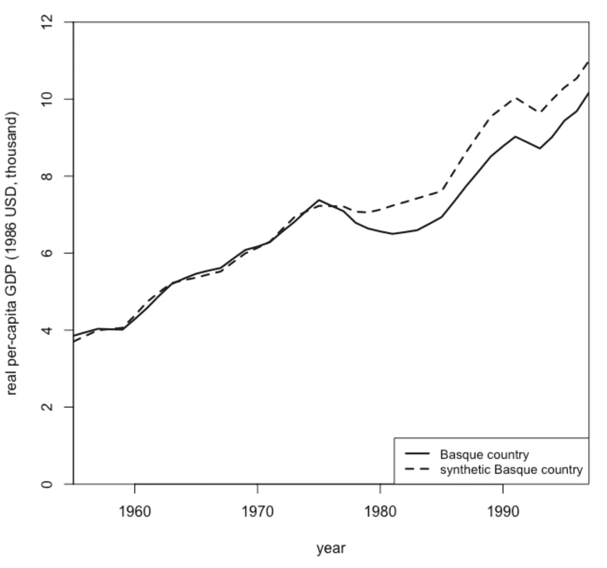
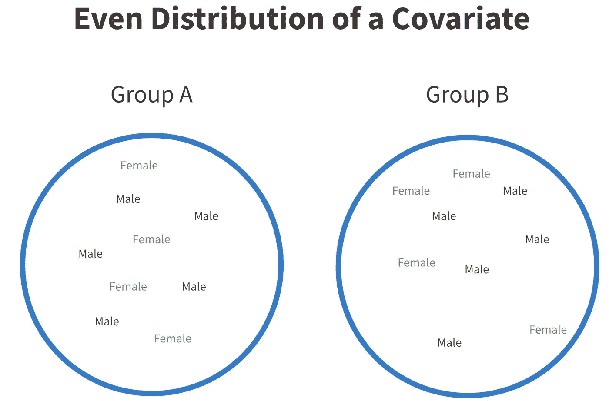
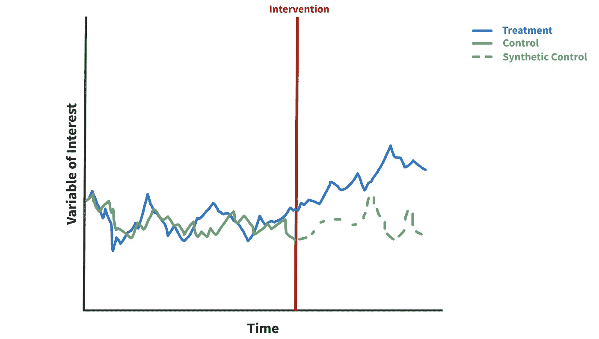
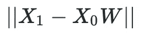
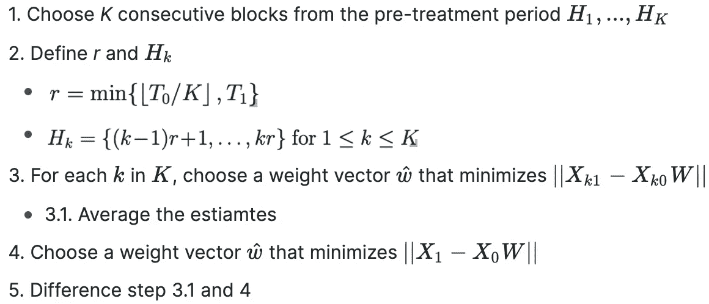
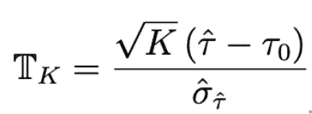

# 如何使用合成控件进行因果推断

> 原文：<https://towardsdatascience.com/how-to-do-causal-inference-using-synthetic-controls-ab435e0228f1?source=collection_archive---------11----------------------->

## 麻省理工学院开发的 t-测验综合控制概述。

在 2017 年和 2021 年之间，有大量关于合成控制的研究。然而，该方法尚未被数据科学行业广泛采用。

图 1:首次发布的合成控制示例，显示了恐怖袭击对巴斯克地区 GDP 的影响。图片作者。

**一句话，合成控制(SC)预测观察到的数据在没有处理的情况下会是什么样子。** SC 很有吸引力，因为它们允许对观察到的时间序列数据进行偶然的推断。它们的计算效率也很高，而且相对简单。

在本帖中，我们将讨论合成控制和一种由麻省理工学院研究人员开发的新变体，用于对合成控制数据进行 [t 检验](https://arxiv.org/pdf/1812.10820.pdf)。与传统方法相比，它拥有一些令人印象深刻的优势，例如置信区间大小减少了 50%。它的计算效率也很高，并且不依赖于假设。

事不宜迟，让我们开始吧…

# 技术 TLDR

综合控制方法在观察时间序列数据中发展了一个控制组的估计。这允许我们在不可能随机化的情况下分离出干预的治疗效果。

我们首先选择一个与我们的治疗组相似的对照组。然后，在干预前阶段，我们使用加权平均值来最小化对照组和治疗组中共变量之间的距离。最后，我们使用对照组中“训练过的”协变量来推断如果治疗没有发生会发生什么。

然而，由于潜在的不正确的权重向量和长期方差的不良估计，对 SC 的推断并不稳健。为了解决这些问题，我们提出了一个无标度 t 统计量，使用 K-fold 交叉拟合过程进行拟合。唯一的假设要求是对照组“充分”喜欢治疗。

这里是 [R 包](https://github.com/kwuthrich/scinference)回购。

# 但是，到底是怎么回事呢？

好吧，你只是遇到了很多麻烦。让我们慢一点，通过合成控制和麻省理工学院的 t-测试进行推理。

## 1 —因果推理

在统计学中，我们经常对因果关系感兴趣。

确定一段关系是否是因果关系的黄金标准是 A/B 测试。通过在治疗组和对照组之间随机分配，我们可以保证(平均)在各组之间均匀分布协变量，如图 2 所示。**随机化有效地使实验组相同。**

一旦我们有了*个相同的*组，我们就可以给其中一组分配一种治疗方法，并观察它们的差异。**由于两组是相同的，差异必然是由治疗引起的。**

图 2:一个均匀分布的协变量的例子，*性别*。图片作者。

然而，我们也有兴趣对我们观察到但没有随机化的数据进行因果推断。一个简单的方法是开发一个完美的因果模型，考虑所有可能的混杂因素。但是我们怎么知道我们是否有所有的混杂因素呢？

你经常不能。“正确”模型的假设是大多数简单因果模型的基础，从根本上说是无法证明的。

有许多选择，但在本帖中，我们将讨论一种专门针对时间序列数据的最稳健的方法…

## 2 —合成控制

合成控制是在观察数据中创建控制组的一种非常聪明的方法。通过这样做，我们有了一个比较的基线，从而可以准确地估计治疗效果。

让我们看一个例子。

假设我们正在评估费城清洁能源政策的影响。我们感兴趣的变量是安装在房屋上的太阳能电池板的数量。

理想情况下，我们的处理效果看起来像下面的图 3。在干预之后，政策的批准，我们会看到太阳能电池板的数量(蓝色)相对于我们的理论控制(绿色点)有所增加。

图 3:综合控制的时间序列结构示例。图片作者。

有了这个框架，让我们通过开发一个综合控制的步骤…

**第一步:选择对照组**。控制组用于训练预测合成控制值的权重向量。注意，对照组不能以任何方式受到治疗的影响。对于我们的示例，我们可能希望排除与费城有业务往来的城市，因为化石燃料出口可能会发生变化。

**第二步:确定相关预测因子。**治疗组和对照组中的预测因子都应该是可观察到的。它们可以是不受治疗系统影响的任何东西。一些例子可以是一个城市的国内生产总值或房屋总数。

**第三步:拟合权重向量。**选择的权重必须使治疗组和对照组预测值之间的距离最小，如图 4 所示。 *X1* 和 *X0* 是相同的预测因子，但分别在处理和对照中观察。W 是我们的权重向量。

图 4:我们希望最小化的范数向量。x 是预测值，W 是权重向量。

在这一步的最后，我们有一组权重，使控制协变量看起来像处理协变量。

第四步:预测我们的控制值。掌握了控制预测因子与治疗预测因子之间的关系，我们可以使用观察到的控制数据来预测未进行干预的治疗*。*

**第五步:观察治疗电梯。**有了对照组和治疗组，我们就可以开始探索差异了。

不算太坏，对吧？

# 方法:合成对照的 T 检验

现在普通的综合控制框架不能确定估计值的变化，所以我们不能确定统计意义。

一个常见的解决方法是运行一个[排列测试](/how-to-use-permutation-tests-bacc79f45749)，但是这里我们概述一个麻省理工学院开发的替代方法。令人印象深刻的是，该方法只需要假设“处理单元与控制单元足够相似”

当估计综合控制的不确定性时，该方法解决了两个主要问题。第一个是**我们的加权平均框架可能产生不准确的估计**，即使我们的治疗和控制预测之间的距离最小化。第二个更微妙，但仍然很重要。在确定统计显著性时，我们经常使用长期方差的估计量来定义置信区间。那些**长期方差估值器通常是不准确的**。

为了简洁起见，这将变得有点技术性，但是请随意参考论文。

## 问题 1 —重量矢量不准确

为了解决潜在的权重向量估计不准确的问题，我们执行了一个 *K* 折叠交叉拟合过程，概述如下…

这里， *T0* 和 *T1* 分别是干预前后的时间点。 *K* 是用户自定义的参数，决定折叠的次数，类似于交叉验证。

请注意，这个符号非常简单，但希望能提供一个大致的理解。详见[第 2.2 节](https://arxiv.org/pdf/1812.10820.pdf)开头。

只剩最后一节了…

## 问题 2——不准确的长期方差估计量

为了解决长期方差估计不准确的问题，我们开发了一种无标度统计。

图 5:无标度 t 统计量。

尽管符号看起来很复杂，但这只是一个 t 统计量。括号中的值是我们的处理平均值和对照平均值之间的差值。分母是通过我们的 k 倍拟合过程确定的标准偏差。并且， *K* 是折叠的次数。

# 摘要

这就是综合控制的概要，以及如何对这些信息进行 T 检验。

概括地说，合成对照使用干预前观察到的治疗组和对照组之间的关系来预测干预后对照组的值。尽管这种方法很受欢迎，但它很难进行稳健的统计推断。

因此，我们概述了利用 k 倍交叉拟合和无标度 t 统计的 t 检验，以解决开发合成对照时发现的常见问题。此外，令人印象深刻的是，这种方法只需要假设我们控制的单位与我们治疗的单位相似。

# 实施说明

*   理论上，供应链框架超越了线性关系和简单的加权平均。然而，数学变得更加复杂，所以在这个领域没有太多的发展。这里有一个值得注意的例外。
*   拟合协变量时，评估拟合的质量很重要。一个严重错误的模型会极大地降低我们结论的质量。这里有一个[偏差修正方法，适用于拟合不佳的模型](https://arxiv.org/pdf/1811.04170.pdf)。
*   为了在不牺牲拟合的情况下简化过程，通常将 PCA 应用于治疗和控制中的预测器。然后，在每个主分量上拟合权重向量。
*   SC 依靠大量的预干预期进行训练。预干预期越长越好。
*   最小化权重时标准化预测值通常是个好主意。这防止具有不同大小/单位的预测器扭曲最小化。
*   [差异中的差异](https://dimewiki.worldbank.org/Difference-in-Differences)是一个常见的选择，但需要更多的假设。如果这些假设中的任何一个都不被支持，SC 和这个 t 检验是一个很好的默认选项。

附言:有很多非常好的研究即将出炉。查看[arxiv.com](https://arxiv.org/search/?query=synthetic+control&searchtype=title&source=header)了解最新消息。

*感谢阅读！我会再写 32 篇文章，把学术研究带到 DS 行业。查看我的评论，链接到这篇文章的主要来源和一些有用的资源。*