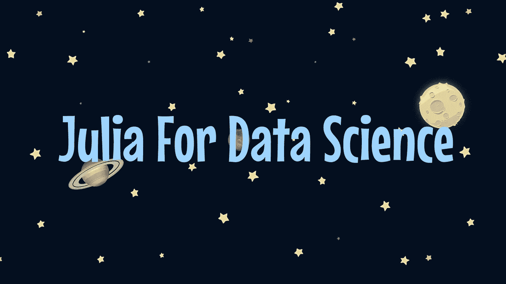

# 如何用 Julia 语言做数据科学

> 原文：<https://towardsdatascience.com/how-to-do-data-science-in-the-julia-language-a9bf7a55eb89?source=collection_archive---------31----------------------->

## 对 Julia 的快速介绍，包括 ML 语言中常用的资源和包的信息。

(图片由作者提供)

# 介绍

从一开始，科学界就一直是编程语言特别难吸引的对象。这当然是指首先是科学家，其次是计算机科学家的科学家。一个从未读过一盎司代码的有抱负的新数据科学家在学习 C++这样的低级语言时肯定会有很多困难。此外，这种语言的范例可能会限制科学家的能力，因为他们需要完整的类型结构来做一些基本的测试，而声明式编程肯定是最适合的。

也就是说，虽然声明式语法对于科学计算来说肯定是最佳的，但它对于速度来说不是最佳的。速度似乎是 Julia 的巨大优势，尽管语言中有更多的特性使其成为数据科学更有价值的资产。科学家们既需要快速的数值计算，也需要迭代性更强的语言的状态管理，同时还需要声明式编程的方法论和易用性。

Julia 语言是最近发布的科学编程语言，旨在解决科学计算面临的所有传统问题。虽然 Julia 是一种非常典型的函数式语言，经常有结构和全局定义的方法，但它通过一个称为多重分派的特性使用参数多态性，这只是一个开始！

虽然 Julia 语言可能肯定是你想要进入的语言之一，但是在 Julia 的生态系统中工作可能是困难的。这对新来者来说更是如此，因为 Julia 的生态系统不像任何竞争对手那样成熟。同样，用于这门语言的资源非常少——我的工作实际上是这些资源的重要部分。

# 处理数据

所以你想和朱莉娅一起做数据科学？使用任何编程语言进行数据科学研究的第一步是学习该语言如何处理一般数据。这包括了解数据类型和如何在语言中使用它们，以及使用生态系统来有效地管理观察。

对于处理数据来说，很容易，你想要查看的最重要的包是 data frames . JL。data frames . JL 是 Julia 编程的 Pandas.py。也就是说，它与 Julia 矩阵的集成和易用性使它成为在 Julia 中处理数据的一个很好的工具。此外，在 Julia 中使用多维数组也是很常见的，所以熟悉这些也是很有用的。

您还需要工具来读取各自的数据格式，比如 CSV.jl 或 JSON.jl。

虽然 DataFrames.jl 可能提供了许多处理数据所需的工具，但通常有一些数据操作更特定于数据科学，如 TrainTestSplit。对于这样的操作，基本上有三种选择:

*   MLJ
*   车床
*   MLDataUtils

所有这些工具都有其优点和缺点。我想说在这方面最全面的可能是 Lathe，它将提供缩放器、编码器、分离器、统计、测试，甚至一些机器学习模型，如相对快速的随机森林分类器实现。关于这个话题，你可以在这篇文章中比较一下车床和 Sklearn 的速度:

</performance-testing-python-and-sklearn-with-julia-and-lathe-f5516fa497d7>  

最后，很多时候需要从其他地方获取数据。例如，我们可以研究用 SQL.jl 执行 SQL，我们可以研究通过使用 HTTP.jl 包来利用 API 数据。

# 测试和可视化

数据科学过程的另一个重要部分是统计测试和数据可视化。虽然这可能主要是更多分析型数据科学家的责任，但这些可视化往往可以帮助机器学习工程师更好地理解和处理他们的数据。可视化是一种很好的研究方法，因为它们可以定性地传达一个想法。例如，我们可以说，通过可视化展示，数据非常分散。虽然方差可能是一个定量的度量，但是可视化我们的数据是如何分布的将会给我们关于我们的数据的定性信息，这将是非常有价值的。

对于假设检验，您应该看一下 HypothesisTests.jl 和 t.jl。这两者对于使用 t 分布的数据进行工程设计和检验都很有用。然而，假设检验包括更多的分布选项，例如在某些情况下可能有用的 f 分布。

最后一个可以用来做统计的模块是我们之前讨论过的一个包，车床。Lathe 附带了一个发行版包，它与其他包一样遵循面向对象编程范例。测试类是使用发行版构建的，然后测试可以很容易地重复执行。此外，这些分布和统计权重可在车床内重新应用，并可与模型一起使用。

至于可视化，Julia 实际上有大量的数据可视化包。这包括带有或不带有交互性或动画的统计、经济和商业可视化。以下是我认为在 Julia 中实现数据可视化的一些最佳选择:

*   Makie.jl
*   牛虻. jl
*   Plots.jl
*   VegaLite.jl

如果您想了解更多，并考虑您今天想要查看哪个可视化库，我写了一篇文章详细介绍了这些出色的库(Makie.jl 除外)的优缺点，您可以在这里查看！：

</julia-visualization-libraries-which-is-best-e4108d3eeaba>  

# 机器学习

Julian 数据科学生态系统的机器学习部分在过去四年中实际上已经取得了相当进步的发展。也就是说，虽然这些包中的许多可能与科学家可能习惯使用的包非常不同，但它们确实是很好的实现。我在 Julia 中寻找机器学习的第一个包是 GLM.jl。

GLM 是广义线性模型的简称。线性建模是在一种新的编程语言中练习建模的一种很好的方式，GLM 的高级接口肯定会将线性建模容纳到一个非常高级的程度。

但是，如果您来自 Python 和 Sklearn，您可能会对一个名为 Lathe 的包感兴趣。Lathe.jl 是一个纯粹的 Julian 统计和数据处理库，上面有一个不断扩展的机器学习模型库。Lathe 的伟大之处在于，它允许没有实际 Julia 编程经验的用户快速进入该语言，并开始使用完整的模型，就像在 Python 中一样。如果你想了解车床，你可以查看车床网站:

  

MLJ.jl 也能派上很多用场。像车床一样，它是相当包容的，并带有一些黑盒模型。然而，虽然 Lathe 更侧重于成为通用数据科学包，但 MLJ.jl 更专注于机器学习。

最后，但肯定不是最不重要的，在选项中我会推荐 Flux.jl。虽然有一些其他解决方案你肯定可以使用，如 Knet，但我认为 Flux.jl 在 Julia 的深度学习上拿了蛋糕——至少现在是这样。Flux 使用简单的函数方法来解决深度学习类型和方法的经典问题。也就是说，虽然 Flux 对于习惯于函数式编程的人来说可能很棒，但对于来自 Tensorflow 之类的人来说可能需要一些时间来适应。在我看来，Flux.jl 实际上更容易使用，但与谷歌开发的 Tensorflow 相比，它的不成熟确实不时表现出来。

# 结论

谢谢你看我的文章！我认为谈论朱莉娅的未来是很重要的。我认为年轻的编程语言的未来看起来相当光明，所以早期采用肯定会有利于未来从事数据科学。也就是说，很难判断在生态系统中你应该首先采用什么，以及如何过渡或开始学习——这篇文章旨在帮助那些想开始但不确定从哪里开始的人。我希望你像我喜欢写作一样喜欢阅读！祝您愉快！