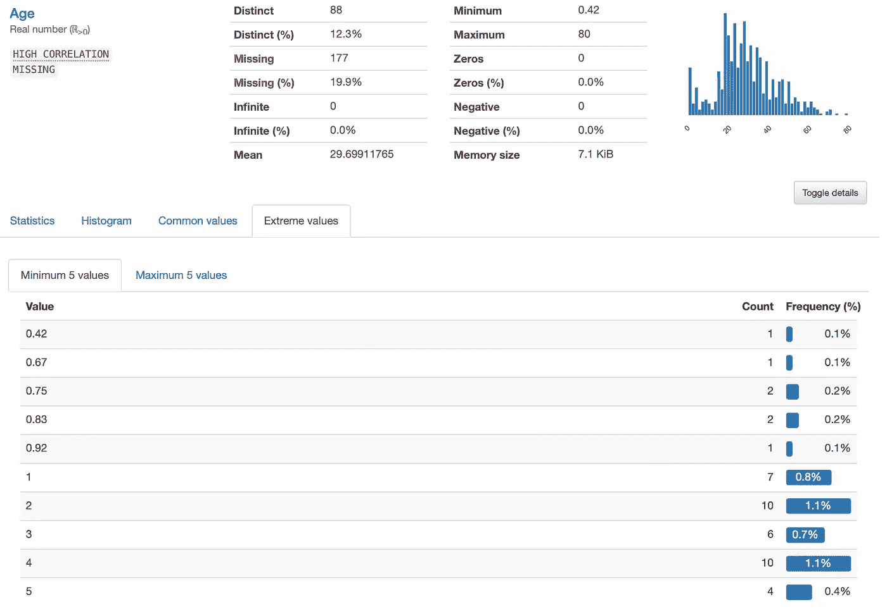

# 如何用一行代码在 Python 中进行探索性数据分析

> 原文：<https://towardsdatascience.com/how-to-do-exploratory-data-analysis-with-one-line-of-code-1364e16a102e?source=collection_archive---------18----------------------->

## 大蟒

## 用熊猫档案为你的下一个项目节省时间


图片由 cottonbro 提供。来源: [Pexels](https://www.pexels.com/photo/man-in-white-dress-shirt-holding-white-ceramic-mug-4114623/)

让我们想象一下，你要做一个探索性的数据分析。你从哪里开始？您加载数据集，打印数据，查找观察值的数量、数据类型、缺失值、重复值和统计汇总。然后，您可能需要创建一些数据可视化来更好地理解您所拥有的。所有这些都需要多行代码，可能需要几个小时。如果我告诉你，你可以节省你的宝贵时间，跳过所有这些步骤，只专注于分析数据，会怎么样？魔法？不，那是熊猫侧写。

有相当多的博客是关于熊猫在媒体上的简介。然而，这是我对这个伟大图书馆的看法。令人惊讶的是，我认识的大多数数据科学家要么不知道熊猫概况，要么很熟悉但从未尝试过使用它。


左图:熊猫下载趋势。右图:熊猫简介下载趋势。来源: [Snyk 顾问](https://snyk.io/advisor/)

看看上面熊猫简介和熊猫的下载趋势，我们可以看到熊猫的受欢迎程度是熊猫简介的几十倍。这当然是意料之中的。然而，我们也可以看到，熊猫烧香并没有得到应有的普及。好吧，如果你不知道它，让我们一起探索它，如果你已经知道它，让我告诉你为什么你应该在你工作的每个项目中使用它。

# 熊猫简介

简而言之，Pandas Profiling 是一个低代码库，允许我们执行彻底的探索性数据分析。通过键入一行代码，您将省去我在本文开头提到的所有步骤，并获得一个漂亮的交互式 HTML 文件，您可以在笔记本中可视化该文件，或者与任何人共享该文件。这就像把你的 Jupyter 笔记本变成一个 Tableau 仪表板。我们开始吧！

# 如何使用熊猫概况

首先，你需要安装熊猫概况。您可以通过键入以下代码行使用`pip`来安装它:

```
pip install -U pandas-profiling[notebook]
jupyter nbextension enable --py widgetsnbextension
```

如果你喜欢使用`conda`，你只需要输入下面的代码:

```
conda env create -n pandas-profiling
conda activate pandas-profiling
conda install -c conda-forge pandas-profiling
```

现在你已经安装好了，是时候享受乐趣了。在这个演示中，我将使用著名的泰坦尼克号数据集，你可以在这里找到它。

```
**# Importing pandas and pandas profiling**
import pandas as pd
from pandas_profiling import ProfileReport**# Importing the dataset**
df = pd.read_csv('world-happiness-report-2021/world-happiness-report-2021.csv')
```

这就是你最后使用熊猫档案所需要做的。很简单，对吧？现在，让我们创建报告。我将输入下面一行代码，我们就可以开始了。

```
profile = ProfileReport(df, title='Titanic Report')
profile
```


作者图片

我们走吧。这份报告在我的电脑上运行了 5.67 秒，只用了一行代码。我将把它分成几个部分，这样我们可以更好地分析我们得到的信息。

# 概观

首先，我们对数据集进行概述，显示变量、缺失值、重复行的数量，有多少值是数值，有多少值是分类的。


作者图片

然后，我们有一个选项卡显示关于数据集的警告。如果你的期末项目和机器学习有关，这些警告会有很大帮助。它显示了具有高基数、高相关性、高缺失值百分比、高零百分比等的类别。在我看来，这两个特点已经使熊猫轮廓值得。


作者图片

# **变数**

现在，我们可以探索变量。Pandas Profiling 将向我们显示每个类别的细分，包括统计信息，如最小值、最大值、无穷大数，以及不同值的百分比。


作者图片

如果我们点击`Toggle details`，会看到更复杂的信息，包括范围、变异系数、偏度、标准差、百分位数等。


作者图片

你是否使用了 5 行以上的代码来得到一个像样的图表，以便更好地理解一个类别？熊猫档案将帮助你做到这一点。点击`Histogram`，您将能够看到类别分布。请记住，这一切都是在 5 秒钟内完成的！


作者图片

不用输入`df['age'].value_counts(normalize=True)`，你只需点击一下就可以看到一个类别中每个值出现的频率。哦，看起来好多了。


作者图片

最后，我们可以很容易地看到数据集中的极值(或异常值)。举个例子，好像有 0.92 岁的人。这可能意味着它们是婴儿，或者数据集是错误的。无论哪种方式，如果您手动操作，都不会很容易发现这一点。



作者图片

# **互动**

熊猫烧香提供的另一个非常酷的功能是查看类别之间的交互。然而，泰坦尼克号数据集并不是分析这一特征的最佳选择。为此，我将使用[世界幸福报告 2021](https://www.kaggle.com/unsdsn/world-happiness) 。

要做到这一点，你需要做的就是选择你想要比较的两个特征，熊猫轮廓将创建瞬时散点图。多酷啊。


作者图片

# 相关

因为我们可以看到每个特性是如何与其他特性交互的，所以想象我们也可以看到一个相关表是有意义的。Pandas Profiling 前进了几步，显示了四个不同的相关表:Pearson 的、Spearman 的、Kendall 的、Phik 的和 Cremér 的。不确定这些都是什么？没问题。点击`Toggle correlation descriptions`，你会得到每一条的解释。


作者图片

# 第一行和最后一行

Pandas Profiling 背后的开发人员希望确保他们涵盖了探索性数据分析的每一步。因此，它们包含了数据集的第一行和最后一行——这是一种非常好的处理方式


作者图片

# 共享报告

熊猫概况的另一个优点是它使得分享报告变得非常容易。您将共享一个文件以备分析，而不是共享一个 Jupyter 笔记本，让其他用户运行所有代码。您可以通过键入`profile.to_file('report_name.html')`来下载报告，您将看到一个新文件将被创建在与您正在使用的笔记本相同的文件夹中。


作者图片

# 结论

在过去的几个月里，熊猫简介变得越来越受欢迎。然而，它并没有得到应有的普及。你应该学习如何手动做 EDA 来提高你的编码技能，但是让我们承认你可以用 Pandas Profiling 节省至少一个小时的时间。

如果你使用这个伟大的图书馆，你不会不专业。事实上，这是一个节省时间和专注于重要事情的聪明方法:分析！我强烈推荐你尝试这个库，如果你尝试了，让我知道它是如何进行的。编码快乐！