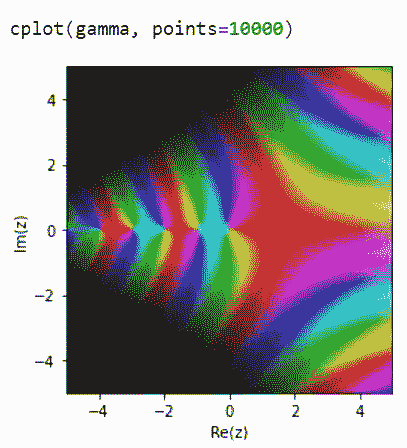
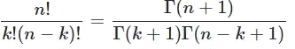
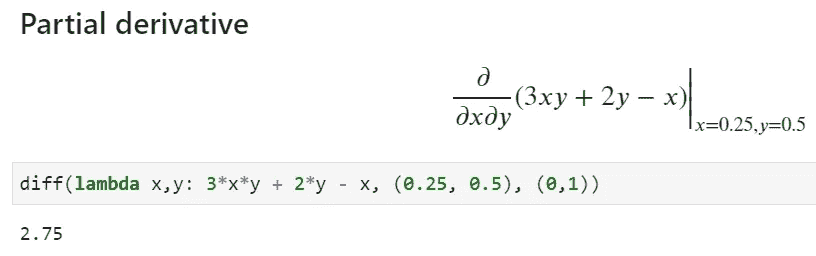

# 如何用 Python 做“无限”数学

> 原文：<https://towardsdatascience.com/how-to-do-limitless-math-in-python-73f573570dfa?source=collection_archive---------5----------------------->

## 如何执行任意精度的计算，以及比 Python 中内置的数学库更多(也更快)的数学运算。


**图片来源** : [Pixabay](https://pixabay.com/photos/steelwool-fire-infinite-firespin-458842/) (免费使用)

# 无限数学？

听起来像一个吸引人的标题？嗯，这个术语真正的意思是**任意精度计算**，即脱离我们通常熟悉的 32 位或 64 位算术的**限制。**

这里有一个简单的例子。


如果您只是从 Python 的标准`math`模块导入，这就是您将得到的 2 的平方根值。

您可以使用 Numpy 来选择您希望结果是 32 位还是 64 位浮点数。


但是，如果您希望结果达到小数点后 25 位呢…

> 1.414213562373095048801689

或者，小数点后 50 位？

> 1.4142135623730950488016887242096980785696718753769

我们是如何得到这些结果的？

仅仅通过使用一个叫做`**mpmath**`的简洁的小软件包。我们来详细考察一下。

# 使用“mpmath”进行任意精度计算

`Mpmath`是一个用于任意精度浮点运算的 Python 库。关于`mpmath`的一般信息，请参见[项目网站](http://mpmath.org/)。

从它的[网站](https://mpmath.org/doc/current/#advanced-mathematics)来看，除了任意精度的算术之外，“`*mpmath*` *提供了对超越函数、求和、积分、极限、根等等的广泛支持”*。它也做许多标准的数学任务，

*   多项式
*   求根和优化
*   总和、乘积、极限和外推
*   区别
*   数值积分(正交)
*   求解常微分方程
*   函数逼近
*   数值逆拉普拉斯变换

简而言之，这是一个充满无限可能的强大数学库！我们将在本文中探讨一些特性。

> **任意精度计算是**脱离了我们平常熟悉的 32 位或 64 位运算的**限制…**

## 安装和选择快速后端引擎

只是皮普。

```
pip install mpmath
```

默认情况下，`mpmath`在内部使用 Python 整数。如果系统中安装了【1.03 版或更高版本，`mpmath`将自动检测并使用`gmpy`整数，而不改变高级用户体验。使用这个后端使它的操作更快，特别是在高精度上。

`gmpy2`是一个支持多精度算术的 **C 代码 Python 扩展模块**。 [**下面是如何安装**](https://gmpy2.readthedocs.io/en/latest/intro.html#installation) 。

## 密码

这里是[笔记本，上面有本文展示的所有代码](https://github.com/tirthajyoti/Stats-Maths-with-Python/blob/master/mpmath-1.ipynb)。

## 选择精度

有很多关于选择和控制`mpmath`精度的资料。鼓励读者直接参考这篇参考文献。

我将向你们展示，在你们工作的时候，设定精度的快速方法。


您可以随时打印`mp`上下文来查看当前的全局精度设置。`mp.prec`以位显示精度，`mp.dps`以十进制显示精度。


## 使用``mpf``实例代替常规浮动

在上面的代码片段中，你可能已经注意到了一个函数`mpf`。一个`mpf`实例保存一个实值浮点数。它们的工作方式类似于 Python 浮点，但是支持任意精度的算术。

您应该使用字符串(而不是 Python 浮点)作为参数来定义`mpf`,以获得真正的准确性。您也可以将`mp.pretty`设置为`True`，以在不丧失内部精度的情况下进行舍入。


## 现在来点魔法！阶乘计算速度快 11，000 倍

只要适用，`mpmath`可以使用智能技巧进行大型计算。一个例子是阶乘。对于较大的数字，它可以在没有指示的情况下适当地使用近似值，并且比默认的 Python 数学模块更快地给出结果。

下面是我们试图计算 100，000 的阶乘时发生的情况。`mpmath`比**快 11,333X】。**


## 有理数和复数是本地公民

我们可以把有理数或复数像浮点数一样容易地混合在一起。为此，我们需要使用一个神奇的函数`**mpmathify**`，它与`**sympy**`内部构件一起工作来解释这些量。


我们不必导入像`[**fraction**](https://docs.python.org/3/library/fractions.html)`或`[**cmath**](https://docs.python.org/3/library/cmath.html)`这样的 Python 模块来以我们选择的精度处理这样的数量。

在此了解 `[mpmath](https://mpmath.org/doc/current/general.html)` [提供的所有其他](https://mpmath.org/doc/current/general.html)[通用实用功能。](https://mpmath.org/doc/current/general.html)

## 快速绘图

如果系统上有 Matplotlib，`mpmath`提供了一个快速简单的绘图选择，只需传递一个函数列表和相应的范围。

下面是一个单行代码示例，


**图片来源**:作者生成

另一个带有[菲涅耳函数](https://en.wikipedia.org/wiki/Fresnel_integral)的例子，


**图片来源**:作者生成

使用`cplot`可以轻松绘制复杂的量。默认情况下，复数参数(相位)显示为颜色(色调)，数值显示为亮度。



**图片来源**:作者生成

表面情节也是游戏，


**图片来源**:作者生成

## 特殊功能

`mpmath`支持数百种现成的特殊功能。以下是该列表的部分截图。有关详细信息，请参考本文档。


**图片来源**:作者生成

## 二项式系数

使用`binomial`函数快速简单地计算统计和组合数学的二项式系数，


这个函数支持**大规模的参数，这是它真正的亮点**。Scipy 计算速度更快，但对于较大的数字，Scipy 甚至不运行！


并且，对非整数和负参数的扩展是自然的(使用 Gamma 函数)，



## 超工厂

对于整数，超因子被定义为，


它们真的很大。你能想出一种简单的方法来计算这种数字吗？


这个数字是 1.1425…后面是 41908 个零！为了了解这一点，只需考虑这个事实——宇宙中大约有[个 10⁸⁰原子](https://www.thoughtco.com/number-of-atoms-in-the-universe-603795)，即 1 后面跟着 80 个零。

无限的数学(以快速的方式)，不是吗？

## 斐波那契数

用朴素的 Python(递归函数)计算斐波那契数列是一个流行的面试问题，因为它可以用几种不同的方法来完成，这些方法在效率上有很大的不同。

但是对于`mpmath`来说，计算大自变量或非整数(甚至是复数)自变量的近似解是很自然和容易的。使用原生 Python 编码实现这一点并不容易。


多项式求值和根

使用`polyeval`和`polyroots`函数轻松快速地计算任意阶多项式和求根。当然，`polyroots`对所有实根和复根一次求值。


## 任意函数的求根

我们可以使用`rootfind`函数来搜索任意函数的根。这里有一个例子，


**图片来源**:作者生成

然后，我们在从-2 到 5 的所有整数附近寻找解，它找到对应于函数过零的所有 x 值的多个解。


## 数值演算

计算任意阶和任意函数的导数，


偏导数很容易，



看[这篇参考文献](https://mpmath.org/doc/current/calculus/differentiation.html)看导数相关的其他高级例子和函数。

## 一维积分

简单快速地评估到任意精度，


## 二维或三维积分

二维或三维积分也是游戏！


点击阅读更多[详情。](https://mpmath.org/doc/current/calculus/integration.html)

## 常微分方程

我们可以用`odefun`求解已知边界条件的常微分方程。


或者，一个更难的问题，


## 矩阵和线性代数

`mpmath`包还提供了所有涉及矩阵和线性代数的标准操作。为了简洁起见，我们在这里只[参考文档](https://mpmath.org/doc/current/matrices.html)而不是展示例子。

# 摘要

在本文中，我们展示了一个强大的 Python 库及其执行任意精度数值计算的能力，包括各种数字和函数。基本上，这个库的主要优点是它覆盖了大量的数学领域(代数、数论、微积分、特殊函数等)。)和**在一个屋檐下一切都可用，无需加载多个库**。

该库的许多用途是在复杂的科学/技术领域，如有限元模拟或密码学，但是作为一个数字爱好者，无论何时您需要数据科学或机器学习工作，您都可以从该包中获得有用的函数。

同样，这里是本文中显示的所有代码的[笔记本。](https://github.com/tirthajyoti/Stats-Maths-with-Python/blob/master/mpmath-1.ipynb)

快乐的数字运算！

*喜欢这篇文章吗？成为* [***中等会员***](https://medium.com/@tirthajyoti/membership) *继续* ***无限制学习*** *。如果你使用下面的链接，* ***，我会收到你的一部分会员费，而不会对你产生额外的费用*** *。*

[https://medium.com/@tirthajyoti/membership](https://medium.com/@tirthajyoti/membership)