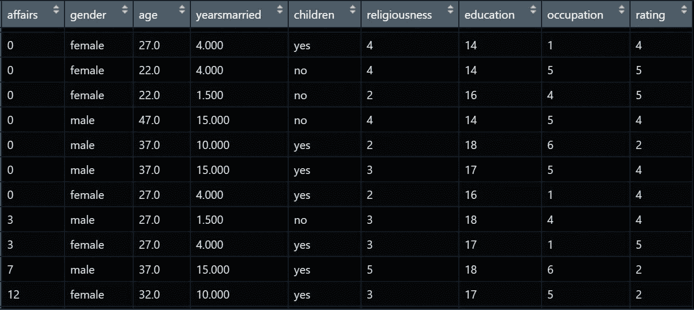
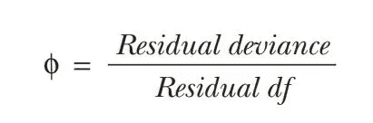

# 如何在 R 中进行逻辑回归

> 原文：<https://towardsdatascience.com/how-to-do-logistic-regression-in-r-456e9cfec7cd?source=collection_archive---------11----------------------->

## 解释、预测和评估带有不忠数据的逻辑回归示例


照片由 [Pexels](https://www.pexels.com/photo/magnifying-glass-on-white-paper-6120207/?utm_content=attributionCopyText&utm_medium=referral&utm_source=pexels) 的 Nataliya Vaitkevich 拍摄

> **简介**

[**逻辑回归**](https://en.wikipedia.org/wiki/Logistic_regression) 是广义线性模型最流行的形式之一。如果您想从一组连续和/或分类预测变量中预测二元结果，它会很方便。在本文中，我将通过一个示例数据集讨论如何在 R 中使用逻辑回归的概述。

我们将使用[不忠数据](https://rdrr.io/cran/AER/man/Affairs.html)作为我们的示例数据集，称为 Fair's Affairs，它基于《今日心理学》在 1969 年进行的一项横截面调查，并在 Greene (2003)和 Fair (1978)中进行了描述。该数据包含从 601 名受访者中收集的 9 个变量，这些变量包含的信息包括他们在过去几年中发生婚外情的频率，以及他们的年龄、性别、教育程度、结婚年限、有无子女(是/否)、宗教信仰程度(从 1 =反对到 5 =非常)、职业(7 分制)以及对婚姻幸福度的自我评级(从 1 =非常不幸福到 5 =非常幸福)。下图显示了一些观察结果，让您对数据有一个总体的了解。



AER 包中的不忠数据样本

运用逻辑回归，我们可以发现哪些因素对不忠贡献最大。然后，你可以用这个模型来检查你和你的伴侣之间哪一个更有可能有外遇😜

但是，在此之前，我们将使用下面的代码运行一些描述性的统计数据，以便更好地理解我们的数据。

```
# How to do Logistic Regression in R
# Created by Michaelino Mervisiano> install.packages("AER")
> library("AER")> data(Affairs, package="AER")
> View(Affairs)
> summary(Affairs)
 affairs        **gender**      **age**            yearsmarried    **children**
 Min.  : 0.0    female:315  Min. :17.50    Min. : 0.125     no :171
 1st Qu: 0.0    male :**286**   1st Qu:27.00   1st Qu: 4.000    yes:**430**
 Median : 0.0               Median :32.00  Median : 7.000
 Mean : 1.456               Mean :**32.49**    Mean : 8.178
 3rd Qu.: 0.0               3rd Qu.:37.00  3rd Qu.:15.000
 Max. :12.0                 Max. :57.00    Max. :15.000 religiousness  education     occupation   rating
 Min. :1        Min. : 9.0    Min. :1.0    Min. :1.000
 1st Qu:2       1st Qu:14.0   1st Qu:3.0   1st Qu:3.000
 Median :3      Median :16.0  Median :5.0  Median :4.000
 Mean :3.116    Mean :16.17   Mean :4.195  Mean :3.932
 3rd Qu.:4      3rd Qu.:18.0  3rd Qu.:6.0  3rd Qu.:5.000
 Max. :5        Max. :20.0    Max. :7.0    Max. :5.000>table(Affairs$**affairs**) 
 0   1  2  3  7   12 
451 34 17 19  42  38
```

从上面的总结中，我们可以看到有 286 名男性受访者(占整体受访者的 48%)，430 名受访者有孩子(占整体受访者的 72%)，我们的受访者的平均年龄为 32.5 岁。此外，我们发现 451 名受访者声称在过去的一年中没有外遇。这意味着 25%的受访者有婚外情，最多的是 12 人。总之，我们可以说 6%的受访者每月有一次婚外情😏。

因为我们对回应变量的二元结果感兴趣(有外遇/没外遇)。我们可以用下面的代码将事务转换成一个名为 ***ynaffair*** 的
二元变量。

```
> Affairs$**ynaffair**[Affairs$affairs >  0] <- 1
> Affairs$**ynaffair**[Affairs$affairs == 0] <- 0> Affairs$ynaffair <- factor(Affairs$ynaffair,levels=c(0,1), labels=c("No","Yes"))> table(Affairs$ynaffair)
No   Yes
451  150
```

> **用逻辑回归拟合模型**

现在，我们可以执行逻辑回归来测量反应变量(事件)和解释变量(年龄、性别、教育、职业、子女、自我评价等)之间的关系。

```
> **fit.full** <- glm(ynaffair ~ gender + age + yearsmarried + children 
              + religiousness + education + occupation +rating,
              data=Affairs, family=binomial())> summary(fit.full)
Deviance Residuals:
 Min        1Q    Median     3Q      Max
-1.571   -0.750   -0.569   -0.254   2.519Coefficients:
              Estimate  Std. Error  z value  **Pr(>|z|)**
(Intercept)    1.3773    0.8878     1.55     0.12081
gendermale     0.2803    0.2391     1.17     0.24108
age           -0.0443    0.0182    -2.43     0.01530 *
yearsmarried   0.0948    0.0322     2.94     0.00326 **
childrenyes    0.3977    0.2915     1.36     0.17251
religiousness -0.3247    0.0898    -3.62     0.00030 ***
education      0.0211    0.0505     0.42     0.67685
occupation     0.0309    0.0718     0.43     0.66663
rating        -0.4685    0.0909    -5.15     2.6e-07 ***
---
Signif. codes: 0 '***' 0.001 '**' 0.01 '*' 0.05 '.' 0.1 ' ' 1
(Dispersion parameter for binomial family taken to be 1)
 Null deviance: 675.38 on 600 degrees of freedom
Residual deviance: 609.51 on 592 degrees of freedom
AIC: 627.5
Number of Fisher Scoring iterations: 4
```

如果我们观察回归系数的 ***Pr( > |z|)*** 或 p 值，那么我们发现性别、有无子女、教育和职业对我们的反应变量没有显著贡献。因此，我们可以尝试拟合第二个模型，只包括年龄、结婚年数、宗教信仰和评级等重要变量来拟合数据。

```
> **fit.reduced**  <- glm(ynaffair ~ age + yearsmarried + religiousness
                   + rating, data=Affairs, family=binomial())
> summary(fit.reduced)
Deviance Residuals:
 Min      1Q      Median   3Q       Max
-1.628   -0.755   -0.570   -0.262   2.400Coefficients:
              Estimate  Std. Error  z value  **Pr(>|z|)**
(Intercept)     1.9308  0.6103      3.16     0.00156 **
age            -0.0353  0.0174     -2.03     0.04213 *
yearsmarried    0.1006  0.0292      3.44     0.00057 ***
religiousness  -0.3290  0.0895     -3.68     0.00023 ***
rating         -0.4614  0.0888     -5.19     2.1e-07 ***
---
Signif. codes: 0 '***' 0.001 '**' 0.01 '*' 0.05 '.' 0.1 ' ' 1
(Dispersion parameter for binomial family taken to be 1)
 Null deviance: 675.38 on 600 degrees of freedom
Residual deviance: 615.36 on 596 degrees of freedom
AIC: 625.4
Number of Fisher Scoring iterations: 4
```

对于第二个模型，我们可以看到每个回归系数的 p 值在统计上是显著的。然后，我们可以使用 R 中的 anova 函数进行卡方检验，以比较第一个和第二个模型。我们将看到哪个模型能更好地解释我们的反应变量。

```
> anova(**fit.reduced**, **fit.full**, test="Chisq") 
Analysis of Deviance Table 
Model 1: ynaffair ~ age + yearsmarried + religiousness + rating Model 2: ynaffair ~ gender + age + yearsmarried + children +
                    religiousness + education + occupation + rating
   Resid.Df  Resid.Dev  Df  Deviance  P(>|Chi|) 
1  596       615 
2  592       610        4    5.85      **0.21**
```

上面的输出显示了 p 值= 0.21 的非显著性卡方值。这意味着只有四个预测值的第二个模型与有九个预测值的完整模型一样适合。它支持了我们最初的信念，即性别、孩子、教育和职业对预测不忠没有任何贡献(我们的反应变量)。因此，我们将继续分析第二个模型，因为在更简单的模型上更容易进行我们的解释。

> **解释模型参数**

基于第二个模型的回归系数，我们看到婚外情的几率随着结婚年限的增加而增加，随着年龄、宗教信仰和幸福自我评估而减少。我们可以根据每个回归系数的正负符号来观察它。总之，我们可以说你结婚的时间越长，你就越有可能有外遇。另一方面，你在婚姻中越快乐，你就越不可能有外遇。

```
> coef(fit.reduced) 
(Intercept)   age  yearsmarried  religiousness   rating 
   1.931    -0.035     0.101        -0.329        -0.461
```

接下来，我们想知道这些变量对*事件*的影响值。首先，我们需要记住，逻辑回归模型的反应变量对数(赔率)Y = 1。这意味着回归系数允许预测变量单位变化回报的对数变化(优势)，保持所有其他预测变量不变。

由于 log(odds)很难解释，我们将通过对结果求幂来转换它，如下所示

```
> exp(coef(fit.reduced))  
(Intercept)  age    yearsmarried  religiousness   rating  
   6.895    0.965     1.106         0.720          0.630
```

我们观察到，结婚年数每增加一年，出轨的几率就会增加 1.106 倍(年龄、宗教信仰和幸福指数保持不变)。相反，年龄每增加一岁，出轨的几率就会增加 0.965 倍。这意味着随着年龄的增长，出轨的几率会下降 3.5%。

此外，对于预测变量中的 *n* 单位变化，响应变量上的较高值的概率变化是*exp*(*βj*)^*n*。那么，在保持其他预测变量不变的情况下，15 年的增长将使几率增加 1.106 ⁵≈4.5。

> **使用新数据预测结果**

在本节中，我们将使用我们构建的模型来预测新数据的结果。第一步，我们将创建一个包含我们感兴趣的预测变量的值的新数据。第二步，我们将应用 R 中的 *predict()* 函数，根据新数据中的值来估计结果事件的概率。

考虑下面的新数据，我们有 5 个不同自我评价的新受访者，将其他变量设为整体数据的平均值。然后，我们应用预测函数来获得这些新受访者的外遇概率。

```
> newdata1 <- data.frame(rating=c(1,2,3,4,5),age=mean(Affairs$age),
                         yearsmarried=mean(Affairs$yearsmarried),
                         religiousness=mean(Affairs$religiousness))
> newdata1
   **rating**  age    yearsmarried  religiousness
1  **1**       32.5     8.18           3.12
2  **2**       32.5     8.18           3.12
3  **3**       32.5     8.18           3.12
4  **4**       32.5     8.18           3.12
5  **5**       32.5     8.18           3.12> newdata1$prob <- **predict**(fit.reduced, newdata=newdata1,
                           type="response")
> newdata1
   **rating**  age    yearsmarried   religiousness  ***prob***
1  **1**       32.5     8.18            3.12        **0.530**
2  **2**       32.5     8.18            3.12        **0.416**
3  **3**       32.5     8.18            3.12        **0.310**
4  **4**       32.5     8.18            3.12        **0.220**
5  **5**       32.5     8.18            3.12        **0.151**
```

显然，我们注意到婚外情几率从婚姻被评为 1 分“非常不幸福”时的 0.53 下降到婚姻被评为 5 分“非常幸福”时的 0.15(保持其他预测变量不变)。这表明不幸福的夫妇比幸福的夫妇有三倍的可能出轨。

让我们创建另一个新数据来观察年龄对不忠的影响

```
> newdata2 <- data.frame(rating=mean(Affairs$rating),
                         age=(17,27,37,47, 57),
                         yearsmarried=mean(Affairs$yearsmarried),
                         religiousness=mean(Affairs$religiousness))
> newdata2
  rating  **age ** yearsmarried  religiousness
1  3.93   **17**     8.18           3.12
2  3.93   **27 **    8.18           3.12
3  3.93   **37 **    8.18           3.12
4  3.93   **47 **    8.18           3.12
5  3.93   **57**     8.18           3.12
> newdata2$prob <- **predict**(fit.reduced, newdata=newdata2, 
                           type="response")
> newdata2
  rating  **age**  yearsmarried  religiousness  **prob**
1  3.93   **17**     8.18           3.12        **0.335**
2  3.93   **27 **    8.18           3.12        **0.262**
3  3.93   **37 **    8.18           3.12        **0.199**
4  3.93   **47 **    8.18           3.12        **0.149**
5  3.93  ** 57**     8.18           3.12        **0.109**
```

在这里，我们看到随着年龄从 17 岁增加到 57 岁，在保持其他变量不变的情况下，出轨的概率从 0.34 下降到 0.11。如果您有兴趣探索其他预测变量的影响或预测其他新数据，那么您可以使用这种方法来进一步分析它。

> **评估过度分散**

在逻辑回归中，我们需要检查从二项式分布中提取的数据的期望方差*σ2 = n*π*(1*π*)*，其中 *n* 是观察次数，π是属于 Y = 1 组的概率。

[过度分散](https://online.stat.psu.edu/stat504/node/162/)发生在假设的分布下，当数据允许比预期更多的可变性时。如果**数据集中存在**过度分散，估计的标准误差和测试统计的总体拟合优度将会失真，必须进行调整。解决方案之一，我们需要对 r 中的 glm()函数使用拟二项分布而不是二项分布。

有两种方法可以验证我们是否存在过度分散问题:

第一种方法，我们可以通过将剩余偏差除以二项式模型的剩余自由度来检查过度离差。



过度离差率

如果该比率明显大于 1，则表明我们存在过度分散问题。使用我们的数据示例计算该比率，我们发现该比率接近 1。这意味着我们的模型没有过度分散的问题。

```
> deviance(fit.reduced)/df.residual(fit.reduced) 
[1]  1.032
```

第二种方法，我们使用两个模型来检验过度离差。基本上，我们将使用两种不同的模型和不同的分布来拟合逻辑回归。然后，我们检查是否有统计证据表明两个模型的期望方差显著不同。

```
> fit    <- glm(ynaffair ~ age + yearsmarried + religiousness +
             rating, family = **binomial()**, data = Affairs)
> fit.od <- glm(ynaffair ~ age + yearsmarried + religiousness +
             rating, family = **quasibinomial()**, data = Affairs)> pchisq(summary(fit.od)$dispersion * fit$df.residual,
 fit$df.residual, lower = F)
[1]  **0.34**
```

我们发现 p 值=0.34 显然不显著(p > 0.05)，这加强了我们的信念，即过度分散在我们的模型中不是问题

我希望你发现这篇文章是有用的，并与他人分享

干杯，

米夏里诺·梅尔维西亚诺