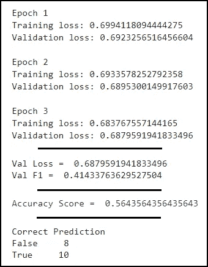
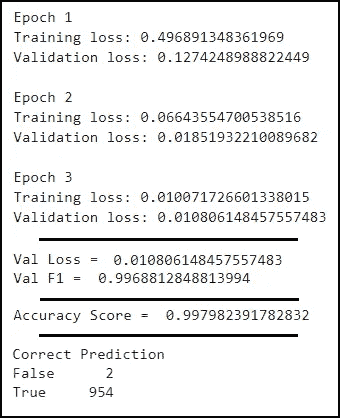

# 如何使用转换器和迁移学习对扩充数据进行情感分析——第 2 部分

> 原文：<https://towardsdatascience.com/how-to-do-sentiment-analysis-with-augmented-data-using-transformers-transfer-learning-part-2-70fbf70a6137?source=collection_archive---------21----------------------->

## 关于如何执行 NLP 的两部分系列的最后一部分——用很少或没有标记的数据进行情感分析。


伊莱恩·卡萨普在 [Unsplash](https://unsplash.com?utm_source=medium&utm_medium=referral) 上的照片

这是无可争议的。我们生活在一个数据的世界里。自从互联网普及以来，数据呈指数级增长，根据福布斯的数据，世界上 90%的数据是在 2016 年至 2018 年之间产生的，这意味着，从人类历史的黎明到 2016 年，所有之前产生的数据只占据了另外 10%的份额。今天，这个数字少了很多。

我相信数据是知识的燃料。今天数据无处不在。

然而，挑战在于理解它。每天有近 50 亿个 YouTube 视频被观看，每天有 5 亿条推文在 Twitter 上发布。随着社交媒体平台和在线新闻网站的兴起，获取事实、想法、观点和错误信息比以往任何时候都更容易。然而有一个阻碍，那里的数据是杂乱的，非结构化的，有时甚至是完全错误的。我们如何以一种有意义的方式利用这些信息的力量？在这篇文章中，我们将看看一种方法做到这一点。

在[上一节](https://medium.com/p/87a838cd0baa)中，我们对一小部分金融文章进行了数据扩充。这产生了一个新的数据集，它比原来的源大 50 多倍，大到足以继续我们的下一步工作:**情感分析**。

情感分析是*自然语言处理* ( ***NLP*** )的一种形式，它识别和量化文本数据情感状态以及其中的主题、人物和实体的主观信息。传统上使用诸如朴素贝叶斯或支持向量机的算法来执行。这在历史上也是一项受监督的任务，使用标记的数据集来训练算法，需要人工仔细选择、分类和标记的大型数据集。

今天，共识是明确的，深度学习方法在大多数 NLP 任务上比其他方法实现了更好的准确性。现在，NLP 中无可争议的王者是被称为变形金刚的大型预训练模型。他们的体系结构旨在解决序列到序列的任务，同时处理长范围的输入和输出依赖，并注意重复。

变形金刚的特别之处不仅在于大多数变形金刚都经过了大量数据的训练，并且经过了高度优化，即使在使用现成的变形金刚时也非常有用，还在于它们可以很容易地进行微调，即使在很少或没有数据的情况下也能表现出色。

**精细** - **深度学习中的调整**涉及使用先前模型的权重来训练另一个类似的**深度学习**过程，以实现期望的输出或增强目标任务的性能。在这个练习中，我选择了来自 Transformers 或简单的 **BERT 的模型双向编码器表示。**

**Bert** 是一个“双向”半监督模型。这意味着 BERT 在训练阶段从令牌上下文(小文本单元)的左侧和右侧学习信息，并使用从具有 8 亿单词的'[图书语料库](https://en.wikipedia.org/w/index.php?title=BooksCorpus&action=edit&redlink=1)和具有 2500 万单词的[英语维基百科](https://en.wikipedia.org/wiki/English_Wikipedia)中提取的未标记数据对其进行预训练。Bert 通过预测屏蔽词来工作，特别是通过引导和跟随单词的特定短语的词。

我喜欢做的第一件事是将我的超参数设置为常量，这将使我的工作容易得多，因为我需要对代码进行的所有更改都在一个地方。

```
MODEL_NAME = 'bert-based-cased'
BATCH_SIZE = 125
LR = 1e-4
MAX_LEN = 100
EPOCHS = 10
LABEL_NUM = 2
device = 'cuda'  # use gpu if no graphics card found
```

这里的超参数定义为:

*   ' MODEL_NAME' —这是 Transformers 用来下载我们将使用的模型的参数
*   ‘BATCH _ SIZE’—是将通过网络传播的样本数
*   LR——控制模型学习的速度
*   ' MAX_LEN' —是我们将输入模型的序列的最大长度。
*   “时期”—是模型将通过数据集的周期数
*   ‘LABEL _ NUM’—我们正在寻找的类的数量
*   ‘设备’—如果您可以访问图形卡，请使用‘cuda ’,否则请使用‘GPU’

在我们训练模型之前，我们需要做一些内务处理工作。首先，我们将在数据中对标记的类进行编码，然后将数据分成训练、测试和验证部分。训练和验证将用于训练和监控我们的模型，而测试将用于衡量模型完成训练后的预测性能。

大多数标记器对于一个模型是唯一的，当试图在 Bert 上执行强化学习时，我们必须使用它自己的标记器，明显地命名为**bertokenizer。**

然后，标记化的数据被打包到所谓的**数据加载器**中。DataLoader 是一个可迭代的容器，用于批量向模型提供数据。训练和验证数据都需要在数据加载器中，以便模型能够高效地学习和验证自身。为了构造它们，我构建了一个助手函数，它将接受一个数据输入并返回一个 DataLoader 容器。

一旦构建了数据加载器，我们就可以继续训练模型了。对于我们的优化器，我们选择 Adam，每个时期的步骤数将通过数据加载器中的元素数乘以时期数来计算。

我们将添加一个调度器，每当一个批处理被提供给模型时，这个调度器就会被调用。我们还通过使用 PyTorch 的*‘nn . utils . clip _ grad _ norm’将渐变从模型中裁剪掉，避免了渐变爆炸(当许多渐变连接成一个矢量时)。*

在每次迭代中，模型将从我们的数据中学习并计算其损失分数，如果一切正确，损失分数将继续降低，直到模型训练完成。

随后，我们将编写代码的验证部分。一旦完成，它将返回每个数据加载器批次的平均损失、预测和数据的真实值。

我们将使用预测值和实际值来计算 F1 分数。F1 将精确度和召回率结合起来，得出给定数据集上的模型精确度。

接下来我们将训练两个模型。一个使用原始数据，另一个使用本系列第一部分创建的扩充数据集。我们将计算它们各自的准确性和 F1 分数，最后根据看不见的数据测试这两个模型，看看它们的表现如何。

在小型/原始数据源上训练的模型的结果如下:



根据原始数据训练的模型的输出

到第三个时期，我们的训练或验证损失都没有低于 0.6。这个糟糕的分数告诉我们，该模型没有足够的数据来学习和归纳。F1 分数没有达到 0.5，并且差的准确性反映在模型不能准确预测几乎所有的新样本上。

然而，在扩充数据集上训练的模型的结果描绘了更好的画面:



根据扩充数据训练的模型的输出

到最后一个时期，我们的训练和验证损失都很低，彼此非常接近。F1 得分达到 0.99，准确性得分也是如此。然后，该模型被用于预测来自看不见的文章的值，并且能够在 99%的时间内正确预测实际情绪。

正如您所看到的，在扩充数据集上训练的模型非常适合识别我们的测试数据，因此我们可以得出结论，它已经被调整得足够好，可以对金融数据进行良好的情感分析。

## 结论:

在这个由两部分组成的系列文章中，我们介绍了在缺乏大量标签数据的情况下，使用 transformers 进行数据扩充和强化学习如何帮助我们创建最先进的分类模型。

如果你错过了它，并且你是一个好奇的人，想知道如何从头开始做数据扩充，点击[这里](https://medium.com/p/87a838cd0baa/edit)跳到这个系列的第一部分: [*使用变形金刚&同义词替换情感分析*](https://medium.com/p/87a838cd0baa/edit) 扩充你的小数据集

## 来源:

*   福布斯:[我们每天创造多少数据？每个人都应该阅读的令人兴奋的统计数据](https://www.forbes.com/sites/bernardmarr/2018/05/21/how-much-data-do-we-create-every-day-the-mind-blowing-stats-everyone-should-read/?sh=48e5381860ba)
*   SeedScientific: [每天产生多少数据？27 惊人的统计数据](https://seedscientific.com/how-much-data-is-created-every-day/)
*   我的回购:[https://github.com/cmazzoni87/ComputerVisionRegression](https://github.com/cmazzoni87/SentimentAnalysis)
*   伯特变形金刚文档:[https://huggingface.co/transformers/model_doc/bert.html](https://huggingface.co/transformers/model_doc/bert.html)