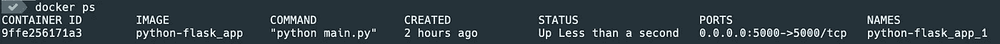

# 如何对接现有的 Flask 应用程序

> 原文：<https://towardsdatascience.com/how-to-dockerize-an-existing-flask-application-115408463e1c?source=collection_archive---------8----------------------->

## 轻松运行烧瓶应用程序


图为[迪安·普](https://unsplash.com/@wezlar11?utm_source=medium&utm_medium=referral)在 [Unsplash](https://unsplash.com?utm_source=medium&utm_medium=referral)

在这篇文章中，我将解释如何对现有的 [Flask](https://flask.palletsprojects.com/en/1.1.x/) 应用程序进行 Dockerize。我将使用我的一个 Python [项目](https://github.com/lifeparticle/python-flask)进行演示。通过使用 Dockerized Flask 应用程序，其他开发人员可以轻松地运行该项目，而无需任何环境管理，这对于节省时间和精力来说非常重要。而且，开发者可以专注于开发。如果你是 Docker 的新手，那么阅读下面的帖子，我在那里介绍了一些基础知识。

[](/how-to-mount-a-directory-inside-a-docker-container-4cee379c298b) [## 如何在 Docker 容器中挂载目录

### 专注于编写代码，无需担心环境管理

towardsdatascience.com](/how-to-mount-a-directory-inside-a-docker-container-4cee379c298b) 

# 设置

首先，你需要安装 [Docker](https://docs.docker.com/engine/install/) 并从 [GitHub](https://github.com/lifeparticle/python-flask) 下载一个 git 库。对于这个设置，我使用的是 macOS。

现在，我将创建一个 Docker 映像，它包含 Python 和 web 应用程序框架 Flask 作为依赖项。让我们分解一下 [**Dockerfile**](https://github.com/lifeparticle/python-flask/blob/main/Dockerfile) 文件的各个成分。

```
FROM python:3.9.1

ADD . /python-flask
WORKDIR /python-flask
RUN pip install -r requirements.txt
```

为了定义父图像，我们需要使用`From`命令。这里我们使用的是 Docker Hub 上预建的官方图片 [Python](https://hub.docker.com/_/python) 。要将当前文件夹中的所有内容添加到图像中名为 **python-flask** 的目录中，我们需要使用`ADD`命令。之后，我们将使用`WORKDIR`命令将工作目录设置为 **python-flask** 。最后，使用 pip，我们将安装应用程序的依赖项:Flask。

现在，我将创建一个 Docker 合成文件，使用我们刚刚创建的 Docker 映像运行 Docker 容器。下面我们来分解一下[**docker-compose . yml**](https://github.com/lifeparticle/python-flask/blob/main/docker-compose.yml)文件的各个成分。

```
version: "3.8"
services:
  app:
    build: .
    command: python main.py
    ports:
      - "5000:5000"
    volumes:
      - .:/python-flask
```

在 **docker-compose.yml** 文件中，我们有 version、services、app、build、command、ports 和 volumes 标签。**版本**标签用于定义合成文件格式。查看[文档](https://docs.docker.com/compose/compose-file/)了解更多信息。 **services** 标签用于定义我们希望应用程序使用的服务。对于我们的应用程序，我们只有一个名为 **app** 的服务。 **build** 命令将使用我们之前创建的 Docker 文件构建我们的 Docker 映像。**命令**标签用于运行 main.py 文件。端口标签用于定义主机和容器端口。它将主机上的端口 5000 映射到容器上的端口 5000。因为默认情况下，Flask 运行在端口 5000 上。最后， **volumes** 标签用于将文件夹从主机挂载到容器。

现在我们将从 **docker-compose.yml** 文件所在的同一个目录运行下面的命令。`docker compose up`命令将启动并运行整个应用程序。

```
docker compose up
```

恭喜你！我们现在正在 Docker 容器中成功运行 Flask 应用程序。现在，您可以通过访问 URL[http://localhost:5000/](http://localhost:5000/)通过您最喜欢的 web 浏览器访问 Flask 应用程序。

现在运行`docker ps`来查看所有正在运行的容器。这里，我有一个。



docker ps

最后，我们来分解一下 [**main.py**](https://github.com/lifeparticle/python-flask/blob/main/main.py) 文件的个别成分。

```
from flask import Flask
app = Flask(__name__)

@app.route('/')
def hello_world():
 return 'Hello World'

if __name__ == '__main__':
 app.run(host="0.0.0.0", debug=True)
```

首先，我们导入 Flask 类，然后创建该类的一个实例。之后，使用`route()` decorator，我们告诉 Flask 基于 URL 触发`hello_world()`函数。最后，我们有代码的入口点，在这里我们使用`run()`方法运行 Flask 应用程序。第一个参数是`host=”0.0.0.0"`，它使应用程序在所有公共 IP 上都可用。第二个参数是`debug=True`将启用调试模式。你可以从[这里](https://flask.palletsprojects.com/en/1.1.x/quickstart/#debug-mode)阅读更多关于 Flask 应用和调试的[这里](https://flask.palletsprojects.com/en/1.1.x/quickstart/#a-minimal-application)。

现在你知道了如何在 Docker 容器中运行 Flask 应用程序。我希望这能帮助你开始使用 Flask 和 Docker。编码快乐！

# 相关帖子

[](/how-to-run-a-python-script-using-a-docker-container-ea248e618e32) [## 如何使用 Docker 容器运行 Python 脚本

### 轻松运行 Python

towardsdatascience.com](/how-to-run-a-python-script-using-a-docker-container-ea248e618e32)