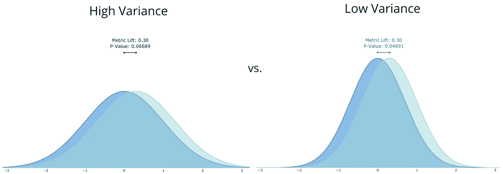
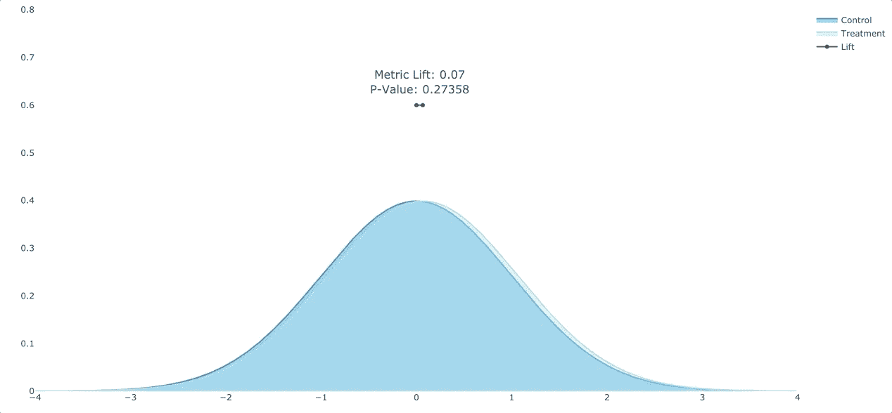
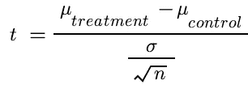
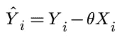
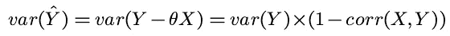
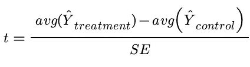

# 如何用 CUPED 使 A/B 测试速度加倍

> 原文：<https://towardsdatascience.com/how-to-double-a-b-testing-speed-with-cuped-f80460825a90?source=collection_archive---------3----------------------->

## 微软的方差缩减正在成为行业标准。

使用已有数据的受控实验(CUPED)是由[微软在 2013 年](https://exp-platform.com/Documents/2013-02-CUPED-ImprovingSensitivityOfControlledExperiments.pdf)创造的一种方差缩减技术。从那以后，它已经在 Booking.com 的、、 [BBC](https://medium.com/bbc-data-science/increasing-experiment-sensitivity-through-pre-experiment-variance-reduction-166d7d00d8fd) 等许多地方实施。

简而言之，CUPED 使用实验前的数据来控制实验中北极星度量的自然变化。通过去除自然变异，我们可以进行需要较小样本量的统计测试。CUPED 可以添加到几乎任何 A/B 测试框架中；它的计算效率很高，编码也相当简单。

最后，它的发音是*库伊-PED* 。



# 技术 TLDR

**1)选择一个预实验协变量( *X* )。**协变量应与实验的北极星度量( *Y* )高度相关，且不应受实验处理的影响。通常，最佳协变量是实验期之前的北极星度量。

**2)计算每个实验条件下的 CUPED 调整度量(*ŷ*)。**因此，我们不用公制平均值( *Y* )来计算升力，而是用经过顶部调整的公制:*ŷ*。

```
Y_HAT = avg(Y) - (cov(X,Y)/var(X)) * avg(X)
```

3)计算每个实验条件的 CUPED 调整方差。

```
VAR_Y_HAT = var(Y) * (1 - corr(X,Y))
```

使用 CUPED 调整后的指标。在下一节中，我们将在 t-test 中使用 CUPED 调整的指标。

# 但是，CUPED 实际上是如何工作的呢？

好的，让我们踩一下刹车，试着理解发生了什么。



在进行经典 A/B 测试时，有 3 个因素会影响我们确定统计显著性的能力:样本大小( *n* )、标准差( *σ* )和提升量(*δ*)，也就是处理均值和控制均值之间的差异。



如果我们希望找到最极端的 t 统计量，我们的目标是增加 *n* 和*δ*，同时减少 *σ* 。不幸的是，这些值通常被认为是固定的；我们在实验开始时确定样本量，并祈祷治疗是有效的，从而有很大的提升。

另一方面，标准差是我们选择的北极星度量的一个特征。太好了，那么把高方差指标换成低方差指标？这可能行得通，但 CUPED 提供了另一种选择。通过使用实验之前的数据，CUPED 能够控制我们的度量固有的变化并消除它。

微软的团队确定了两种利用蒙特卡罗抽样概念来减少方差的方法。这是两者的关键点:**任何预实验数据都是独立于实验的，因此可以用来减少方差。**我们知道这是真的，因为当我们将用户随机分为对照组和治疗组时，我们可以假设两个实验组具有相同的特征，即所有混杂变量在这些组之间均匀分布。

因此，因为我们可以选择任何不受治疗系统影响的协变量，我们将理想地找到最小化 *Y* 方差的协变量。不出所料，通常这个协变量就在实验之前的 *Y* 。

## **计算调整后的度量值和方差**

好了，现在我们有了一些背景，让我们来了解如何计算 CUPED。



CUPED 调整的度量公式

对于每个治疗中的每个用户，我们将计算他们的 CUPED 调整值，其中…

*   *ŷi(y 形帽)*是 CUPED 调整的度量，
*   *易*是北极星的公制、
*   *θ (theta)* 为常数，值为 *cov(X，Y)/var(X)，*其中 *X* 和 *Y* 对应给定处理中的所有用户，
*   *Xi* 是反，而
*   *i* 是给定用户对应的下标。

就是这样。很简单，对吧？

你可能会注意到，这个方程看起来很像线性回归。事实证明，我们实际上在做普通最小二乘(OLS)回归同样的事情； *θ* 的最优值为与 OLS 回归系数相同: *cov(X，Y)/var(X)* 。

在做了更多的工作后，我们确定…



你明白为什么 *X* 和 *Y* 之间的高相关性会导致方差的最大减少吗？

现在我们已经有了 CUPED 调整的指标和该指标的方差，我们可以运行 t-test，并有望观察到更小的 p 值。如果你是手工计算，注意分母必须考虑到我们的处理和控制有不同的方差。这并不是一个糟糕的计算——只需点击[此链接](https://www.statsdirect.co.uk/help/parametric_methods/utt.htm)获取完整的公式。



**最后一点:缺失数据**

CUPED 工作得很好，直到我们没有用户的预实验数据。例如，我们可以对以前从未访问过我们网站的新用户进行实验。在这种情况下，我们实施最简单的解决方案，只对这些用户使用未调整的指标。现在，如果您的所有用户都是第一次使用，您可能希望选择不同的预实验 *X* ，但这取决于您。

# 实施说明(Microsoft 2013)

*   一般来说，最佳的预实验窗口是 1-2 周。较短的窗口不能捕获足够的方差，而较长的窗口会捕获噪声。
*   对于更长的实验，需要更长的预实验窗口，以确保在实验期间和实验之前观察到相同的用户。
*   CUPED 性能高度依赖于度量；在用户群体中具有高方差的度量将表现良好。
*   确保你的协变量 *X* 在治疗和控制之间均匀分布。如果它受到治疗的系统性影响，CUPED 就无效了。
*   上面的 CUPED 方法仅移除可以线性解释的方差。非线性方法将在以后的文章中讨论。

*查看评论中这篇论文和其他资源的链接。*