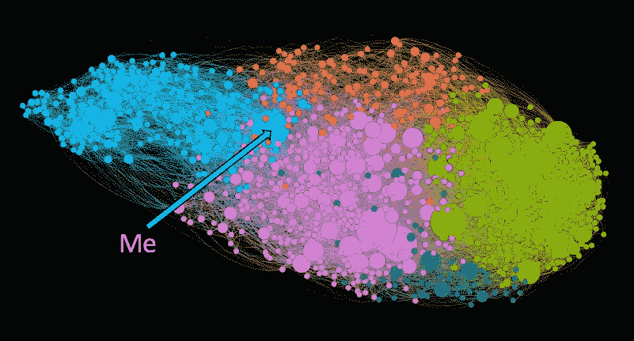
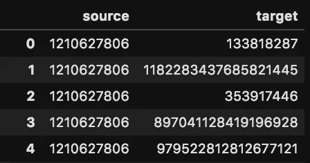
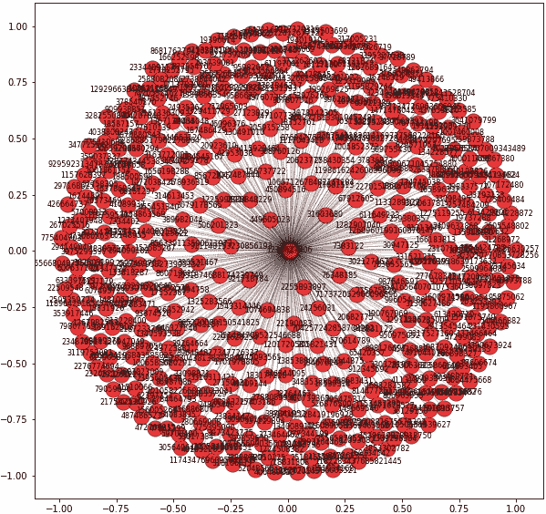
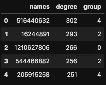
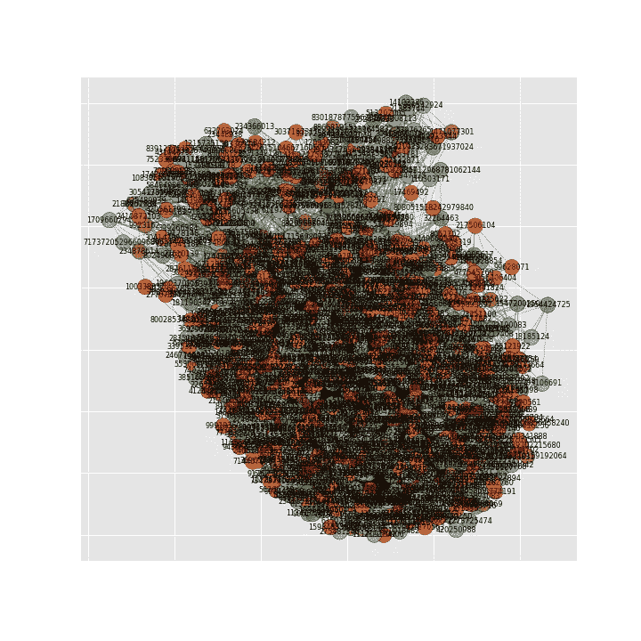

# 如何下载和可视化你的 Twitter 网络

> 原文：<https://towardsdatascience.com/how-to-download-and-visualize-your-twitter-network-f009dbbf107b?source=collection_archive---------4----------------------->



## 使用社交网络分析、Twitter API、Python 和 Gephi 来下载、分析和可视化您的 Twitter 网络

社会网络分析(SNA)本身是一个非常有趣的研究领域，也是数据科学家应用于其他领域的有用技能。在本教程中，我们将使用 Python 包 [Tweepy](https://www.tweepy.org/) 从 Twitter API 下载 Twitter 数据，并使用另一个 Python 包 [NetworkX](https://networkx.org/) 从这些数据中构建一个网络并运行一些分析。最后，我们将使用 [Gephi](https://gephi.org/) 来可视化网络。

# 什么是 SNA？

根据维基百科，

> **“社会网络分析** ( **SNA** )是通过使用[网络](https://en.wikipedia.org/wiki/Network_theory)和[图论](https://en.wikipedia.org/wiki/Graph_theory)调查社会结构的过程。它根据*节点*(网络中的个体行动者、人或事物)和*纽带*、*边*或*链接*(关系或互动)来描述网络结构。”

根据维基百科，它已经进入了几乎每一个领域:

> “社会网络分析已经成为现代社会学的一项关键技术。它在人类学、生物学、人口学、传播学、经济学、地理学、历史学、信息科学、组织学、政治学、公共卫生、社会心理学、发展研究、社会语言学和计算机科学等领域也获得了大量的追随者，并且现在作为一种消费工具已很普遍(见 SNA 软件清单)。”

# 计划本教程

1.  使用 Tweepy 为我的所有关注者和(大部分)他们的关注者收集 Twitter 信息
2.  从所有这些连接中创建一个熊猫数据框架
3.  使用 NetworkX 从这些数据中提取网络，并运行一些基本的网络分析
4.  在 Gephi 中可视化网络

Twitter 提供了一个免费的 REST API 来实时传输数据和下载历史数据。Jaime Zornoza 写了一些很棒的关于使用 API 进行[流](https://medium.com/@jaimezornoza/downloading-data-from-twitter-using-the-streaming-api-3ac6766ba96c)和[下载](/downloading-data-from-twitter-using-the-rest-api-24becf413875)数据的教程，所以如果你想开始使用 API，我建议你先浏览一下。

首先，我们将使用我的个人 Twitter 帐户(@ stevehedden)建立一个网络。为此，我们将从我的所有关注者(大约 450 人)的列表开始。然后我们会得到这 450 个账户的所有关注者。为了节省时间，对于粉丝超过 5000 的账号，我只会刮他们的前 5000 个粉丝。

首先，我们需要导入 Tweepy 和 pandas 包。

```
import tweepy
import pandas as pd
```

然后我们需要输入我们的 Twitter API 凭证。如果你还没有这些，你需要去[https://apps.twitter.com/](https://apps.twitter.com/)然后“创建一个应用”。创建应用程序后，请转到“密钥和令牌”获取令牌。

```
consumer_key = 'XXXXXXXXXXXXX'
consumer_secret = 'XXXXXXXXXXXXX'
access_token = 'XXXXXXXXXXXXX'
access_token_secret = 'XXXXXXXXXXXXX'
```

通过 Tweepy，我们可以使用这些凭证连接到 Twitter API 并开始下载数据。下面的代码只是使用上面输入的凭证来连接到 API。因为我们将要下载相当大的数据集，所以在初始化 API 时指定一些参数是很重要的。我们将“等待速率限制”和“等待速率限制通知”设置为真。从 Twitter 下载数据有速率限制——在给定的时间范围内，你只能向 API 发出有限数量的下载请求。通过将这些参数设置为 True，我们不会在达到这些限制时中断与 API 的连接。相反，我们只要等到超时结束，我们就可以继续下载数据。

```
auth = tweepy.OAuthHandler(consumer_key, consumer_secret)
auth.set_access_token(access_token, access_token_secret)
api = tweepy.API(auth, wait_on_rate_limit=True, wait_on_rate_limit_notify=True, compression=True)
```

为了开始数据下载，我们将从一个单独的用户那里获得所有的追随者。为此，您需要用户的用户 ID。如果您知道用户的屏幕名称，您可以使用下面的代码获得用户的用户 ID。

```
me = api.get_user(screen_name = ‘stevehedden’)
me.id
```

我的用户名是:1210627806

网络由节点(或顶点)和链路(或边)组成。对于这个网络，我们将使用个人用户帐户作为节点，关注者作为链接。因此，我们的目标是创建一个包含两列用户 id 的 edge 数据帧:source 和 target。对于每一行，目标跟随源。首先，我们要将我的所有追随者列为目标。



上面的截图显示了我们想要创建的数据帧的结构。第一列“源”是我的用户 ID (1210627806)，第二列“目标”是我的所有关注者。

下面的代码创建了一个我的 450 个追随者的列表。

```
user_list = ["1210627806"]
follower_list = []
for user in user_list:
    followers = []
    try:
        for page in tweepy.Cursor(api.followers_ids, user_id=user).pages():
            followers.extend(page)
            print(len(followers))
    except tweepy.TweepError:
        print("error")
        continue
    follower_list.append(followers)
```

现在我们有了所有追随者的列表，我们可以将他们放入一个数据帧中。

```
df = pd.DataFrame(columns=['source','target']) #Empty DataFrame
df['target'] = follower_list[0] #Set the list of followers as the target column
df['source'] = 1210627806 #Set my user ID as the source 
```

但这不是一个很有趣的网络。为了可视化这个简单的网络，我们可以使用 NetworkX 包将数据帧转换成图形或网络。

```
import networkx as nx
G = nx.from_pandas_edgelist(df, 'source', 'target') #Turn df into graph
pos = nx.spring_layout(G) #specify layout for visual
```

然后我们使用 matplotlib 绘制图表。

```
import matplotlib.pyplot as plt
f, ax = plt.subplots(figsize=(10, 10))
plt.style.use('ggplot')nodes = nx.draw_networkx_nodes(G, pos,
                               alpha=0.8)
nodes.set_edgecolor('k')
nx.draw_networkx_labels(G, pos, font_size=8)nx.draw_networkx_edges(G, pos, width=1.0, alpha=0.2)
```

上面的代码呈现了下面的视觉效果——不太有趣。



我们真正想要的是获得这 450 个用户的所有关注者。为此，我们将遍历所有这 450 个用户的列表，获取他们的追随者，并将这些链接添加到原始数据帧中。由于速率限制，这段代码需要很长时间才能运行。

```
user_list = list(df['target']) #Use the list of followers we extracted in the code above i.e. my 450 followersfor userID in user_list:
    print(userID)
    followers = []
    follower_list = []

    # fetching the user
    user = api.get_user(userID)

    # fetching the followers_count
    followers_count = user.followers_count

    try:
        for page in tweepy.Cursor(api.followers_ids, user_id=userID).pages():
            followers.extend(page)
            print(len(followers))
            if followers_count >= 5000: #Only take first 5000 followers
                break
    except tweepy.TweepError:
        print("error")
        continue
    follower_list.append(followers)
    temp = pd.DataFrame(columns=['source', 'target'])
    temp['target'] = follower_list[0]
    temp['source'] = userID
    df = df.append(temp)
    df.to_csv("networkOfFollowers.csv")
```

这段代码与上面的代码非常相似，它获取给定用户 ID 的所有关注者。主要的区别是，我们不是只输入一个帐户，而是遍历关注我的所有 450 个帐户。另一个区别是，如果一个账户有超过 5000 个关注者，我们只取前 5000 个关注者。这是因为 API 的工作方式。每个 API 请求将只返回 5000 个帐户。因此，如果我们想要一个拥有一百万追随者的账户的所有追随者，我们需要发出 200 个个人请求。

由于速率限制，我让它运行了一整夜来获取所有数据。它发出 15 个 API 请求，然后必须等待 15 分钟，然后再发出 15 个请求，依此类推。所以可能要花很长时间。

一旦完成运行，您应该有一个包含网络所有边缘的 csv。我把这些都写到一个 csv 文件中，这样如果它在运行时坏了，我仍然可以把所有的边都刮干净。

现在读取 csv，并使用 NetworkX 将 df 转换成图形。

```
df = pd.read_csv(“networkOfFollowers.csv”) #Read into a df
G = nx.from_pandas_edgelist(df, 'source', 'target')
```

一旦数据被转换成图表，我们就可以运行一些基本的网络分析。

```
G.number_of_nodes() #Find the total number of nodes in this graph
```

我的网络中有 716，653 个节点！

我们还可以使用中心性度量来找到网络中最有影响力的节点。最简单的中心性度量是度中心性，它只是每个节点拥有的连接数的函数。以下代码查找每个节点的连接数，即每个节点的度数，并按降序对它们进行排序。

```
G_sorted = pd.DataFrame(sorted(G.degree, key=lambda x: x[1], reverse=True))
G_sorted.columns = [‘nconst’,’degree’]
G_sorted.head()
```

我的网络中度数最高的节点是节点 37728789 或者@ TheSolarCo。索拉科的学位是 5039。这些连接中的 5000 个是我们刮到的这个节点的 5000 个关注者。但这意味着有 39 个额外的联系——意味着索拉可关注 39 个关注我的账户。要获得给定用户 ID 的帐户的用户名，请使用下面的代码，类似于上面我们获得用户 ID 的方式。

```
u = api.get_user(37728789)
u.screen_name
```

因为网络现在非常大(超过 700，000 个节点)，任何分析都将需要很长时间来运行，任何可视化都将是一片混乱。在本教程的其余部分，我们将把网络过滤成更易于管理的节点数。我们使用 NetworkX 的 [k_core 函数](https://networkx.org/documentation/networkx-1.7/reference/generated/networkx.algorithms.core.k_core.html)来实现这一点。k_core 函数过滤掉度数小于给定数字 k 的节点。在本例中，我将 k 设置为 10，这将图中的节点数量减少到大约 1000 个。

```
G_tmp = nx.k_core(G, 10) #Exclude nodes with degree less than 10
```

有了这个小图，我们可以很容易地做一些网络分析。我们首先使用[社区检测算法将图分成组。](https://python-louvain.readthedocs.io/en/latest/api.html)

```
from community import community_louvain
partition = community_louvain.best_partition(G_tmp)#Turn partition into dataframe
partition1 = pd.DataFrame([partition]).T
partition1 = partition1.reset_index()
partition1.columns = ['names','group']
```

现在我们的网络变小了，我们需要再次运行度中心性代码。

```
G_sorted = pd.DataFrame(sorted(G_tmp.degree, key=lambda x: x[1], reverse=True))
G_sorted.columns = ['names','degree']
G_sorted.head()
dc = G_sorted
```

既然我们已经将节点分成组，并且知道了每个节点的度数，我们就将它们组合成一个数据帧。

```
combined = pd.merge(dc,partition1, how='left', left_on="names",right_on="names")
```

现在你的数据帧应该看起来像这样。



现在我们可以使用下面的代码来可视化这个图表。

```
pos = nx.spring_layout(G_tmp)
f, ax = plt.subplots(figsize=(10, 10))
plt.style.use('ggplot')#cc = nx.betweenness_centrality(G2)
nodes = nx.draw_networkx_nodes(G_tmp, pos,
                               cmap=plt.cm.Set1,
                               node_color=combined['group'],
                               alpha=0.8)
nodes.set_edgecolor('k')
nx.draw_networkx_labels(G_tmp, pos, font_size=8)nx.draw_networkx_edges(G_tmp, pos, width=1.0, alpha=0.2)
plt.savefig('twitterFollowers.png')
```

这应该会创建类似这样的图形。



真是一团糟。我肯定有办法使用 matplotlib 使这种视觉效果看起来更好，但在这一点上，我总是只将文件导出为 csv 格式，并使用 Gephi 进行可视化。 [Gephi](https://gephi.org/) 是一款开源的网络分析和可视化软件。你应该可以很容易地从他们的网站上免费安装。它很容易开始，并允许一些真正美丽的可视化。如果你从未用过 Gephi，这里的[是从](https://medium.com/@Luca/guide-analyzing-twitter-networks-with-gephi-0-9-1-2e0220d9097d) [Luca Hammer](https://medium.com/u/f41b88c25359?source=post_page-----f009dbbf107b--------------------------------) 开始入门的好教程。

要使用 Gephi，首先需要将节点列表和边列表导出为 csv 文件。

```
combined = combined.rename(columns={"names": "Id"}) #I've found Gephi really likes when your node column is called 'Id'
edges = nx.to_pandas_edgelist(G_tmp)
nodes = combined['Id']edges.to_csv("edges.csv")
combined.to_csv("nodes.csv")
```

您可以按照我上面提到的 Gephi 教程将这些文件导入到 Gephi 中，并开始可视化您的网络。这是我的样子。


希望你能够没有太多问题地跟上。如果你有问题，或者你觉得我错过了什么，请在下面留下评论，我会回复你的。

祝你好运！