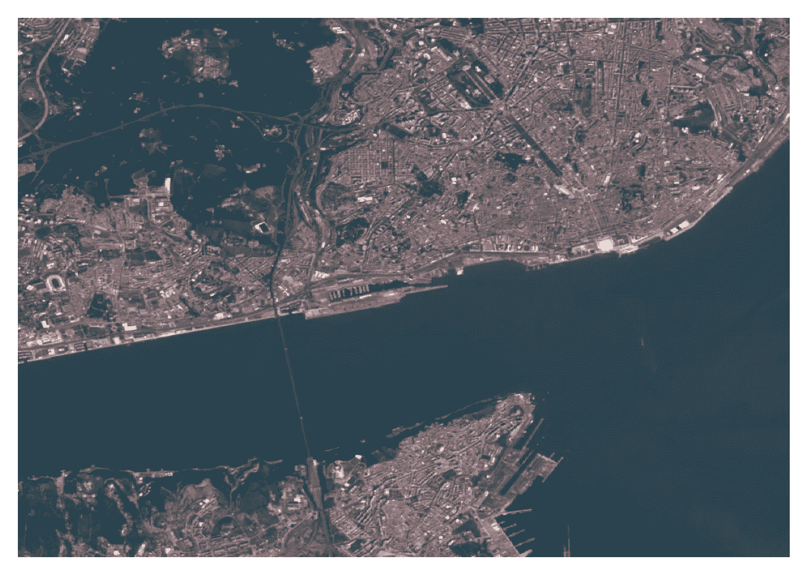

# 如何下载地球上任何地方的高分辨率卫星数据

> 原文：<https://towardsdatascience.com/how-to-download-high-resolution-satellite-data-for-anywhere-on-earth-5e6dddee2803?source=collection_archive---------4----------------------->

## 使用 Google Earth Engine Python API 和 FireHR 实用程序函数，您可以轻松下载地球上任何选定区域的时间序列或无云复合数据。在 Google Colab 上试试吧！

哨兵-2 查看里斯本和特茹河。图片由作者使用从谷歌地球引擎下载的 Sentinel-2 数据制作。

在这个故事中，你将了解到 [**谷歌地球引擎**](https://earthengine.google.com/) ，以及如何轻松下载 [**Sentinel-2**](https://sentinel.esa.int/web/sentinel/missions/sentinel-2) 10 米空间分辨率卫星图像，供地球上任何地方使用。

# 什么是谷歌地球引擎？

根据谷歌地球引擎的[主页面:](https://earthengine.google.com/)

> “Google Earth Engine 将数 Pb 的卫星图像和地理空间数据集目录与行星级分析功能相结合，使科学家、研究人员和开发人员能够检测变化、绘制趋势图并量化地球表面的差异。”

换句话说，这是一项免费提供的服务，它结合了大量的全球数据集，如果没有超级计算机，这些数据集通常是无法处理的。

**Sentinel-2** 数据是一个很好的例子，因为它由多光谱卫星图像组成，空间分辨率高达 10 米，轨道重访周期为 5 天，同时考虑了 Sentinel-2A 和 Sentinel-2B 卫星。

例如，如果您正在研究一个 100 x 100 km 的区域，并且您的数据空间分辨率为 10 米，那么您的图像大小将为 10，000 x 10，000 像素。如果图像未经压缩以 16 位精度存储，则每个通道需要 1，600，000，000 位或 200 MB。如果需要三个通道，就已经有 600 MB 的数据了。现在，假设您想在一年的时间内每 5 天下载一张这样的图像(以获得土地变化的时间序列),您将获得近 45 GB 的数据。记住这只是一个 100 x 100 公里的区域。**谷歌地球引擎**在全球范围内提供这些数据和快速处理能力。

有几种方法可以使用谷歌地球引擎。首先，有一个 [web 编辑器](https://code.earthengine.google.com/)，在这里你可以创建在 google 服务器上运行的脚本，并将结果发送回你的浏览器，结果显示在一个动态地图中(见下图示例)。

谷歌地球引擎网页编辑器的打印屏幕。[https://code.earthengine.google.com/](https://code.earthengine.google.com/)

web 编辑器的一个可能的限制是它要求用户使用 JavaScript。但是仍然有很多例子可以开始。

对 Python 用户来说幸运的是，有一个 [Python API](https://developers.google.com/earth-engine/guides/python_install) 允许地球引擎和 Python 之间的交互。在下一节中，我将展示如何轻松使用 Google Earth Engine 作为预处理和下载 geotiff 格式数据的工具。

# 预处理和下载数据

在这一节中，我将展示如何使用 [**FireHR**](https://github.com/mnpinto/FireHR) 实用函数(在后台使用 Google Earth Engine Python API)轻松下载您选择的任何地区和时间的数据。

FireHR 是我最近开发的一个 Python 库，用于使用 Sentinel-2 数据绘制烧伤区域的地图(你可以在这篇科学论文的[中找到更多细节)。然而，FireHR 包中的`data`模块可以更广泛地用于下载数据，这就是本文的重点！例如，由于一些大小限制，从地球引擎的下载必须在小块中完成。这些图块需要被组合回全尺寸区域。FireHR 代码在幕后完成所有的整理和合并工作。](https://www.mdpi.com/2072-4292/13/9/1608)

我们来看一个例子！

下载选定地区和时间段的最不浑浊图像的 Sentinel-2 中值合成图像的代码示例。Google Colab 上提供的代码。图片由作者提供。

作为示例，上面的代码显示了如何下载 Sentinel-2 数据(第 11 行)的红色、绿色和蓝色波段(第 12 行),该区域由第 5–8 行中定义的边界框坐标界定。本例中选择的区域对应于德国柏林附近正在建设的特斯拉巨型工厂之一的位置。所选的时间间隔从 3 月 1 日开始，到 4 月 25 日结束，因此综合报告将给出截至本文撰写之日的施工进度概况。第 23 行中的`download_data`函数将搜索间隔中所有可用的图像，并计算具有最低云量分数的三幅图像的中值，如设置为值 3 的参数`use_least_cloudy`所定义的。请注意，过滤和合成是在谷歌地球引擎服务器中完成的，因此，这是一个非常快速的过程。**只有最终的合成文件被下载并保存为 GeoTIFF 文件。这节省了大量的处理时间和所需的存储！**

下图显示了前面代码中示例的结果。**你可以跟随** [**这个网址**](https://colab.research.google.com/drive/1CqerpiyWeFty396VZPov_mGe7YBHHlKs?usp=sharing) **在 Google Colab 笔记本上运行。**Colab 笔记本上的代码还具有`download_data_ts`功能，可用于下载选定日期内的所有图像，而不是创建合成图像。

截至 2021 年 3 月/4 月德国柏林附近的特斯拉 Gigafactory 视图。作者使用本笔记本中的[代码创建的图像。](https://colab.research.google.com/drive/1CqerpiyWeFty396VZPov_mGe7YBHHlKs?usp=sharing)

注:有关谷歌地球引擎上可用的 Sentinel-2 数据集的更多信息，请确保查看[目录页](https://developers.google.com/earth-engine/datasets/catalog/COPERNICUS_S2)。您可以在那里找到关于光谱波段和元数据的所有信息。

# 结论

`FireHR` Python 包中提供的代码可以作为通用工具从 Google Earth 引擎下载 Sentinel-2 数据。从其他产品(如 Landsat)下载数据也应该是可能的，但尚未测试。当然，如果你需要为你的应用程序修改的话，你可以在 GitHub 查看 [FireHR 源代码。此外，欢迎](https://github.com/mnpinto/FireHR)[在推特](https://twitter.com/mnpinto_)上关注我，了解更多更新，或者如果你对这个话题有任何疑问！