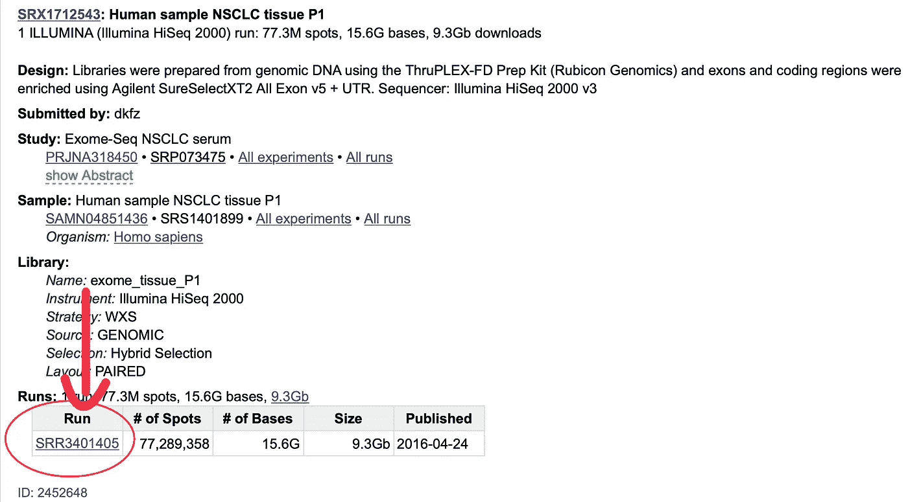

# 如何从 NCBI 的序列读取档案下载 NGS 数据

> 原文：<https://towardsdatascience.com/how-to-download-ngs-data-from-ncbis-sequence-read-archive-ead03908a192?source=collection_archive---------22----------------------->

## [实践教程](https://towardsdatascience.com/tagged/hands-on-tutorials)

## 使用 SRA 工具包从序列读取档案下载 FASTQ 文件的指南


由[马库斯·斯皮斯克](https://unsplash.com/@markusspiske?utm_source=medium&utm_medium=referral)在 [Unsplash](https://unsplash.com?utm_source=medium&utm_medium=referral) 上拍摄的照片

序列读取档案库，简称 SRA，是 NCBI 的数据库，储存了从包括人类在内的任何物种的测序实验中获得的下一代序列 DNA 数据。对于那些不熟悉生物信息学的人来说，可能不清楚如何从这个庞大的资源中获取数据。最有可能的是，你将试图从你刚刚读过的一篇研究文章中获取数据，作者将提供一份数据可用性声明，其中包括一个登录号。本指南假设您已经准备好了登录号。生物信息学软件主要在基于 Unix 的操作系统上运行，这是下载 SRA 数据所需的工具包的情况。你需要一台运行 Linux 或 MacOS 的电脑。本指南专门针对 MacOS，但是 MacOS 和 Linux 的命令基本相同，尽管它们可能需要在操作系统之间做一些小的调整。最后，NGS 数据通常非常庞大，因此您的计算机上需要相当大的可用存储空间。根据数据集来自的物种，对 NGS 数据的全面分析可能会使用 100Gb 以上的内存。不过仅仅下载一个文件应该不超过 50Gb。让我们从下载工作所需的软件开始。

## 下载 SRA 工具包

SRA 工具包包含了我们从 SRA 下载和操作数据所需的所有程序。要下载它，导航到 [NCBI 的 sra-tools GitHub 页面](https://github.com/ncbi/sra-tools/wiki/01.-Downloading-SRA-Toolkit)并下载适合你的操作系统的文件。在下载文件夹中，双击。tar 文件并导航到新创建的文件夹。我们将用于下载 SRA 数据的程序位于 bin 文件夹中。我们需要获得那个 bin 文件夹的路径名，并在命令行中导航到它。为此，请右键单击 bin 文件夹，按住 option 键，然后选择“拷贝“bin”作为路径名”。

现在，打开终端并键入以下命令，通过粘贴先前复制的路径名来替换<path>:</path>

```
cd <path/to/bin>
```

要检查一切是否正常，请运行以下命令:

```
./fastq-dump — stdout SRR390728 | head -n 8
```

您应该得到以下输出:

```
@SRR390728.1 1 length=72CATTCTTCACGTAGTTCTCGAGCCTTGGTTTTCAGCGATGGAGAATGACTTTGACAAGCTGAGAGAAGNTNC+SRR390728.1 1 length=72;;;;;;;;;;;;;;;;;;;;;;;;;;;9;;665142;;;;;;;;;;;;;;;;;;;;;;;;;;;;;96&&&&(@SRR390728.2 2 length=72AAGTAGGTCTCGTCTGTGTTTTCTACGAGCTTGTGTTCCAGCTGACCCACTCCCTGGGTGGGGGGACTGGGT+SRR390728.2 2 length=72;;;;;;;;;;;;;;;;;4;;;;3;393.1+4&&5&&;;;;;;;;;;;;;;;;;;;;;<9;<;;;;;464262
```

我们现在准备下载一些数据。

## 预取数据

我们需要做的第一件事是找到数据的运行号，它不同于研究文章中列出的登录号。要获得运行编号，[导航至 NCBI SRA 网页](https://www.ncbi.nlm.nih.gov/sra)，粘贴您在研究文章中的登录号并进行搜索。从列表中，单击您感兴趣的样品，并在“运行”下，复制以 SRR 开头、后跟 6 或 7 位数字的编号。此页面上有许多不同的登录类型编号，但您必须选择正确的编号，以便在下一步中使用。



作者截图

回到命令行，我们将使用 prefetch 命令下载数据以及与之相关的任何必要文件。要下载数据，请运行以下命令，其中<srr0000000>是您的运行编号。</srr0000000>

```
./prefetch <SRR0000000>
```

该文件将下载到 bin 文件夹中，所以在下载完成后，在进入下一步之前，请检查一下以确保它在那里。根据您的网速和下载文件的大小，下载可能需要一段时间。

## 将 SRA 文件转换为 FASTQ 文件

预取程序将下载一个. sra 文件，这不是一个非常有用的文件格式。我们需要将这个文件转换成 FASTQ 的标准 NGS 文件格式来处理它。我们将使用 fastq-dump 工具来转换数据。有很多选项可以和 fastq-dump 一起使用，但是如果你不确定使用哪一个，你可以暂时忽略它们。split-files 选项可能是最有用的一个选项，它将成对的读操作分成单独的文件。要转换。sra 文件放入。fastq，确保该文件在 bin 文件夹中，并运行以下命令，其中[options]是任何相关的选项，< SRR0000000 >是您的 SRR 号码。sra 文件:

```
./fastq-dump [options] <SRR0000000>
```

## 看看你的数据

最终的 FASTQ 文件将被转储到 bin 文件夹中。根据文件大小，此过程可能需要一段时间。在转换之后，我们可以通过将 head 命令插入 less 命令来可视化文件中的一些碱基。

```
head -10000 <filename> | less
```

现在，您可以继续对 FASTQ 文件进行任何进一步的处理，包括映射到引用和变量分析。