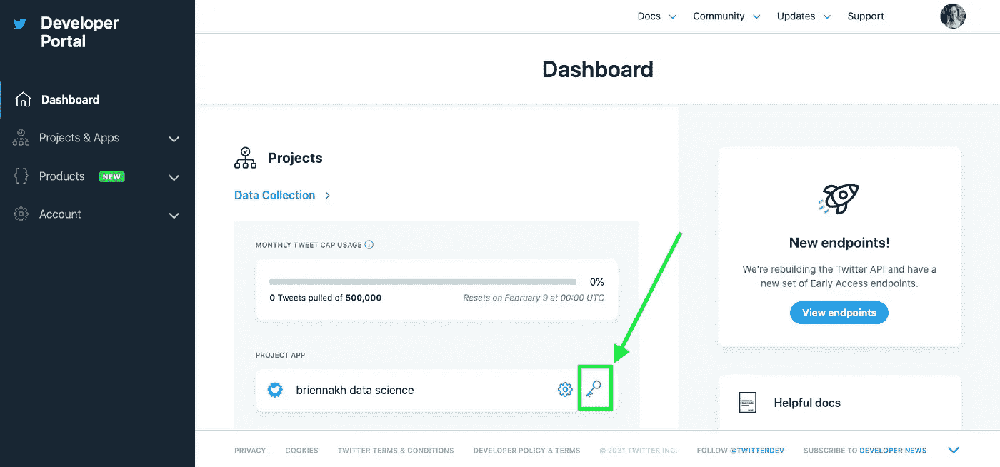

# 如何免费下载推特粉丝或好友

> 原文：<https://towardsdatascience.com/how-to-download-twitter-friends-or-followers-for-free-b9d5ac23812?source=collection_archive---------17----------------------->

## Python 中的简单指南


当你谷歌如何做到这一点，所有这些公司弹出，提供为你做这些，如果你付给他们一小笔费用。但是 Twitter 为你提供了所有你需要的工具，而且是免费的。这个简短的指南将带您浏览一个 Python 脚本，帮助您使用这些工具。

在本指南的最后，您会看到一个脚本，它下载了一个 CSV 文件，其中包含任何公共 Twitter 句柄的所有关注者和/或朋友。该文件还将包含每个人的以下详细信息:

*   用户名
*   用户标识
*   处理
*   位置
*   个人简历
*   全球资源定位器(Uniform Resource Locator)
*   关注者计数
*   朋友很重要
*   创建帐户的日期
*   验证状态

为 [@briennakh](https://twitter.com/@briennakh) 的关注者提供的示例 CSV 文件:


**目录:**

1.  设置您的 Twitter 开发者帐户
2.  生成身份验证令牌
3.  编写 Python 脚本
4.  运行脚本

# 1.设置您的 Twitter 开发者帐户

要使用 Twitter API 下载朋友和/或关注者等大量数据，您需要一个开发人员帐户、一个项目和一个应用程序。如果你已经有了所有这些，你可以跳过这一步。

如果您还没有开发人员帐户，请在此处获取一个:

[](https://developer.twitter.com/en/apply-for-access) [## 申请访问- Twitter 开发者

### 申请准入。Twitter APIs 和工具入门。所有新开发人员必须申请一个开发人员帐户…

developer.twitter.com](https://developer.twitter.com/en/apply-for-access) 

有用的文档:

*   [开发者门户](https://developer.twitter.com/en/docs/developer-portal/overview)
*   [项目](https://developer.twitter.com/en/docs/projects/overview)
*   [App](https://developer.twitter.com/en/docs/apps/overview)

获得批准可能需要一段时间，最多几天或几周。

如果您没有时间等待批准，我很乐意快速为您获取数据。你可以在 UpWork 上找到我:

[](https://www.upwork.com/o/profiles/users/~013c12563e17631b80/) [## 布蕾娜·赫罗尔德

### 我很乐意帮你得到你想要的数据。

www.upwork.com](https://www.upwork.com/o/profiles/users/~013c12563e17631b80/) 

# 2.生成身份验证令牌

一旦您拥有了一个开发人员帐户，您就需要生成身份验证令牌，这将允许您从脚本连接到 API。

在您的[开发者门户](https://developer.twitter.com/en/portal/dashboard)仪表盘中，点击您的应用旁边的钥匙图标:



它会带你到你的应用程序页面。这里，您需要生成或重新生成四条信息:

*   消费者 API 密钥
*   消费者 API 秘密
*   访问令牌
*   访问机密

立即将这些令牌保存到一个名为 **config.ini** 的文件中，因为一旦您查看完这些令牌，您将无法再次查看它们。你必须让他们重生。

您的config.ini 必须是这样的:

```
[TWITTER]
CONSUMER_KEY = YOUR_CONSUMER_KEY_HERE
CONSUMER_SECRET = YOUR_CONSUMER_API_SECRET_HERE
ACCESS_TOKEN = YOUR_ACCESS_TOKEN_HERE
ACCESS_SECRET = YOUR_ACCESS_SECRET_HERE
```

用你的令牌交换掉`YOUR_ETC_HERE` 的所有实例。不要在文件开头和`[TWITTER].`之间留下任何空格

我经常使用 config.ini 文件来避免直接将认证令牌粘贴到我的脚本中，这样可以安全地将脚本公开，因为我的认证令牌现在是隐藏的。

# 3.编写 Python 脚本

为了更容易连接到 Twitter API，我们将使用 Tweepy 包。对于这个包，我们的脚本包含四个步骤:

1.  验证我们的连接。
2.  获取每个关注者或朋友的 Twitter id。
3.  获取每位关注者或朋友的更多详细信息，如他们的用户名、账号和简历。完整的列表可以在本指南的开头找到。
4.  将数据处理成可用的格式。

我们将这个脚本保存为一个名为**download _ friends _ or _ followers . py**的文件，并将其保存到与我们的 **config.ini** 文件相同的目录中。

**目录结构:**

```
twitter-helper-scripts
 |_ config.ini
 |_ download_friends_or_followers.py
```

## 验证我们的连接

我们打开 configs.ini 并读入令牌，然后使用它们来验证我们与 Twitter API 的连接。

```
import configparser
from tweepy import API, Cursor, OAuthHandler, TweepError# Read in configs
configs = configparser.ConfigParser()
configs.read('./config.ini')
keys = configs['TWITTER']
consumer_key = keys['CONSUMER_KEY'] 
consumer_secret = keys['CONSUMER_SECRET'] 
access_token = keys['ACCESS_TOKEN']
access_secret = keys['ACCESS_SECRET']# Authenticate Tweepy connection to Twitter API
auth = OAuthHandler(consumer_key, consumer_secret)
auth.set_access_token(access_token, access_secret)
api = API(auth, wait_on_rate_limit=True, wait_on_rate_limit_notify=True)
```

## 获取每个关注者或朋友的 Twitter id

要获得给定句柄的每个追随者的 id:

```
screen_name = 'briennakh'
ids = []
for fid in Cursor(api.followers_ids, screen_name=screen_name, count=5000).items():
    ids.append(fid)
```

对于朋友来说，这个过程是相同的，除了我们将 API 端点从`api.follower_ids`改为`api.friend_ids`:

```
screen_name = 'briennakh'
ids = []
for fid in Cursor(api.friends_ids, screen_name=screen_name, count=5000).items():
    ids.append(fid)
```

现在我们有了`ids`，它是一个关注者 id 列表，或者一个朋友 id 列表，这取决于我们使用的 API 端点。

## 获取每个关注者或朋友的更多详细信息

除了请求更多我们实际可以使用的数据之外，id 列表几乎没有任何用处。因此，我们将这些 id 提交给负责返回单个用户详细信息的 API 端点`api.lookup_users,` 。

```
info = []
for i in range(0, len(ids), 100):
    try:
        chunk = ids[i:i+100]
        info.extend(api.lookup_users(user_ids=chunk))
    except:
        import traceback
        traceback.print_exc()
        print('Something went wrong, skipping...')
```

这里，我们将`ids`分解成 100 个 id 的块，这是这个 API 端点接受的每个请求的最大块大小。每当一个块完成处理时，我们将返回的用户详细信息保存到扩展这个列表的`info,` 中。

最后，`info` 将为每个关注者或朋友包含一条记录，如下所示:


## 将数据处理成可用的格式

这些记录不容易使用。不同的格式，如 CSV，在以后会更容易使用，所以我们处理这些记录，并将它们下载为 CSV 文件。

```
import pandas as pddata = [x._json for x in info]
df = pd.DataFrame(data)
df = df[['id', 'name', 'screen_name', 'location', 'description', 'url', 'followers_count', 'friends_count', 'created_at', 'verified']]
df.to_csv('followers.csv', index=False)
```


请注意，我没有保留每个关注者或朋友的所有可能的细节。如果您在记录中看到想要添加到 CSV 中的详细信息，您可以编辑代码以包含它。同样，您也可以删除您不想保存的细节。

此外，请记住，如果你是某人的朋友，并且他们也关注你，那么此人将同时出现在关注者列表和朋友列表中。我们的脚本不处理这种类型的后处理。

# 4.运行脚本

您可以将上述代码复制并粘贴到您自己的脚本中，或者您可以在此处找到该脚本的可执行版本:

[](https://github.com/brienna/twitter-helper-scripts) [## brien na/Twitter-助手-脚本

### 为任何公开的 Twitter 账号获得朋友或关注者。

github.com](https://github.com/brienna/twitter-helper-scripts) 

要使用这个脚本，

1.  下载两个文件:**脚本**及其**需求. txt** 。将这两个文件和您的**配置**放在同一个目录中。ini 从上面。在这个目录中应该总共有 3 个文件。
2.  使用命令行，导航到此目录。下载 Python 需求:

    `pip install -r requirements.txt`
3.  运行脚本:

    `python download_friends_or_followers.py -u [user] -t [type]` 对于`[user]`参数，输入您想要获取关注者和/或朋友的 Twitter 句柄。此参数是必需的。

    对于`[type]`参数，输入所需类型:`friends,` `followers`或`both.`此参数不是必需的。默认为`followers.` 例如:

    `python download_friends_or_followers.py -u briennakh -t both`

现在，您应该会看到一个或两个 CSV 文件出现在您的目录中，这取决于您所请求的类型。

如果你想阅读更多我的文章或者探索数以百万计的其他文章，你可以注册成为中级会员

[](https://brienna.medium.com/membership) [## 通过我的推荐链接加入 Medium-briena Herold

### 作为一个媒体会员，你的会员费的一部分会给你阅读的作家，你可以完全接触到每一个故事…

brienna.medium.com](https://brienna.medium.com/membership) 

你也可以订阅我的邮件列表，以便在我发表新文章时得到通知

[](https://brienna.medium.com/subscribe) [## 每当布蕾娜·赫罗尔德发表。

### 每当布蕾娜·赫罗尔德发表。通过注册，您将创建一个中型帐户，如果您还没有…

brienna.medium.com](https://brienna.medium.com/subscribe) 

你可能会对我的其他一些故事感兴趣

[](/how-to-bulk-access-arxiv-full-text-preprints-58026e19e8ef) [## 如何批量获取 arXiv 全文预印本

### 使用 Python3 和 MacOS X 命令行

towardsdatascience.com](/how-to-bulk-access-arxiv-full-text-preprints-58026e19e8ef) [](/collecting-data-from-the-new-york-times-over-any-period-of-time-3e365504004) [## 从《纽约时报》收集任何时期的数据

### Python 中的简单指南

towardsdatascience.com](/collecting-data-from-the-new-york-times-over-any-period-of-time-3e365504004) [](https://medium.com/codex/how-to-detect-code-plagiarism-de147cb4f421) [## 如何检测代码抄袭

### 使用斯坦福苔藓的简短教程

medium.com](https://medium.com/codex/how-to-detect-code-plagiarism-de147cb4f421)