# 如何用线性规划用 Python 画国会选区

> 原文：<https://towardsdatascience.com/how-to-draw-congressional-districts-in-python-with-linear-programming-b1e33c80bc52?source=collection_archive---------29----------------------->

## [实践教程](https://towardsdatascience.com/tagged/hands-on-tutorials)

## 高层对话的模型，不沉溺于细节

由[丹·迈耶斯](https://unsplash.com/@dmey503?utm_source=medium&utm_medium=referral)在 [Unsplash](https://unsplash.com?utm_source=medium&utm_medium=referral) 上拍摄的照片

# 美国国会选区分配如何类似于在线订单？

作为一名建立了许多供应链模型的数据科学家，我理解分配模型是如何有用的。以网上订购产品为例。该产品可能存在于不止一个仓库的库存中，但是该产品很可能从更近的仓库发货。这里的推理与成本有关；短途运输通常花费较少。但是，如果更远的仓库运营成本更低，那么总成本*也会更低。当尽快收到产品有价值时，附近的仓库更有可能处理订单，即使总成本更高。*

类似于仓库如何将大量产品分配给客户，这种国会选区模型将使用线性规划将各县的人口分配给各选区。线性规划是数学建模的一种形式，用于寻找用线性关系表示的问题的最优解。但首先，让我们讨论一下俄勒冈州国会选区的背景——它将被用作例子。假设对美国国会选区有基本的了解。

# 俄勒冈州的国会选区

当我得知俄勒冈州可能在 2020 年美国人口普查后获得一个新的国会选区时，我的好奇心被激起了。皮尤研究中心写了一篇[文章](https://www.pewresearch.org/fact-tank/2018/05/31/u-s-population-keeps-growing-but-house-of-representatives-is-same-size-as-in-taft-era/)可视化了这种可能性，因为俄勒冈州是 2010 年最接近增加一个区的州之一。

划分国会选区很复杂。还有一些相互竞争的要求，如紧凑性和保持政治边界，如县界。尽管研究人员和软件工程师已经开发出优雅的模型来展示[最佳紧凑度](https://bdistricting.com/2010/)或[平衡功率](http://district.cs.brown.edu/)，但这些模型并不维持大多数县和政治的界限。

最大化每个参数的复杂性已被很好地记录。相反，这种模式旨在快速制定解决方案，为对话提供一个良好的起点。关于我的动机的主题，该模型对于阐明如何处理地区数量的变化是最有用的。

大约 50 年前，俄勒冈州的选区数量发生了变化([维基百科](https://en.wikipedia.org/wiki/Oregon's_congressional_districts))，思考一个新的选区会是什么样子很有趣。新地区是否会对地区形状产生重大影响，或者新地区是否会在现有地区没有重大变化的情况下被吸收？我关于未来的问题可以归结为两点。

*   在过去的十年里，人口发生了怎样的变化？
*   国会选区地图将如何重画？

Python 模型将考虑以下国会选区标准:

*   **总体** — 几乎相等或对任何差异的合理推理
*   **邻接** —一个地区的所有部分都与其他部分相连
*   **郡县** — 保留郡县和其他政治边界

在通过线性规划模型发现解决方案之前，让我们更深入地了解一下俄勒冈州的人口。

# 俄勒冈州人口概况

根据关于人口普查分配何时准备就绪的[最新更新](https://2020census.gov/en/important-dates.html)，我们可以预计在 2021 年底左右知道俄勒冈州 2020 年人口普查的结果。因此，目前以下分析和模型基于 2018 年和 2020 年的估计。*2020 年人口普查数据发布后，您可以查看*[*Github*](https://github.com/wpbSabi/python_optimization/tree/main/oregon_districts/towardsDS)*文件进行更新。*

根据 2010 年的人口普查，俄勒冈州最大和最小的地区之间的人口差异约为 1.6%。由于各地区之间人口增长的差异，现在最大的差异接近 5%。

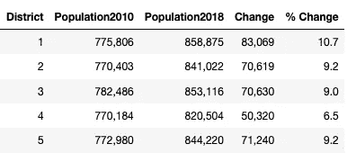

估计人口变化(图片由作者提供)

根据人口标准和俄勒冈州目前的国会选区地图，人们可能会认为俄勒冈州的大部分人口居住在太平洋海岸附近。

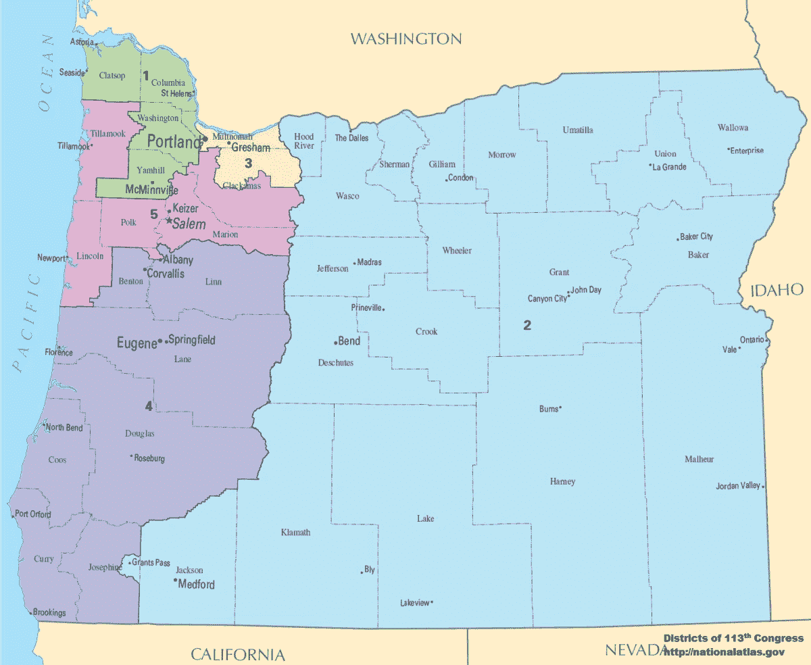

来自 2010 年人口普查的俄勒冈州国会选区地图(内政部-通过维基百科的美国国家地图集)

根据对县人口的进一步调查，俄勒冈州 420 万人口中约有 70%居住在威拉米特河谷。

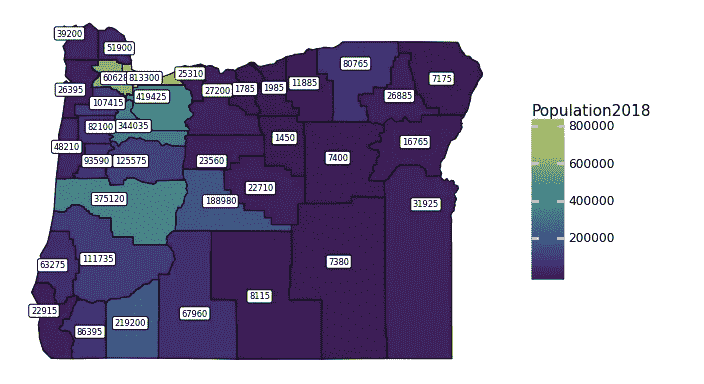

俄勒冈州各县人口* 2018 年估计数(图片由作者提供)

威拉米特河始于尤金附近，向北流动，直到在波特兰与哥伦比亚河汇合。海岸山脉在山谷的西面，而喀斯喀特山脉在山谷的东面。

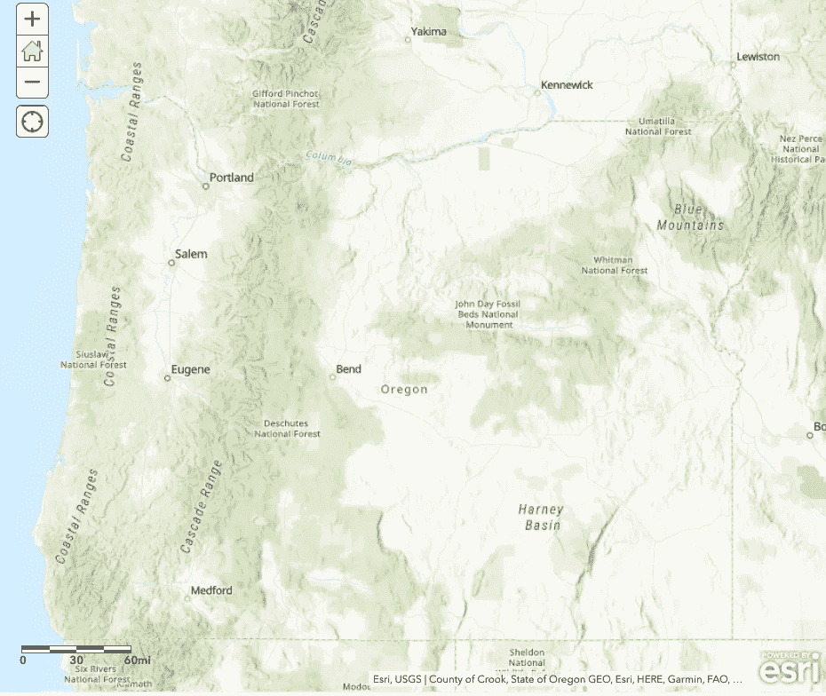

通过 ArcGIS 在线地图 Viewer⁴获取俄勒冈州地形

在上两次人口普查之间，所有五个国会选区都经历了人口增长，而这种增长大部分发生在人口已经最多的县。

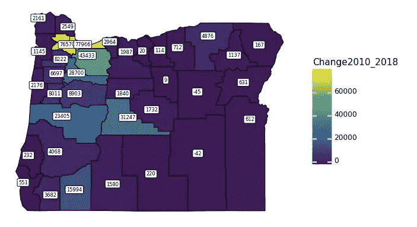

俄勒冈州各县人口变化(图片由作者提供)

# 线性规划优化模型

完整的线性规划模型发布在 [GitHub](https://github.com/wpbSabi/python_optimization/tree/main/oregon_districts/towardsDS) 上，摘录将在此分享。

该模型由一个目标驱动，即在以下约束条件下，将分配给多个区的县的数量最小化:

1.  只有人口超过 220，000 的县才能分配给一个以上的区。这些县可以划给一个或两个区。如果一个县被分配到一个区，那么该县至少有 20%的人口被分配到该区。
2.  所有县至少被分配到一个区。
3.  所有县的人口都被分配到区，这种分配只能在一个县被分配到该区时发生。
4.  分配给一个区的县必须与该区的其他县接壤。
5.  确保每个区只有一个相邻区。*一个* *算法被用来创建这些约束，并被部分利用。对接近可用的解决方案进行小的修改的功能也是可用的，但是没有被利用。*

# 用 Python 建模(纸浆)

首先，导入有用的 Python 模块进行数据建模和可视化。然后导入以下相关数据:

*   各县人口
*   地理县形状
*   在地图上标注县的纬度和经度

使用纸浆语法，制定优化模型。公式化的第一步是设置模型变量。

添加模型约束。对于纸浆，第一个约束总是目标函数。

添加主要约束。

*   **分配和指派**—将所有县的人口分配到各区。
*   **毗邻地区** —例如，库斯县[5]仅与库里县[7]和道格拉斯县[9]接壤。因此，需要将库里县[7]或道格拉斯县[9]分配给包含库斯县[5]的任何区。否则，库斯县[5]将会与该区的其他地方脱节。
*   **地区规模** —每个地区的人口规模限制在 68 万至 73 万之间。基于 2020 年人口估计的最佳规模是每个区 711，000 人。
*   **县拆分** —只有人口超过 220，000 的县可以拆分为两个区，在这种情况下，每个区必须分配至少 20%的人口。

如果两个县之间在地理上有重要的人口中心，下面的附加约束会阻止这两个县被分配到同一个区。这种情况大多发生在相距遥远的县。这些限制因素也降低了各区出现多个集群的可能性，以确保各区相邻。

要查看这些约束的完整集合，请查看发布在 [GitHub](https://github.com/wpbSabi/python_optimization/tree/main/oregon_districts/towardsDS) 上的模型。为简洁起见，这里分享一段摘录，防止俄勒冈州东部的贝克县与俄勒冈州西部的县划入同一个区。

调用算法求解模型并显示求解器状态。在这种情况下，将使用 GLPK 求解器。 [GLPK 解算器](https://www.gnu.org/software/glpk/)需要安装，可与 pip 一起安装，但默认的 [CBC 解算器](https://projects.coin-or.org/Cbc)也可以工作，具体取决于模型和/或解算器参数。

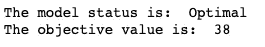

求解器状态(按作者排序的图像)

因为模型状态是最优的，而不是不可行的或另一种状态。俄勒冈州有 36 个县，目标的下限是 36 个。但是，客观值 38 意味着有两种情况，一个县被分配给两个区。

以下块处理来自求解器变量的数据并创建地图。

我们可以看到，Multnomah 县和 Klamath 县已被分配到多个区，因为这些县都是灰色的。

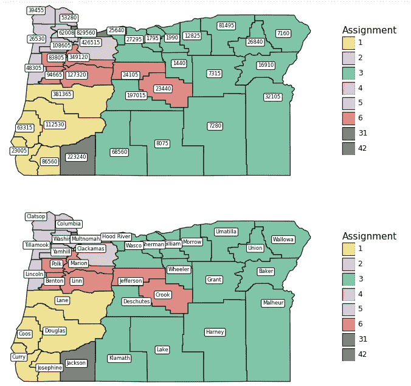

按人口和县划分的俄勒冈州选区(图片由作者提供)

这一解决方案表明，俄勒冈西南部和东部的两个现有地区将保留。俄勒冈州西北部目前的其他三个区将稍作修改，以允许第四个区转向人口稠密的地区。

以下显示了熊猫数据框架，按地区总结了熊猫数量，并回顾了灰色县的分配情况。

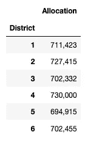

地区分配摘要(图片由作者提供)

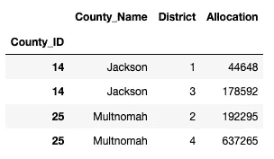

拥有多个地区分配的县(图片由作者提供)

# 其他解决方案

这是在迭代过程中生成的另外两个解决方案图。

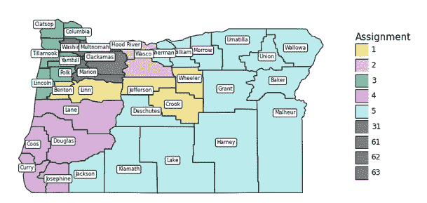

波特兰地铁的更多变化(图片由作者提供)

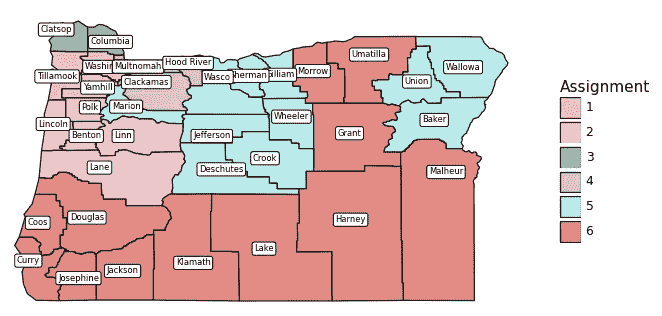

需要轻微修改的替代解决方案(图片由作者提供)

# 反射

这个模型在不到 10 分钟的时间内就被解决了，而且对于一个关于新区应该建在哪里的讨论来说，结果是令人满意的。尽管各区之间的人口差异比最终的实现要大，但是微调是繁琐的，超出了本文的范围。

回想起来，我意识到解决这个问题的复杂性。研究这个模型帮助我欣赏了国会选区划分的研究。有多种解决问题的方法，但是组合太多的方法会使问题变得不可行。也就是说，不存在满足所有期望约束的解决方案。

即使在试图简化复杂的国会选区模型以进行高层对话时，也有许多方法来构建该模型。由于*高层对话*并不适用一个模型比另一个更好的评估标准，我在这里分享了运行最快的模型。

我考虑或测试的几个建模选项特别值得注意:

1.  也许我在最终模型中没有包括的最好的修改是修改邻接约束，以强制大多数县在其辖区内与多个其他县接壤。虽然该约束对于更快地找到合理的解决方案很有效，但是当收紧模型限制时，该约束不能与现有的约束很好地结合。然而，如果为其他状态(即，具有不同的数据)公式化该模型，对邻接约束的这种修改可能是有用的。
2.  有可能创建一个目标函数来最小化到达每个地区的平均位置的距离。然而，对于求解器来说，该目标在计算上是复杂的，从而破坏了该模型快速运行的目标。

该建模练习的目的是开发一个可用于国会选区高层对话的模型。有趣的是，即使在俄勒冈州增加了一个额外的区，原来的五个区的形状可以说没有明显的变化。其他州的情况会是这样吗？

如果你喜欢这篇文章，并且想读(写)更多这样的文章，请考虑使用我的推荐链接成为中等会员:【https://sabolch-horvat.medium.com/membership 

*请注意，俄勒冈州的模型将在 2020 年人口普查结果可用时更新。该数据将可能在 2021 年* *年底* [*发布。届时将有一篇专门关注俄勒冈州的新文章链接到这里。*](https://2020census.gov/en/important-dates.html)

[1]:皮尤研究中心。(2018 年 5 月 31 日)。*美国人口持续增长，但众议院规模与塔夫脱时代相同*[https://www . pewresearch . org/fact-tank/2018/05/31/u-s-population-keep-growing-but-House-of-Representatives-is-same-size-in-Taft-era/](https://www.pewresearch.org/fact-tank/2018/05/31/u-s-population-keeps-growing-but-house-of-representatives-is-same-size-as-in-taft-era/)

[2]:各州立法机关全国会议。(2019 年 4 月 23 日)。*选区划分标准*[https://www . ncsl . org/research/redisting/redisting-Criteria . aspx](https://www.ncsl.org/research/redistricting/redistricting-criteria.aspx)

[3]维基百科。 *O* regon 的*国会选区*[https://en . Wikipedia . org/wiki/Oregon 的 _congressional_districts](https://en.wikipedia.org/wiki/Oregon's_congressional_districts)

[4]:俄勒冈州 ArcGIS Server 服务。 *ArcGIS Online 地图查看器*[https://navigator.state.or.us/arcgis/rest/](https://navigator.state.or.us/arcgis/rest/)

2021–08–21:数据已经发布。Register Guard(俄勒冈州尤金市的一份报纸)有一个很好的按县或州的汇总地图，显示哪些县或州的人口增长比其他县或州快。([https://data . register guard . com/census/total-population/total-population-change/Oregon/040-41/](https://data.registerguard.com/census/total-population/total-population-change/oregon/040-41/))