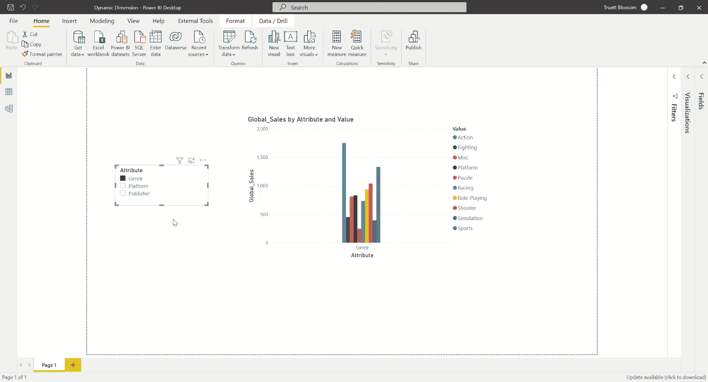
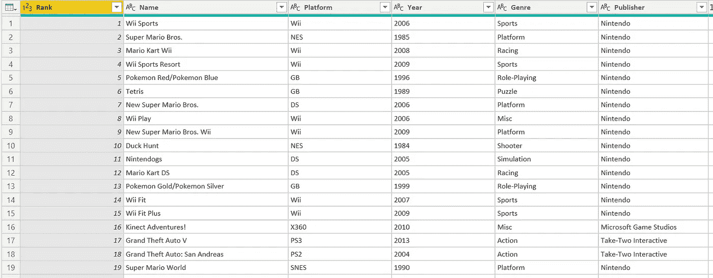
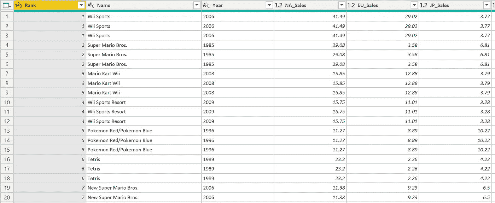
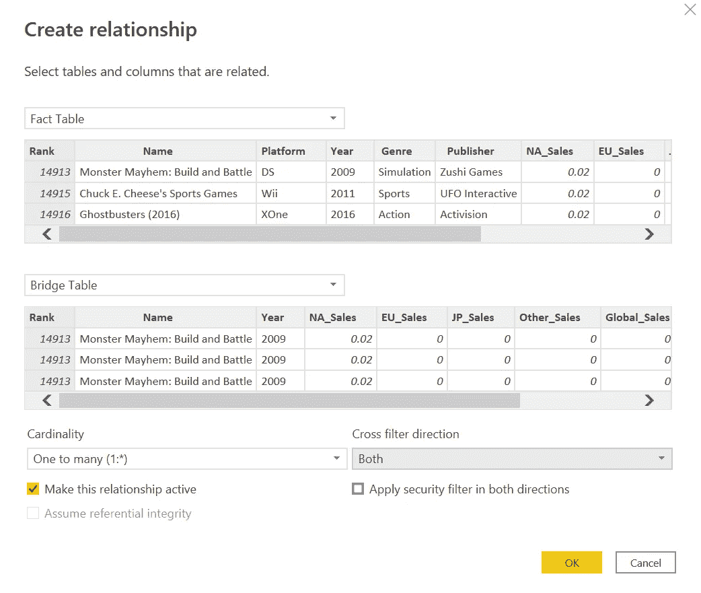
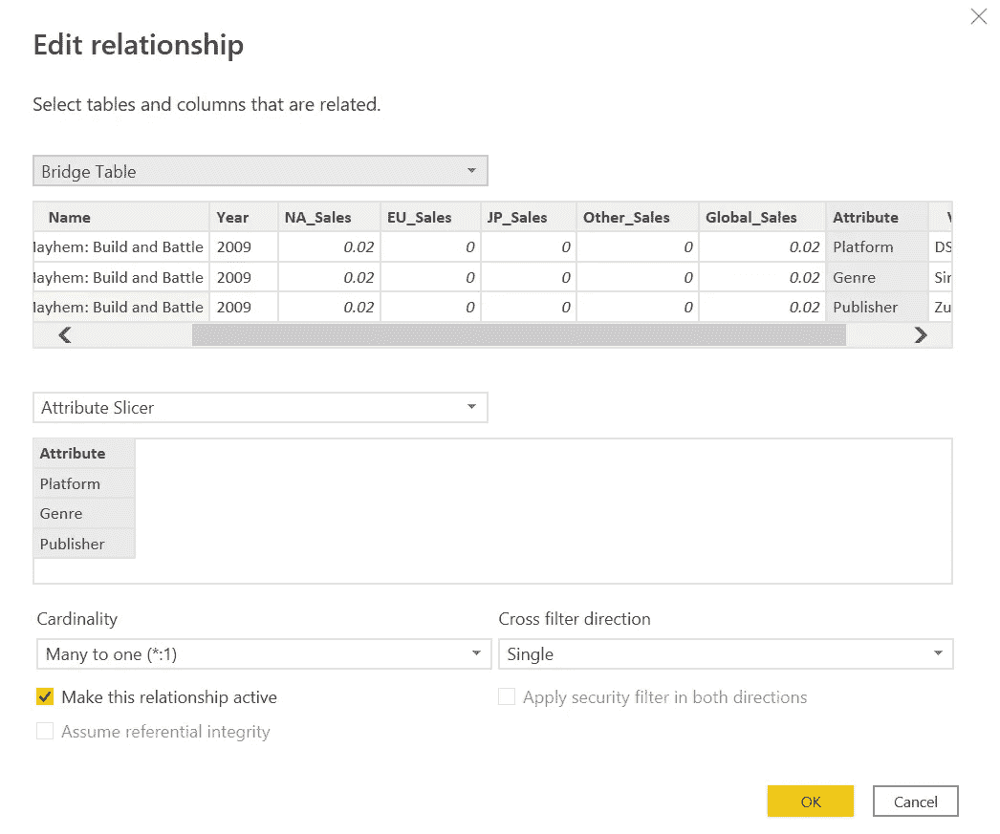
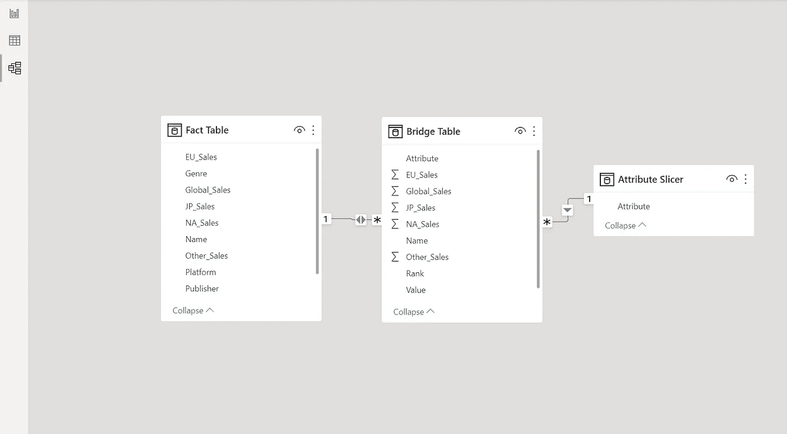
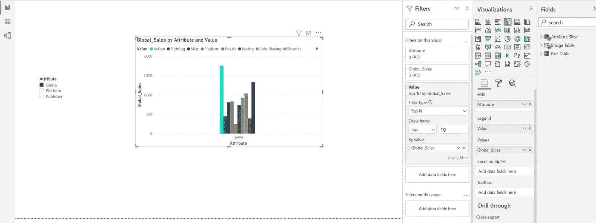

# 如何动态更改 Power BI Visual 中的尺寸

> 原文：<https://towardsdatascience.com/how-to-dynamically-change-dimensions-within-a-power-bi-visual-61de11a0eea1?source=collection_archive---------7----------------------->

## 数据可视化中最受欢迎的功能之一是用户能够更改/切换图形中的维度。下面是如何在 Power BI 中实现的。

作者 Gif

最近，我一直在使用 Power BI 以富有洞察力的方式可视化数据，其中最受欢迎的功能之一是更改/切换仪表板中某个图形的维度。今天，我将一步一步地教你如何做到这一点。你只需要对 Power BI 有一个基本的了解就可以了。

我将使用一个 kaggle 数据集，它可以在这里找到[来展示如何在一个 Power BI 视觉中改变尺寸。创建此功能的基本步骤如下:](https://www.kaggle.com/gregorut/videogamesales/version/2)

1.  在电源查询中创建桥接表
2.  在超级查询中创建属性切片器表
3.  连接事实表、桥和属性切片器表
4.  添加具有动态维度功能的切片器和图形

好，我们开始吧！

1.  **在电力查询中创建桥接表**

在创建桥表之前，您需要加载事实表。我将使用上面链接的 Kaggle 中的 vgsales 数据作为我的事实表。一旦完成，您将需要转到 Power Query 编辑器，为您的事实表创建两个副本，这可以通过右键单击事实表并选择 Duplicate 来完成。将第一个重复表重命名为“桥表”，将另一个重复表重命名为“属性切片器”。接下来:

1.  在电源查询中选择您的网桥表
2.  移动到“转换”选项卡
3.  选择您希望能够在视觉效果中更改/切换的列(在我的例子中是:平台、流派和出版商)。提示:您可以通过按住 Ctrl 键并单击来选择多列。
4.  单击“取消透视列”

unpivoting 要做的是将三个维度连接到一个名为“属性”的列中，这样每一行(唯一的视频游戏名称)现在将有 3 行(每个维度一行)。3 个维度中每个维度的值现在将合并到一个名为“值”的列中。这是取消透视前的表格:

作者图片

这是取消透视后的表格:

作者图片

所以，基本上我们把表格从宽格式转换成了长格式。

2.**在超级查询中创建属性切片器表**

我们将对属性切片器表执行与桥接表相同的步骤，并增加几个额外的步骤:

1.  在超级查询中选择属性切片器表
2.  移动到“转换”选项卡
3.  选择您希望能够在视觉效果中更改/切换的列(在我的例子中是:平台、流派和出版商)
4.  单击“取消透视列”
5.  选择新的“属性”列
6.  移动到主页表
7.  选择删除其他列(在删除列选项卡下)
8.  选择删除重复项(在删除行选项卡下)

所以基本上你会得到一个只有一列和三个值的表:平台、流派和出版商。你现在可以点击关闭并在超级查询中应用。

3.**连接事实表、桥和属性切片器表**

要连接事实表和桥表，您需要转到 Power BI 中的 Model 选项卡，并选择 Manage Relationships。您的事实表需要有一个惟一的主键来连接到桥表上。在我的例子中，PK 是等级和/或名称列。你们的关系应该是这样的:

作者图片

确保选择交叉过滤方向选项“Both ”,否则动态切片器将无法工作。接下来，设置桥和属性切片器表之间的关系，如下所示:

作者图片

您的数据模型应该如下所示:

作者图片

4.**添加具有动态尺寸功能的切片器和图形**

现在是时候真正开始有趣的事情了！我们将向报告页面添加一个切片器，并将属性切片器表中的属性添加到其中。然后，我们将添加一个条形图，并选择以下数据用于它:

轴:属性切片器表中的属性

图例:桥表中的值

值:Global_sales(这可以是您想要的任何指标)

我还在值过滤器中只过滤了前 10 名 Global_sales，以减少图表中显示的条形列的数量。您的页面应该如下所示:

作者图片

现在，您可以通过更改切片器选项来选择不同的属性显示在您的图形中！不要忘记让切片器只选择一个选项。

希望你喜欢我的教程，一如既往，我已经在我的 [github](https://github.com/tsbloxsom/medium-projects/tree/master/PowerBI%20-%20Dynamic%20Dimensions) 上发布了数据和功率 BI 报告。