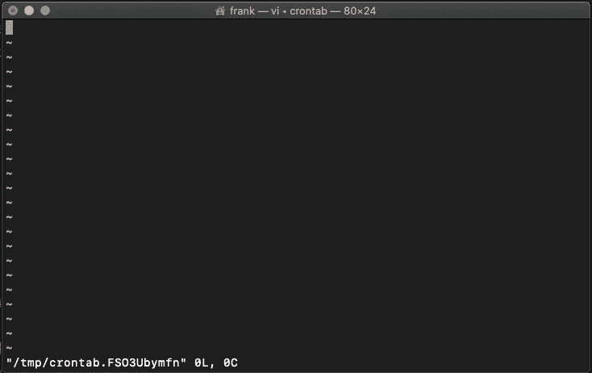
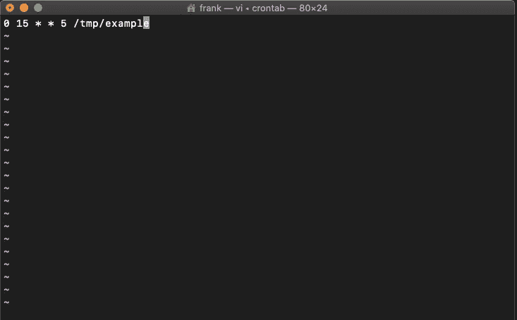
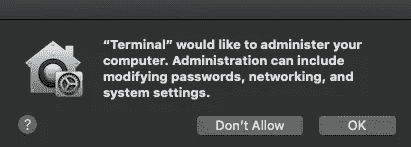
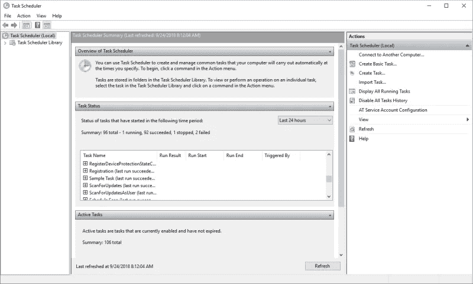
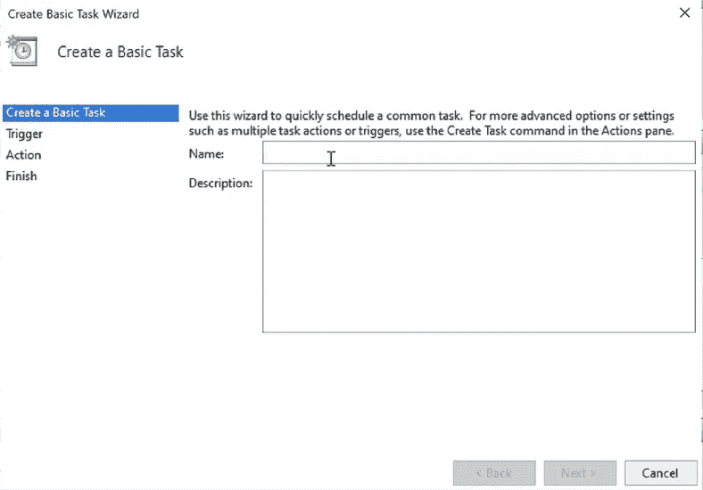

# 如何在 Mac 和 Windows 上轻松自动化您的 Python 脚本

> 原文：<https://towardsdatascience.com/how-to-easily-automate-your-python-scripts-on-mac-and-windows-459388c9cc94?source=collection_archive---------2----------------------->

## 使用 crontab 和任务调度器来自动化您的脚本并节省时间


图片由 [Pixabay](https://pixabay.com/photos/office-freelance-freelancer-4906569/) 上的 [Deeezy](https://pixabay.com/users/deeezy-15467098/) 拍摄

运行 Python 脚本可能就像打开 IDE 或文本编辑器并单击运行按钮一样简单；但是，如果脚本必须每天或每周执行，您就不希望浪费时间一遍又一遍地重复这些步骤。

相反，您可以通过计划在特定时间运行 Python 脚本的作业来自动化这些脚本。在本文中，我将向您展示如何在 Mac 和 Windows 上使用 crontab 和任务调度器来完成这项工作。

# 在 macOS 上调度作业

我们将要自动化的 Python 脚本叫做`example.py`。你可以使用任何你必须遵循的脚本。

## 步骤 1:用 PyInstaller 使 Python 文件可执行

要在 macOS 上调度一个作业，我们首先需要使我们的 Python 文件可执行(。exe)。将`.py` 文件转换成可执行文件有不同的方法。在这种情况下，我将使用“PyInstaller”库，因为它很简单。

PyInstaller 读取 Python 脚本并找到脚本需要执行的库。然后，它创建所有文件的副本，并将它们放在一个可执行文件中。

要安装 PyInstaller 并使您的 python 脚本可执行，请执行以下操作。

*   打开终端，运行`pip install pyinstaller`。这将安装 PyInstaller
*   在终端内部，转到您的脚本所在的目录(使用`cd` 在目录中导航)
*   一旦进入脚本所在的路径，在终端中编写下面的`pyinstaller --onefile example.py` ,使脚本可执行。

在此之后，您将看到一条消息，上面写着“成功完成”然后在您的脚本所在的目录中，应该已经创建了一个名为“dist”的文件夹。在这个文件夹中，你会找到独立的可执行文件！**右键点击，点击“打开方式”，然后“终端”，测试是否一切正常。**

***注意:如果您在运行独立的可执行文件后看到一个错误，如“ModuleFoundNotError:Not module named ' name _ of _ module '”，您必须再次重复第 1 步，但是现在编写下面的***

```
pyinstaller --onefile example.py --hidden-import name_of_module
```

## 步骤 2:使用 crontab 调度作业

为了在 macOS 上调度作业，我们将使用 crontab。为此，打开终端并运行`crontab -e`。在这之后，你的终端应该看起来像下面的图片。



作者图片

您可以在这里创建新的工作。他们每个人都有自己的台词。要创建作业，请使用下面框中的格式。

```
* * * * * command_to_execute* - minute (0-59)
* - hour (0-23)
* - day of the month (1-31)
* - month (1-12)
* - day of the week (0-6, Sunday to Saturday)
```

学习如何创建新的 cron 作业很简单，但是要小心，cron 作业失败可能是灾难性的。我建议您使用 [crontab.guru](https://crontab.guru/) 来生成正确格式的 cron 表达式。

现在是时候创建一个 cron 作业了。

*   点击`i`激活`INSERT`模式
*   现在可以写作业了。在这个例子中，我写了`0 15 * * 5 path_of_executable` 这意味着"*在每个*星期五的 15:00 运行 Python 脚本*"*(你可以在 [crontab.guru](https://crontab.guru/) 上查看)



作者图片

*   打出后，按`esc`。然后键入`:`并写`wq`保存并退出(`w` -写，`q` -退出)，最后按回车键。

此后，可能会出现以下窗口



作者图片

只需点击“确定”即可授予访问权限。在此之后，应该已经创建了 crontab。

要验证 crontab 是否已创建，请编写`crontab -e or crontab -l`。如果您想删除列出的所有 crontabs，请编写`crontab -r.`

就是这样！现在，您的 Python 脚本将在预定的时间运行！

*注意:如果你有权限问题，你需要给完全磁盘访问权限，所以去系统偏好设置，安全和隐私，隐私，和完全磁盘访问权限。*

# 在 Windows 上调度作业

由于有了任务调度器，在 Windows 上安排作业比在 Mac 上更容易。只需遵循以下步骤。我们将要自动化的 Python 脚本叫做`example.py`

## 步骤 1:用批处理文件使 Python 文件可执行

批处理文件有不同的用途，但是在这种情况下，我们将把它作为一个可执行文件来自动化我们的 Python 脚本。

我们将把 Python 脚本存储在 bat 文件中，然后单击 bat 文件来执行命令并运行 Python 脚本。为此，请按照下列步骤操作。

*   右键单击任何文件夹，然后单击“新建”并创建一个记事本(“文本文档”)
*   在记事本中，使用以下格式编写文本。

```
**<Paste your python.exe location> <Paste your python script location>**
```

要获得“python.exe”路径(python 应用程序路径)，您需要转到保存 Python 的位置(检查您安装它的位置)。您的记事本可能看起来像下面的文本。

```
"C:\User\Anaconda\python.exe" "C:\Scripts\example.py"
```

*   现在点击“文件”,然后点击“另存为”,最后写下包括扩展名`.bat` 在内的任何名称。对于这个例子，我将创建一个名为`example.bat`的文件

## 步骤 2:在 Windows 任务计划程序中创建任务

让我们用 Windows 任务调度器来调度`example.bat` 文件。只要按照这些步骤。

*   按 Windows 按钮并搜索 Windows 任务计划程序。然后点击它。



作者图片

*   现在你应该会看到一个类似上图的窗口。单击右侧面板上的“创建基本任务”。

应该会弹出这样的窗口。



作者图片

现在你只需要填写所有需要的信息，然后点击下一步。这些是您在上面看到的选项:

1.  **创建一个基本任务:**写下你的任务名称和描述。
2.  **触发时间:**选择您希望任务开始的时间。您可以选择每日、每周、每月等等。然后你必须选择上一次选择的时间 **(** 每 x 天、周、月重复一次)
3.  **操作:**有 3 种操作可用，但其中两种已过时，因此只需选择“启动程序”并单击“下一步”。然后，浏览我们之前创建的 bat 文件。
4.  点击**完成**按钮创建任务。

在此之后，一个新的任务应该被列在任务调度器上。

*就是这样！现在，您已经准备好在您的计算机上自动化任何 Python 脚本了。*

[**与 3k 以上的人一起加入我的电子邮件列表，获取我在所有教程中使用的 Python for Data Science 备忘单(免费 PDF)**](https://frankandrade.ck.page/bd063ff2d3)