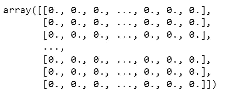
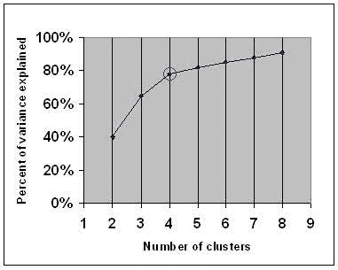
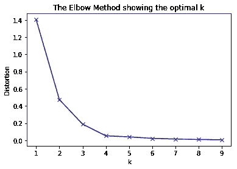
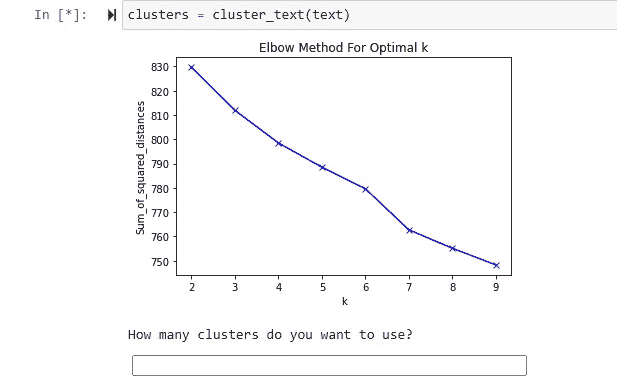
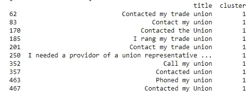

# 如何在 Python 中轻松聚集文本数据

> 原文：<https://towardsdatascience.com/how-to-easily-cluster-textual-data-in-python-ab27040b07d8?source=collection_archive---------2----------------------->

## 通过这种方法，您再也不必手动对调查答案进行聚类


Pawel Czerwinski 在 [Unsplash](https://unsplash.com/s/photos/bin?utm_source=unsplash&utm_medium=referral&utm_content=creditCopyText) 上的照片

文本数据是出了名的烦人，我真的不喜欢和它一起工作。

尤其是调查数据——让人们想打什么就打什么是谁的好主意？

在大多数研究公司中，一些穷人将不得不手动整理这些回答，并将它们“分类”到相似的答案组中。这样做有很多问题，比如大量的时间消耗，以及如何选择应该创建的集群数量。

集群太少，它们就不具体，太多，它们就过于具体。

我将要向您展示的这个方法解决了这两个问题。在让您访问该函数之前，我将首先解释我使用的方法，以便您将来可以使用它。

*如果你知道 TF-IDF 和 K-means，那就直接跳到底部的功能。*

# 向量表示和 TF-IDF

关于文本的向量表示和 [TF-IDF](https://en.wikipedia.org/wiki/Tf%E2%80%93idf) 有上百万篇文章，所以我不会在这里浪费你太多时间。简而言之，我们将在这里使用的方法，TF-IDF(术语频率-逆文档频率)是一种统计方法，它表示一个单词(或词组)对一个文档或文本语料库的重要性。TF-IDF 值与该单词在文档中出现的次数成比例增加，并与包含该单词(或单词组)的文档数量成比例。更全面的解释，包括方程式，可以在[维基页面](https://en.wikipedia.org/wiki/Tf%E2%80%93idf)看到。

我在这里使用的例子是一项调查的答案。我们正试图将调查答案归入同质组。因此，TF-IDF 分数将查看该答案中出现的单词与这些单词在所有其他答案中出现的频率的关系。

最好的开始方式是对 pandas 数据框架中的列使用 unique()方法，如下所示——S3 是我的列名。输入是字符串类型对象的列表。完整的文档可以在[这里](https://scikit-learn.org/stable/modules/generated/sklearn.feature_extraction.text.TfidfVectorizer.html)看到。

```
text = df.S3.unique()
```

其输出将是一个稀疏的 Numpy 矩阵。如果您使用 toarray()方法来查看它，它很可能是这样的:



稀疏矩阵的输出—由作者创建

从这里我们可以使用 K-means 来聚类我们的文本。

# k-均值和肘方法

[K-means](https://en.wikipedia.org/wiki/K-means_clustering) 是最常见的聚类算法之一。但是，它不经常用于文本数据。多亏了 TF-IDF，我们的文本数据以一种可行的方式呈现出来。

大多数人以前都遇到过 K-means，但如果没有，这里有一个简短的介绍。

K-means 算法的主要目标是通过创建相似方差的聚类来最小化聚类内的平方和(或惯性)。首先，必须指定簇的数量，然后随机分配相同数量的“质心”。然后测量每个数据点和质心之间的欧几里德距离。然后，数据点被“分配”给最近的质心。然后，我们将新生成的聚类的平均值作为新的质心，并重复前面的步骤。然后重复这个过程，直到达到收敛或最大迭代次数。更深入的解释可以在[这里看到。](https://medium.com/data-folks-indonesia/step-by-step-to-understanding-k-means-clustering-and-implementation-with-sklearn-b55803f519d6)


这个过程的一个可视化例子，你可以看到质心和集群一起移动。【https://en.wikipedia.org/wiki/K-means_clustering 

因此，算法相对来说是比较简单的。但是我们如何选择集群的数量呢？一个常见的，虽然不完美，但实用的启发式方法是肘法。该方法绘制相对于聚类数量的方差，并选择最像肘形的点。也可以通过绘制平方差的和来完成。



[https://en . Wikipedia . org/wiki/Elbow _ method _(clustering)#/media/File:data clustering _ Elbow criterion。JPG](https://en.wikipedia.org/wiki/Elbow_method_(clustering)#/media/File:DataClustering_ElbowCriterion.JPG)



[https://commons . wikimedia . org/wiki/File:Elbow _ Method _ for _ chopping _ Number _ of _ k . png](https://commons.wikimedia.org/wiki/File:Elbow_Method_for_Choosing_Number_of_K.png)

# 将这一切结合在一起

因此，我们能否将所有这些整合到一个功能中？当然，在下面。我会带你走一遍。

如果您在字符串列表上运行这个函数，在本例中，我使用调查答案，它将首先通过 TF-IDF 矢量器运行文本，然后运行 K-means。然后，它会为您绘制距离的平方和，然后显示要求您选择多少个集群。



由作者创建。应该在 Jupyter 运行以获得最佳效果。

然后，您只需输入您想要的集群数量，它就会为您创建群组。一旦你这样做了，它将输出所有的答案和他们被分配到哪个组。这是我的输出的一个例子，它清楚地表明工会是一个重要的集群。我的数据中没有明确的拐点，但我选择了七个聚类。每个组都有一个明确的主题，如工会或新冠肺炎，最后一个组作为不属于指定组的答案的总称。



由作者创建。

因此，接下来你所要做的就是得到一个字符串列表，就像我在开始时展示给你的那样，然后运行这个函数，你就有了聚集文本！

希望这有所帮助，它会节省你很多时间。

如果我鼓励你加入 medium，如果你通过这个[链接](https://jamesasher4994.medium.com/membership)加入，我会非常感激——这将有助于支持我在未来写出更好的内容。

如果你喜欢这篇文章，请看看我下面的其他文章。

[](/how-to-easily-run-python-scripts-on-website-inputs-d5167bd4eb4b) [## 如何在网站输入上轻松运行 Python 脚本

### 这是我建立的一个网站的演示，它将动态分析文本情感

towardsdatascience.com](/how-to-easily-run-python-scripts-on-website-inputs-d5167bd4eb4b) [](/how-to-easily-show-your-matplotlib-plots-and-pandas-dataframes-dynamically-on-your-website-a9613eff7ae3) [## 如何轻松地在你的网站上动态显示你的 Matplotlib 图和 Pandas 数据框。

### 这是一种令人惊讶的简单方法，可以在线向全世界展示您的图表和数据框架，而且不到…

towardsdatascience.com](/how-to-easily-show-your-matplotlib-plots-and-pandas-dataframes-dynamically-on-your-website-a9613eff7ae3) [](/how-to-easily-automate-your-keyboard-to-do-tasks-in-python-b698e98a5c40) [## 如何轻松地自动化您的键盘来完成 Python 中的任务

### 永远告别单调的任务

towardsdatascience.com](/how-to-easily-automate-your-keyboard-to-do-tasks-in-python-b698e98a5c40) 

干杯，

詹姆斯