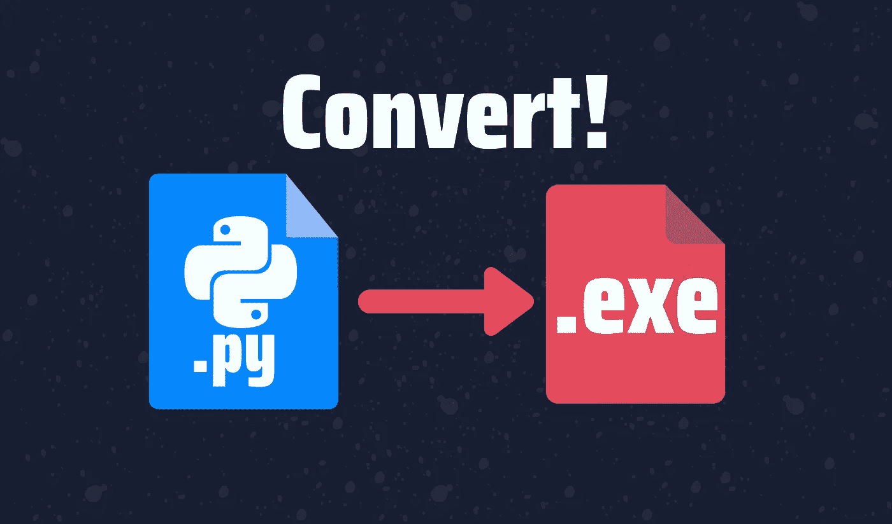
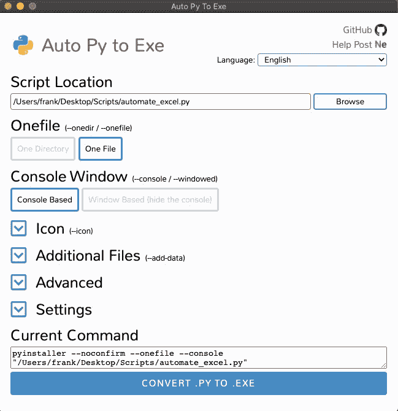
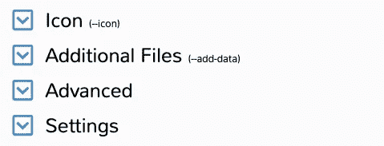
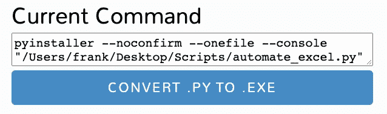

# 如何轻松将 Python 脚本转换成可执行文件(。exe)

> 原文：<https://towardsdatascience.com/how-to-easily-convert-a-python-script-to-an-executable-file-exe-4966e253c7e9?source=collection_archive---------0----------------------->

## 创建 Python 可执行文件的两种简单方法。



作者图片

虽然使用终端或您最喜欢的文本编辑器运行 Python 脚本很简单，但是在某些情况下，您更喜欢隐藏脚本中编写的所有代码(。py)放在可执行文件(.exe)。

也许您需要将脚本发送给一个根本不会编码的人，或者您可能需要安排一个在特定时间在您的计算机上运行`.exe`的作业。无论情况如何，在本指南中，我将向您展示两种创建可执行文件的方法。第一个(auto-py-to-exe)有一个友好的界面，可以帮助初学者轻松地创建可执行文件，而第二个(PyInstaller)提供了一种通过终端创建可执行文件的简单方法。

```
**Table of Contents** 1\. [Making an Executable file with auto-py-to-exe](#b2c6)
 - [Installing with pip](#c689)
 - [Running auto-py-to-exe](#eeef)
 - [Step 1: Add the script location](#0063)
 - [Step 2: Choosing “One Directory” or “One File”](#7b48)
 - [Step 3\. Choosing “Console Based” or “Window Based”](#d2bc)
 - [Step 4: Advanced option(e.g. output directory, additional import)](#7cd6)
 - [Step 5: Convert the file](#ed33)
2\. [Making an Executable file with PyInstaller](#f30d)
```

# 用 auto-py-to-exe 制作可执行文件

第一个选项提供了一个漂亮的 GUI(图形用户界面),它负责将 Python 脚本转换成可执行文件的所有必要工作。

对了，你也可以看看我的 YouTube 视频，学习一下如何把一个. py 转换成。如果你更喜欢看下面的步骤而不是阅读它们。

## 使用 pip 安装

要安装 auto-py-to-exe 的最新版本，只需打开终端并运行以下命令。

```
pip install auto-py-to-exe
```

*注意:确保你安装* `*auto-py-to-exe*` *的工作环境包含了你的脚本需要运行的所有库。*

## 运行自动复制到可执行文件

一旦安装了 auto-py-to-exe，创建一个可执行文件就像编写下面的命令一样简单。

```
auto-py-to-exe
```

运行该命令后，将打开以下 GUI 应用程序。



作者图片

我将带您浏览每个选项，以正确创建一个可执行文件。

# 创建可执行文件的步骤

## 步骤 1:添加脚本位置

浏览您希望转换的脚本，并将其添加到“脚本位置”字段。在本例中，我将选择一个自动化 Excel 报告的脚本(您可以在下面的链接中找到我的自动化 Excel 指南)

</a-simple-guide-to-automate-your-excel-reporting-with-python-9d35f143ef7>  

你可以随意选择任何你想要的剧本。然而，如果你的脚本需要读取一个路径，确保你使用绝对路径，因为相对路径不会像你期望的那样处理可执行文件。如有必要，在下面包含以下代码行，以了解可执行文件的位置，并对脚本进行必要的更改，以便在正确的目录下读取/导出文件。

```
application_path = os.path.dirname(sys.executable)
```

## 第二步:选择“一个目录”或“一个文件”

现在我们必须选择是创建“一个目录”还是“一个文件”第一个创建一个目录，其中包含脚本运行所需的所有依赖项(包括可执行文件)，而第二个只创建一个可执行文件。

对于这个例子，我将选择“一个文件”选项。

## 第三步。选择“基于控制台”或“基于窗口”

现在是时候选择是否显示控制台了。如果您选择“基于控制台”，控制台将在运行可执行文件后打开，如果您的脚本生成基于控制台的输出，建议您这样做。但是，如果您不想在运行可执行文件时显示控制台输出，请选择“基于窗口”

我的脚本需要引入 Excel 电子表格的名称作为输入，以便创建我的 Excel 报表，因此我将选择“基于控制台”

## 步骤 4:高级选项(例如，输出目录、附加导入)

您可以添加图标，添加您的脚本需要运行的文件，等等！然而，对于这个例子，我将只修改可执行文件的导出路径。为此，点击“设置”选项并浏览您希望的输出目录。



作者图片

*注意:如果您在双击创建的可执行文件后看到类似“ModuleFoundNotError:Not module named ' name _ of _ module '”的错误，您必须再次从步骤 1 开始重复，但是现在在“高级”选项的“隐藏-导入”字段中缺少模块名称。*

## 步骤 5:转换文件

要转换。将文件复制到。只需点击下面的蓝色按钮。



作者图片

`auto-py-to-exe`在 convert 按钮上方显示的真正重要的东西是`pyinstaller` (本指南中的主库和第二个选项)制作的代码。exe 文件)需要创建一个可执行文件背后的花式贵由看到在屏幕上。

一旦该过程完成，可执行文件应该位于您在步骤 4 中设置的输出目录中！

# 用 PyInstaller 制作可执行文件

这个选项更适合那些喜欢在终端上快速创建运行命令的可执行文件的人。

如果您习惯于使用终端，那么 PyInstaller 库将是最佳选择。要安装 PyInstaller，请按照下列步骤操作。

*   **第一步:**打开一个终端，运行`pip install pyinstaller`
*   **步骤 2:** 使用终端，转到您的脚本所在的目录(使用`cd`命令)
*   **步骤 3:** 一旦进入正确的目录，在终端中使用下面的语法`pyinstaller --onefile name_of_script.py` 编写一个命令，使脚本可执行。

步骤 3 中使用的命令类似于步骤 5 图片中显示的`auto-py-to-exe` 选项的代码。您可以稍微使用一下由`auto-py-to-exe` 提供的 GUI，以习惯您可以添加到该命令中的许多选项。

运行该命令后，您应该会看到一条消息，显示“成功完成”在脚本所在的目录中，应该已经创建了一个名为“dist”的文件夹。在这个文件夹中，你会找到独立的可执行文件！

*祝贺你！现在，您的 Python 脚本已经被转换为可执行文件。如果您想安排该文件在您的计算机上运行的时间，请查看本指南。*

</how-to-easily-automate-your-python-scripts-on-mac-and-windows-459388c9cc94>  

使用 Python 自动化您的生活！ [**加入我的 20k+人电子邮件列表，获取我的免费自动化备忘单。**](https://frankandrade.ck.page/44559e1ae7)