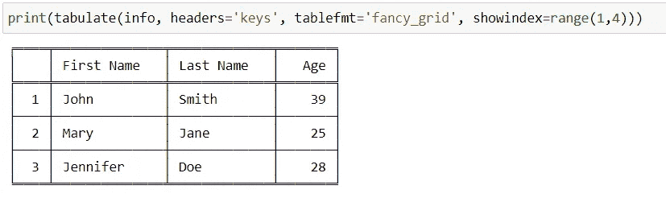

# 如何在 Python 中轻松创建表格

> 原文：<https://towardsdatascience.com/how-to-easily-create-tables-in-python-2eaea447d8fd?source=collection_archive---------0----------------------->

## 如何在 Python 中使用制表函数创建格式良好的表格


照片由 [Unsplash](https://unsplash.com?utm_source=medium&utm_medium=referral) 上的 [Fotis Fotopoulos](https://unsplash.com/@ffstop?utm_source=medium&utm_medium=referral) 拍摄

能够快速地将我们的数据组织成可读性更强的格式，例如在数据争论时，对于分析数据和计划后续步骤非常有帮助。Python 能够轻松地将某些表格数据类型转换成格式良好的纯文本表格，这是通过 ***制表*** 函数实现的。

## 安装制表

我们首先在命令行中使用 pip install 安装**制表**库:

```
pip install tabulate
```

## 导入制表功能

然后我们在代码中从**制表**库中导入 ***制表*** 函数:

```
from tabulate import tabulate
```

现在我们准备使用 ***制表*** 功能！

## 制表支持的表格数据类型

****制表*** *函数可以将以下任何内容转换成易于阅读的纯文本表格:(来自制表* [*文档*](https://pypi.org/project/tabulate/) *)**

*   **列表的列表或另一个可迭代的列表**
*   **列表或另一个字典条目(作为列的关键字)**
*   **可重复项的字典(作为列的键)**
*   **二维数组**
*   **NumPy 记录数组(名称为列)**
*   **熊猫。数据帧**

## *列表列表*

*例如，如果我们有以下列表列表:*

```
*table = [['First Name', 'Last Name', 'Age'], 
         ['John', 'Smith', 39], 
         ['Mary', 'Jane', 25], 
         ['Jennifer', 'Doe', 28]]*
```

*我们可以使用 ***制表*** 功能将它变成可读性更好的纯文本表格:*

```
*print(tabulate(table))*
```

**

*由于列表列表中的第一个列表包含列名作为其元素，我们可以通过将*‘first row’*作为 ***headers*** 参数的参数来将其设置为列名或标题名:*

```
*print(tabulate(table, headers='firstrow'))*
```

**

****制表*** 函数还包含一个 ***tablefmt*** 参数，该参数允许我们使用伪图形来改善表格的外观:*

```
*print(tabulate(table, headers='firstrow', tablefmt='grid'))*
```

**

*对于 ***tablefmt*** ，我更喜欢用*【fancy _ grid】*的说法:*

```
*print(tabulate(table, headers='firstrow', tablefmt='fancy_grid'))*
```

***</three-concepts-to-become-a-better-python-programmer-b5808b7abedc> * 

## *文学词典*

*我们可以使用字典创建上面的相同表格:*

```
*info = {'First Name': ['John', 'Mary', 'Jennifer'], 
        'Last Name': ['Smith', 'Jane', 'Doe'], 
        'Age': [39, 25, 28]}*
```

*在字典的情况下， ***键*** 将是 ***列标题*** ，而**值**将是那些列的**元素。我们通过将*‘keys’*作为 ***headers*** 参数的自变量进行传递，来指定这些键将成为标题:***

```
*print(tabulate(info, headers='keys'))*
```

**

*当然我们可以使用 ***tablefmt*** 参数来改善表格的外观:*

```
*print(tabulate(info, headers='keys', tablefmt='fancy_grid'))*
```

**

## *添加索引*

*我们还可以使用 ***showindex*** 参数将**索引**添加到我们的表中:*

**

*我们可以通过向参数 ***showindex*** 传递一个 *iterable* 来添加一个自定义索引。例如，如果我们希望索引从 1 开始，我们可以传入一个*范围对象*作为参数:*

***</three-functions-to-know-in-python-4f2d27a4d05> * 

## *缺少值*

*如果我们从上面的 ***info*** 字典中删除*‘Jennifer’*，我们的表将包含一个空字段:*

```
*print(tabulate({'First Name': ['John', 'Mary'], 
                'Last Name': ['Smith', 'Jane', 'Doe'], 
                'Age': [39, 25, 28]}, 
                headers='keys', 
                tablefmt='fancy_grid'))*
```

**

*如果我们的表中有任何**缺失值**，我们可以使用 ***missingval*** 参数选择用什么来填充它们。 ***的缺省值*** 是一个空字符串。如果我们将其更改为*‘N/A’*，我们的表格将会是这样的:*

```
*print(tabulate({'First Name': ['John', 'Mary'], 
                'Last Name': ['Smith', 'Jane', 'Doe'], 
                'Age': [39, 25, 28]}, 
                headers='keys', 
                tablefmt='fancy_grid', 
                missingval='N/A'))*
```

**

## *将表格保存在文本文件中*

*我们可以使用上下文管理器将上述表格保存为文本文件:*

```
*# save the table created above in a variable
table = tabulate({'First Name': ['John', 'Mary'], 
                 'Last Name': ['Smith', 'Jane', 'Doe'], 
                 'Age': [39, 25, 28]}, 
                 headers='keys', 
                 tablefmt='fancy_grid', 
                 missingval='N/A')

# use context manager to create table.txt file and write table to it
with open('table.txt', 'w') as f:
  f.write(table)*
```

*现在我们应该有一个名为***table . txt****的文本文件包含了上面的表格。**

**如果你喜欢阅读这样的故事，并且想支持我成为一名作家，可以考虑注册成为一名媒体会员。每月 5 美元，你可以无限制地阅读媒体上的故事。如果你用我的 [***链接***](https://lmatalka90.medium.com/membership) *报名，我就赚点小提成。***

**<https://lmatalka90.medium.com/membership> ** 

**我希望这篇关于如何使用制表函数轻松创建格式良好的表格的教程对你有所帮助。感谢您的阅读！**