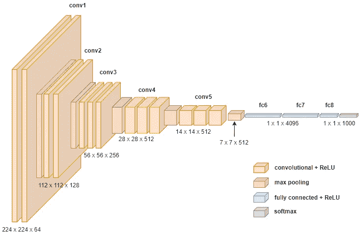
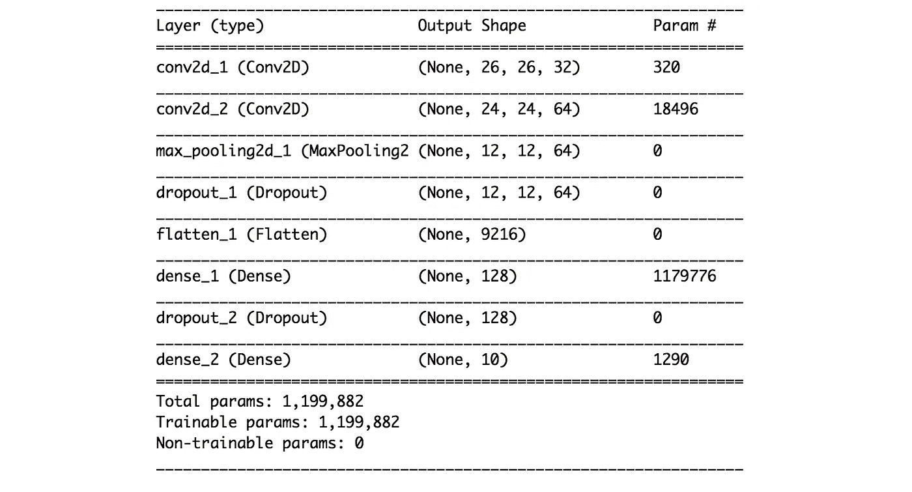
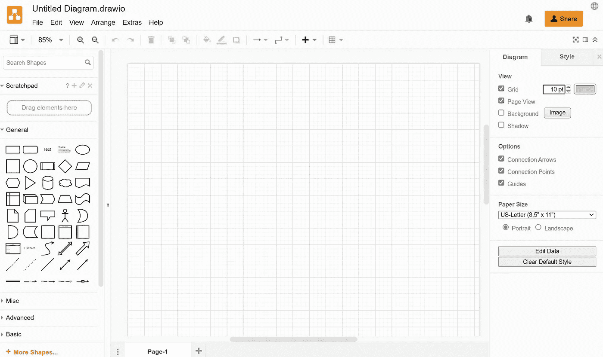
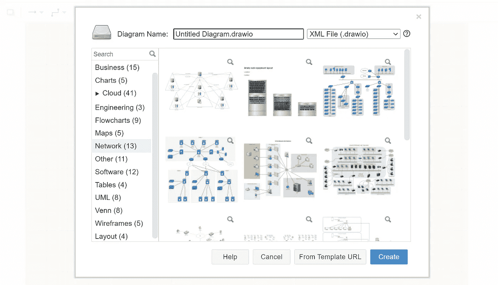
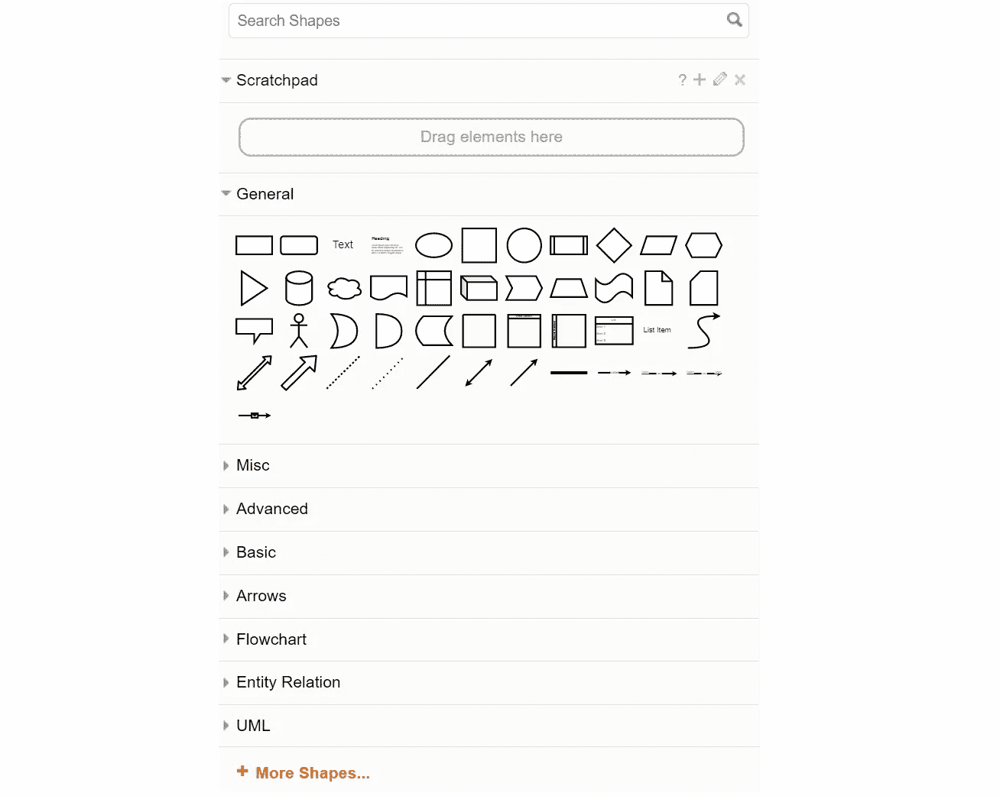
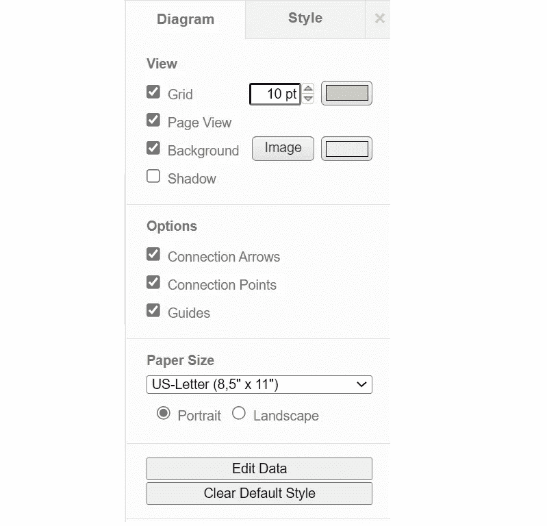
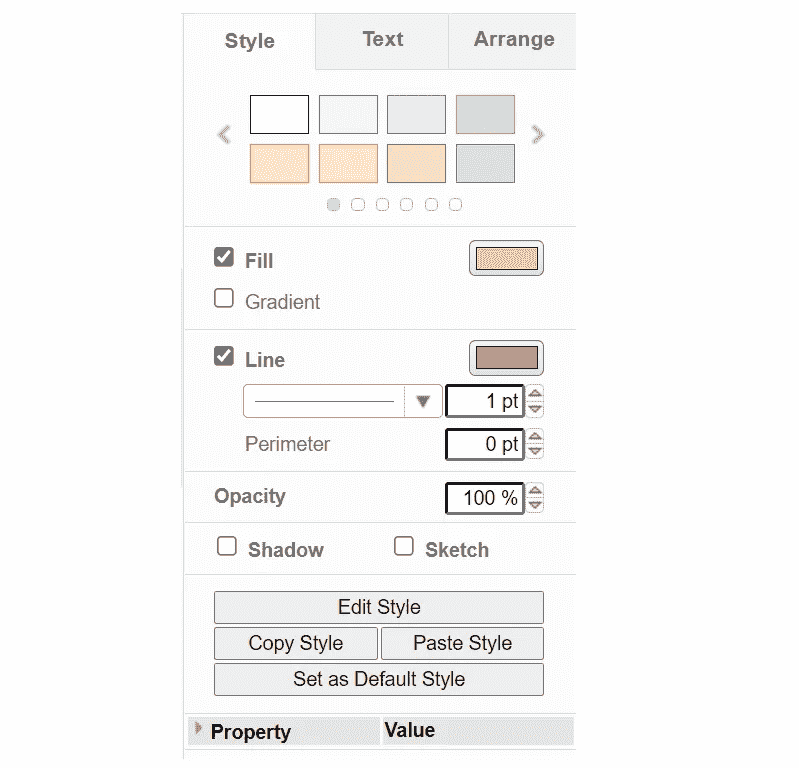
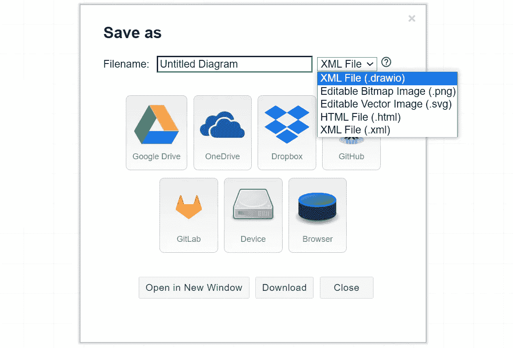
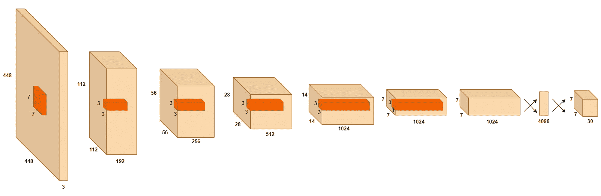
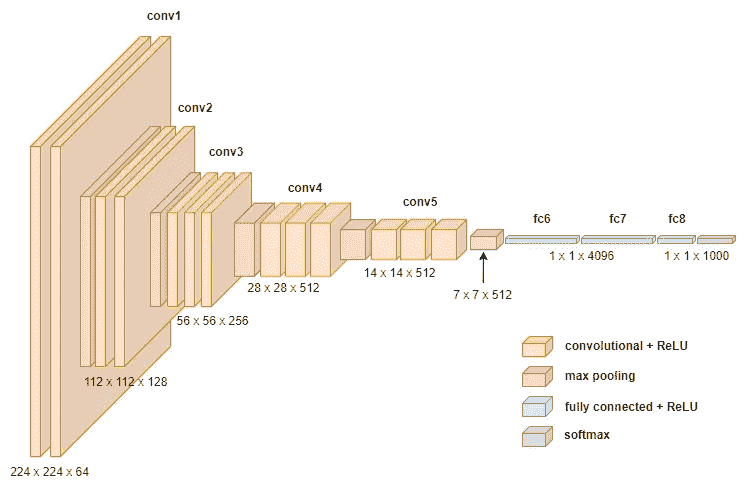

# 如何轻松绘制神经网络架构图

> 原文：<https://towardsdatascience.com/how-to-easily-draw-neural-network-architecture-diagrams-a6b6138ed875?source=collection_archive---------1----------------------->

## 使用无代码 diagrams.net 工具通过图表可视化展示您的深度学习模型

作者图片

当我们处理越来越复杂的神经网络时，架构可能会变得难以理解和消化。

当我们想要向技术和非技术受众解释这些架构时，通常的模型摘要打印输出不会使其更容易理解。

摘要打印输出**不是**呈现神经网络结构的最佳方式|作者图片

在呈现和描述神经网络的架构时，**图表可视化**比**更有效**，而不是用文字解释模型。

我们可能已经为今年剩下的时间编写了足够多的代码，所以让我们来看看一个简单的用于绘制定制架构图的无代码工具—**diagrams.net(以前称为 draw.io)。**

# 内容

> ***(1)***[*关于 diagrams.net*](#18d1)***(2)***[*画你的第一张图*](#b992)
> ***(3)***[*保存你的图*](#b440)

****

**[Adeolu Eletu](https://unsplash.com/@adeolueletu?utm_source=medium&utm_medium=referral) 在 [Unsplash](https://unsplash.com?utm_source=medium&utm_medium=referral) 上拍摄的照片**

# **①关于 diagrams.net**

**[**diagrams.net**](https://www.diagrams.net/)**(原名**[**draw . io**](https://draw.io))是一款**免费拖放的在线图表工具**，允许用户创建流程图，生成网络和实体关系(ER)图，甚至设计数据库模式。******

****diagrams.net 的几个关键优势包括其易用性以及与 GitHub、OneDrive 和 Google Drive 等常见平台的无缝集成。****

# ****(2)画出你的第一张图****

## ****(I)导航至网络应用程序****

****让我们先来看看 diagrams.net 在线编辑工具<https://app.diagrams.net/>**。******

******当您到达主页时，会出现一个弹出窗口，要求您选择保存图的目标位置。如果你想先做些实验，你可以选择“**稍后决定**”。******

****以下是图表编辑器在登录页面上的外观:****

********

****diagram.net 编辑器的主页面|图片在 [Apache 2.0 许可下使用](https://github.com/jgraph/drawio/blob/dev/LICENSE)****

## ****㈡从模板开始****

****虽然你在主页上看到的第一件事是一个空画布，但这并不意味着你必须从头开始构建你的图表。****

****diagrams.net 提供了现成的模板供您开始工作，这可以通过点击顶部菜单栏中的*文件>新建…* 来探索。****

****根据您的不同目标，有许多模板可供选择。****

********

****可用模板列表|在 [Apache 2.0 许可下使用的图像](https://github.com/jgraph/drawio/blob/dev/LICENSE)****

## ****(三)形状选择****

****diagrams.net 是建立在拖放的概念上的，所以使用起来非常直观。有大量的形状(来自不同的类别)可供选择，它们可以在图编辑器的左侧栏**中找到。******

********

****左侧栏中可用的形状列表|在 [Apache 2.0 许可下使用的图像](https://github.com/jgraph/drawio/blob/dev/LICENSE)****

****侧边栏带有一个搜索栏，用于查找您想到的特定形状(如等轴测立方体)和一个便笺，您可以在其中拖放形状以将其保存为收藏夹。****

****除了侧边栏中显示的形状之外，还有很多其他形状，你可以点击“ ***+更多形状…* 【T21””按钮来浏览整个收藏。******

****<https://kennethleungty.medium.com/membership> **** 

## ****㈣定制****

****一旦你把所有你想要的形状放到画布上，下一步就是定制设计编辑和安排。****

******右侧边栏**提供了多个选项，可以对整个布局或特定形状进行细微的更改。可用选项因您用鼠标选择的对象而异。****

****如果您想手动编辑字体颜色和字体样式等方面的具体值，您可以点击“*编辑样式*按钮。****

****************

****整个画布布局(左)和特定形状(右)的侧边栏定制菜单|在 [Apache 2.0 许可下使用的图像](https://github.com/jgraph/drawio/blob/dev/LICENSE)****

# ****(3)保存您的图表****

****最后一步是以首选格式保存您的图表杰作。****

********

****根据 [Apache 2.0 许可](https://github.com/jgraph/drawio/blob/dev/LICENSE)保存图表|图像的选项****

****你可以把它保存在你的本地设备或者流行的云存储平台上，比如 Google Drive 和 Dropbox。****

# ****(4)示例****

****使用这个在线工具，我能够轻松地为 YOLO v1 和 VGG16 生成架构图:****

## ****YOLO v1 建筑****

********

****YOLO v1 建筑|作者图片****

## ****VGG16 架构****

********

****VGG16 架构|作者图片****

****这些美丽的视觉化图像无疑让我们所有人更容易欣赏和理解这些神经网络架构。****

****如果你想使用我创建的模板，请前往[**GitHub repo**](https://github.com/kennethleungty/Neural-Network-Architecture-Diagrams)访问*。drawio* 文件，可以直接使用。****

## ****在你走之前****

****欢迎您加入**和我一起踏上数据科学学习之旅！**关注此[媒体](https://kennethleungty.medium.com/)页面或查看我的 [GitHub](https://github.com/kennethleungty) 以了解更多精彩的数据科学内容。同时，享受绘制架构图的乐趣！****

****</network-analysis-and-visualization-of-drug-drug-interactions-1e0b41d0d3df>  </the-most-starred-forked-github-repos-for-python-and-data-science-f8bb3de47e96>  </pytorch-ignite-classifying-tiny-imagenet-with-efficientnet-e5b1768e5e8f> ****