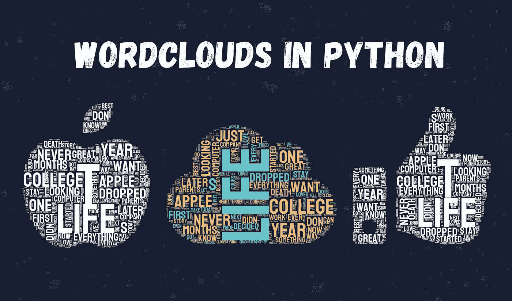
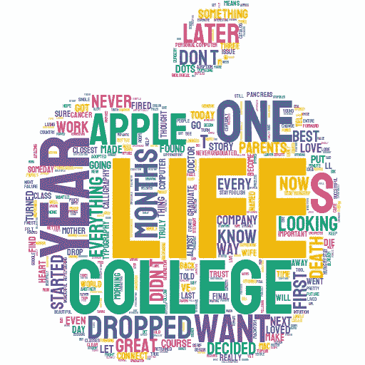
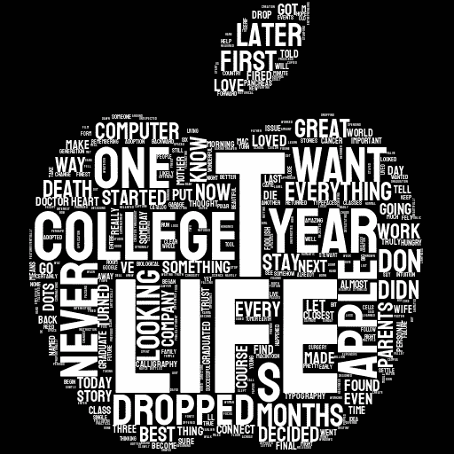
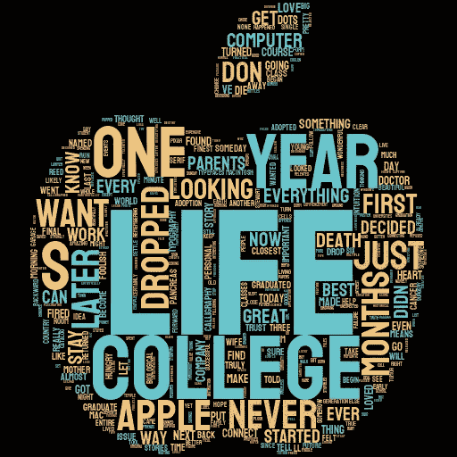
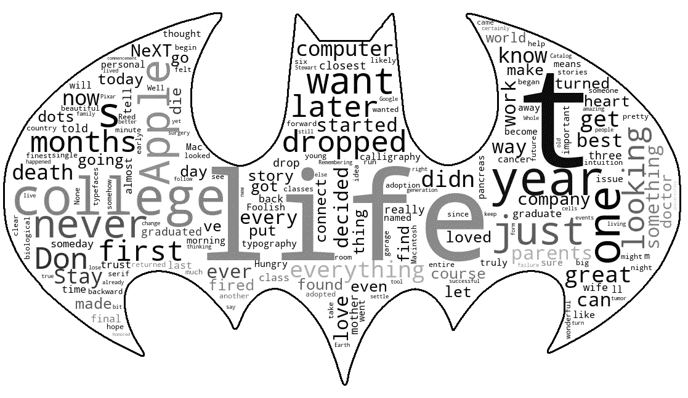

# 如何用 Python 轻松制作漂亮的文字云

> 原文：<https://towardsdatascience.com/how-to-easily-make-beautiful-wordclouds-in-python-55789102f6f5?source=collection_archive---------5----------------------->

## 使用 stylecloud 和 wordcloud 库来定制你的 wordcloud。



作者图片

词云让我们很容易识别文本中的关键词，其中单词的大小代表它们的频率。有了这个，我们甚至在阅读之前就能很好地理解一篇文章的内容。虽然有很多免费的工具可以在线制作 word cloud，但是我们可以使用我们的 Python 技能来定制更多的 word cloud。

在本文中，我们将使用`stylecloud`库用几行代码制作漂亮的单词云，使用`wordcloud` 库添加我们自己的图片作为单词云的遮罩，使用`stop_words` 定制默认提供的停用词列表。

# 用 Stylecloud 制作漂亮的单词云

我们将要使用的文字是史蒂夫·乔布斯在斯坦福演讲的一部分。你可以找到。txt 文件，或者使用任何文本来制作你自己的 wordcloud。

要轻松做出漂亮的字云，我们首先要做的就是安装`stylecloud`。你可以通过 pip `pip3 install stylecloud.`安装它

一旦安装了`stylecloud`，就要导入。

```
import stylecloud
```

现在要创建一个基本的 wordcloud，我们需要使用`.gen_stylecloud()` 方法并添加。txt 文件和图标，我们将使用这个词云的形式。在这个[网站](https://fontawesome.com/icons?d=gallery&p=1&m=free)上，你可以找到可以和 stylecloud 一起使用的图标列表。只需搜索你想要的图标，复制图标的 HTML 代码(在这个例子中，我选择了一个苹果作为图标)

```
stylecloud.gen_stylecloud(file_path='SJ-Speech.txt',
                          icon_name= "fas fa-apple-alt")
```

结果是下面的 wordcloud(该文件在 Python 脚本所在的同一路径中创建)



作者图片

但是我们可以做得更多！我们可以进一步定制 wordcloud，以获得更好看的 wordcloud。

我们可以控制背景颜色、单词的颜色、输出文件的名称，还可以省略 wordcloud 中两个单词的搭配。为此，我们将使用下面的代码。

```
stylecloud.gen_stylecloud(file_path='SJ-Speech.txt',
                          icon_name='fas fa-apple-alt',
                          colors='white',
                          background_color='black',
                          output_name='apple.png',
                          collocations=False)
```

我们甚至可以编写颜色的 HTML 代码，而不是使用像“白色”这样的标准颜色在这个[网站](https://htmlcolorcodes.com​)上，你可以选择任何你想要的颜色，并获得它的 HTML 代码，你可以将它包含在 stylecloud 的`colors` 参数中。



作者图片

# 添加或删除停用词

默认情况下，Stylecloud 有一个英文的停用词列表，但是如果您想要删除或添加新的停用词，您必须在`custom_stopwords`参数中包含一个新的列表。

为了定制停用词列表，我们必须使用`stop_words`库。要做到这一点，首先，安装它(`pip install stop_words`)，然后我们使用`get_stop_words`获得一个特定语言的停用词列表。

```
from stop_words import get_stop_wordsstop_words = get_stop_words('english')
```

一旦定义了列表，就可以分别用`.append` 和`.remove`方法添加或删除元素。

```
stop_words.append('my_new_stop_word')
stop_words.remove('my_new_stop_word')
```

现在，我们只需添加新的`stop_words`列表。我还将使用调色板而不是颜色来给 wordcloud 一个不同的外观。

```
stylecloud.gen_stylecloud(file_path='SJ-Speech.txt',
                          icon_name='fas fa-apple-alt',
                         palette='cartocolors.qualitative.Pastel_3',
                          background_color='black',
                          output_name='apple.png',
                          collocations=False,
                          custom_stopwords=stop_words)
```

在这个[网站](https://jiffyclub.github.io/palettable/)上，您可以找到一个 Python 调色板列表，您可以在 stylecloud 库中使用它(正如您在上面的代码中看到的，用点分隔的名称代表了`palettes`模块的内容)



作者图片

# 添加您自己的图像

有数百个免费图标可以和`stylecloud`一起使用，但有时我们可能想使用我们自己的图像来给我们想要创建的 wordcloud 赋予形式。如果是这样的话，我们必须使用`wordcloud` 库来制作一个单词云，`PIL`来上传图片，`matplotlib` 来绘制单词云，`numpy` 来使用上传的图片作为我们的单词云的遮罩。

首先，我们安装前面提到的所有 4 个库。一旦我们有了所有的模板，我们就导入它们，并开始用想要的模板创建一个 wordcloud。

```
from wordcloud import WordCloud, ImageColorGenerator 
from PIL import Image
import matplotlib.pyplot as plt
import numpy as np# create a mask based on the image we wish to include
my_mask = np.array(Image.open('batman-logo.png'))# create a wordcloud 
wc = WordCloud(background_color='white',
               mask=my_mask,
               collocations=False,
               width=600,
               height=300,
               contour_width=3,
               contour_color='black',
               stopwords=stop_words)
```

如您所见，所使用的代码类似于 stylecloud，只是有一些变化。我们使用`mask`来指定我们想要用于 wordcloud 的图像(在本例中，我使用的是蝙蝠侠标志)。此外，我们包括轮廓宽度和颜色，使图像的形状更加明显。

*注意:确保你要用作蒙版的图片具有清晰的轮廓，否则文字云会不好看。*

现在我们必须读取文本文件，并用下面的代码生成 wordcloud。

```
with open('SJ-Speech.txt', 'r') as txt_file:
    texto = txt_file.read()wc.generate(texto)
```

如果我们想使用原始图像的颜色，我们编写下面的代码(如果不是这样，wordcloud 将有随机的颜色，就像本文中显示的第一个苹果图像一样)

```
image_colors = ImageColorGenerator(my_mask)
wc.recolor(color_func=image_colors)
```

最后，我们使用 matplotlib 来绘制 wordcloud。

```
plt.figure(figsize=(20, 10))
plt.imshow(wc, interpolation='bilinear')
plt.axis('off')
wc.to_file('wordcloud.png')
plt.show()
```

我还删除了轴，只保留了图中的单词云，并用`wc.to_file()`保存单词云



作者图片

*就是这样！现在你已经准备好用 Python 制作你自己的 wordcloud 了！我在下面的文章中用辛普森一家的角色创建了一些单词云。*

</the-simpsons-is-the-best-tv-show-to-increase-your-english-vocabulary-f433fe060a74>  

下面是我看的学习 Python 的书单。

<https://betterprogramming.pub/4-python-books-i-read-as-a-self-taught-programmer-5a5453840cdb>  

[**与 3k 以上的人一起加入我的电子邮件列表，获取我在所有教程中使用的 Python for Data Science 备忘单(免费 PDF)**](https://frankandrade.ck.page/bd063ff2d3)

感谢阅读这篇文章！在下面的文章中，你可以找到我用 Python 制作的其他漂亮的可视化指南。

</a-simple-guide-to-beautiful-visualizations-in-python-f564e6b9d392>  </avatar-meets-data-visualization-60631f86ba7d>  </8-free-tools-to-make-interactive-data-visualizations-in-2021-no-coding-required-2b2c6c564b5b> 