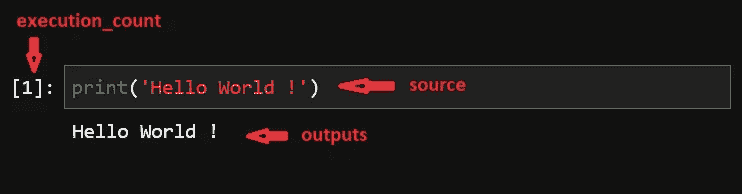

# 如何轻松将多台 Jupyter 笔记本合并为一台

> 原文：<https://towardsdatascience.com/how-to-easily-merge-multiple-jupyter-notebooks-into-one-e464a22d2dc4?source=collection_archive---------1----------------------->

## [*招数*](https://towardsdatascience.com/tagged/tips-and-tricks)

## 黑进你的 Jupyter

作者:[阿玛尔哈斯尼](https://medium.com/u/d38873cbc5aa?source=post_page-----e464a22d2dc4--------------------------------) & [迪亚赫米拉](https://medium.com/u/7f47bdb8b8c0?source=post_page-----e464a22d2dc4--------------------------------)


Paul Hanaoka 在 [Unsplash](https://unsplash.com/?utm_source=unsplash&utm_medium=referral&utm_content=creditCopyText) 上拍摄的照片

Juypyter 笔记本是数据科学家非常必要的工具。它们为交互式计算提供了多种实用的选择，因为它们将代码、文本和可视化结合在一个文档中。
出于组织目的，通常会选择在一个项目中使用多个独立的笔记本。问题是，当经理或客户要求快速演示时，您需要快速合并不同的笔记本，重组单元格可能是一个冗长乏味的复制-粘贴序列。

由于 Jupyter 的界面并不容易，我们认为是时候创建我们自己的解决方案了。在本文中，我们将向您展示如何以省时的方式重组和连接两个笔记本。您将学习到的内容将允许您使用 python 代码来重组、过滤和更改笔记本的单元格。

```
**Table Of Contents:**
· [Getting to know Notebooks’s structure](#06b6)
· [Concatenating Notebooks](#e504)
· [Going further with nbformat](#2394)
```

# 了解笔记本电脑的结构

不知道大家有没有尝试过打开 Jupyter 笔记本文件(那个有**)。ipynb** 作为扩展)带有文本编辑器。如果您看到了，那么您要么看到了奇怪的乱码，要么认出了 JSON 格式。

如果您不知道 JSON 格式是什么，它代表 JavaScript 对象表示法，是一种以人类可读的方式存储对象/数据的方法。相当整洁简单(你可以在这里了解更多关于这个[)。](https://medium.com/python-pandemonium/json-the-python-way-91aac95d4041)

就像我说过的，IPYNB 文件是以 JSON 纯文本格式存储的，如果你打开一个文件，它会是这样的:

如您所见，这是一本结构良好的字典，包含:

*   `metadata`:基本上是一个字典，包含关于内核和所用语言的信息(以及更多)。
*   `nbformat`和`nbformat_minor`:这些只是笔记本格式版本(这里是 4.0)
*   这是我们最有可能感兴趣的，它包含了笔记本单元格的列表。

每个单元格由一个包含不同键值对的类似字典表示:

您可以在该屏幕截图中看到每个字段的位置:



作者截图

现在，您已经了解了足够多的知识，可以开始玩笔记本的电池了。但是，如果你想了解更多细节，你可以在这个[链接](https://nbformat.readthedocs.io/en/latest/format_description.html)查看文档。

# 连接笔记本

所以我们选择的实际例子是将两个笔记本合并在一起。这是一个相当简单的例子，但是你将看到如何读、写和调整笔记本，并且根据你的使用情况，你可以根据你的需要修改代码。

如果你愿意，你可以在这个[链接](https://gist.github.com/hmiladhia/b7b8d8eed7b2f2ebdd1a6b451e85716b/archive/1c48af9a0fbdf8a143f93d9e811c7a7df46a21a0.zip)下载示例笔记本来尝试代码。

所以让我们从实现一个读取 IPYNB 文件的函数开始。我们将使用 python 标准库中包含的 `json`模块:

现在读取文件只需要两行代码:

```
first_notebook = read_ipynb('first_notebook.ipynb')
second_notebook = read_ipynb('second_notebook.ipynb')
```

虽然在这个例子中我们可能不一定需要复制笔记本，但是如果您想摆弄笔记本，它可能会派上用场。这里，我们将再次使用标准库的 `copy`模块:

```
import copy
final_notebook = copy.deepcopy(first_notebook)
```

这就是我们实际合并细胞的部分:

```
final_notebook['cells'] = first_notebook['cells'] + second_notebook['cells']
```

最后，让我们编写一个助手函数，将笔记本导出为 Jupyter 笔记本格式，并使用它导出我们的 final_notebook:

# 使用 nbformat 更进一步

Jupyter 开发团队给了我们包 `nbformat`来进行类似的操作，比如读取`ipynb`文件或者用 `nbformat.v4.new_code_cell`创建新的代码单元。

举个例子，让我们复制用`nbformat`连接两个笔记本的等价代码:

如果你想要一个由`nbformat`提供的更详尽的函数列表，你可以在下面的[链接](https://nbformat.readthedocs.io/en/latest/api.html)中查看它们的文档。

# 最后的想法

深入了解 Jupyter 笔记本的结构，可以获得创建细胞操作解决方案所需的知识。本文详细介绍了两种解决方案，它们为您提供了一种将两个笔记本合并成一个笔记本的繁琐的复制粘贴工作的变通方法。您将在这个 [Github 资源库](https://github.com/hmiladhia/jupyter_mix)中找到本文使用的所有代码。

根据您的用例，您可以进一步创建脚本，以自动、省时的方式进行您需要的其他修改。

我们希望这篇文章对你有用。感谢您坚持到现在，注意安全，我们将在下一篇文章中再见😊！

# 更多文章阅读

<https://python.plainenglish.io/what-the-newly-released-jupyterlab-3-has-to-offer-a9a144d93046>  </8-tips-to-write-cleaner-code-376f7232652c> 