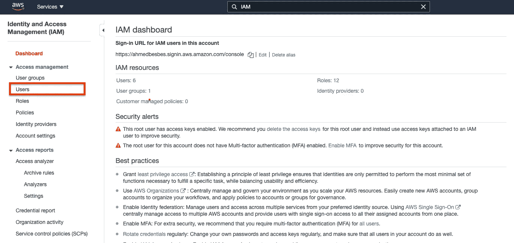
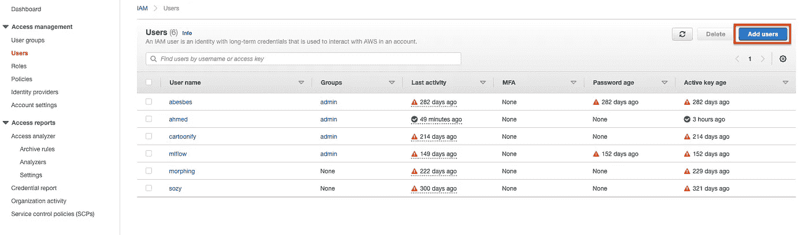
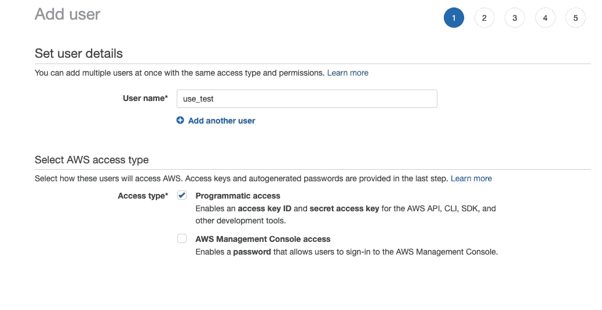
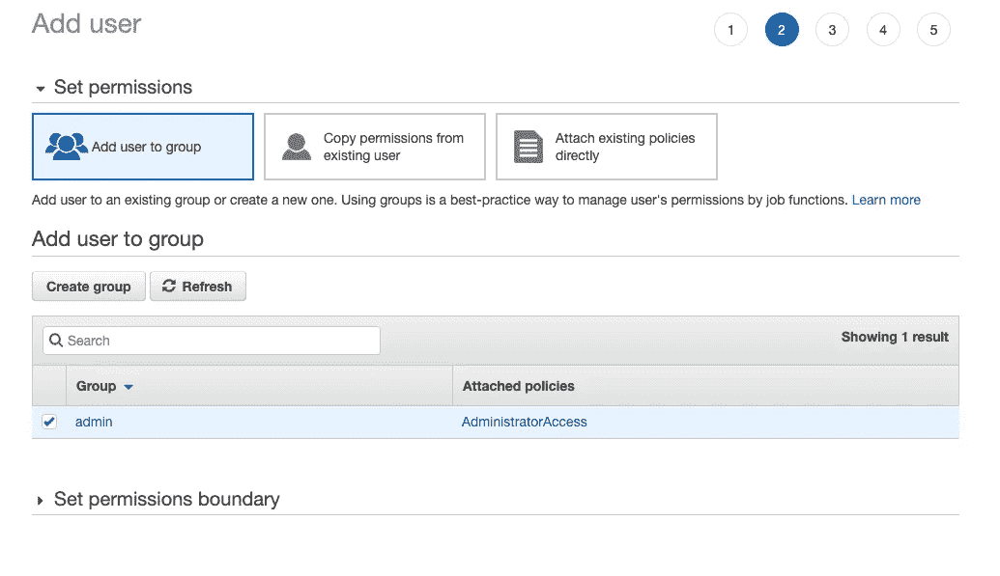
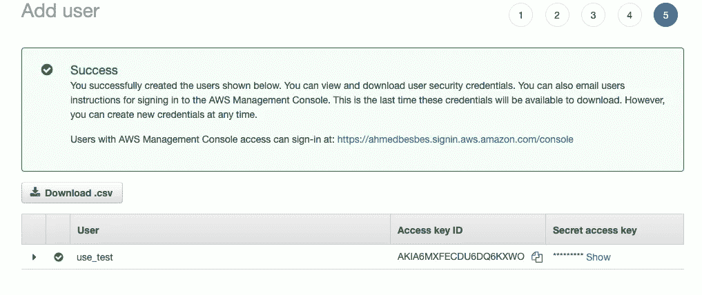
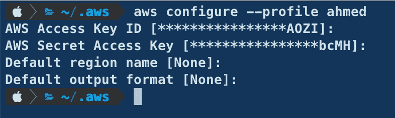
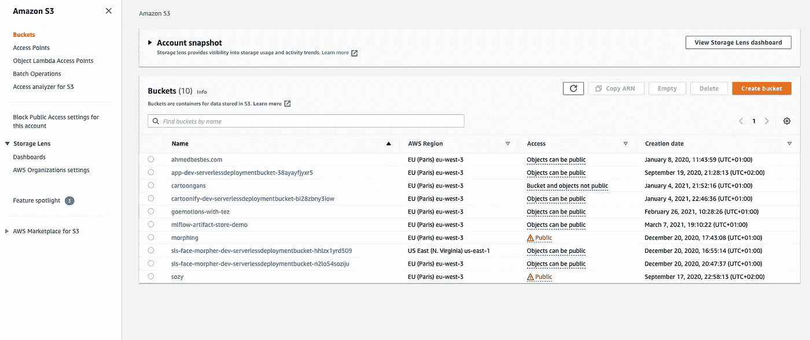
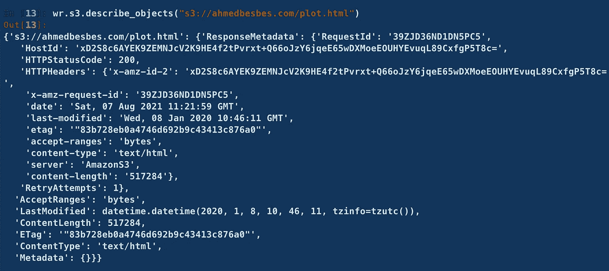

# 如何使用 AWS Data Wrangler 在 S3 上轻松执行 Pandas 操作

> 原文：<https://towardsdatascience.com/how-to-easily-perform-pandas-operations-on-s3-with-aws-data-wrangler-875672289aae?source=collection_archive---------8----------------------->

## 与 S3 交互，就像它是您的本地文件系统一样


照片由 [JJ 英](https://unsplash.com/@jjying?utm_source=medium&utm_medium=referral)在 [Unsplash](https://unsplash.com?utm_source=medium&utm_medium=referral)

我一直觉得通过编程与 S3 交互来执行简单的任务有点复杂和不直观，比如文件读取或写入、批量下载或上传，甚至大规模文件删除(使用通配符等)。

我的典型用例是处理我从 S3 下载(或保存到那里)的熊猫数据帧，数据格式有三种:CSV、JSON 和 Parquet，用于分析和处理。

在寻找 [boto3](https://boto3.amazonaws.com/v1/documentation/api/latest/index.html) (不要误会，这是一个很好的与 AWS 进行编程接口的包)的替代品时，我遇到了 [**AWS Data Wrangler**](https://github.com/awslabs/aws-data-wrangler) ，这是一个 python 库，它通过将数据帧连接到 AWS 数据相关的服务，如 Athena、Glue、Redshift、DynamoDB、EMR……以及最重要的(至少对我来说)S3，将 Pandas 的功能扩展到 AWS。

> **在本帖中，我将回顾 AWS Data Wrangler 轻松连接熊猫和 S3 的功能。**


作者图片

# 什么是 S3？


用户修改的图像

如果你不是 AWS 用户，S3 代表亚马逊简单存储服务。这是一套网络服务，你可以用它在任何时间，从网络上的任何地方存储任何数量的数据。

它为任何开发人员提供了对高度可伸缩、可靠、快速和廉价的数据存储的访问。

→要全面了解 S3，请查看官方[文档。](https://aws.amazon.com/s3/?nc1=h_ls)

**→** 为了能够使用 S3 并复制以下代码片段，您需要设置一个 AWS 帐户。

# 创建 IAM 用户


用户修改的图像

在使用 AWS Data Wrangler 之前，您必须创建一个 **IAM 用户**。

IAM 代表**身份和访问管理**:这是一种让你能够安全管理 AWS 服务和资源访问的服务。IAM 允许您创建用户和组，并使用权限来允许或拒绝对 AWS 资源的访问。

一旦创建了 IAM 用户，AWS 将为您提供两个凭证:`**Access key ID**`和`**Secret access key**`。您必须使用它们在您的机器上配置 AWS 概要文件。

然后，AWS Data Wrangler 将使用该配置文件代表您以编程方式访问 AWS 服务。

要创建 IAM 用户，请转到 AWS 控制台并搜索 IAM。在左上角的工具条上，点击`Users`。



用户截图

这将列出您已经创建的用户。要添加新的，点击`Add users`。



用户截图

为此用户输入一个名称，并分配给它`**Programmatic access**`。



用户截图

然后，将其添加到一个组中，以定义其权限集。为简单起见，授予 it 管理员访问权限，但是您可能希望将其限制为一组有限的权限。



用户截图

跳过标记步骤并验证用户创建。

创建用户后，屏幕上会出现凭证:`**Access key ID**`和`**Secret access key**`。我们将使用它们来配置 AWS 概要文件。



用户截图

# 配置 AWS 配置文件

要配置 AWS 概要文件，您必须首先按照本[指南](https://docs.aws.amazon.com/cli/latest/userguide/install-windows.html)安装 AWS CLI，然后输入以下命令

```
**aws configure --profile ahmed**
```

系统会提示您输入以前的凭据。只需这样做，并将区域名称和输出格式保留为默认值。



用户截图

现在，AWS 概要文件已经正确配置了。

为了让 AWS Data Wrangler 使用它，我们必须在实验开始时设置一个与 boto3 的默认会话:只需在脚本或笔记本的开头留下这些行。

后续命令将使用为此配置文件提供的权限。

# 使用 AWS Data Wrangler 与 s3 对象交互

首先，让我们安装 AWS 数据牧马人。

```
**pip install awswrangler**
```

在运行任何命令与 S3 交互之前，让我们看看我的 buckets 的当前结构。



用户截图

没什么特别的，只是一堆我用于个人项目的水桶。

AWS Data Wrangler 可以对这些桶执行基本操作:

*   **检查物体是否存在:**

```
**>>> wr.s3.does_object_exist("s3://ahmedbesbes.com/plot.html")
True**
```

*   **递归列出桶内的对象:**

```
**>>> wr.s3.list_objects("s3://ahmedbesbes.com")
['s3://ahmedbesbes.com/app.mp4',
 's3://ahmedbesbes.com/plot.html',
 's3://ahmedbesbes.com/pyldavis.html']**
```

*   **列出存储桶内的目录**

```
**>>> wr.s3.list_directories("s3://sozy")
['s3://sozy/assets/',
 's3://sozy/images/',
 's3://sozy/saved_images/']**
```

*   **显示每个桶的区域名称**

```
**>>> wr.s3.get_bucket_region("ahmedbesbes.com")
'eu-west-3'**
```

*   **获取每个对象的信息**

```
**>>> wr.s3.describe_objects("s3://ahmedbesbes.com/plot.html")**
```

这将输出一个描述文件的 JSON 对象。它包括内容类型、大小以及权限元数据等属性。



作者截图

`describe_objects`方法也可以接受一个文件夹作为输入。在这种情况下，它将返回一个 JSON 对象列表，每个对象描述文件夹中的每个文件。

# 读取、写入和删除操作

现在有趣的部分来了，我们让熊猫在 S3 上做手术。

*   **读取文件**

让我们从在 bucket 中保存一个虚拟数据帧作为 CSV 文件开始。

这就像与本地文件系统交互一样简单。这里有一件很酷的事情:如果`/csv/sub-folder/`还不存在，AWS Data Wrangler 会自动创建它。

*   **一次读取多个 CSV 文件:**

这个其实挺简单的。您所要做的就是传递一个远程路径列表。在幕后，AWS Data Wrangler 将沿着行轴(轴=0)连接四个数据帧。

*   **使用前缀**

假设您在一个文件夹中有 1000 个 CSV 文件，并且您想在一个数据帧中一次性读取它们。为此，您可以将文件夹的路径传递给`read_csv`方法。AWS Data Wrangler 将在其中查找所有 CSV 文件。

```
**wr.s3.read_csv(f"s3://{bucket}/csv/")**
```

*   **删除对象**

您可以使用`delete_objects`方法删除对象

该方法在 path 参数中接受 Unix shell 样式的通配符。

例如，假设您想要删除特定文件夹中的所有 1000 个 CSV 文件。

你应该这么做:

```
**wr.s3.delete_objects(f"s3://{bucket}/folder/*.csv")**
```

# JSON 和 Parquet 文件也是如此

您也可以对 JSON 和 Parquet 文件执行同样的操作

只需替换为:

*   `wr.s3.read_csv`带`wr.s3.read_json`或`wr.s3.read_parquet`
*   `wr.s3.to_csv`同`wr.s3.to_json`或`wr.s3.to_parquet`

# 下载和上传对象

*   **下载对象**

AWS Data Wrangler 使从 S3 下载对象变得非常容易。这是我开始使用它的主要原因。

要下载远程对象，只需使用 download 方法。该方法将对象的远程路径作为第一个参数，将保存对象的本地路径作为第二个参数。

或者，您可以以二进制模式下载对象。

*   **上传对象**

上传对象遵循相同的逻辑。

# 感谢阅读！

这篇文章收集了我在使用 AWS Data Wrangler 进行 per 时所做的笔记。我希望你觉得它们有用。

在后面的文章中，我将回顾其他 AWS 服务，如 DynamoDB 和 EMR，以及如何使用 AWS Data Wrangler 与它们进行交互。

就目前而言，如果你想深入了解，这里有一些值得一读的资源。

*   **AWS S3:**[**https://aws.amazon.com/s3/?nc1=h_ls**](https://aws.amazon.com/s3/?nc1=h_ls)
*   **AWS IAM:**[https://aws.amazon.com/iam/?nc2=type_a](https://aws.amazon.com/iam/?nc2=type_a)
*   **AWS 数据牧马人文档:**[**https://aws-data-wrangler.readthedocs.io/**](https://aws-data-wrangler.readthedocs.io/)
*   **Github:**https://github.com/awslabs/aws-data-wrangler[T21](https://github.com/awslabs/aws-data-wrangler)

下次见！


照片由[卡斯滕·怀恩吉尔特](https://unsplash.com/@karsten116?utm_source=medium&utm_medium=referral)在 [Unsplash](https://unsplash.com?utm_source=medium&utm_medium=referral) 上拍摄

# 新到中？您可以每月订阅 5 美元，并解锁无限的文章— [单击此处。](https://ahmedbesbes.medium.com/membership)