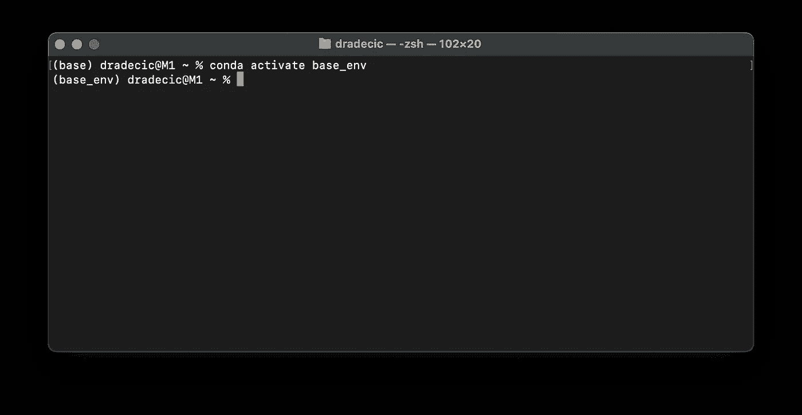
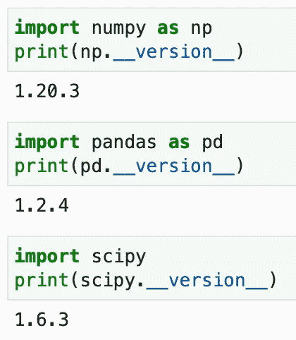
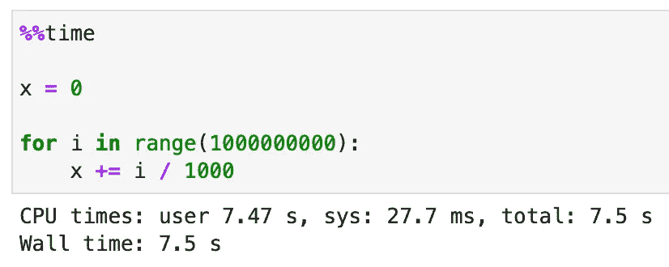
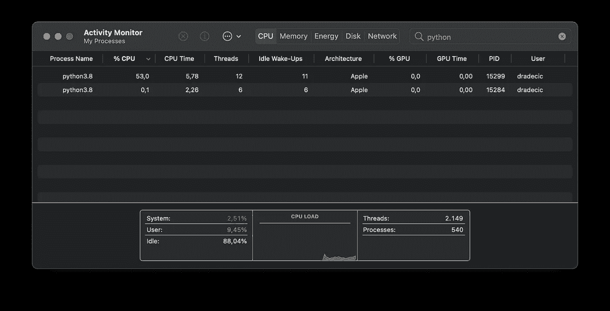
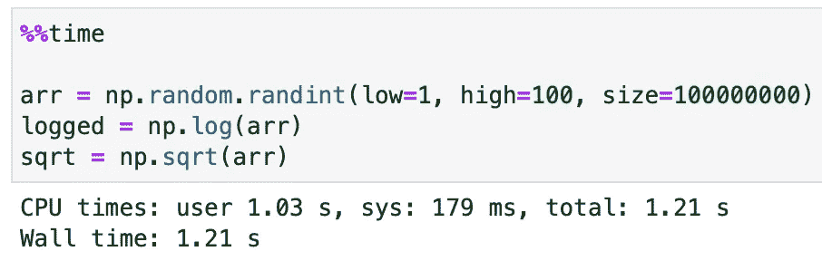
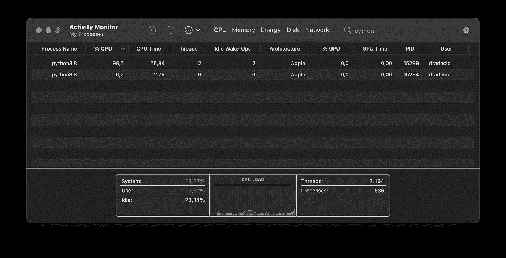
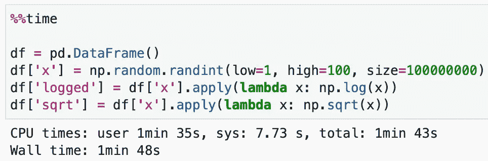
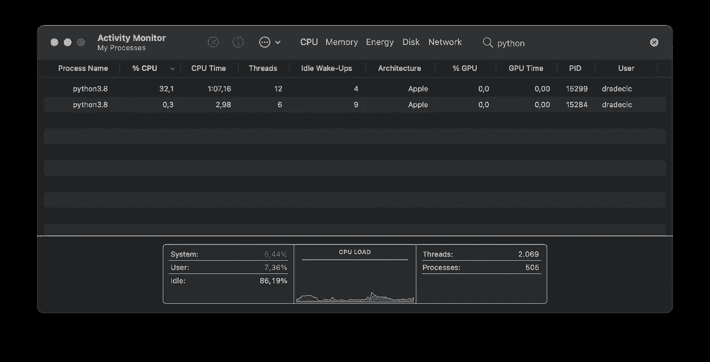

# 如何轻松设置 M1 macbook 进行数据科学和机器学习

> 原文：<https://towardsdatascience.com/how-to-easily-set-up-m1-macbooks-for-data-science-and-machine-learning-cd4f8a6b706d?source=collection_archive---------4----------------------->

## 你只需要 10 分钟。和一台 M1 苹果机。


安德烈·德·森蒂斯峰在 [Unsplash](https://unsplash.com/s/photos/mac-m1?utm_source=unsplash&utm_medium=referral&utm_content=creditCopyText) 上拍摄的照片

为数据科学配置 M1 MAC 可能是一件痛苦的事情。您可以选择更简单的方法，在 Rosseta 下运行所有东西，或者像疯子一样手动安装依赖项，面对永无止境的错误消息日志。

第一个选项很好，但是 Python 不能本地运行，所以会损失一些性能。第二个是，嗯，乏味又伤脑筋。

但是还有第三种选择。

今天，您将学习如何设置 Python，以便在任何 M1 芯片上通过 Miniforge 本机运行。我们还将通过一些例子来探索 Python 是否真的在本地运行。

这篇文章的结构如下:

*   安装和配置 Miniforge
*   性能试验
*   最后的想法

# 安装和配置 Miniforge

我花了很多时间为数据科学配置 M1 Mac 电脑。它从来没有一点瑕疵。直到我发现了这个选项。根据网速的不同，完全设置需要 5 到 10 分钟。

首先，你需要安装[自制软件](https://brew.sh/)。这是一个用于 Mac 的软件包管理器，您可以通过从终端执行以下行来安装它:

```
/bin/bash -c “$(curl -fsSL https://raw.githubusercontent.com/Homebrew/install/HEAD/install.sh)"
```

请记住——如果你正在安装一台新的 M1 Mac，很可能你不会安装自制所需的 *XCode 构建工具*。终端会通知您这些是否丢失，并询问您是否要安装它们。

一旦安装了 XCode 构建工具和 Homebrew，您就可以重启终端并安装 Miniforge:

```
brew install miniforge
```

这是几百 MB 的下载，所以需要一些时间来完成。完成后，再次重启终端。

**就是这样！Miniforge 现已安装，您可以创建虚拟环境并初始化 conda 了。以下终端行将基于 Python 3.8 创建一个名为“base_env”的虚拟环境:**

```
conda create — name base_env python=3.8
```

最后，初始化 Z shell (zsh)的 conda:

```
conda init zsh
```

只是为了好玩，在激活环境之前再次重启终端。调用“init”后，默认情况下将激活“base”环境。您可以通过执行以下行来更改它:

```
conda activate base_env
```

您应该会看到类似这样的内容:



图 1 —激活 conda 环境(图片由作者提供)

最后一步，让我们通过 conda 安装几个 Python 库:

```
conda install numpy pandas matplotlib plotly scikit-learn jupyter jupyterlab
```

仅此而已。接下来让我们做几个测试。

# 性能试验

如果你愿意的话，可以在虚拟环境中建立一个 Jupyter 实验室。首先，让我们导入常见的数据科学疑点——Numpy、Pandas 和 Scipy——只是为了验证一切工作正常:



图 2 —库导入和版本检查(作者图片)

接下来，让我们在没有任何库的情况下做一个简单的循环。代码如下:



图 3 —纯 Python 测试(图片由作者提供)

如您所见，该单元花了 7.5 秒完成。为了验证使用的是原生 Python 版本，而不是 Rosetta 下的 Intel 版本，我们可以在活动监视器中检查 *Python3.8* 的*架构*值:



图 4 —纯 Python 测试的活动监视器(图片由作者提供)

让我们用 Numpy 做下一个测试。下图中的代码生成一个大的随机整数数组，计算对数和平方根:



图 5 — Numpy 测试(图片由作者提供)

这是活动监视器:



图 Numpy 测试的活动监视器(图片由作者提供)

如你所见，Numpy 工作起来很有魅力。最后，让我们用熊猫做测试。我们将执行与 Numpy 相同的操作，因此无需进一步解释:



图 7-熊猫测试(图片由作者提供)

让我们再看一下活动监视器:



图 8-熊猫测试的活动监视器(图片由作者提供)

这就证明了 Python 和它的数据科学库都可以轻松配置。接下来让我们总结一下。

# 最后的想法

总之，在为数据科学配置新的 M1 Mac 电脑时，没有必要去碰壁。当然，这个过程和英特尔的不一样(除非你用的是 Miniforge)，但是这个过程仍然很简单。

请继续关注更多 M1 测试以及与其更大的兄弟-2019 年的 16 英寸英特尔 i9 的详细比较。

感谢阅读。

*喜欢这篇文章吗？成为* [*中等会员*](https://medium.com/@radecicdario/membership) *继续无限制学习。如果你使用下面的链接，我会收到你的一部分会员费，不需要你额外付费。*

<https://medium.com/@radecicdario/membership>  

# 了解更多信息

*   [Python 3.10 的新特性–您应该尝试的 4 个惊人特性](/whats-new-in-python-3-10-4-amazing-features-you-should-try-4f3044871476)
*   [如何用 Cron 调度 Python 脚本——你需要的唯一指南](/how-to-schedule-python-scripts-with-cron-the-only-guide-youll-ever-need-deea2df63b4e)
*   [Dask 延迟——如何轻松并行化您的 Python 代码](/dask-delayed-how-to-parallelize-your-python-code-with-ease-19382e159849)
*   [如何使用 Python 创建 PDF 报告—基本指南](/how-to-create-pdf-reports-with-python-the-essential-guide-c08dd3ebf2ee)
*   [2021 年即使没有大学文凭也能成为数据科学家](/become-a-data-scientist-in-2021-even-without-a-college-degree-e43fa934e55)

# 保持联系

*   关注我在[媒体](https://medium.com/@radecicdario)上的更多类似的故事
*   注册我的[简讯](https://mailchi.mp/46a3d2989d9b/bdssubscribe)
*   在 [LinkedIn](https://www.linkedin.com/in/darioradecic/) 上连接