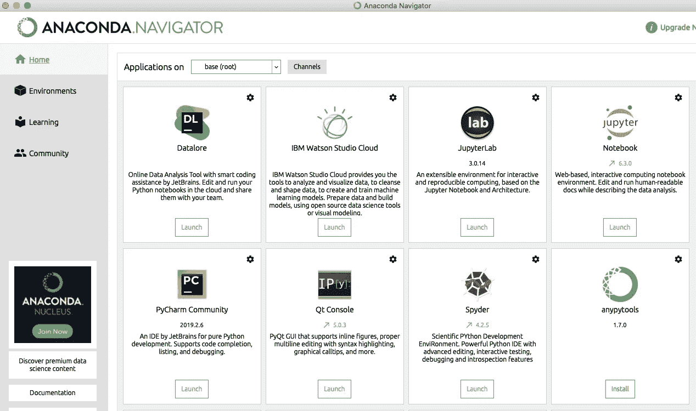
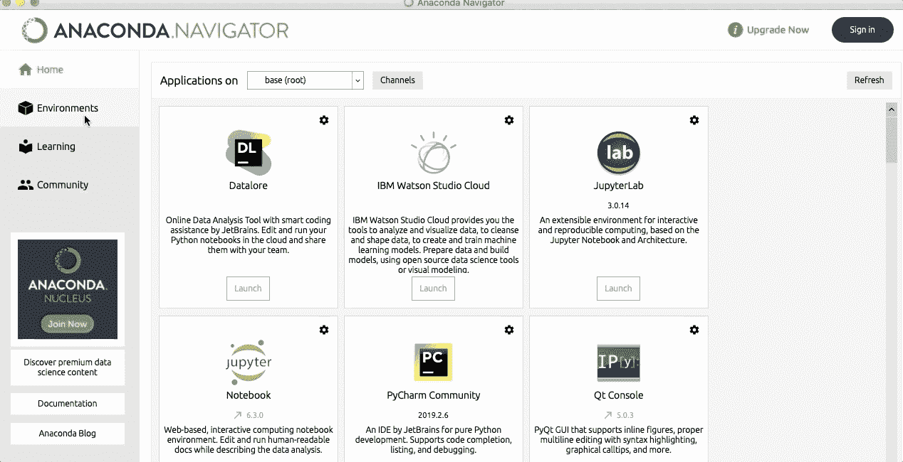

# 如何在任何 M1 Mac 上轻松设置 Python

> 原文：<https://towardsdatascience.com/how-to-easily-set-up-python-on-any-m1-mac-5ea885b73fab?source=collection_archive---------0----------------------->

## 在 M1 Mac 上正确安装 Python 和所有数据科学包的两种简单方法


Dmitry Chernyshov 在 [Unsplash](https://unsplash.com?utm_source=medium&utm_medium=referral) 上拍摄的照片

买了一台 M1 Mac 后，我意识到在新的 Mac 机型上正确设置 Python 和所有数据科学包(以及非数据科学包)是多么令人困惑。

根据这篇关于苹果芯片的长篇 [Anaconda 指南](https://www.anaconda.com/blog/apple-silicon-transition),在 M1 上运行 Python 有 3 种选择——pyenv、Anaconda 和 miniforge。

在本指南中，我将向您展示如何使用 anaconda 和 miniforge 在任何 M1 Mac 上轻松设置 Python。Anaconda 一次安装就带来了数据科学中使用的所有工具(包括 Python 和 Jupyter Notebook)和包，而 miniforge 让你可以自由地按照自己的意愿设置 conda 环境，所以你需要自己安装任何包。

*注意:本指南中提到的方法不会帮助你在 M1 MAC 上运行 Python，而是通过 Rosetta2。Python 可以很好地工作，只要记住* [*与原生 ARM64*](https://www.anaconda.com/blog/apple-silicon-transition) 相比，使用 Rosetta2 运行 x86–64 程序时，人们会看到 20–30%的性能损失

```
**Table of Contents** 1\. [Setting up Python and Data Science Packages with Anaconda](#6ef3)
 - [Step 1: Download and Install Anaconda](#cb9f)
 - [Step 2: Launch Jupyter Notebook/Lab](#57a6)
 - [Step 3: Install any additional library](#fe78)
2\. [Setting up Python with Miniforge](#c3d4)
 - [Step 1: Install Homebrew](#9400)
 - [Step 2: Install miniforge](#dab6)
 - [Step 3: Setup and activate a virtual environment](#8ea8)
 - [Step 4: Install any Python library](#52f4)
```

# 选项 1:用 Anaconda 设置 Python 和数据科学包

下面的步骤将帮助您下载 Anaconda 安装程序以及用于数据科学的所有包。有了这个选项，我们将能够使用图形化安装程序来管理 Anaconda。

## 步骤 1:下载并安装 Anaconda

转到 [Anaconda](https://www.anaconda.com/) 并点击“开始”按钮。将会出现一个列表，选择选项“[下载 Anaconda 安装程序](https://www.anaconda.com/products/individual#Downloads)”在这里，您将看到所有操作系统的 Anaconda 安装程序。

下载任何用于 macOS 的 64 位安装程序(由于 Rosetta2 *，这两个程序都可以很好地用于 M1 机型)。在我的例子中，我选择了“64 位图形安装程序”来拥有 Anaconda 提供的漂亮的 GUI。*

下载文件后，打开它安装 Anaconda。将弹出一个窗口，按“继续”开始安装。

## 步骤 2:启动 Jupyter 笔记本/实验室

一旦 Anaconda 安装完毕，您将会看到一个代表 Anaconda 徽标的绿色圆形图标。点击它运行 anaconda。如果您像我一样下载了图形安装程序，您将会看到如下所示的 Anaconda navigator。



作者图片

数据科学的主要应用是 Jupyter 笔记本和 Jupyter 实验室。让我们启动它们中的任何一个，并导入几个数据科学库，以检查所有设置是否正确

```
import pandas as pd
import numpy as np
```

第一次导入库时，可能会花费比平时更多的时间。

## 步骤 3:安装任何附加库

Anaconda 为数据科学带来了最常见的包，但是您最终可能需要安装一些额外的库。

为此，请转到左侧的“环境”部分。然后选择您正在使用的环境(默认情况下称为“基本”)，点击下拉菜单，并选择“未安装”在此之后，将显示通过康达-福吉渠道提供的所有包。在搜索框中，您可以编写任何您想要的库，然后选中复选框来安装库。



作者图片

就是这样！您已经准备好将 Python 用于数据科学。如果有不清楚的地方，查看下面的视频了解更多细节。

# 选项 2:用 Miniforge 设置 Python

Miniforge 允许你安装 conda 包管理器。这个选项给你自由设置 conda 环境，所以你需要自己安装任何包。

## 步骤 1:安装自制软件

要轻松安装 miniforge，首先，我们需要安装 Homebrew。家酿是一个开源的软件包管理系统，简化了 macOS 上的软件安装。

要安装家酿，去这个[网站](https://brew.sh/)。在那里，您会发现下面的代码，您需要在终端中运行。

```
/bin/bash -c "$(curl -fsSL https://raw.githubusercontent.com/Homebrew/install/HEAD/install.sh)"
```

终端将要求您的用户输入密码。介绍它，然后按 return/enter 继续。

注意:要安装 Homebrew，你需要安装 *XCode 构建工具*。如果你不确定你是否已经拥有它，不要担心；终端会让你知道 *XCode 构建工具*是否丢失，并要求安装。

## 步骤 2:安装 miniforge

一旦安装了 Homebrew，重启终端并安装 miniforge，运行下面的命令。

```
brew install miniforge
```

如果你得到错误`zsh: command not found: brew`，可能自制程序被保存在`/opt/homebrew/` 而不是`/user/local/…`T11 中。如果是这样，你必须用下面的命令修改你的路径(更多细节在 [StackOverflow](https://stackoverflow.com/questions/36657321/after-installing-brew-i-get-command-not-found-brew) )。

```
export PATH=/opt/homebrew/bin:$PATH
```

这之后就可以使用`brew`并安装 miniforge 了。现在是创建和激活虚拟环境的时候了。

## 步骤 3:设置并激活虚拟环境

要安装虚拟环境，请在终端上运行以下命令。在这个例子中，我将使用 Python 3.8 创建一个名为`test_env`的新环境

```
conda create --name test_env python=3.8
```

此后，您必须运行以下命令来激活环境。

```
conda activate test_env
```

## 步骤 4:安装任何 Python 库

最后，您可以安装运行以下命令的 Python 包。

```
conda install PACKAGENAME
```

让我们安装数据科学中使用的最流行的 Python 库。

```
conda install numpy
conda install pandas
conda install matplotlib
conda install plotly
conda install scikit-learn
```

你还应该安装 Jupyter 笔记本和/或 Jupyter 实验室。

```
conda install jupyter
conda install jupyterlab
```

要运行 jupyter 笔记本，请在终端上运行以下命令。

```
jupyter notebook
```

就是这样！您已经准备好将 Python 用于数据科学。

<https://frankandrade.ck.page/bd063ff2d3>

**如果你喜欢阅读这样的故事，并想支持我成为一名作家，可以考虑报名成为一名媒体成员。每月 5 美元，让您可以无限制地访问数以千计的 Python 指南和数据科学文章。如果你用[我的链接](https://frank-andrade.medium.com/membership)注册，我会赚一小笔佣金，不需要你额外付费。**

**<https://frank-andrade.medium.com/membership> **