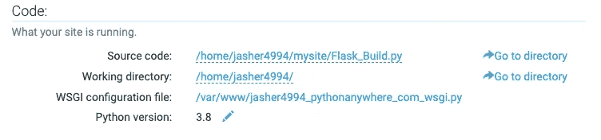

# 如何轻松地在你的网站上动态显示 Matplotlib 图和 Pandas 数据框

> 原文：<https://towardsdatascience.com/how-to-easily-show-your-matplotlib-plots-and-pandas-dataframes-dynamically-on-your-website-a9613eff7ae3?source=collection_archive---------5----------------------->


卢卡斯·布拉塞克在 [Unsplash](https://unsplash.com?utm_source=medium&utm_medium=referral) 上的照片

## 用不到 100 行代码，一个令人惊讶的简单方法，向全世界展示你的 Matplotlib 图和 Pandas 数据帧。

H 你有没有想过从你的笔记本电脑或手机上获得一个可视化或数据框架，而不必每次都运行代码？如果你能让它在后台运行，并拥有一个可以随时随地(通过互联网连接)访问数据的网址，这不是很好吗？尤其是当有新数据时可以自动更新的。

事实证明，你可以，而且一点也不难。上周我只是从谷歌上自学了如何做到这一点，但那里有很多垃圾，所以这里是我发现的最简单的方法。可能有我不知道的更好的选择，所以如果有，请让我知道。我很好奇。然而，这种方法绝对可以保证的是简单性。它也不会花你一分钱。我也绝对不是一个网络开发人员，所以我提前道歉，如果我谋杀了任何术语。

本文对您的期望不高，对 Python 有基本的了解就可以了。对 HTML 有一点了解是有益的，但绝对不是必要的。理解 Flask 会让这变得很容易，但是如果你了解 Flask，你可能已经知道如何去做了。这个结构看起来有点像这样，你可以在一个小时内真正地让它运行起来，没问题。

*   *设置烧瓶*
*   *基本路由*
*   *熊猫数据帧*
*   *Matplotlib 图*
*   *托管在 PythonAnywhere 上*

**设置烧瓶**

这不是一篇关于网页设计的文章，因为我肯定没有资格谈论它。这是一篇关于如何在你的网站上获得数据框架和图表的文章。最重要的是自动更新的绘图和数据帧。你可以“保存”你的图表，把它们塞进你的静态文件夹，当新的数据进来时不断更新它们，但那是苦差事，我不喜欢苦差事。

所以，首先，我们要做的是有一个非常简单的两页网站。一页展示你的精彩图表，一页突出你美丽的熊猫数据框。

它看起来会和这个一模一样。

我知道非常难看，但是你可以用一些 CSS 或 JS 让它看起来更漂亮，但是那是以后的事了。这只是简单地告诉你如何让他们在那里，你可以担心让他们看起来很漂亮。

这是代码。我将一节一节地讲解。如您所见，主文件只有 69 行。

确保不要将该文件命名为 Flask.py，因为这将与 Flask 本身冲突。

我们可以从第 0–16 行开始。这些都是需要导入的东西，第一部分**(第 4 行)**是帮助你处理所有路由和网站结构的 flask 包。它们的名字都是不言自明的，你不必想太多。正如你所看到的，其中的一些，你实际上并不需要它的基本版本。然而，它们非常有用，所以我倾向于总是导入它们。

下一个**(第 6-12 行)**的导入都是为了绘制你的数据。同样，这些都很常见，不言自明。唯一一个可能会引起你注意的是**第 11 行**——‘matplotlib . use(' Agg)’。出于某种我不完全理解的原因，默认的 plt 后端不能很好地与 Flask 一起工作——这一行代码修复了它。如果你不使用 plt，不要担心，但是如果你使用，我建议你把它包括进来。第 15 行只是我们稍后需要的另一个包，当我们谈到它时，我会尽力解释。

现在，我们需要一些数据来使用。在这个文件中，我有两种方法，没有被注释掉的方法是我认为最容易获取数据的方法。让熊猫通过 CSV 文件带进来就行了。然而，这有几个问题。首先，当以后在 PythonAnywhere (PA)上托管网站时，路径可能会不同，并且相对于 PA 环境，而不是本地桌面。因此，请确保根据您是在本地测试还是试图在线发布来指定正确的路径。其次，这不会自动更新，除非您自动更新 CSV 文件。如果你想让数据自动更新，那么我个人的偏好是定义一个函数，从互联网上抓取数据，并将其清理到一个熊猫数据框架中。我不会在本文中深入探讨，但是在这个 [GitHub repo](https://github.com/jasher4994/StatisiticalWebsiteTemplate) 中有一个例子，以及这个小项目中涉及的其余代码。因此，要使这些图“动态”，你所要做的就是找到一个动态数据源(互联网通常是最好的)并创建一个文件，每次主文件运行时它都会抓取数据。**第 19 行和第 21 行**调用另一个文件中的函数，该文件通过搜索互联网来完成这一任务。

好的，最后，谈谈 flask 应用程序本身。你要做的第一件事就是初始化应用程序— **line 25** 。个性化是有空间的——但我不会。很容易把事情搞砸。我总是坚持那条路线。

**基本路由**

Flask 使用 route decorators 让您指定应该在每个 URL 上执行哪些函数。因此，这里的想法是创建两个返回两个不同函数的 URLs 一个显示我们的数据框架，另一个显示我们的绘图。基本的路线装饰可以在**28 行看到。**这个 decorators 参数仅仅是“/”，它有效地告诉 Flask 这是我们的主页，下面的函数应该从我们的起始 URL 运行——在我的例子中是:[http://jasher4994.pythonanywhere.com/](http://jasher4994.pythonanywhere.com/)。正如你所看到的，如果你把“/”从 URL 中去掉，那么什么都不会改变。因此，要创建带有扩展 URL 的新页面，只需用 route decorator 创建一个新页面。这是我们下面要做的。

**熊猫数据帧**

所以，首先，我们可以为我们的熊猫做一个数据框架，我们也可以做我们的主页。我们已经在**第 28 行**中看到了 route 操作符，所以我们可以扩展它并在**第 29 行创建一个名为“Pandas”的新页面。**这次我们做了完全相同的事情，除了创建一个名为“Pandas”的新 URL，并声明我们想要使用“POST”和“GET”方法。这是两种最常见的 HTTP 方法，分别用于向服务器发送和请求数据。

因此，我们现在有两个 URL 将调用同一个函数。该功能在第 30 行**中定义如下。**这是一个传统的 Python 函数，它返回另一个函数——“render _ template()”。这个函数非常有用，它有效地告诉 Flask 从你的 templates 文件夹中呈现一个 HTML 模板(模板必须在一个名为“templates”的子目录中，所以要确保它是)。下面是你需要创建的 HTML 模板。这非常简单，只需要将第 7–10 行代码添加到传统的 HTML 模板中。第 7 行甚至不需要在那里，它只是一个标题标签。

这是怎么回事？在主文件的第 33 行中，我们将“表格”作为参数传递给渲染模板函数。该表只是我们的 pandas 数据帧，其中应用了“to_html()”方法。我很肯定你能猜到那是什么。这一行的其余部分只是指定我们是否需要像索引和列标题这样的东西。然后，在我们的 HTML 文件中，我们可以使用这个表。

Flask 在这里实际上使用了 Jinja2(一个创建 HTML 的 python 模板引擎),这就是你在第 7–10 行看到的。你不必太担心这一点，但是这 3 行有效地在 HTML 中显示了你的表格。

就这么简单！如果您现在在终端中运行主文件，您应该会得到一个本地链接，您可以复制并粘贴到您的浏览器中，您应该会看到您的数据帧！

**Matplotlib 地块**

Matplotlib 图一开始在 Flask 中工作似乎有点困难，但最终证明它们非常简单。在这一部分，我们将自下而上地工作，请耐心等待。

如果您的图形从不更改，您可以将它作为静态文件放在 images 文件夹中，并直接引用它。

然而，如果它确实需要定期改变，那么这种方法是适合你的。例如，我在这里使用的数据是足球队预期的零失球(他们不会失球的概率)。这当然会随着对手的不同而改变。所以，我有另一个文件定期抓取和更新这些数据。如果我把它作为一个静态文件，它不会更新，只会显示第一周的图表。用这种方法，情节将显示在飞行中，我将永远不需要更新它。我从未在“实时”数据上测试过这一点，我怀疑它不会工作得很好，可能需要一些 JavaScript。如果你的数据每天更新，甚至每小时更新一次，我怀疑这种方法绝对有效。

回到 Python 文件中的 Matplotlib 部分**(第 50–63 行)**，我们可以先看看 create_fig()函数。所有这些只是创建一个数字(图形)并绘制出我们想要的数据。在这种情况下，它在 x 轴上绘制“团队”,在 y 轴上绘制“预期目标”。出于美观的原因，我已经更改了 x 刻度的颜色和旋转。

向上移动，我们到达 plot_png()函数**(44–48)**。这个稍微复杂一点，但是不多。简而言之，它创建了一个网页，只显示我们之前显示的图形——以 png 格式。BytesIO()'创建一个内存缓冲区，可以选择用您作为参数提供的数据填充，并允许您对它进行类似文件的操作。

这将产生一个只有我们在上面创建的图像的网页。再次，创建一个新的路线，如前所述，可以在这里看到[。这很有用，但还不够有用。当然，在未来，我们可能希望在同一页上有一些描述我们可爱情节的文字，或者其他一些情节——而不仅仅是充满一个大情节的一页。](http://jasher4994.pythonanywhere.com/plot.png)

因此，我们希望我们的情节成为页面的一部分，而不是整个页面。

因此，我们创建一条最终路线(第 38–40 行),并呈现我们的第二个也是最后一个模板，如下所示。

可以看出，这非常容易。只有两行不同于标准 HTML 模板的代码——其中一行是标题！**第 7 行**是这里最重要的一行，它转到我们之前用整页 png 创建的路径，获取图像，然后将它放到我们的 HTML 文件中。现在图像是我们页面的一部分，并没有吞噬整个页面。

哒哒！现在，您可以在浏览器上显示您的绘图和数据帧了。不过，这只是局部的，所以用处不大。幸运的是，用 pythonanywhere 把它们发布到网上让全世界看到是非常简单的。下一节将向您展示如何做到这一点。

**在 Python anywhere 上托管**

现在，最后一步，托管你的网站。 [pythonanywhere](http://www.pythonanywhere.com) (PA)是做这件事的一个很棒很简单的地方。如果操作正确，您也可以在不到五分钟的时间内启动并运行。所以，一旦你用三个文件(你的主 Flask 文件和你的两个 HTML 文件)创建了一个 PA 账户，你只需要一个初学者账户就可以了——这是免费的。一旦你注册完毕，你应该会看到一个类似这样的面板。


在这里，我们将主要使用“Web”和“Files”选项卡，但是不需要太多的想象力就能想到其他选项卡提供了什么。

首先，我们需要创建我们的 web 应用程序。因此，在左侧的仪表板上，单击“添加新的 web 应用程序”，然后按照说明进行操作。选择您使用的 Python 版本，当然，Flask 是您的框架。然后它会为你创建一个 web 应用程序，你可以指定名称——为了简单起见，我称我的应用程序为“我的网站”。

所以现在我们需要做的是，把我们的文件放到 PA 里。如果你知道 Git，太棒了，PA 有一个控制台，你可以直接打开和拉你的库，然后你就可以开始了。

对于不了解 Git 的人来说，这也非常简单，我将在下面向您展示如何操作。首先，去文件区。然后，在左侧，单击您的 web 应用程序路径(我的网站)。在这个目录中添加您的 Flask 文件。然后在这个目录中，创建一个名为“templates”的新目录。对 Flask 来说，准确地完成这一步很重要，这样它就知道在哪里寻找 HTML 模板。然后在这个新的模板目录中添加两个 HTML 文件。应该是这样的。


快到了！您必须检查的最后一件事是确保源代码是直接指定的。如果看起来不像这样..



那就改改看。

..最后！点击顶部那个性感的绿色大按钮来重新加载你的应用，然后点击链接。

瞧，你现在有熊猫和 Matplotlib 在网页上运行。Python anywhere 将免费为你无休止地运行这个网站，但你必须每三个月登录一次，让他们知道你还活着，你仍然想运行这个网站。不过，他们会在一周前给你发邮件，所以没必要设置任何提醒。

一旦你开发出这样一个不错的框架，利用像 https://getbootstrap.com/这样的资源让一个网站看起来相当专业就变得非常简单了。

我真的希望这有所帮助，任何反馈都将不胜感激。下面是我写的一些类似的文章，你可能会喜欢。

```
If I’ve inspired you to join medium I would be really grateful if you did it through this [link](https://jamesasher4994.medium.com/membership) — it will help to support me to write better content in the future.If you want to learn more about data science, become a certified data scientist, or land a job in data science, then checkout [365 data science](https://365datascience.pxf.io/c/3458822/791349/11148) through my [affiliate link.](https://365datascience.pxf.io/c/3458822/791349/11148)
```

[](/how-to-use-data-and-psychology-to-get-more-data-1749996ea704) [## 如何利用数据(和心理学)获得更多数据

### 在进行研究调查时，使用这些技巧平均能让我多得到 70%的回答。

towardsdatascience.com](/how-to-use-data-and-psychology-to-get-more-data-1749996ea704) [](/how-to-analyze-survey-data-in-python-c131764ea02e) [## 如何用 Python 分析调查数据

### 以下是一些使用 Python 清理、分析和可视化调查数据的技巧和代码。

towardsdatascience.com](/how-to-analyze-survey-data-in-python-c131764ea02e) 

干杯，

詹姆斯