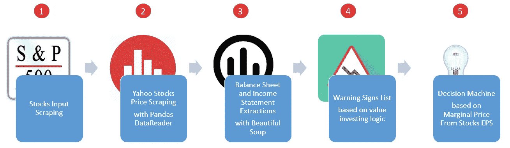
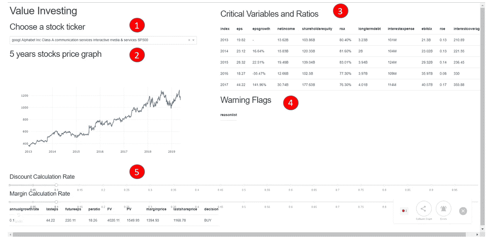

# 如何有效地让您的数据项目取得成功

> 原文：<https://towardsdatascience.com/how-to-effectively-set-your-data-projects-for-success-c0927c24d7aa?source=collection_archive---------39----------------------->

## 给有抱负的数据科学家的个人建议

## 原型设计来测试、说服和指导您的数据项目

来源( [Unsplash](https://unsplash.com/photos/1UMrSoItdDE) )

# 问题陈述

> 哪些分析方向会用最少的时间带来最多的影响？
> 
> 在失败的数据项目中如何避免沉没成本？

> 87%的数据项目将会失败— [2019，克里斯·查珀，Gap 的数据和分析 SVP](https://venturebeat.com/2019/07/19/why-do-87-of-data-science-projects-never-make-it-into-production/)

## 数据科学项目非常昂贵

每一个 ML 模型都必须在它的整个生命周期中被训练、生产和支持。它需要来自多个利益相关者(用户、工程师、运营、科学家等)的巨大支持来培育模型。

偶尔，可能会有一只黑天鹅和巨大的破坏(例如:疫情)使你的模型无用(又名:[概念漂移](https://en.wikipedia.org/wiki/Concept_drift#:~:text=In%20predictive%20analytics%20and%20machine,less%20accurate%20as%20time%20passes))。[如果没有适当的支持，这将是您最大和最昂贵的数据科学噩梦](/intro-to-mlops-ml-technical-debt-9d3d6107cd95)例如:

*   [在最好的黄金时段，亚马逊的价格从 13，000 美元的相机镜头涨到 94 美元](https://www.washingtonpost.com/technology/2019/07/20/amazons-best-prime-day-deal-was-likely-an-accident/)。
*   [网飞浪费了 100 万美元来奖励一个他们无法采用的机器学习模型。](https://www.wired.com/2012/04/netflix-prize-costs/)

**事实上，** [**根据 Chris Chapo 的说法，87%的 AI 项目失败都是因为这三个原因:**](https://venturebeat.com/2019/07/19/why-do-87-of-data-science-projects-never-make-it-into-production/)

*   **金钱驱动的投资:**对人工智能的过度宣传让许多投资者认为成功来自于对技术的投资。这导致了“总是成功”的心态，失败不是一个选项。
*   **垃圾数据发现得太晚**:由于项目负责人之间的适当数据通信失败，但被伪装成成功或“*在制品(WIP)* ”。
*   **复杂的数据管理工作:**访问统一数据需要巨大的努力(基础设施、专业人员等)。更不用说堆积在复杂数据基础设施中的技术债务了。

> **但是后来……**
> 
> 我们怎么知道这个数据项目不是一艘泰坦尼克号，在索赔中不沉，但在第一次航行中沉没？
> 
> 我们如何知道这个解决方案是否有效，而不会浪费资源(金钱、时间、人力)？

# 为什么:用于测试、说服和指导的原型

## 测试:更快地排除失败的假设

> 不要试图煮沸海洋，而是选择一个痛点来解决，在那里你可以展示明显的进步——Chapo

拥有一个原型有助于您消除失败的假设，避免沉没成本，因为您可以做出明智的决策来部署产品。

小项目成功总比大项目失败好。这种快速的尝试-失败-重复过程还允许企业以更及时的方式消除失败的假设并发现有用的假设。

例如，当我接到一个新项目时，我会快速开发设计文档，并进行小实验来决定下一个最佳的战略分析方向。

**类似地，你也可以使用类似的推理来启动每一个数据项目，例如:**试验社交媒体功能以进行品牌分析，通过聚类进行功能工程，等等。

## **劝说:加大对 ML 项目的支持力度**

> 团结你的利益相关者来拥有金块。

数据科学家从不独自工作。在每一个数据项目中，您都需要获得运营、分析师和工程师的支持，以支持基于 ML 的解决方案。

因此，每个数据项目都需要可靠的沟通来传播让利益相关者兴奋的想法和知识。

这就是为什么原型很重要。原型将抽象的代码简化为有形的应用程序，通过我们的五种感官(听觉、触觉、嗅觉、视觉和味觉)吸引我们。

在交互式笔记本或 Shell 脚本中通过文本显示结果是不够的，但拥有一个可视化的仪表板，利益相关者可以在其中进行交互，这将在您的解决方案中建立他们的兴奋感和所有权。

## **指南:为想法的成功设定关键方向**

> 原型使关键的想法和数据项目得以发展

数据科学家的定位是确定需要大量时间和精力的分析方向。

拥有一个原型对于生成做出明智决策所需的反馈来决定分析方向是很重要的。有了更多的反馈，你将对什么以及如何为你的利益相关者创造价值有更好的认识。

此外，想法滋生想法。例如，证明基于计算机视觉的解决方案在产品推荐中的功效的简单原型可以重新用于欺诈检测，甚至自动贴标。

这意味着原型可以让你的想法快速发展和转移。你的影响力不仅会扩大到你各自的团队，还会扩大到对你的想法感兴趣的其他职能部门。

> 原型构建快速概念验证(POC)来测试、说服和指导每个大规模数据项目——Vincent Tatan

# 如何:原型制作需要学习哪些工具？

> 使用 Web 仪表盘、Python Web 框架和 AI 原型框架。

在这个主题中，我想强调几个工具，从最简单到最简单的方式来构建一个原型。总的来说，我建议您从简单的工具开始，以节省时间，然后在需要时构建更高级的数据原型。

## 网络仪表板(谷歌数据工作室)

[您可以在 10 分钟内构建一个交互式网络仪表盘](/how-to-build-a-great-dashboard-ee0518c3d3f7)。

**使用这种方法最简单的方法是:**

*   对数据集运行 Python 脚本并将预测转储到静态文件中(例如:CSV/excelsheet)
*   根据你的预测创建一个谷歌数据工作室仪表盘
*   允许你的利益相关者访问和互动。

这些是如何使用连接的数据集快速构建仪表盘的一些示例。

[在 10 分钟内建立一个数据工作室仪表板](/how-to-build-a-great-dashboard-ee0518c3d3f7)(来源于作者)

[创建使用 Instagram API 进行社交媒体分析的原型/工具。(作者为 Yayasan Merajut Hati——一个总部设在印度尼西亚的心理健康组织提供)](/accessing-facebook-api-for-instagram-business-568cfe3efb77)

## Python Web 框架(Dash/Flask)

如果你想要一个直接在内存上运行预测的解决方案，你可以使用 Flask 和 Dash 这样的 Web 框架来交互式地运行预测。

总的来说，Dash 允许你设置 webhooks 来启动预定义的操作，并通过 Plotly 在交互式视觉效果中当场呈现结果。

这里有一个例子，我建立了一个价值投资仪表板来预测股票的买入/卖出判断。

[原型价值投资计算(买入/卖出)带破折号](/value-investing-dashboard-with-python-beautiful-soup-and-dash-python-43002f6a97ca)(来源于作者)

## 数据原型框架(例如:Streamlit)

> **Streamlit** 是一个开源的 Python 库，可以轻松创建和共享漂亮的定制 web 应用程序，用于机器学习和数据科学。只需几分钟，您就可以构建和部署强大的数据应用程序— [Streamlit.io](https://streamlit.io/)

我没有探索过 Streamlit.io，但是我发现 Chanin Nantasenamat(又名数据教授)教程非常有用。

拥有一个直观且易于使用的框架将会让你在不花费太多时间的情况下构建数据项目的原型。

【FreeCodeCamp.org 简化 Youtube 教程

# 总之:原型是快速失败的基本方法

通过原型设计，你可以让自己很快失败。对原型技术的投资将测试、说服并引导您的数据项目走向成功。

**总之，原型设计对于将您的想法付诸实践并通过以下方式产生共享影响非常重要:**

*   **测试**:更快地排除失败的假设。
*   **说服**:加大对 ML 项目的支持力度
*   **指南**:为想法的成功设定关键方向

我希望这能帮助您理解为什么原型设计很重要，并使用它来交付真实的数据影响。

索利·德奥·格洛丽亚

# 关于作者

文森特用 ML @ Google 对抗网络滥用。文森特使用高级数据分析、机器学习和软件工程来保护 Chrome 和 Gmail 用户。

除了在谷歌的工作，文森特还是[乔治亚理工学院计算机科学硕士校友](/5-biggest-tips-to-juggle-work-and-study-as-data-scientists-7cad143f10a)、三项全能运动员和[面向数据科学媒体的特约作家，该媒体在全球拥有超过 100 万的观众，为有志于数据科学的人和数据从业者提供指导](https://medium.com/@vincentkernn)。

最后，请通过[**LinkedIn**](http://www.linkedin.com/in/vincenttatan/?source=post_page---------------------------)**、**[**Medium**](https://medium.com/@vincentkernn?source=post_page---------------------------)**或** [**Youtube 频道**](https://www.youtube.com/user/vincelance1/videos?source=post_page---------------------------) 联系文森特