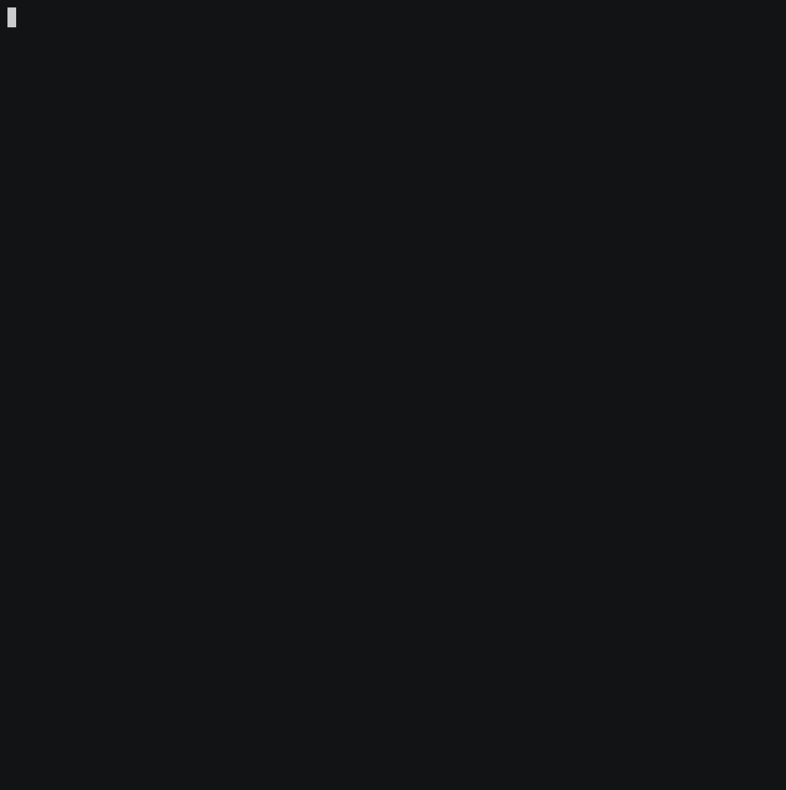
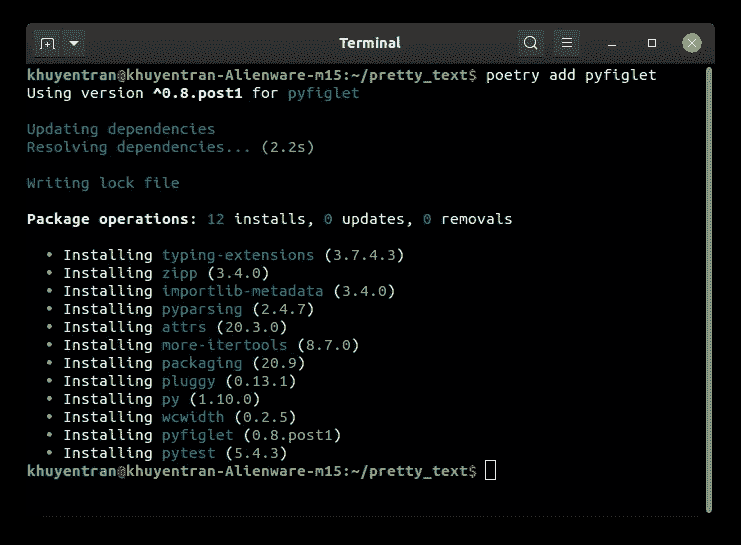
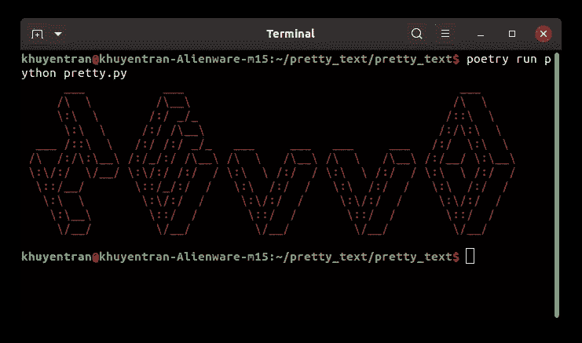
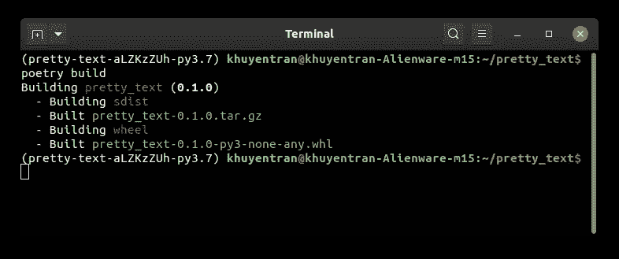
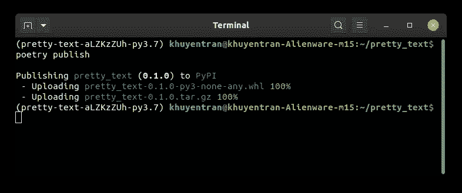
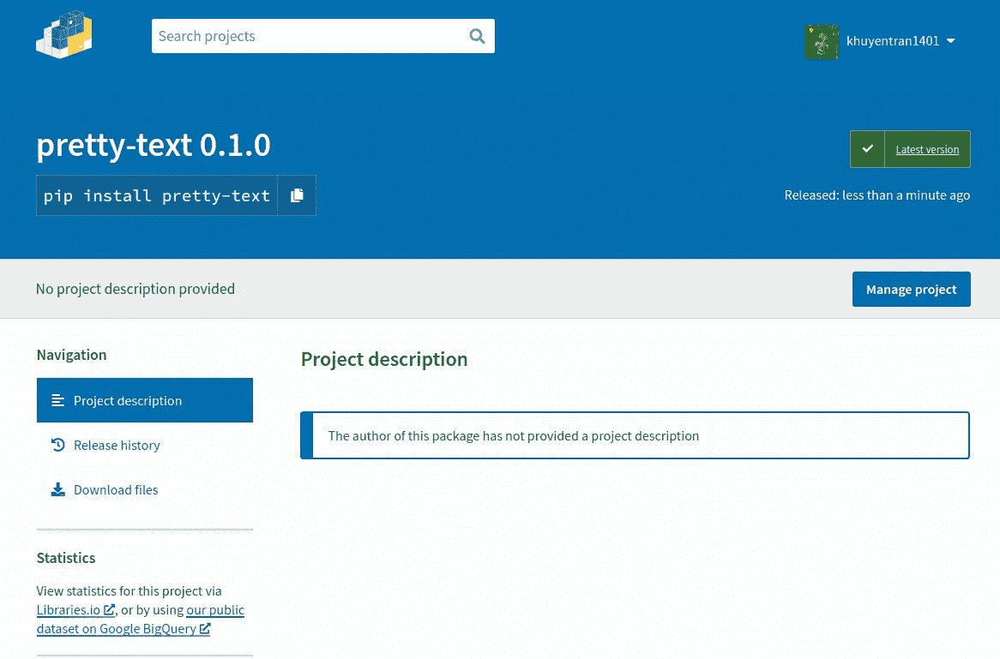
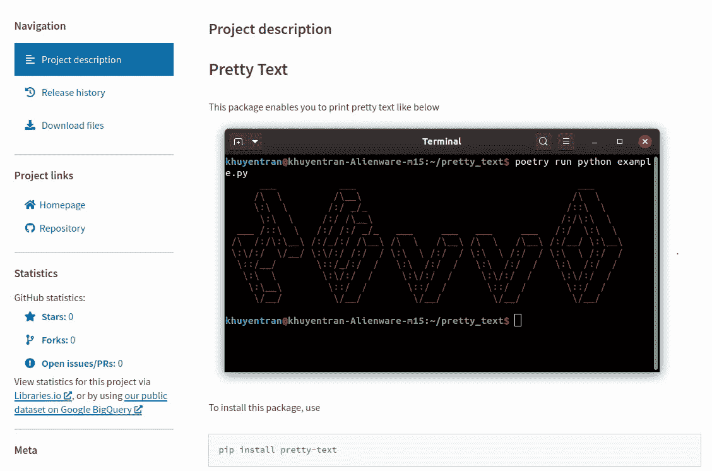

# 如何使用诗歌毫不费力地将 Python 包发布到 PyPI

> 原文：<https://towardsdatascience.com/how-to-effortlessly-publish-your-python-package-to-pypi-using-poetry-44b305362f9f?source=collection_archive---------10----------------------->

## 在 10 分钟内分享您有用的 Python 工具


照片由[基拉·奥德海德](https://unsplash.com/@kadh?utm_source=medium&utm_medium=referral)在 [Unsplash](https://unsplash.com?utm_source=medium&utm_medium=referral) 拍摄

# 动机

你是否创建了一些有用的函数或类，并在多个项目中反复使用？如果您可以像下面一样在您的任何项目中导入您的有用函数，而不是复制和粘贴相同的代码，这不是很方便吗？

为了让您和其他人可以访问您的包，请发布到 [PyPI](https://pypi.org/) 。我相信你在尝试安装一些 Python 包的时候一定遇到过 PyPI。任何人都可以上传他们的包到 PyPI，包括你。

你的包上传到 PyPI 需要复杂吗？不要！如果你觉得你的函数有用，很多其他人也会觉得它们有用。

# 我在 PyPI 上发布了一个包，你也可以！

我喜欢 Rich 中的[表类，但是，它不支持我经常使用的 Pandas DataFrame。所以我决定创建自己的类来创建一个生动漂亮的表格，然后发布到 PyPI。](https://github.com/khuyentran1401/rich-dataframe)

现在，我只需要从 PyPI 安装[我的包，而不是使用](https://pypi.org/project/rich-dataframe/0.1.9.5/) [**220** 行代码](https://github.com/khuyentran1401/rich-dataframe/blob/master/rich_dataframe/rich_dataframe.py)来创建一个漂亮的数据框架

```
pip install rich-dataframe
```

然后使用我创建的函数`prettify`美化我在 **1** 行代码中的数据帧。

瞧啊。



作者 Gif

在本教程中，我将向您展示如何使用诗歌将您的包发布到 PyPI。

# 创建项目

什么是诗歌？[poems](https://python-poetry.org/docs/)是一个 Python 库，它使得管理依赖关系和打包 Python 项目变得简单高效。在这里找到如何安装诗歌[的说明。](https://python-poetry.org/docs/#installation)

要创建名为`pretty_text`的项目，请键入

```
$ poetry new pretty_text
```

如果您已经有一个预先存在的项目，请使用

```
$ cd pretty_text
$ poetry init
```

在回答完诗歌提出的所有问题后，我们将把所有这些文件放在我们的`pretty_text`目录下！

```
.
├── pretty_text
│   └── __init__.py
├── pyproject.toml
├── README.rst
└── tests
    ├── __init__.py
    └── test_pretty_text.py
```

以及`pyproject.toml`中关于我们套餐的所有信息！

从文件中我们可以看到，安装这个包的要求是 3.7 以上。接下来，我们需要为我们的包安装更多的库。但在此之前，让我们先激活虚拟环境。

# 激活虚拟环境并安装依赖项

什么是虚拟环境？虚拟环境是一种工具，有助于将不同项目所需的依赖关系分开。为不同的项目创建不同的虚拟环境是一个很好的实践。

诗歌使得用一个命令创建和激活虚拟环境变得容易

```
$ poetry shell
```

酷！现在我们已经准备好为我们的包安装依赖项了。要安装 pyfiglet，请使用`poetry add <package>`

```
$ poetry add pyfiglet
```



现在已经安装了 pyfiglet 及其依赖项。与使用 pip 相比，使用诗歌安装库的惊人之处在于，你将只能看到你在`pyproject.toml`安装的包

随 pyfiglet 安装的其他依赖项将保存在`poetry.lock`中。`poetry.lock`列出了所有依赖项的确切版本，以确保使用你的项目的每个人的包版本是一致的。

使用相同的命令安装 termcolor:

```
$ poetry add termcolor
```

# 添加包的内容

在`pretty_text/pretty_text`目录下为您的包添加其他文件:

```
$ touch pretty_text/pretty.py
```

现在，您的目录应该如下所示:

```
.
├── poetry.lock
├── pretty_text
│   ├── __init__.py
│   └── pretty.py
├── pyproject.toml
├── README.rst
└── tests
    ├── __init__.py
    └── test_pretty_text.py
```

将下面的代码添加到`pretty.py`:

要运行脚本，请结合使用`poetry run`和`python pretty.py`命令:

```
$ poetry run python pretty_text/pretty.py
```



酷！我们的功能有效！

# 缩短导入语句

让我们通过将我们的函数导入根目录中的另一个文件来进行测试。

```
$ touch example.py
```

您的目录结构应该如下所示

```
├── example.py
├── pretty_text
    ├── __init__.py
    ├── pretty.py
```

在文件`example.py`中，我们导入并使用我们的函数:

我们运行时没有错误。然而，对于我们的用户来说，键入`from pretty_text.pretty import pretty_text`来访问我们的包是相当冗长的。我们能缩短这个吗？

肯定！只需从文件`pretty_text/__init__.py`中的`pretty`导入函数`pretty_text`

现在可以直接从`pretty_text`导入函数`pretty_text`！

# 发布您的包

在发布您的包之前，[在 PyPI 上注册一个帐户](https://pypi.org/)。然后简单地输入

```
$ poetry build
```

您应该会看到如下所示的内容。这将构建源代码和轮子档案。



请注意，与最初的[方法](https://packaging.python.org/tutorials/packaging-projects/)相比，使用诗歌可以更容易地设置您的包。

要发布，请键入:

```
$ poetry publish
```



搞定了。现在这个包在 PyPI 上[可用！](https://pypi.org/project/pretty-text/)



现在我们可以使用

```
pip install pretty-text
```

而且很管用！您现在应该能够导入并使用它了:

我们的 PyPI 网站看起来有点无聊。让我们给它添加一些相关的链接、描述和图片。

# 让你的包裹看起来很专业

## 创建指向源代码的链接

如果我们希望其他人看到您的代码并为其做出贡献，我们可能希望为您的包创建一个 Github 存储库。首先在 Github 上创建一个名为`pretty-text`的新存储库。然后在我们的项目中添加一个新的遥控器。

使用[。gitignore](https://github.com/khuyentran1401/pretty-text/blob/master/.gitignore) 忽略一些不应该提交给 Github 的包。然后提交并将我们的更改推送到 Github。

## 创建描述

给`README.md`添加一些描述和图片

## 更新您的版本

将描述、存储库、自述文件和关键字添加到`pyproject.toml`

注意我们还想在`version`里把旧版本换成新版本。

## 更新并发布

要更新和发布您的 repo，请键入与前面相同的命令:

```
$ poetry build
$ poetry publish 
```

现在再次查看我们的[包的网站。](https://pypi.org/project/pretty-text/)



作者图片

看起来好多了！

# 结论

恭喜你！您刚刚学习了如何使用诗歌创建自己的包。请注意，您可以用这 5 个命令将您的包发布到 PyPI:

*   `poetry init`
*   `poetry shell`
*   `poetry add <package>`
*   `poetry build`
*   `poetry publish`

很酷，不是吗？创造出别人能用的东西是一种很好的感觉。我希望通过发布您的软件包，您会经历同样的事情。

如果你想用一行代码创建漂亮的熊猫数据帧输出，请点击这里查看我的富数据帧包:

<https://github.com/khuyentran1401/rich-dataframe>  

我喜欢写一些基本的数据科学概念，并尝试不同的算法和数据科学工具。你可以在 LinkedIn 和 T2 Twitter 上与我联系。

星[这个回购](https://github.com/khuyentran1401/Data-science)如果你想检查我写的所有文章的代码。在 Medium 上关注我，了解我的最新数据科学文章，例如:

</pytest-for-data-scientists-2990319e55e6>  </introduction-to-schema-a-python-libary-to-validate-your-data-c6d99e06d56a>  </streamlit-and-spacy-create-an-app-to-predict-sentiment-and-word-similarities-with-minimal-domain-14085085a5d4>  </stop-using-print-to-debug-in-python-use-icecream-instead-79e17b963fcc> 