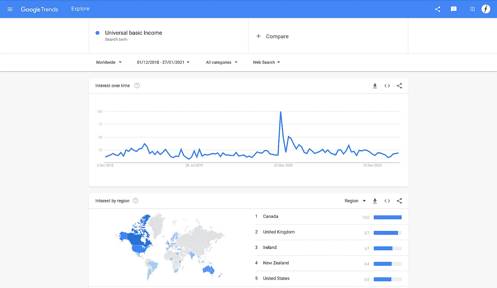
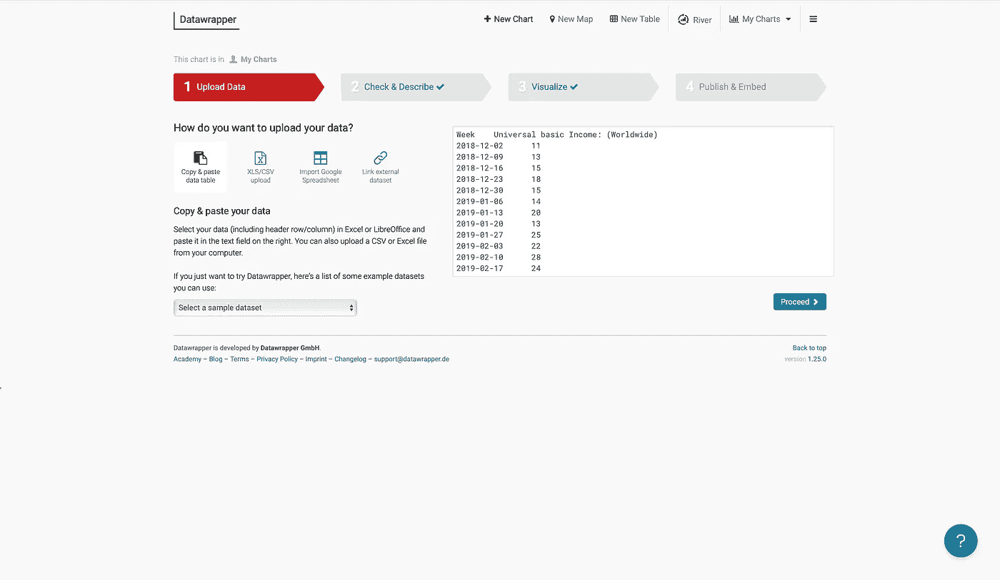
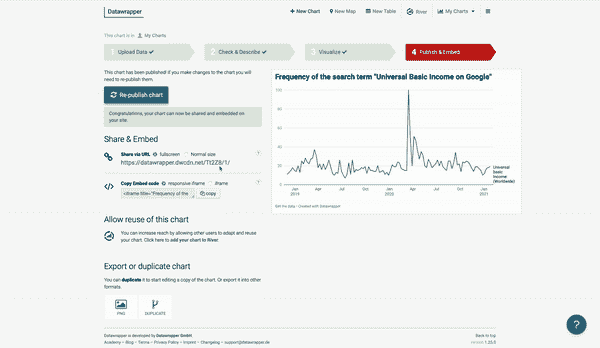

# 如何在媒体上嵌入交互式图形

> 原文：<https://towardsdatascience.com/how-to-embed-interactive-graphs-on-medium-1156300e9e4a?source=collection_archive---------36----------------------->

## 了解如何使用 Datawrapper 在中型帖子上嵌入交互式图形

在 [Unsplash](https://unsplash.com?utm_source=medium&utm_medium=referral) 上由 [Carlos Muza](https://unsplash.com/@kmuza?utm_source=medium&utm_medium=referral) 拍摄的照片

作为数据科学家，我们喜欢好的图表。有数不清的编程软件包致力于数据可视化。仅在 Python 中，我们就有 bokeh、seaborn、Plotly、Geoplotlib 和许多其他库。图表是用数据讲述故事的一种很好的方式，当它们是交互式的时，它们甚至更加身临其境。在一些 web 空间中，可以通过 HTML 代码嵌入交互式图形，但 Medium 目前不允许这样做。但是你可以使用网络工具 [Datawrapper](https://www.datawrapper.de) 得到交互式图形。最重要的是，它完全免费使用。让我们来看看。

## 什么是 Datawrapper？

Datawrapper 是一个创建图表的在线工具。他们是一家德国公司，曾与包括《纽约时报》、《NPR》和《彭博》在内的一些重量级媒体合作。虽然 Datawrapper 对企业使用该工具收费，但对你我来说是完全免费的。不过，在开始使用该工具之前，您确实需要创建一个帐户。

## 如何创建交互式图表

让我们看一个简单的例子。我想看看“普遍基本收入”这个词在过去两年的搜索趋势。我将使用[谷歌趋势](https://trends.google.com/trends/?geo=US)下载这些数据。

作者截图

接下来，我从 CSV 文件中复制相关数据并粘贴到 Datawrapper 的接口中。在这一点上，我应该提到你可以添加来自一系列来源的数据，如下图所示。对于这个例子，我已经通过复制和粘贴我的数据做了最简单的事情。继续在界面中前进，直到到达发布和嵌入页面，使您的图形符合您的要求。

作者截图

要将互动图嵌入到你的 Medium 帖子中，复制 URL，*而不是 HTML 源代码，*并将其粘贴到 Medium 的草稿编辑器中。在你发表文章之前，这个图形是不会被交互的，所以现在不要担心它看起来像一个图像。一旦你发布，你会得到一个类似下图的数字。

作者 Gif

## 最终产品和一些分析

下面你可以看到我用 Datawrapper 生成的交互图。我选择以线形图显示数据，但是 Datawrapper 提供了饼图、条形图和许多其他类型的图形。它也完全归因于在媒体上的使用。

作者交互式图表

从图中，我们可以看到，在 2020 年 3 月左右，谷歌中的搜索词“普遍基本收入”出现了大幅飙升。这当然是在冠状病毒开始挤压英国和美国经济的时候，人们开始担心他们的财务前景。普遍基本收入是指国家定期给成年公民一定数量的钱。显而易见，当人们面临财务安全的不确定性时，这个想法会很有吸引力。

## 结论

Datawrapper 工具提供了一种在中型帖子上免费嵌入交互式图形的方法。以下是如何制作和嵌入交互式图形的简要概述。首先，创建一个帐户，并将您的数据上传到 Datawrapper。配置您的图表，并选择发布和嵌入选项。最后，将 URL 链接复制并粘贴到 Medium 的草稿编辑器中，然后按回车键。一旦故事被发布，该数字将变成交互式的。