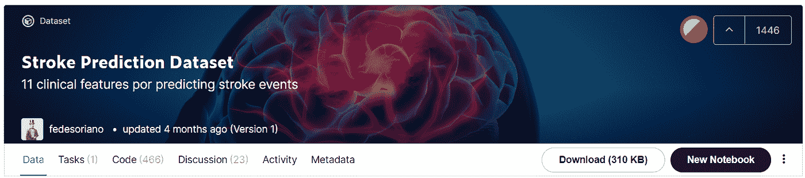
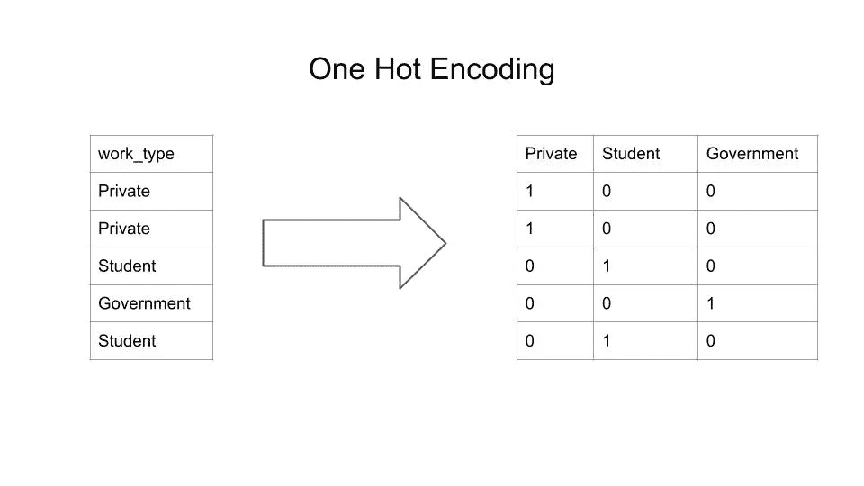

# 如何使用 Python 编码分类列

> 原文：<https://towardsdatascience.com/how-to-encode-categorical-columns-using-python-9af10b36f049?source=collection_archive---------9----------------------->

## 机器学习模型读取的不是字符串而是数字。

马库斯·斯皮斯克在 [Unsplash](https://unsplash.com/s/photos/matrix?utm_source=unsplash&utm_medium=referral&utm_content=creditCopyText) 上的照片

# 介绍

机器学习是从数据中提取模式的好方法。有了这个模式，我们可以从新数据中提取隐藏信息，甚至预测标签。在我们可以使用机器学习模型中的数据之前，我们需要首先清理数据。

现在存在的数据还不是干净的。可能存在的问题是缺少值、分布不均匀、单个列的格式不同，或者某些列不是数字格式。

机器学习模型读取数字。如果这些列不是数字，模型将捕捉到一个错误。此外，模型不会将这些列纳入建模过程。因此，我们需要将非数字列重新格式化为数字列。

本文将向您展示如何使用 Python 处理非数字或分类列。没有进一步，让我们开始吧！

# 履行

## 数据源

为了演示这一过程，我们将使用一个称为中风预测数据集的数据集。这是 fedesoriano 在 Kaggle 上创建的数据集。

该数据集描述了是否患有中风的人。此外，数据集包含与疾病相关的指标。该数据集属于监督学习问题，因为它包含一个人是否可能患有中风的标签。

您可以在这里 访问数据集 [**。**](https://www.kaggle.com/fedesoriano/stroke-prediction-dataset)

作者捕捉到的

现在让我们导入数据。为此，我们可以使用 pandas 库来处理我们的数据集。下面是导入和预览数据的代码:

从上面的数据集中可以看出，有些列已经是数字格式的了。它们是年龄、高血压和心脏病栏。此外，有些列不是数字格式，如工作类型、性别、居住类型和吸烟状态列。

现在，我们将关注非数字列。让我们根据数据类型来分离数据框。下面是这样做的代码和结果:

分离数据框后，让我们检查每一列的唯一值。您可以使用。检索列中不同值的唯一方法。下面是代码和结果预览:

根据上面的结果，两列有两个唯一的值。三列有两个以上的唯一值。为什么计算唯一值的数量很重要？因为我们将以不同的方式对列进行编码。

对于具有两个不同值的列，我们可以直接对该列进行编码。当一个列有两个以上的唯一值时，我们将使用 one-hot 编码。

## 使用标签编码对标签进行编码

在我们知道了每列的特征之后，现在让我们重新格式化列。首先，我们将用两个不同的值重新格式化列。它们是曾经结婚和居住类型列。为此，我们可以使用 scikit-learn 中的 LabelEncoder 对象对列进行编码。

现在让我们看看曾经结过婚这一栏。首先，我们将像这样初始化 LabelEncoder 对象:

之后，我们可以像这样将对象放入数据中:

现在我们可以将该列转换成数字格式，如下所示:

以下是我们运行代码后的结果，包括编码过程之前、之后和相反的过程:

干得好！我们已经对第一列进行了编码。现在让我们对下一列进行编码，这是“residence_type”列。

回想一下前面的代码，拟合和转换过程似乎是分开执行的。实际上，我们可以将这个过程与。fit_transform 方法。

下面是代码和结果:

## 使用一键编码对标签进行编码

不错！让我们转到具有两个以上不同值的列。有三列包含两个以上的唯一值。它们是性别、工作类型和吸烟状态列。为了处理这些列，我们将使用一种称为一次性编码的技术。

什么是热门编码？该过程将对列进行编码，并将其转换为矩阵。其中每一列表示该列中的每个不同值，每个单元格确定该值是否存在。

以下是一键编码流程的示例:

作者插图

为了实现这一点，我们将使用 scikit-learn 中的 OneHotEncoder 对象对这些列进行编码。

现在我们来看看性别一栏。首先，我们将像这样初始化 OneHoteEncoder 对象:

接下来，我们可以使用。fit_transform 方法来同时拟合和转换数据。代码如下:

哎呀，这里有一个错误。如果我们读取错误，它说有一个值错误。该函数需要一个二维数组作为输入。

要转换列的形状，我们可以使用。整形列的整形方法。但是我们需要首先将列转换为 NumPy 数组。为此，我们可以用 np.array 函数包装该列。

让我们重复这个过程！下面是一键编码过程之前、之后和之后的代码和结果:

有用！现在让我们将它应用到其他列，如 smoking_status 和 work_type 列。下面是一键编码过程的代码和结果:

干得好！现在您已经对所有的列进行了编码。

## 创建编码的数据帧

对这些列进行编码后，我们可以从中创建一个数据帧。对于每一列，我们将初始化 DataFrame 对象以创建 dataframe。然后，我们使用。concat 方法。下面是这样做的代码和结果:

## 与数字列数据框架组合

太好了！这些分类列已经是 dataframe 格式。现在让我们将它们与数字列结合起来。下面是这样做的代码和结果:

## 包装过程的技巧

哇，那是一个漫长的过程。实际上，有一个技巧可以让你只用一行代码就做到这一点。您可以使用一个名为。从熊猫图书馆拿假人做所有这些。

让我们回忆一下包含数据帧中所有分类列的 df _ categorical 变量。以下是对数据帧及其结果进行编码的代码:

现在让我们将它们与数字列结合起来:

简单吧？如果你时间不多，get_dummies 函数马上就能帮到你！

# 结束语

干得好！现在，您已经了解了如何使用 Python 对分类变量进行编码。我希望这篇文章能帮助你解决这个问题。因此，如果您从事这样的项目，下次就不必扔掉这些列了。

如果你对我的文章感兴趣，可以关注我的媒介，获取更多关于数据科学和机器学习的文章。如果你有任何问题或者想打个招呼，你可以在 [**LinkedIn**](https://www.linkedin.com/in/alghaniirfan/) 上联系我。

谢谢你看我的文章！